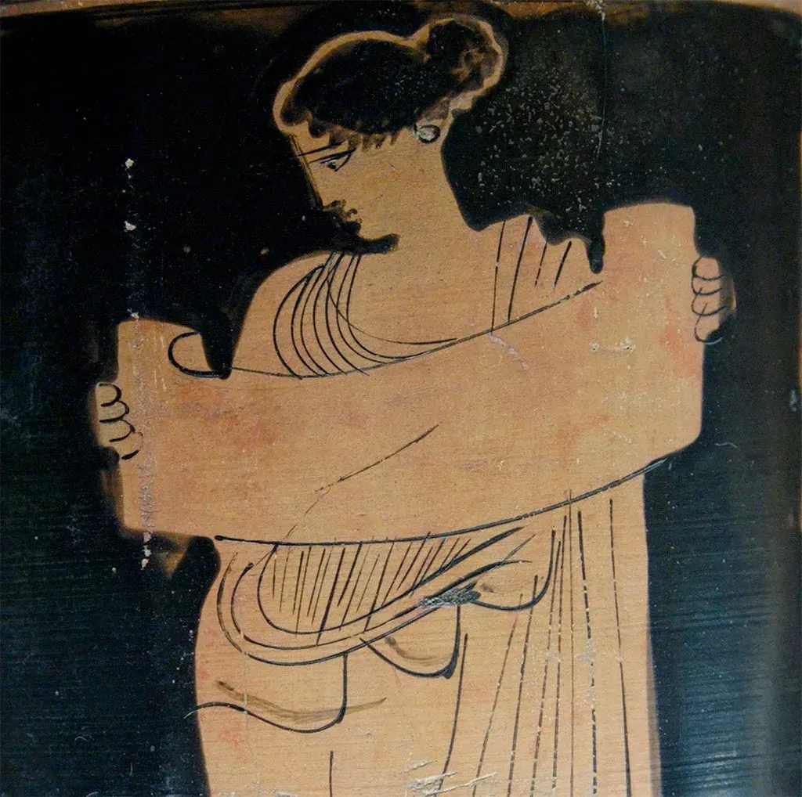

# L’ebook, qu’un ersatz de lecture numérique

Que ce titre ne me fasse pas passer pour un inconditionnel du papier. J’y ai quasiment renoncé depuis 2007, date de l’achat de ma première liseuse, une Sony PRS 500. Je suis aujourd’hui un indécrottable du Kindle (ne me dites pas qu’Amazon est le grand méchant parce que je vais vous en sortir une longue liste de méchants avec lesquels vous êtes sans doute acoquinés).

Mais quelque chose me chagrine. Par l’intermédiaire d’une recommandation sociale, je suis tombé sur [un article du New York Times](http://www.nytimes.com/2014/08/14/arts/reading-literature-on-screen-a-price-for-convenience.html?) évoquant une étude selon laquelle on lirait moins bien sur Kindle que sur papier. J’ai alors repensé à la même étude [commentée avec plus de discernement par Hubert Guillaud](http://lafeuille.blog.lemonde.fr/2014/09/12/non-on-ne-memorise-pas-moins-bien-sur-kindle-que-sur-papier/). Conclusion : un seul handicap à la liseuse, on perçoit moins bien l’épaisseur d’un texte, on s’y repère avec moins de précision.

Logique, une liseuse c’est plat. Tu lis Proust ou une nouvelle, tu as le même objet entre les mains. Avec le livre on lit en 3D, avec un ebook, on lit en 2D. En tous cas, si on reste attaché aux dimensions spatiales. Parce que le search, les marques-pages, les annotations… offrent de nouvelles lignes de lectures multidimensionnelles (et on découvre alors quelques avantages à la liseuse que les études devraient mesurer pour se prétendre objectives).

J’ai souvent galéré pour retrouver un passage lu dans un ebook. Si je me souviens d’un mot-clé, ça va plus vite qu’avec un livre. Si je n’ai qu’une vague idée, c’est vraiment plus difficile. Quand on tourne des pages papier, on mémorise la position des passages dans l’épaisseur du livre, c’est-à-dire dans le temps du récit. Mais tout cela devrait s’arranger avec les nouvelles interfaces de lecture, conclut un des auteurs de l’étude, Jean-Luc Velay du Laboratoire de neurosciences cognitives de Marseille.

J’en suis pas sûr. Parce que lire en numérique est-ce lire selon la vielle métaphore du livre, c’est-à-dire tourner des pages ? Cette mode commence avec les *volumens*, ces rouleaux à dérouler à l’horizontale. Technologie optimisée par les Romains sous le vocable de codex, codex eux-mêmes plus tard transformés en livres.

Tournons-nous les pages sur le Web ? Non. Nous déroulons de haut en bas, selon une autre métaphore, celle du *rotulus*, découverte durant l’antiquité en même temps que celle du *volumen*, mais guère utilisée au cours de l’histoire, sinon pour les décrets officiels ou les textes sacrés.

[caption id="attachment\_38702" align="aligncenter" width="600"] Un rotulus d’avant le Web.[/caption]

Quand je déroule un texte sur le Web, même très long, je n’éprouve aucune difficulté, il me semble, à retrouver un passage déjà lu. Je le situe dans la hauteur de la page avec autant de facilité que dans l’épaisseur d’un livre (impression à confirmer ou infirmer par des études). Alors pourquoi pousser dans le monde numérique la vieille métaphore du livre ? Ne sommes nous pas trahis par nos vieilles habitudes ?

Pourquoi ne pas tout simplement dérouler nos ebooks dans la hauteur plutôt que nous obstiner à tourner des pages imaginaires ? Pas étonnant que, dans ce cas, les études trouvent des avantages au papier, lui tout à sa métaphore, sans compromis. Mais à comparer, autant comparer ce qui est comparable. Faire lire un texte en mode livre ou en mode rotulus numérique. Et mesurer deux métaphores différentes plutôt que comparer le livre et une piètre imitation du livre.

Nous sommes sans doute en train de perdre beaucoup de temps à vouloir mimer le livre sur support numérique. C’est vrai pour l’industrie, c’est aussi vrai pour les auteurs. Nous travaillons encore souvent nos textes pour une métaphore passée de mode et d’usage.

Penser lecture déroulée implique de penser titres, intertitres, illustrations… autant d’éléments graphiques qui structurent la page unique et facilite le repérage. Et tout de suite, on ne produit plus le même texte. On écrit autrement, autre chose.

Il me semble urgent que nos systèmes de lecture offrent les deux métaphores de lecture. Que nous ayons le choix en tant que lecteur. En ramenant toujours tout au livre, nous nous interdisons de penser l’avenir.

*PS : Durant les fêtes, j’ai initié mes enfants et leurs cousins à* Donjons & Dragons. *Plutôt que repartir sur mon viel AD&D des années 1980, j’ai décidé de plonger dans la nouvelle édition. J’ai téléchargé la boîte de base. J’ai vite compris qu’avec mon iPad, ça ne le ferait pas. J’ai dû courir acheter les livres, sinon c’est injouable. Preuve s’il en fallait que la métaphore du livre n’est pas tout à fait morte pour certains usages (je dis bien certains usages).*

[caption id="attachment\_38700" align="aligncenter" width="600"] Mon D&D V5 déjà corné. [/caption]

#edition #dialogue #y2015 #2015-1-5-14h19
