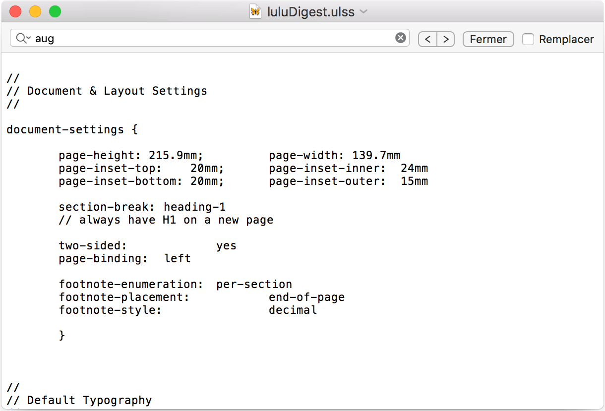
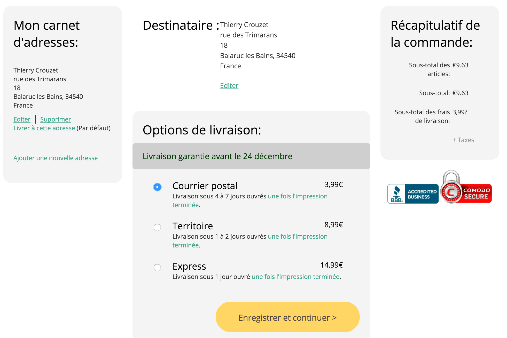

# Comment soumettre à un éditeur un manuscrit papier

Depuis des années, j’échange avec les éditeurs des fichiers électroniques et j’ai pris l’habitude de voir mes textes imprimés qu’une fois en librairie. Sauf qu’aujourd’hui on me demande une version papier de *[One Minute](../../page/une-minute)*. Je passe sur cette demande incongrue, le but de ce billet n’est pas de la discuter, mais de lui trouver une réponse.

Données du problème :

* Manuscrit de 738 pages, chaque chapitre occupant deux pages (à ce prix, c’est du papier qui te mange les doigts).
* Ramette 500 feuilles A4 60g/m2 : 3,5 €.
* Toner de ma vieille LaserJet que j’utilise que pour les courriers administratifs encore obligatoires : 16 € pour 5000 pages (à ce prix ce n’est pas du toner HP).

Si j’imprime en simple face le manuscrit tel quel, ça me revient à 7,53 € (je n’inclus pas l’usure de l’imprimante amortie depuis longtemps) auquel il faut ajouter la reliure, [6 € pour une vulgaire spirale vu l’épaisseur du machin](http://accessrepro.fr/?page_id=66). Le tout pèse 2,8 kg. Pour l’expédition, il me faudrait [payer 6,90 €](http://www.grenierdesbd.com/pages/tarifs_poste.html). La douloureuse s’élève donc à 20,50 €, sans compter qu’il me faut courir jusqu’à chez un relieur, pas de ça dans mon village, puis à la Poste.

Je pourrais faire des économies. Tout d’abord en imprimant en recto-verso (ma LaserJet ne sait pas le faire en natif, il faut retourner les pages à la main, donc j’oublie). Je peux aussi imprimer deux pages A5 en côte à côte, c’est ce que je faisais dans ma jeunesse. Avec une imprimante recto verso, on peut ainsi encore réduire le coût d’impression et le poids, au prix d’un manuscrit pénible à manipuler (et ce n’est pas ce qu’on veut quand on envoie un texte pour essayer de le vendre). La facture tombe à un poil moins de 15 €.

### Quand Ulysses fait des miracles

Plutôt qu’envoyer balader ledit éditeur, j’ai trouvé une autre solution, qui m’a pris moins de temps que pour imprimer le manuscrit à la maison.

[caption id="attachment\_42866" align="alignnone" width="600"] Le format le plus économique de chez lulu.[/caption]

Avec son format d’impression Digest, [Lulu](http://www.lulu.com/create/books) me propose de m’imprimer un dos carré collé de 738 pages pour 9,63 €. C’est un gros un A5, proche des éditions originales de la plupart des livres du commerce.

Pour générer le PDF *ad hoc*, je n’ai pas besoin de quitter Ulysses, mon traitement de texte favori. J’ai même modifié un de leur filtre d’exportation pour qu’il génère directement du luluDigest ([téléchargez-le](https://app.box.com/s/8fr5bjfir4pgn4oozlizziuvwg4emjmg) et importez-le dans la liste des styles, en gros c’est du CSS très simple à adapter). [Voici une raison de plus d’adopter Ulysses](../4/revolutionner-lecriture-ou-comment-ecrire-avec-ulysses.md), en séparant le texte de sa forme, il se prête instantanément à tous les desiderata.

[caption id="attachment\_42868" align="alignnone" width="600"] PDF Lulu Digest généré d’un clic à partir d’Ulysses.[/caption]

Sur Lulu, je crée une couv blanche, avec juste le titre, mon mail, la date du manuscrit et je fais envoyer le tout à mon destinataire. C’est réglé en quinze minutes. Coût sans bouger les fesses de chez moi : 14,95 € avec une qualité bien meilleure qu’un bidouillage à la maison.

[caption id="attachment\_42869" align="alignnone" width="600"] Résumé du projet One Minute, que je garde en privé.[/caption]

[caption id="attachment\_42870" align="alignnone" width="600"] Coût de l’expédition 3,99 (la Poste facture 4,85 € jusqu’à 1 kg).[/caption]

[caption id="attachment\_42871" align="alignnone" width="600"] Je commande en faisant livrer directement chez mon destinataire.[/caption]

#cuisine #dialogue #y2015 #2015-11-23-9h51
