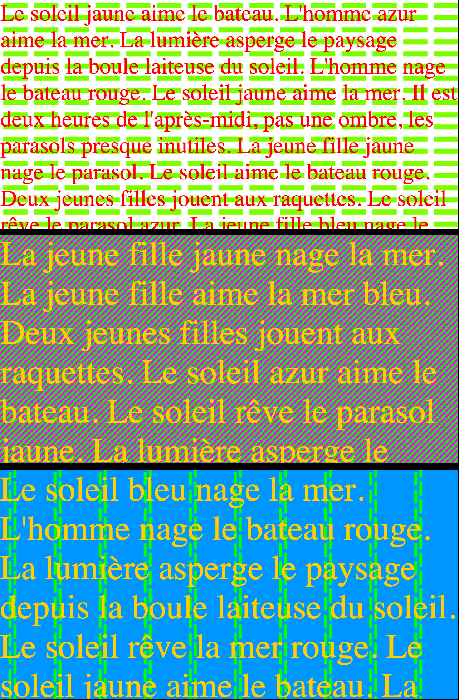
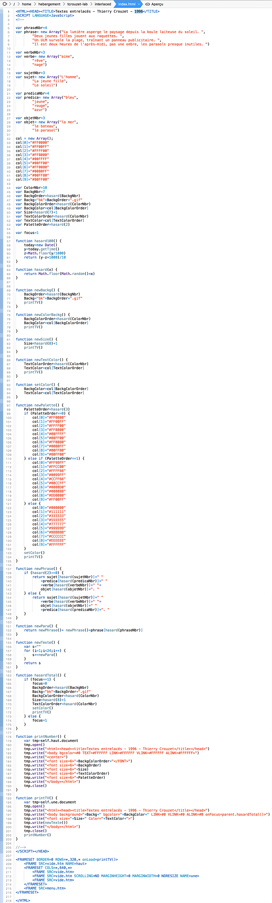

# La poésie est dans le code

Lors de la journée sur [la forme brève en littérature Web](http://www.lr2l.fr/actualites/les-formes-breves-lhonneur-luniversite-montpellier-3.html), Gwendolyn Kergourlay a parlé des haïkus version numérique, évoquant notamment les expériences de [Philippe de Jonckheere](http://www.desordre.net/blog/) au début des années 2000.

Un souvenir de juin 1996 m’est alors revenu. La date est précise parce que je me familiarisais à ce moment avec [JavaScript](https://fr.wikipedia.org/wiki/JavaScript), langage créé en 1995 et effectivement disponible à partir de mars 1996 dans Netscape Navigator 2.0. Mon premier bout de code est une incursion dans la poésie générative : [Interlaced](http://lab.tcrouzet.com/interlaced/), 99 999 combinaisons visuelles multipliées par un bon paquet de combinaisons textuelles (j’ai la flemme de calculer).

Je me dis aujourd’hui que si cette unique page Web initialement publiée sur Europe Online, peu après [*Pensé de Sicile*](http://lab.tcrouzet.com/sicile1996/), est une œuvre, c’est par son texte JavaScript plus que par ce qui s’affiche et se donne à lire à l’écran. L’œuvre c’est donc ça :

[caption id="attachment\_42948" align="alignnone" width="864"] Code javascript d’Interlaced, 1996.[/caption]

Plus que ça :

[caption id="attachment\_42949" align="alignnone" width="590"] Trois générations possibles…[/caption]

Étudier ce genre de poésie, c’est donc aussi étudier le code qui la sous-tend. Dans ce code, on trouve imbriqués quatre vers d’inspiration haïku.

> La lumière asperge le paysage  
> depuis la boule laiteuse du soleil.
> 
> 
> Deux jeunes filles jouent aux raquettes.
> 
> 
> Un ULM survole la plage,  
> traînant un panneau publicitaire.
> 
> 
> Il est deux heures de l’après-midi,  
> pas une ombre,  
> les parasols presque inutiles.

Je trouve ça assez vertigineux : poésie affichée, code la générant, poésie dans le code, code lui-même poétique… ça peut faire délirer.

#netlitterature #dialogue #y2015 #2015-11-27-10h53
