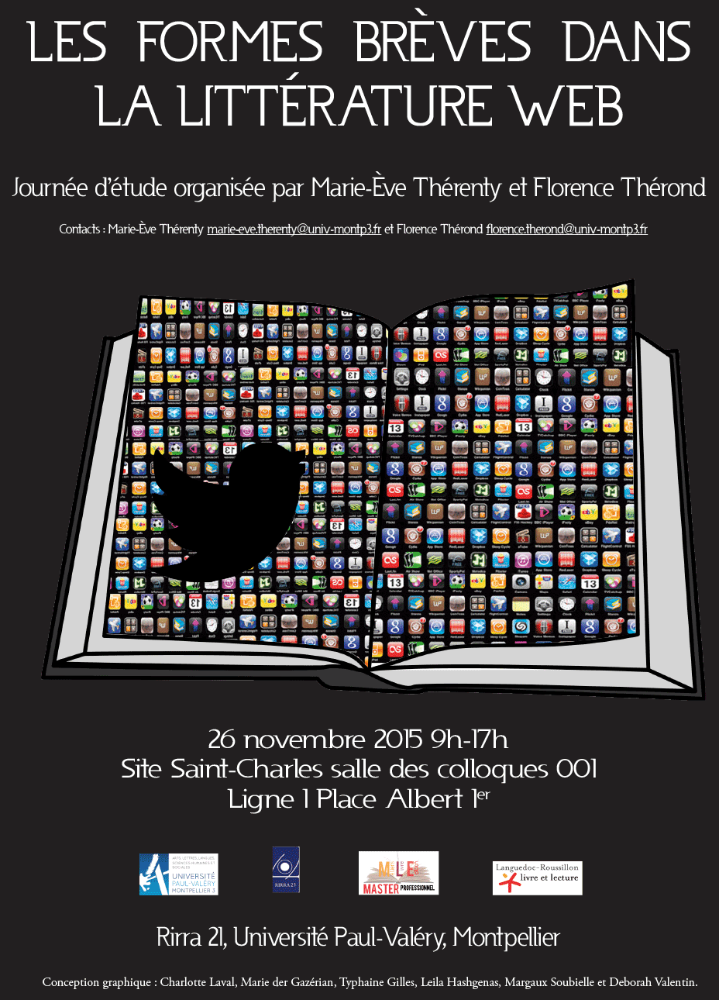

# One Minute, une lecture théorique d’Oriane Deseilligny

À l’occasion de la journée sur [la forme brève en littérature Web](http://www.lr2l.fr/actualites/les-formes-breves-lhonneur-luniversite-montpellier-3.html), [Oriane Deseilligny](http://www.gripic.fr/utilisateur/oriane-deseilligny), chercheuse au Celsa Paris-Sorbonne, a effectué une communication intitulée [« *One minute* de Thierry Crouzet : métamorphose d’un texte, d’un dispositif à l’autre »](http://nt2.uqam.ca/fr/cahiers-virtuels/article/one-minute-de-thierry-crouzet-metamorphoses-dun-texte-dun-dispositif-lautre). Voici la version audio, enregistrée en sauvage
### Introduction

Oriane présente *One Minute* et décrit sa propre approche théorique.

[audio src="/images\_tc/2015/11/1minute-intro.mp3"]

### Partie I : Les dispositifs de lecture

Comment *One Minute* se transforme en passant du blog à Wattpad et à l’epub.

[audio src="/images\_tc/2015/11/1minute-p1.mp3"]

### Partie II : La structure narrative

Oriane décrit les mécanismes qui permettent au roman de raconter une histoire alors que le temps n’y existe pas (je suis confus, parce que c’est plus lumineux que dans ma tête).

[audio src="/images\_tc/2015/11/1minute-p2.mp3"]

### Remerciements

J’ai du mal à trouver des mots après cette plongée dans mon roman. Je laisse [Jean-Yves Fréchette](https://twitter.com/JYFrechette) conclure.

[audio src="/images\_tc/2015/11/1minute-rep.mp3"]

[caption id="attachment\_42955" align="alignnone" width="600"] C’était à Montpellier, le 26 novembre.[/caption]

#netlitterature #sur_1_minute #dialogue #y2015 #2015-11-27-16h18
