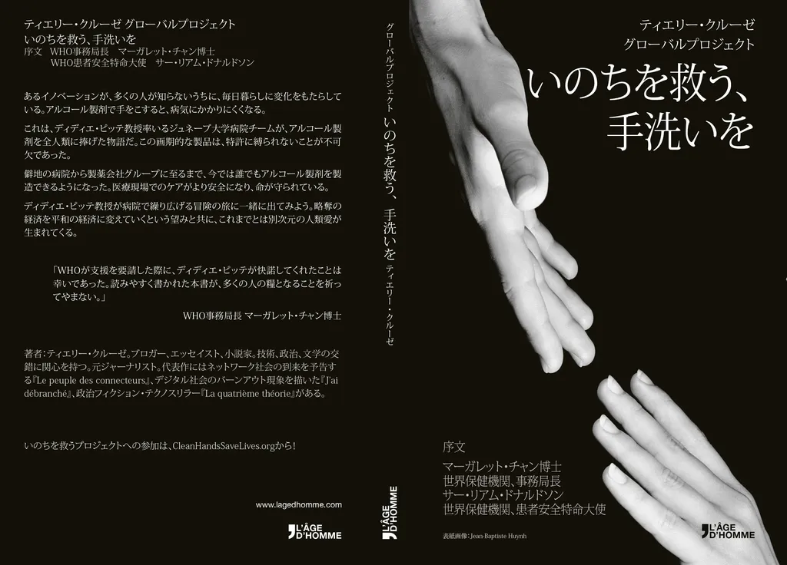

# Être politique pour un auteur, c'est être lu

Quand j’essaie de montrer [pourquoi une licence Creative Commons n’est pas une solution universelle](conditions-operatives-du-creative-commons.md), [Alias me répond](http://alias.codiferes.net/wordpress/index.php/usage-du-commun/) « C’est aussi un geste politique, un pari sur l’avenir. »

Certes, mais j’écris avant tout pour être lu. Mon texte est plus important que son emballage juridique. C’est lui le geste politique numéro un. Plus il est lu, plus je suis satisfait (ce qui ne veut pas dire que je suis prêt à écrire n’importe quoi). Mes textes sont plus politiques que la licence qui les porte. Je donne la priorité au texte.

Bien sûr, choisir le CC est politique, mais une politique seconde par rapport au texte. Un discours raciste sous CC reste raciste. Le CC n’atténue rien, ne pardonne rien.

Si je sens qu’un de mes textes a plus de chances avec un copyright parce qu’un éditeur se propose de le propulser dans sa communauté, je choisis cette option.

Pour moi, donner ici et maintenant le plus de chances à mes textes est plus important que parier sur l’avenir. Si un de mes textes sous copyright éveille plus tard un intérêt, j’espère qu’il sera piraté par ceux qui ne peuvent pas se le payer et ce sera très bien. C’est en faisant tout mon possible aujourd’hui que je donne une chance à cet avenir d’exister.

Je croyais avoir été plus clair. Quand on n’a pas d’éditeur, pas de vendeur, pas de communauté, il faut bien sûr adopter le CC. Il donne plus de chances qu’un copyright. La question du choix de la licence devrait donc se poser uniquement pour les auteurs qui peuvent être édités. Parfois le CC est évident, par exemple dans le cas du *[Geste qui sauve](../../page/le-geste-qui-sauve)* ou de *[La mécanique du texte](../../page/la-mecanique-du-texte)*, parfois pas. Pour finir, Alias résume très bien la situation : « Les Creative Commons, c’est un peu comme les antibiotiques : ce n’est pas automatique. »

J’espère bien sûr qu’un jour tous les textes seront sous CC. En attendant, si je veux faire vivre mes textes, je dois écouter les arguments des uns et des autres. Il faudra du temps pour que tout le monde comprenne que le CC n’interdit pas la réussite commerciale.

*PS : Quand on gagne sa vie avec des droits d’auteurs, il est pragmatiquement impossible d’être un intégriste du CC, surtout si on n’est pas un auteur tout-puissant avec des best-sellers derrière soi. Militer pour le CC ne m’empêche pas de mettre de l’eau dans mes contrats. Pour moi, l’important est d’écrire selon mes envies. C’est d’autant plus facile de le faire aujourd’hui, parce si un éditeur ne veut pas d’un de mes textes, j’ai toujours le CC à ma disposition. L’existence du CC suffit à me libérer.*

#commonisme #edition #dialogue #y2015 #2015-12-4-19h45
