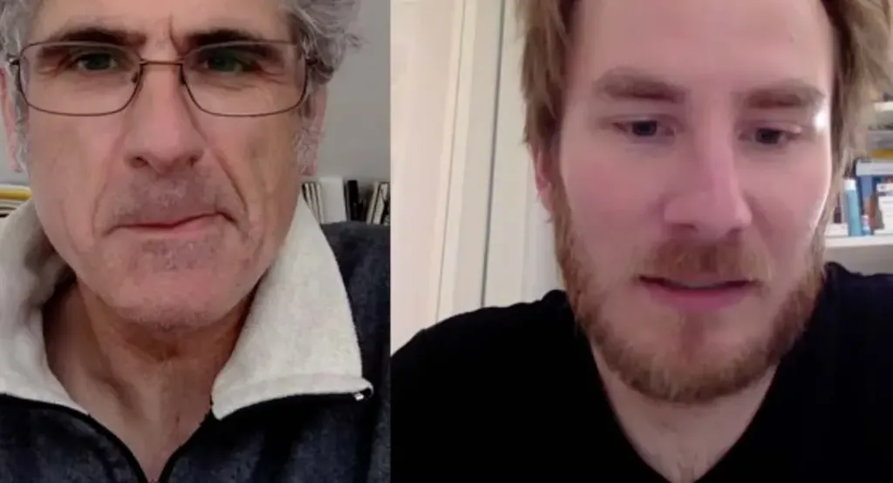

# Deux auteurs énervés à la radio

L’idée a germé sur Twitter entre [Neil Jomunsi](http://page42.org/) et moi. Plutôt que d’écrire sur ce qui nous énerve et qui ne mérite pas nécessairement un texte, autant en discuter, pour se décharger de notre trop-plein d’énergie.

Le projet : inviter d’autres auteurs à discuter avec nous. Parler de leur travail et aussi des choses qui les énervent, mais qu’eux-mêmes n’ont pas nécessairement envie d’écrire.

On a fait un petit essai aujourd’hui en duo où on parle droit d’auteur et Wattpad. Bon, on diffuse même si le son est pourri. La prochaine fois on utilise des casques.

[audio:http://blog.tcrouzet.com/images\_tc/2015/nrv1-test.mp3 podcast="nrv" licence="cc0"]

[caption id="attachment\_39648" align="aligncenter" width="600"] On a même enregistré en vidéo, mais on s’était pas fait beau.[/caption]

#edition #podcasts #y2015 #2015-2-27-17h53
