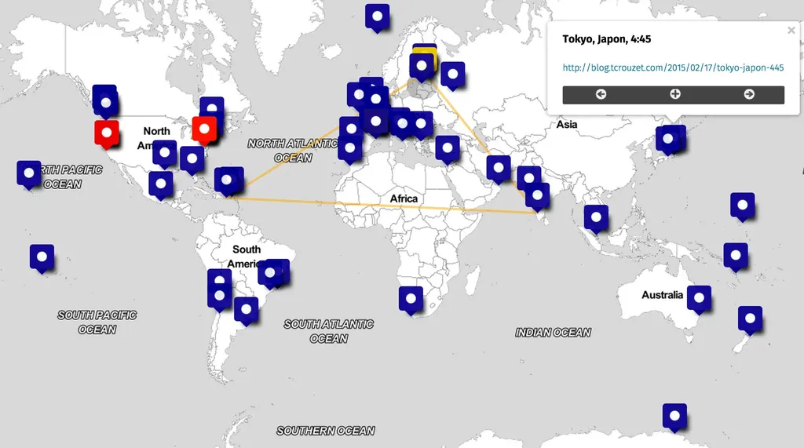
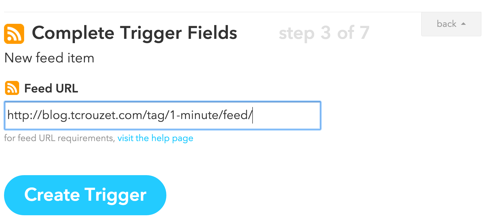
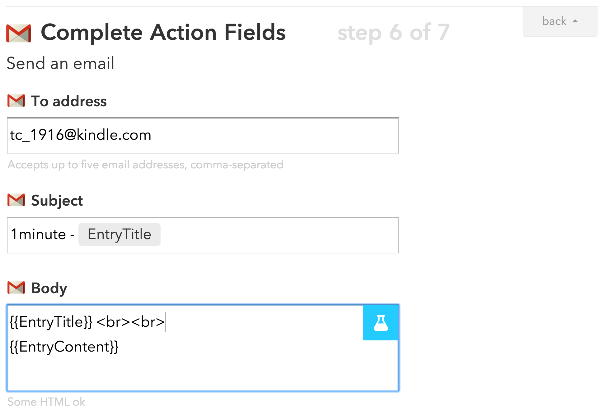
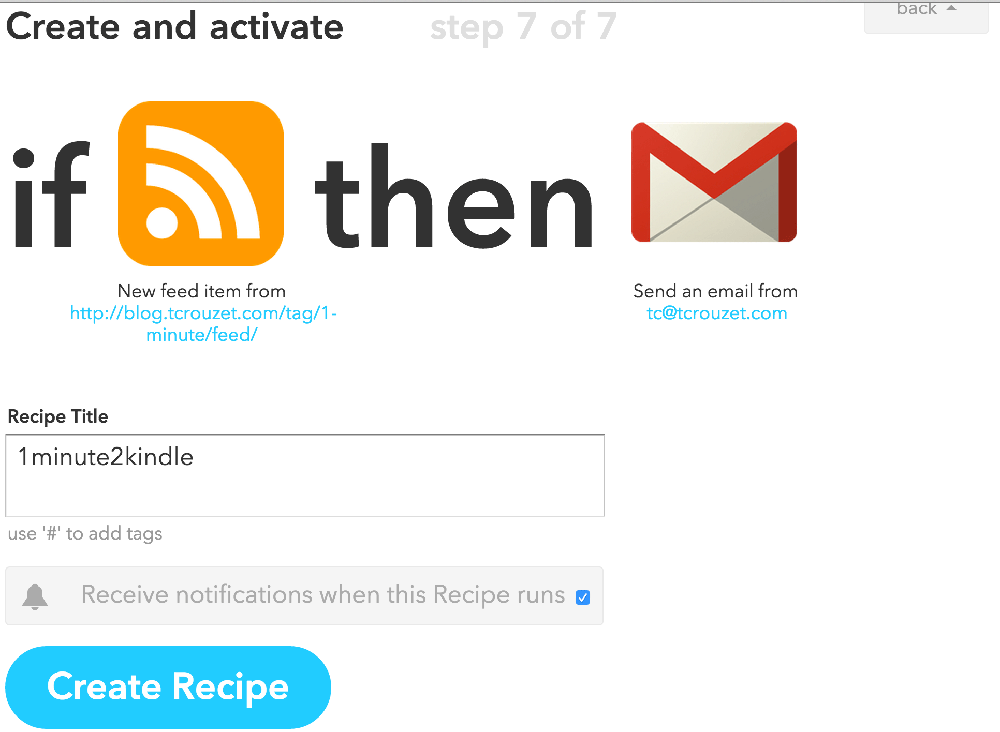
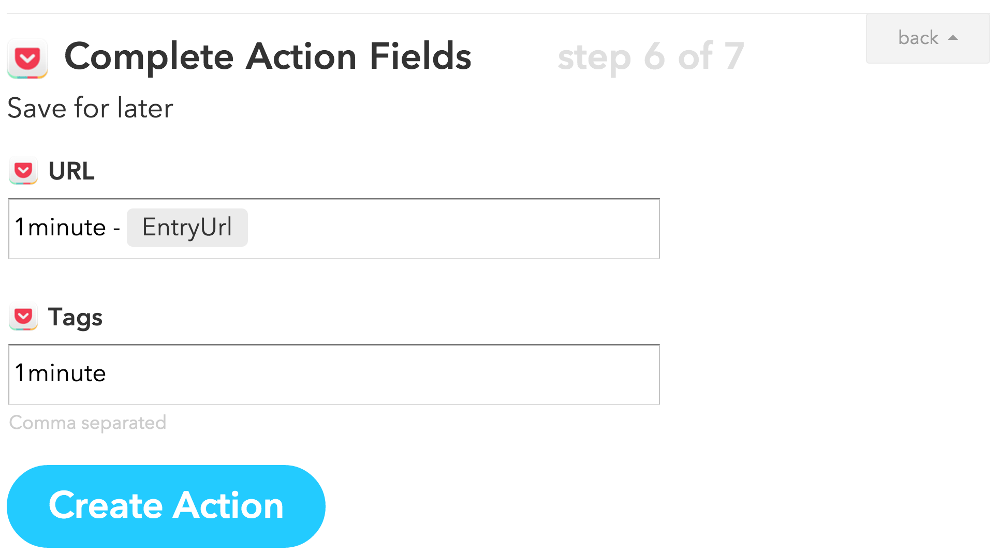
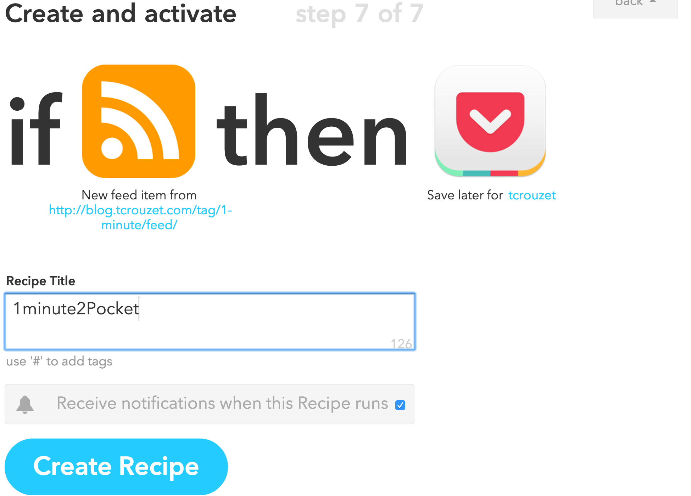

# Devenez power lecteur

Pour commencer, il vous faut des power auteurs, et non pas des conservateurs recroquevillés sur leurs droits, contre la moindre innovation juridique ou technique, prompts à utiliser les logiciels libres mais moins prompts à libérer leurs œuvres, incapables de mesurer la puissance de la société ouverte, cette société seule susceptible de lutter contre les fanatismes, les extrémismes et le totalitarisme comme l’a démontré Kark Popper.

Laissons ces dinosaures de côté, il vous reste les autres, ceux qui [certes s’exhibent sur le Net](les-ecrivains-ne-se-cachent-plus-pour-jouir.md), souvent [nous livrent un peu trop vite leurs états d’âme](contre-les-pleurnichards-du-net.md), mais qui au moins vous laissent une chance d’entrer dans leurs œuvres, d’en jouer, de l’étendre, de la discuter.

Plusieurs de ces power lecteurs se sont glissés dans mon projet [*1 minute*](http://www.wattpad.com/story/29694130-1-minute) pour le commenter, traquer mes fautes, me suggérer des améliorations stylistiques, des bouts d’intrigues et même créer un sommaire non linéaire [en positionnant chacune de mes minutes sur une carte](http://umap.openstreetmap.fr/fr/map/une-minute_29980#3/30.75/5.63). Il devient ainsi possible de me lire géographiquement plutôt que chronologiquement. J’en avais rêvé, ils l’ont fait.

[caption id="attachment\_39569" align="aligncenter" width="600"] Le sommaire cartographique de 1 minute créé par les lecteurs eux-mêmes.[/caption]

Le power lecteur tord à sa mesure jusqu’aux interfaces de lecture. Si le blog ou [Wattpad](http://www.wattpad.com/story/29694130-1-minute) ne lui conviennent pas, il joue avec toutes une panoplie d’outils pour mettre en forme les textes automatiquement et les recevoir sur l’appareil de son choix dans l’application de son choix.

### Exemple 1 : lire *1 minute* sur liseuse

Certaines liseuses comme les Kindle ou Pocketbook disposent d’un mail attitré. Quand vous envoyez un mail à cette adresse, il est automatiquement converti en ebook et ajouté à la liste de lecture. Voici comment recevoir tous les jours mon feuilleton sur votre Kindle.

1. Récupérez tout d’abord l’adresse mail de l’appareil dans le menu Paramètres/Options de l’appareil/Personnalisez votre Kindle. Elle est du type *xxx@kindle.com*.
2. Récupérez l’adresse du [flux RSS associée au feuilleton](#1-minute/feed). Sur les blogs Wordpress, un flux est associé à chaque tag : <http://blog.tcrouzet.com/tag/1-minute/feed/>
3. Dans [IFTTT](https://ifttt.com), créez une nouvelle règle qui, pour tout nouveau billet dans le flux, envoie un mail via Gmail à votre Kindle avec le texte en pièce attachée. Attention : [votre mail Gmail doit être autorisé chez Amazon](https://www.amazon.fr/gp/help/customer/display.html?nodeId=200767340) (pour éviter le spam sur les Kindle).

[caption id="attachment\_39570" align="aligncenter" width="600"] Créez un IF sur un flux RSS.[/caption]

[caption id="attachment\_39571" align="aligncenter" width="600"] Envoyez le texte à la liseuse par mail.[/caption]

[caption id="attachment\_39572" align="aligncenter" width="600"] Validez la nouvelle règle.[/caption]

### Exemple 2 : lire *1 minute* sur téléphone ou ordi

Cette seconde méthode est sensiblement identique. Sur IFTTT, créez une règle qui envoie les textes vers [Pocket](https://getpocket.com/) ou [Instapaper](https://www.instapaper.com/). Vous vous recréez ainsi un livre que vous lirez à votre rythme.

[caption id="attachment\_39573" align="aligncenter" width="600"] Envoyez les textes sur l’application Pocket ou Instapaper.[/caption]

[caption id="attachment\_39574" align="aligncenter" width="600"] Validez la règle.[/caption]

Le power lecteur décide de lire où il veut et quand il veut. Tout billet de blog peut devenir un élément d’un livre électronique, que l’auteur aime ou non les livres électroniques. Désormais, c’est le lecteur qui décide. Auteurs, comprenez-le, offrez vos textes de manière à ce qu’ils se glissent dans toutes les interfaces. Ne pensez plus papier, ni même ebook, blog ou je ne sais quoi. Ne pensez plus à comment on vous lira car de nouvelles possibilités surgissent tous les jours. C’est dans ce territoire du nouveau, vers les nouvelles frontières, que se joue la littérature d’aujourd’hui. Ne vous fermez pas les portes de l’avenir sous prétexte que vous ne savez pas comment demain vous gagnerez votre vie.

#edition #sur_1_minute #y2015 #2015-2-23-17h45
