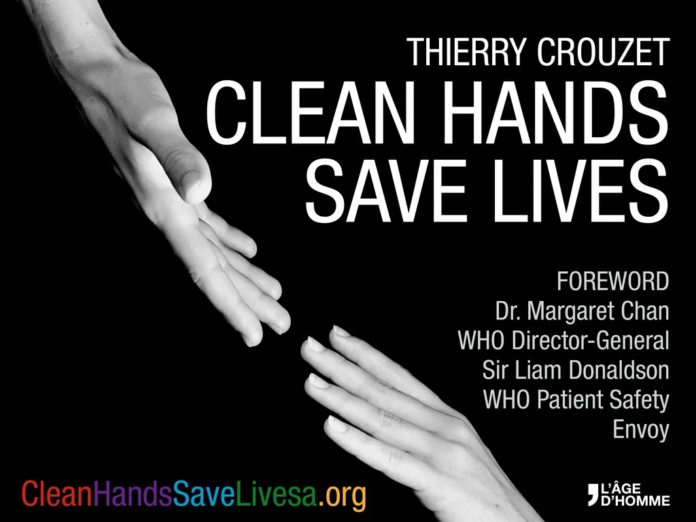

# Quand la propriété intellectuelle tue, le domaine public sauve

Je ne suis ni docteur, ni professeur, ni chercheur.

Si je suis invité au [Semmelweis-Congress 2015](http://semmelweis.info/index.php/semmelweis-hygiene-conference/) sur l’hygiène hospitalière, c’est parce qu’un jour j’ai rencontré Didier Pittet et qu’il m’a raconté l’histoire de l’hygiène des mains et m’a donné l’envie d’écrire un livre sur le sujet.

Les écrivains ont vite fait de s’enflammer, d’écrire sur tout et n’importe quoi, mais rien pourtant a priori ne me poussait à m’intéresser à l’hygiène des mains.

De formation, je suis ingénieur en électronique, j’ai été informaticien, puis journaliste spécialisé dans les nouvelles technologies, puis théoricien et romancier des transformations induites par le numérique dans la société.

À ce stade, difficile de voir un lien avec l’histoire de l’hygiène des mains. Pour que la connexion soit plus claire, je vais faire un retour en arrière sur deux évènements médicaux qui vous sont de toute évidence familiers.

### Angleterre XVIIe siècle

Dans les années 1630, Pierre Chamberlen, obstétricien et chirurgien de la reine Henriette, épouse de Charles Ier, invente les [forceps](http://fr.wikipedia.org/wiki/Forceps). Résultat : moins de mortalité pour les mamans comme pour les bébés.

Mais Pierre Chamberlen garde secrète sa découverte. Il ne la divulgue pas à ses collègues, condamnés à laisser se répéter bien des drames. Les enfants de la famille Chamberlen deviennent obstétriciens à leur tour et conservent pour eux l’innovation. De cette connaissance, ils tirent un grand prestige et une grande richesse. Il faut attendre 1735 pour que l’usage des forceps se répande en Europe. Pendant cent ans, des mamans et des bébés sont morts pour rien.

Enseignement :

> Dans le domaine médical, la propriété intellectuelle tue, lorsqu’elle est trop bien gardée.

### États-Unis durant les fifties

Après avoir travaillé pour l’armée américaine, [Jonas Salk](http://fr.wikipedia.org/wiki/Jonas_Salk) installe son laboratoire à l’université de Pittsburgh, en Pennsylvanie, où il devient professeur. Grâce à une bourse de l’Infantile Paralysis Foundation, il met au point le premier vaccin contre la poliomyélite. En 1955, après plus d’un million de tests, le vaccin est déclaré efficace.

Salk décide de ne pas le breveter, renonçant potentiellement à 7 milliards de dollars. Ses raisons : en tant que professeur, il estime avoir de quoi vivre heureux. Conséquence : partout dans le monde, les laboratoires peuvent fabriquer le vaccin à moindre coût.

Enseignement :

> Dans le domaine médical, libérer de droit une innvovation sauve des vies par millions.

### De la médecine au numérique

Quand je rencontre Didier Pittet, j’ignore tout ou presque de ces deux histoires, mais je sais que dans le monde technologique certains innovateurs brevettent leurs découvertes alors que d’autres les offrent en partage sous licences libres.

Si Bill Gates ou Steve Jobs ont toujours breveté, Tim Berners-Lee nous a offert le Web au début des années 1990. Quasi en même temps, Linus Torvalds a créé le noyau de Linux qu’il a aussi distribué sous licence libre. Pour ma part, à ma petite échelle, je donne souvent mes textes. Je suis un avocat du libre et de l’open source. Je défends l’idée que les œuvres de l’esprit, artistiques, intellectuelles ou techniques, appartiennent à l’humanité et non exclusivement à leur créateur.

Cette prise de position politique a deux raisons principales.

1. Quand j’écris un texte, c’est jamais seul. Je m’appuie sur le travail d’autres auteurs et je profite des largesses d’un système qui me donne le loisir d’écrire. En quelque sorte, je travaille sur les épaules des géants qui m’ont précédé et ils sont au moins autant les auteurs de ce que j’écris que moi.
2. J’estime que les revenus des lecteurs de doivent pas limiter ce qu’ils peuvent lire. La culture doit être en accès libre. Si un texte libéré ne sauve pas directement des vies, il participe néanmoins à l’instruction, à la sagesse, donc peut-être à la paix de l’humanité.

Vous connaissez maintenant mon arrière-plan intellectuel lorsque je rencontre Didier Pittet. Quand il me raconte qu’il a offert à l’humanité une formulation du gel hydroalcoolique et son protocole d’usage, je suis immédiatement enthousiaste. En effet, on reproche toujours aux défenseurs du libre d’être des utopistes. On nous dit que le libre ça ne marche que dans l’immatériel : l’informatique, la littérature, la musique, les arts plastiques, mais pas ailleurs. Didier me raconte une tout autre histoire. Ça marche merveilleusement bien dans la santé, et notamment pour l’hygiène des mains.

### Les avantages du libre

Bien sûr je retrouve dans le cas du gel hydroalcoolique les effets connus propres à l’usage des licences libres.

1. La publication détaillée de toutes les caractéristiques (formules chimiques, codes informatiques, protocoles…) empêche les discussions sans fin, les suspicions, les théories du complot… Tout est disponible en libre usage et en open source selon une volonté de grande transparence.
2. Propagation très rapide de l’innovation puisque tout le monde peut l’adopter sans rien demander à personne.
3. Prix sur le marché minimal puisque pas d’exclusivité, pas de droits et concurrence ouverte. Quand les prix sont trop importants, de nouveaux opérateurs surgissent, parfois institutionnels
4. Pas de freins dans les zones géographiques les moins favorisées.

Mais je ne suis qu’au début de mes surprises. Je découvre des effets nouveaux.

1. Dans un premier temps, la libération du gel casse le marché des compagnies qui en produisaient. Elles commencent par voir d’un mauvais œil la libération d’une solution concurrente à la leur.
2. Comme toutes les compagnies disposent des mêmes informations, elles ne peuvent prendre de vitesse les compagnies concurrentes. Se battre est en quelques sorte inutile. La concurrence subsiste, mais elle est moins féroce.
3. Elles commencent même à collaborer. Elles se regroupent, créent l’association [Private Organizations for Patient Safety](http://www.who.int/gpsc/pops/en/), avec un bénéfice évident pour la recherche et les patients. Ensemble, elles travaillent sur des améliorations plutôt qu’à réinventer la roue.
4. Le marché s’en trouve pacifié.
5. Pardaroxalement le volume de ce marché s’accroît et tous les acteurs y gagnent.

Enseignement :

> Libérer une solution n’implique pas une perte de revenu pour le marché, bien au contraire.

### L’économie de paix

Mais nous ne vivons pas dans le meilleur des mondes. Pour un innovateur, choisir le libre n’est pas sans conséquence.

1. Pas de bénéfices particuliers pour lui. Les bénéfices sont répartis pacifiquement entre tous ceux qui se joignent à l’aventure.
2. L’innovateur doit être rémunéré par le marché, une institution ou une fondation (c’est le cas pour Didier Pittet, Tim Berners-Lee, Linus Torvalds…).
3. Comme l’innovateur a donné, il faut que les autres donnent en retour. [Une licence libre exige la réciprocité.](../../2010/10/2-0-hyper-capitalisme.md)
4. Sans une prise de conscience éthique de l’ensemble de la société, le donateur risque la ruine.

Très vite, j’ai demandé à Didier combien de vies le gel sauvait chaque année depuis sa large adoption. Il était réticent à donner des chiffres. J’ai insisté, ensemble nous avons croisé toutes les études disponibles. Nous les avons extrapolées. C’est limite d’un point de vue scientifique, mais on est arrivé à un ordre d’idée faramineux : 8 millions de vies potentiellement épargnées chaque année.

Vous vous dites peut-être que Didier est aujourd’hui le roi du pétrole, que les dollars coulent à flots dans son laboratoire. Non, malheureusement. Si faire le choix du libre dans le domaine médical sauve des vies, ce n’est pas nécessairement la meilleure façon de poursuivre ses recherches.

Bien des chercheurs qui jamais ne sauveront autant de vies que Didier reçoivent des centaines de fois plus d’argent que lui. Donner, c’est presque un geste suspect. Il faudrait que ça change, surtout dans le domaine médical, où une innovation qui tarde à se propager implique des souffrances inutiles.

Mais pourquoi le don fait-il peur, surtout chez les industriels ? Parce qu’ils misent sur le secret pour rembourser leurs investissements, exactement comme les obstétriciens de la famille Chamberlen, avec les mêmes conséquences : des morts évitables.

L’histoire du gel nous l’a montré : quand on donne, les acteurs du marché ne gagnent pas nécessairement moins. Surtout, ils deviennent plus respectueux les uns des autres. Ils passent d’une économie de prédation, où il faut maximiser ses bénéfices quitte à écraser la concurrence, à une économie de paix, qui favorise la coopération entre les acteurs. Sans cette économie, nous n’aurions pas Internet, pas plus que dans nos poches des flacons de gels hydroalcooliques.

En offrant le gel, Didier Pittet a sauvé des vies, évité bien des souffrances tout en pacifiant une partie du marché. Plus qu’à la santé globale, je crois qu’il a contribué à la paix. Lui et tous les promoteurs du libre inventent un monde plus pacifique. Il nous suffit de les imiter pour que ce mouvement prenne de l’ampleur.

Quand on a de quoi vivre, pourquoi en vouloir plus ? C’est une question très importante quand on vit sur une planète où le développement aveugle devient insoutenable.

*PS : Bien sûr, je ne pouvais pas me contenter de vendre mon livre sur l’hygiène des mains. [On peut le télécharger gratuitement.](../../page/le-geste-qui-sauve/downloads) Il est distribué sous licence libre.*

#le_geste_qui_sauve #pittet #politique #dialogue #y2015 #2015-2-25-15h41
