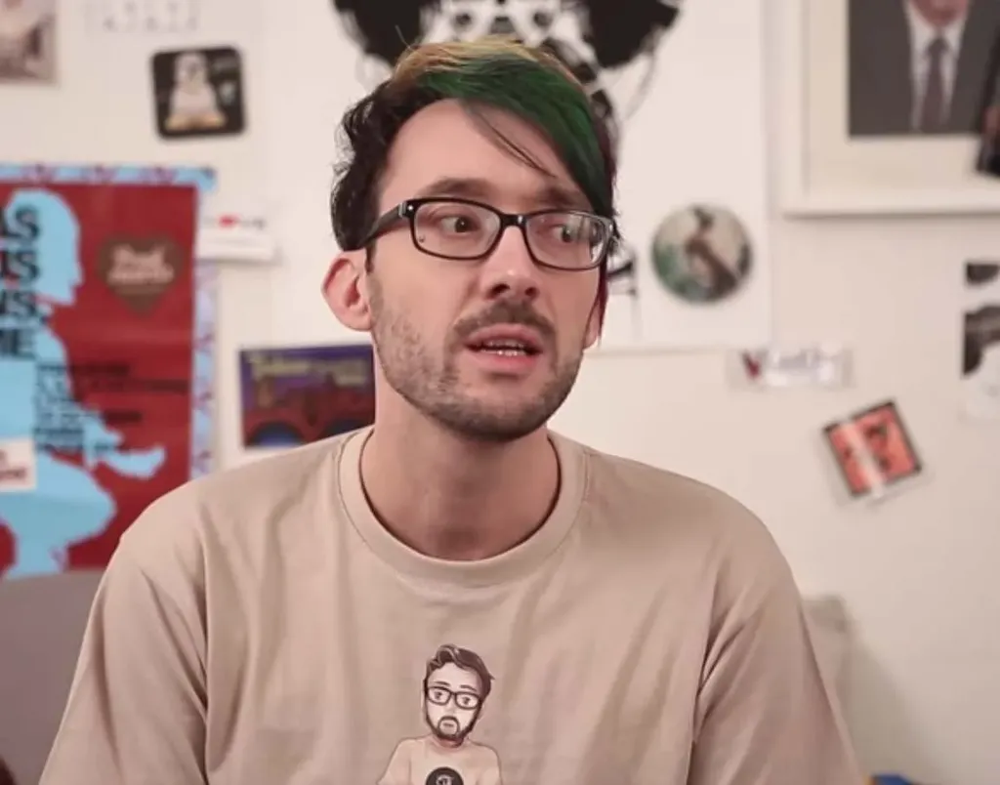

# Auteurs énervés : Pouhiou sexe et Creative Commons

Après une [première radio](../2/deux-auteurs-enerves-a-la-radio.md), [Neil Jomunsi](http://page42.org/) et moi nous lançons pour un live improvisé avec [Pouhiou](http://pouhiou.com/) : Youtuber incontournable, défenseur du libre et auteur, bien sûr.

[audio:http://blog.tcrouzet.com/images\_tc/2015/nrv2-pouhiou.mp3 podcast="nrv" licence="cc0"]

Si vous voulez nous rejoindre, ça marche simplement…

1. On n’est pas journalistes, on donne notre avis et on improvise.
2. On invite avec nous un auteur ou un acteur de l’édition.
3. On le fait parler de son travail, de ses questions, de ses galères, de ses joies... et aussi de ce qui l’énerve dans cet univers… et ailleurs.
4. On publie sous [licence CC0](http://fr.wikipedia.org/wiki/Licence_CC0).
5. [Vous pouvez vous abonner sur iTune](https://itunes.apple.com/fr/podcast/thierry-crouzet/id976965942?l=fr).

#edition #podcasts #y2015 #2015-3-10-16h48
