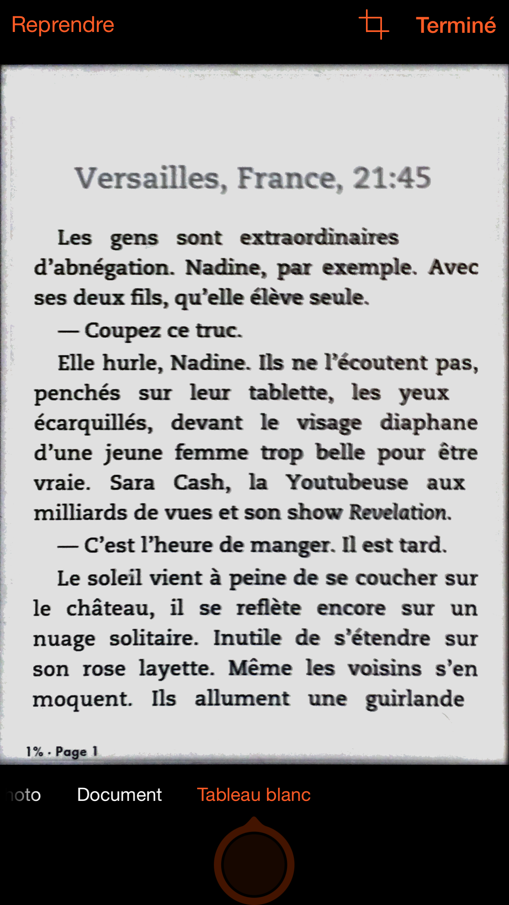

# Comment pirater un livre papier

Un de mes amis vient de sortir un polar. J’aime ses romans. Je lui dis : « je vais le lire et le chroniquer sur le blog. » Je me livre rarement à cet exercice, mais quand je le fais un bon nombre de lecteurs me suivent comme avec l’extraordinaire [*Terminus mon Ange*](../../2014/2/un-ton-neuf-dans-le-polar.md).

Rien de très ordinaire jusque là. Sauf que l’éditeur de mon ami ne publie pas en numérique. Et que moi je lis avec de plus en plus de difficulté sur papier (parce que l’acide des pages m’irrite les doigts, parce que les réglages typo choisis m’échauffent les yeux, parce que les reliures se referment sur mes mains telles des gueules de Pac man, parce que ma bibliothèque déborde et menace de m’ensevelir… [j’arrête l’inventaire](../../2014/3/pourquoi-jaime-lire-en-numerique.md)).

Donc je demande à l’éditeur en question de m’envoyer un fichier, pour me faciliter la vie. Il ne me répond même pas. Je demande à mon ami ce qui se passe. Il m’explique : « Il a peur de se faire pirater. »

Dans quel monde éditorial d’arriérés vivons-nous ? Durant des années, la [Team Alexandriz](https://twitter.com/teamalexandriz) a piraté des livres papier sans aucune difficulté technique. Qu’un éditeur renonce au numérique de peur se faire pirater, c’est la pire des âneries. Qu’il croit se protéger ainsi du piratage, ça frise le ridicule et ça démontre que ledit éditeur vit dans un autre temps et s’adresse peut-être à des lecteurs chimériques qui n’existent plus aujourd’hui, sinon dans une niche moribonde de conservateurs réactionnaires.

Parce que pour pirater un livre papier, il suffit en gros d’un téléphone et d’une petite heure. Il existe de superbes applications d’OCR. Tu photographies une page, tu te retrouves avec le texte dans la boîte. Tu répètes l’opération à chaque page, tu as vite tout un livre. Tu passes dessus Antidote et ça roule. C’était le job de la Team avant que des avocats la poussent à mettre la clé sous la porte.

Éditeur, dis-toi bien que si tes auteurs méritent d’être piratés, ils le seront que tu le veuilles ou non. Aujourd’hui, pour un auteur, être piraté est un honneur. Je suis bien malheureux de ne pas l’être davantage. Plus tu es piraté, plus tu es populaire (et plus tu gagnes de l’argent). Je ne connais pas de meilleur hit-parade (ni de meilleur marketing).

Maintenant, c’est bien dommage. Je ne vais pas pouvoir chroniquer mon ami, même si tu m’envoies son livre, parce que tout le monde mettra un nom sur lui et sur toi, et je n’en ai pas envie.

Je crois qu’en vérité tu n’as pas peur du piratage, mais de la modernité. Tu te caches derrière un épouvantail. Tu aimerais bien que les choses restent telles qu’elles étaient. Continuer à faire ton travail à l’ancienne. C’est étrange parce que j’ai déjà lu quelques romans que tu as édités, et plutôt pas mal d’ailleurs, bien écrits, bien rythmés, mais peut-être qu’il leur manque à tous ce regard vers demain qui semble tant t’effrayer.

Bon, encore un billet pour me faire des amis dans l’édition, mais c’est plus fort que moi. Je ne supporte pas tous ces gens qui vivent avec les deux pieds sur le frein, et qui par ailleurs se proclament éveillés, conscients, artistes… J’en ai marre des fumisteries. Je me fiche bien de me fâcher avec tous les éditeurs de la planète. Les derniers qui accepteront de bosser avec moi seront mes véritables compagnons de lutte. Et s’il n’en reste aucun, je n’en serai pas moins lu (c’est la pire des choses qui peut leur arriver).

Éditeur, tu vis dans un monde numérique. Rien n’échappe aux bits (et à leur beat). Si tu ne veux pas être piraté, arrête de publier. *Safe publishing is no publishing.* Tu peux même dire à tes auteurs d’arrêter d’écrire. Ils ne risqueront plus rien. *Safe writing is no writing.*

*PS : [Pendant ce temps, des auteurs qui n’ont rien compris, comme leurs éditeurs, s’offusquent du piratage.](https://www.actualitte.com/usages/piratage-porter-un-veritable-projet-collectif-sur-le-livre-numerique-56398.htm)*

[caption id="attachment\_40695" align="aligncenter" width="394"] J’aime Office Lens de Microsoft qui remet d’aplomb les pages photographiées.[/caption]

#edition #coup_de_gueule #y2015 #2015-4-22-14h5
