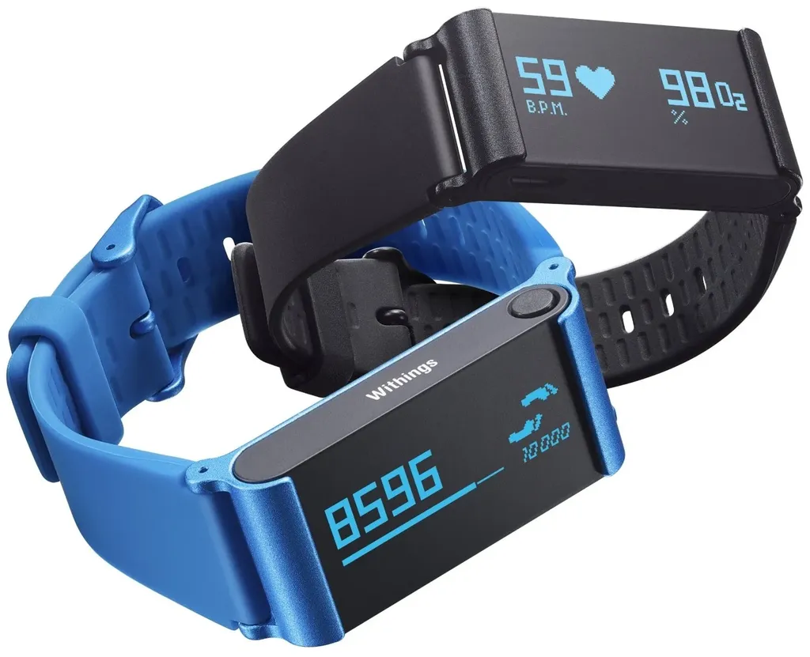

# Digital intox

Depuis deux ans, j’ai envie d’écrire sur l’hyperconnexion. J’ai beaucoup discuté du sujet avec Fayard, mais ça ne se fera pas avec eux. J’ai une proposition d’un petit éditeur, je discute encore avec deux gros, mais l’échéance approche à grands pas et rien n’est signé.

Je voudrais commencer l’expérience avec la sortie de la montre Apple. Et je doute de m’y lancer sans un éditeur, il en va ainsi de certains projets d’écriture, c’était le cas avec *[J’ai débranché](../../page/jai-debranche)*, c’est le cas avec *Digital intox* dans lequel j’ai envie de tordre le cou de la mode *digital detox*. Mon nouveau slogan pourrait être :

> Le remède à l’hyperconnexion, c’est l’hyperconnexion.

J’ai esquissé un plan. Je le publie, pour faire date, au cas où je n’avancerais pas d’un pas dans cette direction, parce que si je ne l’écris pas ce texte d’autres l’écriront, il est est d’une nécessité vitale.

---

*Digital intox* reprend la forme de *J’ai débranché*, Fayard, 2012. Ce sera un journal initiatique au fil d’une expérience, l’hyperconnexion, où je me barde de gadgets. Je l’imagine plus drôle, moins théorique, plus expérimental, plus ludique, plus narratif, avec beaucoup d’autodérision… une sorte de *Journal de Bridget Jones* ou de *Eat pray love* écrit pas un geek quinquagénaire qui tente de se dépêtrer de sa modernité, veut rester jeune et se prend parfois pour James Bond.

Difficile de penser le plan d’une expérience avant de l’avoir vécue. Je liste plus loin les thèmes à développer, plus que l’ordre réel du livre. C’est une quête pour apprendre à vivre notre époque où tout change très vite et à laquelle personne ne nous a préparés, parce que personne ne l’a vécue avant nous.

### J’ai tué mon père

Comment le décès de mon père en septembre dernier aurait pu être évité, peut-être simplement par une montre connectée qui aurait détecté son infarctus. Comment je sors de cette épreuve avec la conviction que vivre déconnecté est aujourd’hui aussi absurde que vivre sans lunettes si on voit mal. Avec tous les dangers pour l’hypocondriaque que je suis (et qu’était mon père). Aussi le sentiment qu’en prônant un moment la déconnexion, j’ai en quelque sorte laissé mon père mourir. C’est un sentiment peut-être absurde, mais la culpabilité est là.

### Le retour d’un déconnecté

Analyse critique du choix de me déconnecter après mon burn-out numérique en 2011. La déconnexion n’est pas une option viable malgré le sentiment de bien-être qu’elle procure. Grâce à cette médication extrême, j’ai retrouvé des sensations oubliées, mais, en même temps, j’ai eu l’impression de passer à côté de quelque chose d’essentiel à mon époque… Donc je suis revenu sur le Net pour y développer un comportement moins naïf qu’avant, plus critique, surtout avec plus de distance, mais peu à peu je me suis fait regagner par la connexion, parce que sans elle la vie est moins intense. Je suis bien obligé de le confesser. Toutefois, je me sens moins fragile qu’avant.

### Les dangers d’une connexion déséquilibrée

Revenir sur ce qui a provoqué mon burn-out et sur les maux des hyperconnectés mis en évidence par des études de plus en plus nombreuses. En fait, selon moi, tous imputables à une connexion trop centrée sur l’intellect. Nous sommes des hyperconnectés du cerveau. Nous oublions souvent en chemin notre corps et notre esprit, l’espace et le temps. Nous ne marchons plus que sur une de nos trois pattes, le cerveau. Alors nous tombons. Si je vis mieux l’hyperconnexion, c’est parce que j’ai commencé à reconnecter les deux dimensions que j’ai négligées par le passé, le corps et l’esprit.

### L’achat de la montre Apple

Ça tombe bien. Les industriels nous préparent des gadgets pour nous aider à reconnecter le corps, à secourir une volonté parfois défaillante, tant les écrans l’aspirent. Par exemple la montre Apple et le bracelet Withings. Alors le 24 avril, je cours dans mon Apple Store acheter la montre Apple. Et je raconte. Je suis dans le vécu. Je décris la folie mimétique des foules, mais aussi ce besoin d’être davantage connecté. Quelque chose travaille les gens au plus profond, ils ne sont pas simplement des suiveurs, des victimes du marketing, ils sentent au fond d’eux qu’ils doivent reconnecter leur corps.

### Ma vie avec la montre

Je me donne un objectif. Courir un semi-marathon. Je vis avec la montre et les bracelets. Le jour, la nuit. Je partage sur le Net, j’échange. J’expérimente. La connexion du corps, la reconnexion avec l’espace. Je mesure la vertu des feedbacks, mais aussi je critique bien sûr. Et puis comment savoir à l’avance ce que je vivrai à partir de fin avril ? Et j’en rajoute. Je contacte toutes les boîtes qui vendent des gadgets. Je me surbranche. Je deviens leur cobaye, mais toujours critique.

### La méditation

Tous les premiers hyperconnectés, notamment du côté de la Silicon Valley, se mettent à la méditation pour supporter la connexion. Ils passent de la connexion numérique à la connexion spirituelle. Le but : reprendre le contrôle du temps. Aller à leur rencontre, les faire parler. Montrer comment sans contrôle du temps, on ne lit plus que des brèves sur le Net. Lien entre le contrôle du temps et la lecture de textes longs, et donc de livres, et donc avec notre culture. Sans connexion avec le temps long, les connexions temps réel nous dévorent.

### Les sages

Enquêter du côté des sages des différentes spiritualités. Voir comment ils ont appris à vivre dans le monde hyperconnecté tout en restant fidèles à leurs enseignements. Alors je me remets à la méditation, comme par hasard interrompue en gros avec l’arrivée d’ADSL chez moi (et des enfants, c’est vrai).

### La connexion totale

Pour une approche holistique de la connexion : intellect, physique, spirituel. Sorte de bilan de mon expérience. L’hyperconnexion comme suite de notre histoire sociale et seul espoir de régler les problèmes provoqués par la crise de la complexité, mais à condition de trouver la connexion harmonieuse.

### Hyperconnecté hyperespionné

Mais attention danger. Les gouvernements et les entreprises veulent également contrôler en cherchant à maximiser les feedbacks. Chez les institutions s’est installée une peur de la société hyperconnectée, donc hypercomplexe, difficile à piloter… peur de libérer des forces nouvelles.

### Ça risque de finir dans un ashram

Je n’ai aucune idée d’où cela me mènera, nous mènera. Je me vois bien mettre tout à plat dans un lieu de médiation, dépourvu de connexion électronique, mais chargé de connexions plus traditionnelles.

[caption id="attachment\_40471" align="aligncenter" width="600"] Hyperconnecté, mais bien connecté.[/caption]

#netculture #dialogue #y2015 #2015-4-9-12h31
