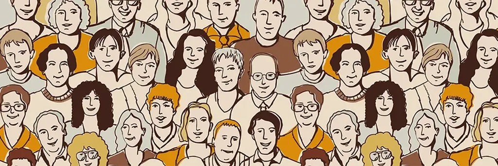

# Internet favorise-t-il la liberté de faire n’importe quoi ?

Tout le monde peut s’exprimer sur le Web. Publier ses photos, ses commentaires, ses articles, ses vidéos. Nos libertés, tout au moins la liberté d’expression, paraissent de toute évidence accrues. D’un autre côté, des beuveries géantes s’organisent grâce aux réseaux sociaux, avec à la clé des victimes. Ce n’est qu’un exemple. Tout n’est donc pas parfait dans le meilleur des mondes. Est-ce que plus de liberté implique mécaniquement plus de bêtise ?

Tout d’abord, Internet contribue-t-il positivement à nos libertés ? Aujourd’hui, faute de temps, nous ne pouvons ni voir, ni écouter, ni lire plus de choses qu’avant. Même si nous pouvons tous nous exprimer avec davantage de facilité, pas plus de voix ne peuvent se faire entendre. L’accès à la parole s’est démocratisé sans que nos mots portent plus loin. Le Net a étendu la liberté d’expression sans la transformer radicalement. Au final, il n’a fait que mettre nos voix en concurrence. Un anonyme peut soudain faire la une des médias. Il rejoint alors la *short list* des quelques privilégiés entendus.

###Plus je me lie, plus je suis libre

Si Internet nous libère, ce n’est donc pas pour la raison communément invoquée : la plus grande liberté d’expression. Le mécanisme est plus tortueux. Une chose fondamentale a changé dans nos vies : nous sommes en relation avec plus de personnes que par le passé. Mail, Facebook, Twitter, Skype… nous interagissons avec beaucoup plus de gens. Certes, le plus souvent superficiellement, mais néanmoins des émotions, des exaspérations, des blagues se propagent. Elles arrivent de toute part et nous les faisons suivre. En conséquence, le réseau social de l’humanité se densifie. Métaphoriquement, la carte comporte chaque jour de plus en plus de routes, qu’elles soient nationales ou vicinales.

Imaginez-vous maintenant à la place des forces de l’ordre. Le contrôle de ce réseau devient de plus en plus difficile. Et de fait, l’intensité du contrôle ne peut que diminuer. C’est automatique : plus un système se complexifie, plus son organe de supervision doit lui-même se complexifier. Ses ressources étant toujours plus limitées que celles de l’ensemble du réseau, il ne peut suivre la course à la complexification. Les individus s’en trouvent libérés faute de pouvoir être contrôlés.

En réponse, presque tous les gouvernements multiplient les lois pour faciliter la surveillance des citoyens. Chaque attentat est l’occasion d’accroître la puissance de l’organe de supervision à moindre coût. C’est d’autant plus vital pour les autoritaristes, persuadés qu’Internet a mis entre les mains de chacun de nous une kalachnikov.

### Le piège du mimétisme

Que faire du surplus de liberté ? Si nous regardons tous les mêmes vidéos, si nous lisons tous les mêmes textes, il est probable que nous réagirons tous de la même façon. C’est ainsi que des adolescents se retrouvent par milliers sur la même plage pour se saouler à mort. Chacun persuadé d’être libre, mais tout usant de leur liberté exactement de la même façon.

C’est le piège du mimétisme. Exploité par les dictateurs, les prophètes sectaires, les escrocs ou tout simplement les politiciens. Disposer d’une totale liberté de mouvement et de parole sans, dans le même temps, s’être construit seul contre les autres, nous met en situation d’obéir aveuglément à la première injonction venue. Un individu n’est libre que s’il est un et irréductible, autrement dit que s’il développe son individuation, c’est-à-dire apprend à être lui-même et nul autre.

Cet être individué n’est pas un parangon de sagesse. Il peut commettre des erreurs, mais toujours en son nom, avec des conséquences collectives modestes, et bien moins dramatiques que quand des milliers, des millions de personnes, embrassent le même comportement, telle une armée fanatisée. Un être libre peut faire n’importe quoi. Quand ils sont innombrables à faire le même n’importe quoi, ça devient catastrophique.

La liberté seule ne nous protège en rien. C’est une condition nécessaire à notre émancipation, mais pas suffisante. Et si le Net nous libère mécaniquement, il n’accroît pas mécaniquement notre individuation. Un écart se creuse alors entre ces deux dimensions, et la liberté risque de se retourner contre elle-même. Ce phénomène se produit chaque fois qu’un monde libre sombre dans la dictature. Ainsi les intégristes combattent l’éducation parce qu’elle est le meilleur chemin vers l’individuation.

Internet aussi, paradoxalement. Ils nous donnent accès à la diversité des points de vue, à la multiplicité des paroles. À nous de transformer notre kalachnikov en canne à pêche pour attraper ce qui n’intéresse pas les autres, et de cette prise, ajoutée à beaucoup d’autres, nous construire une originalité radicale. Alors nous ne ressemblerons plus à des soldats, même libres comme les Athéniens antiques, nous serons des individus, chacun parcourant sa route. Et quand nous nous rencontrerons, nous nous éblouirons de nos différences, plutôt que de nous gargariser de nos similitudes.

Internet ne contribuera positivement à l’humanité que le jour où sa force libératrice se retournera contre le mimétisme. Nous en sommes malheureusement encore loin.

*PS : Article écrit durant le drame de Charlie Hebdo pour [le numéro 36 d’Immorama](http://www.immorama.ch/immodossier/erosion-des-droits-individuels).*

[caption id="attachment\_40496" align="aligncenter" width="600"] Immorama #36[/caption]

#liberte #netculture #dialogue #y2015 #2015-4-10-9h56
