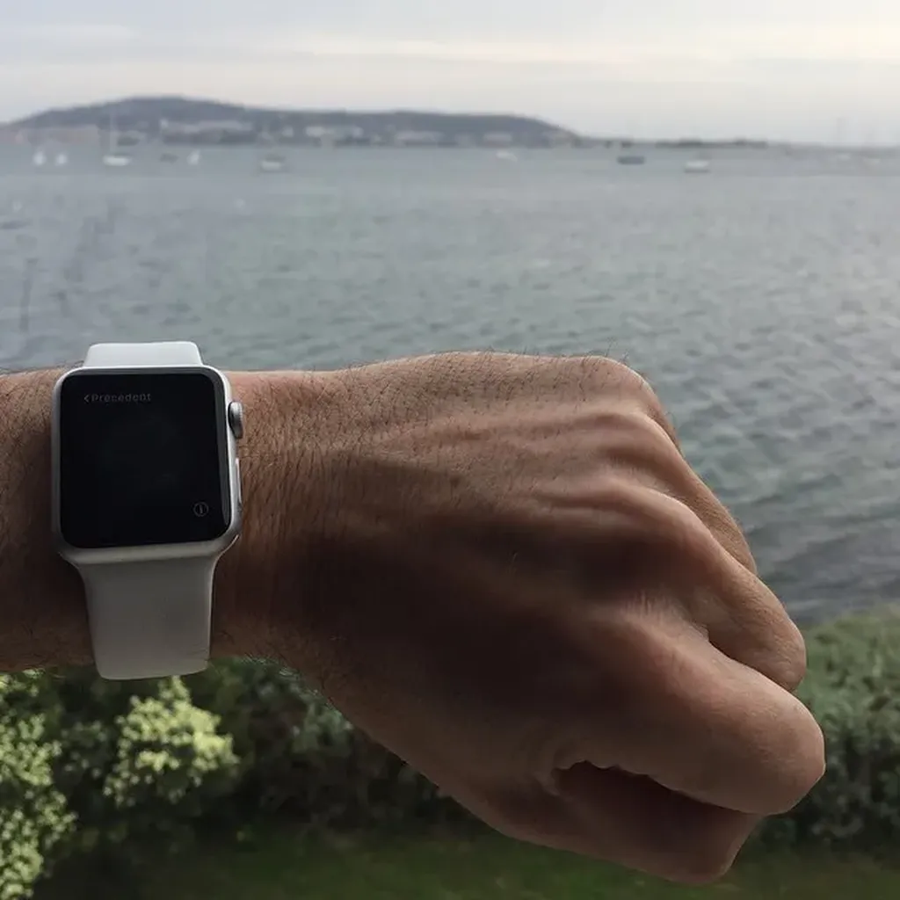

# Critique de la technocritique

Le technocritique serait libertaire, voire anarchiste, et verrait dans la technique un énième moyen d’asservir l’homme, de creuser l’espace entre dominants et dominés. Fort belle pensée, mais pas dépourvue d’incohérences. [Exemples relevés dans un superbe dossier d’*Usbek & Rica* écrit par Blaise Mao.](https://readymag.com/usbeketrica/technocritiques/)

> Il n’existe pas de mouvement critique de la technologie mais une multitude de courants de pensée et d’initiatives qui ne sont pas structurés de façon homogène. François Jarrige, historien auteur de *Technocritiques, sorte de contre-histoire du progrès*.

Comment un amoureux de la liberté peut-il se plaindre du manque d’homogénéité ? Quand les hommes sont libres, ils se dispersent et c’est une bonne chose, parce qu’ils expérimentent, font des essais, des erreurs et des trouvailles, sans avoir d’idées préconçues au préalable de ce qui sera bon pour eux à l’avenir. L’homogénéité ne survient qu’avec une forme de totalitarisme intellectuel.

> Si on adopte une approche sectorielle et à court terme, on se condamne à ne rien comprendre à la technique. Joël Decarsin membre fondateur de l’association Technologos.

Même tentation. Vouloir unifier le champ de la technique, le mettre sous un commandement unique, jeter dans le même camp les adeptes de la surveillance et les hackers. Il n’existe pas une technique, mais des techniques, et chercher à les confondre n’est encore une fois qu’une forme de totalitarisme avec la volonté évidente de nier la complexité.

> [L’anonymat] C’est un choix de résistance face à la transparence ; c’est une mise à l’écart pour mettre le collectif au cœur de l’action. En tout cas, ça traduit un refus démocratique de la prise de posture de l’intellectuel prophète qui explique le monde aux masses. François Jarrige.

Cette position laisse supposer qu’il existe encore une possibilité historique pour l’intellectuel prophète. Il suffit d’ouvrir les yeux : tout le monde s’exprime désormais sans avoir peur de devenir prophète. On a plutôt peur de s’époumoner pour rien tant nous sommes nombreux à nous exprimer.

> Bien sûr qu’Internet donne du pouvoir aux individus, et c’est bien ça le problème. C’est la poursuite d’une tragédie : l’homme ne parvient pas à sortir de la logique du pouvoir. Joël Decarsin.

Je ne suis pas sûr qu’on puisse comparer le pouvoir que nous avons sur nos vies et nos états mentaux, avec la recherche du pouvoir sur les autres, qui elle me paraît bien sûr condamnable. Je ne suis déjà pas très sûr qu’Internet nous donne du pouvoir, si un peu tout de même, déjà celui de publier mes balivernes, mais du pouvoir sur les autres, j’en doute. Dans *Le Cinquième pouvoir*, j’évoquais d’ailleurs un non-pouvoir, un pouvoir pour empêcher ceux qui l’exercent d’habitude de continuer à l’exercer. Le but est bel et bien d’échapper à la tragédie.

> [Le technophile] est de plus en plus cet existentialiste suréquipé, qui n’a de cesse de tout ingénier, de tout recréer, ne pouvant souffrir une réalité qui, de toutes parts, le dépasse. Le comité invisible.

Un point commun chez tous les technocritiques. Ils pensent savoir ce qui est bon pour les autres et surtout savoir ce que les autres ne comprennent pas. J’appelle ça se placer au-dessus d’eux, donc se penser hiérarchiquement leurs supérieurs… Ça joue mal avec l’idée de liberté, avec l’anarchisme et tout le bazar.

> Qu’ils soient sévères ou indulgents envers les hackers, les technocritiques se rejoignent en tout cas pour dénoncer l’obsession des pirates informatiques pour la liberté individuelle, « qui leur interdit de constituer des groupes assez forts pour déployer, par-delà une série d’attaques, une véritable stratégie ». Comité invisible cité par Blaise Mao.

Et ressurgit ce besoin ancien de faire église, de faire groupe, de se fondre dans la masse de la foule réunie au nom d’un même slogan, et implicitement d’un chef. Peur d’aller au front par soi-même, en guérilléros, envie de se joindre à une armée. Des désirs que, pour ma part, je combats, quitte à payer cette position par une extrême solitude… mais parfois on se retrouve, on se reconnecte, on se touche. On n’est pas si seul que ça quand on choisit de ne pas se joindre au troupeau.

> Critiquer la technologie, c’est s’exposer à une forme d’exil intellectuel. Blaise Mao.

En France, c’est bien le contraire. Mes propos n’ont jamais autant été repris que quand j’ai publié *J’ai débranché*. Il suffit même de proposer une idée de livre technophile à un éditeur français pour qu’il grimace.

> Rien n’agace autant un technosceptique que d’entendre son interlocuteur affirmer qu’une nouvelle technologie n’est « ni bonne ni mauvaise » et que « tout dépend de l’usage qu’on en fait. Blaise Mao.

Au moins, sur ce point nous sommes d’accord. À bien y regarder, surtout depuis que j’ai publié *J’ai débranché*, j’ai rejoint les rangs des technocritiques. Et, si je saute sur le moindre iTruc, c’est pour mieux le critiquer (ne vous moquez pas — « Tu as tout, toi, papa », me disent mes fils. « Oui, mais c’est pour mon travail. »).

[caption id="attachment\_40907" align="aligncenter" width="600"] J’ai même craqué pour une Apple Watch.[/caption]

#netculture #dialogue #y2015 #2015-5-4-15h22
