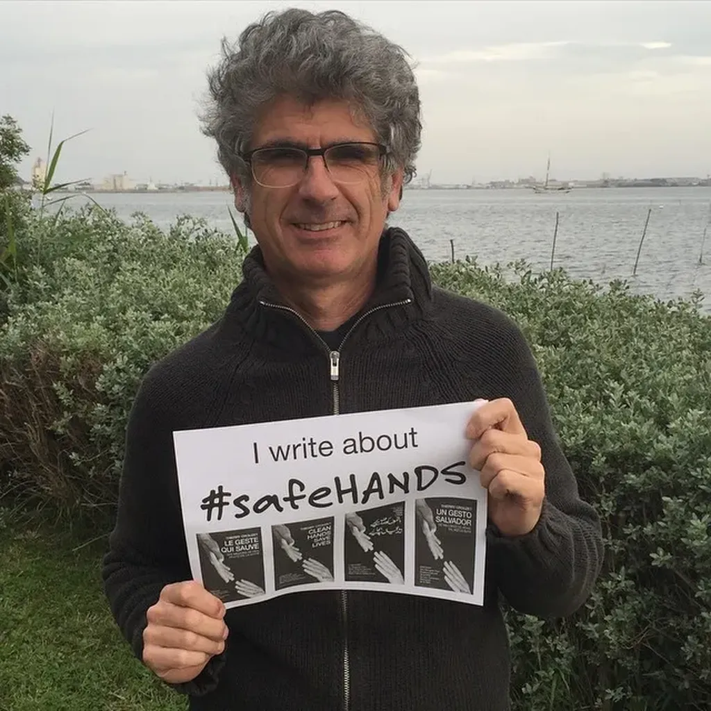
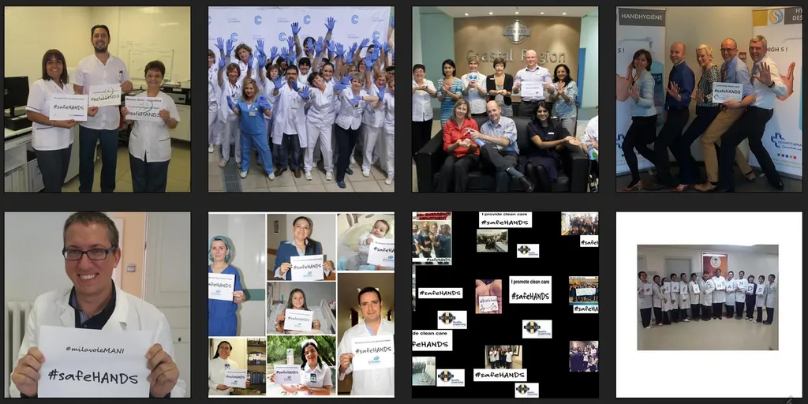

# Faites le geste qui sauve

Le 5 mai, c’est la journée mondiale de l’hygiène des mains. Donnez de l’ampleur au mouvement avec un selfie qui affichera le hashtag #safeHANDS.

Pour jouer, il suffit de faire comme moi. [Récupérez une affiche sur le site de l’OMS](http://www.who.int/gpsc/5may/EN_PSP_GPSC1_5May_2015/en/), photographiez-vous, postez l’image partout. [Toutes les images se retrouveront sur le site de la fondation CleanHandsSaveLives.](http://www.cleanhandssavelives.org/safehands/)

Si vous voulez en savoir plus sur cette fantastique épopée médicale, il est encore temps de lire *[Le geste qui sauve](../../page/le-geste-qui-sauve/downloads)*. Le livre souffle demain son premier anniversaire, avec plus de 40 000 copies distribuées dans une douzaine de langues.

[caption id="attachment\_40922" align="aligncenter" width="600"] Participez et sensibilisez vos amis.[/caption]

#le_geste_qui_sauve #politique #breves #y2015 #2015-5-4-19h5
