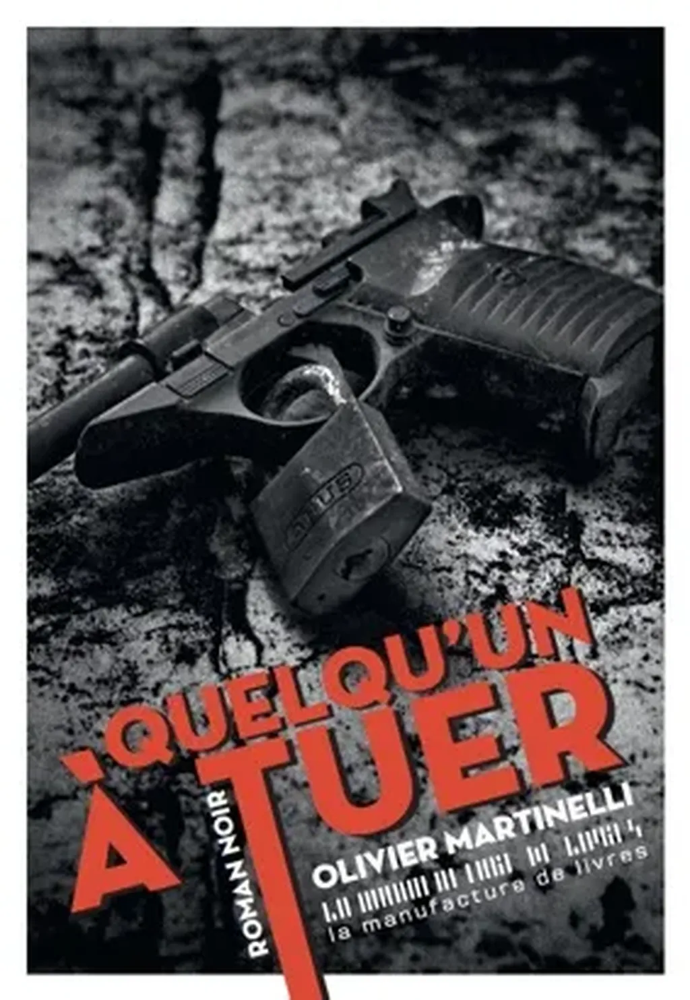

# Le rocker nous joue sa fugue

J’ai juré de ne pas parler de [*Quelqu’un à tuer*](http://www.lamanufacturedelivres.com/le_site/Quelquun_a_tuer.html). [Parce que Pierre Fourniaud l’éditeur de ce roman refusait de me donner une version numérique.](../4/lediteur-qui-ne-fait-pas-confiance-aux-lecteurs.md) Reste que le texte existe, son auteur aussi, Olivier Martinelli, une sorte de survivant du XXe comme échoué sur les rivages du XXIe, avec sa voix, sa hargne, sa volonté inflexible, le tout en douceur, cette douceur du rocker au cœur trop gros pour rester caché bien longtemps.

Alors j’ai acheté le livre papier. Un sale objet qui me ronge les doigts, me force à lire à la lumière du jour ou pire sous un abat-jour, à la typo toujours trop proche de la reliure intérieure, je l’ai pris tout de même parce que je le devais, et parce que je ne pouvais plus faire autrement après avoir écouté Olivier lire quelques passages.

Du rocker, je retrouve le rythme. Les phrases courtes, enchaînées à toute berzingue, perlées par des chapelets de « Et », brisées par des « Mais », des dialogues hurlés. Pas une fausse note, ça file, ça dégomme, la basse martèle. Plus j’entre dans le morceau, plus le son devient cristallin. Le technicien à la sono trouve le réglage parfait.

Deux lignes mélodiques se croisent. 1990, presque aujourd’hui, mais encore bel et bien le XXe, avant la béance numérique généralisée. 1934, l’Espagne révolutionnaire, paradoxalement plus proche de nous. Deux hommes du même âge destinés de toute évidence à se croiser.

Une construction parfaite. Plus classique que Rock. Une fugue contraponctique, avec les deux lignes qui se fuient l’une l’autre pour se donner de plus en plus de vitesse et de profondeur en même temps qu’elles s’enlacent.

La musique et son thème m’ont inévitablement fait penser [*Au rire d’Olga*](../../2010/7/le-rire-olga.md) de Lilian Bathelot. J’avais aussi en tête un autre chant comme en opposition. En contre point de la fugue classique jouée par Olivier s’élevait en moi la polyphonie hallucinée de [*Rêves de Gloire*](../../2012/8/roland-c-wagner-1960-2012.md) de Roland C. Wagner. D’un côté, la forme littéraire du XXe menée à sa pureté, de l’autre, le chaos et la complexité du XXIe. Les deux pans de ma propre vie.

[*Quelqu’un à tuer*](http://www.lamanufacturedelivres.com/le_site/Quelquun_a_tuer.html) est un texte terrible non par les meurtres de l’Histoire qui le traversent mais par la puissante nostalgie qu’il réveille en moi. Il m’a imprégné d’une couleur, d’une saveur, d’une sensation du temps qui n’existe plus, et que peut-être, nous, les survivants, devons aller fouiller dans nos souvenirs et ceux de nos parents.

#critique #dialogue #y2015 #2015-5-29-11h55
