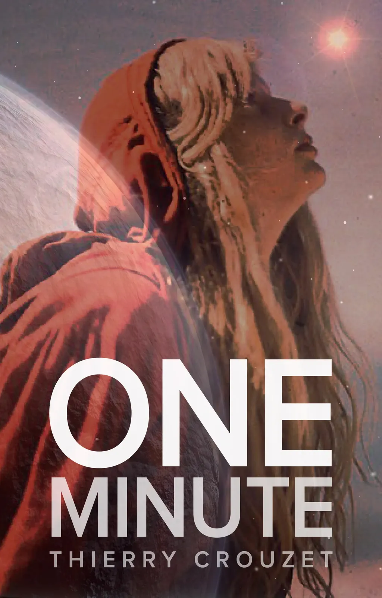
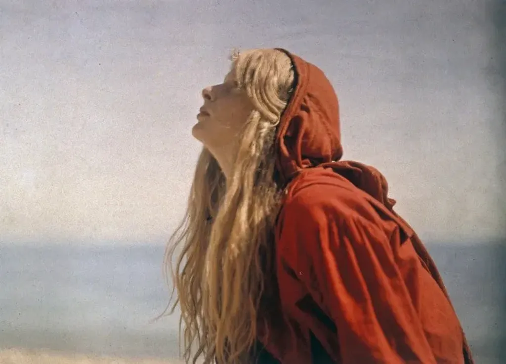
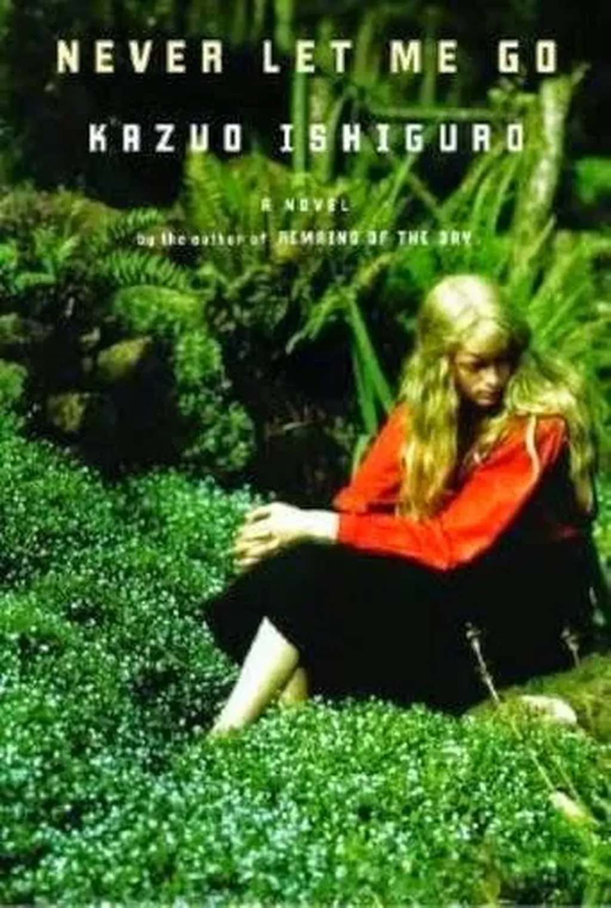

# Un visage pour Sara Cash

Sara Cash, l’héroïne de [*1 minute*](http://www.wattpad.com/story/29694130-1-minute), change de visage en fonction de ceux qui la regardent. Tantôt elle est adorable, tantôt un monstre, tantôt une pimbêche prétentieuse, tantôt une ado boudeuse. Il n’existe pas de vérité.

Dans [la minute 132](http://www.wattpad.com/128673994-1-minute-copenhague-danemark-21-45), un graphiste est persuadé d’avoir retrouvé Sara sur un cliché datant de 1913, une authentique photo de Christina O’Gorman. J’ai eu cette idée en découvrant [une série de clichés d’elle par son père Mervyn O’Gorman](http://www.fisheyemagazine.fr/la-jeune-fille-en-rouge/).

[caption id="attachment\_41030" align="aligncenter" width="600"] Christina, 1913 par Mervyn O’Gorman. [/caption]

Difficile de ne pas tomber amoureux d’elle, tout en sachant qu’elle nous a quittés depuis longtemps. Je suis resté des plombes à l’observer, si vivante, si mystérieuse. C’est une des plus anciennes photos couleur que nous possédons. Christina est comme la première immortelle.

[caption id="attachment\_41036" align="aligncenter" width="342"] Christina en couverture, logique puisque les photos de Mervyn O’Gorman sont désormais libres de droits.[/caption]

[caption id="attachment\_41031" align="aligncenter" width="342"] Christina donne un visage à Sara Cash.[/caption]

#cuisine #sur_1_minute #dialogue #y2015 #2015-5-12-21h50
