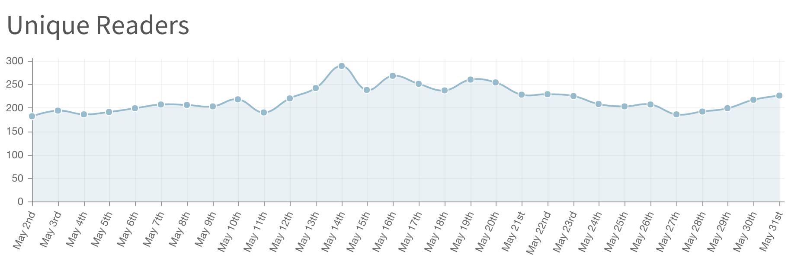

# Cinq mois sur Wattpad

Je tiens le rythme sur [*1 minute*](http://www.wattpad.com/story/29694130-1-minute), notamment grâce aux encouragements de quelques lecteurs fidèles. Des éditeurs me disent : « C’est pas un roman ton truc. » Je crois plutôt qu’ils confondent succès en librairie et roman.

Moi, j’ai bel et bien l’impression d’écrire un roman, [même s’il est moléculaire](../5/le-texte-moleculaire.md) et même si sa version finale ne sera pas projetable sur papier. Raison de plus pour continuer le jeu, partir, chercher à ne rien respecter. J’ai commencé par flinguer le personnage principal pour donner la parole aux seuls personnages secondaires. Je vais continuer à mêler romanesque et philo.

Côté chiffres, je n’ai pas le courage de faire une analyse poussée. [Après quatre mois](../5/wattpad-le-contraire-dun-blog.md), les 15 premiers chapitres recueillaient 50 % des lectures. Il faut désormais 22 chapitres pour atteindre ce score, preuve que la longue traîne s’allonge, que les lectures se répartissent mieux sur l’ensemble.

En données brutes, j’ai donc 87 000 lectures pour 151 chapitres, soit une moyenne par chapitre de 576 lectures/chapitres (contre 504 lectures/chapitres après quatre mois).

[caption id="attachment\_41252" align="aligncenter" width="600"] Le nombre de lecteurs uniques/jour a bien progressé avant de retomber, puis de repartir à la hausse, sans doute un effet des ponts, du climat.[/caption]

#netlitterature #wattpad #dialogue #y2015 #2015-6-1-20h57
