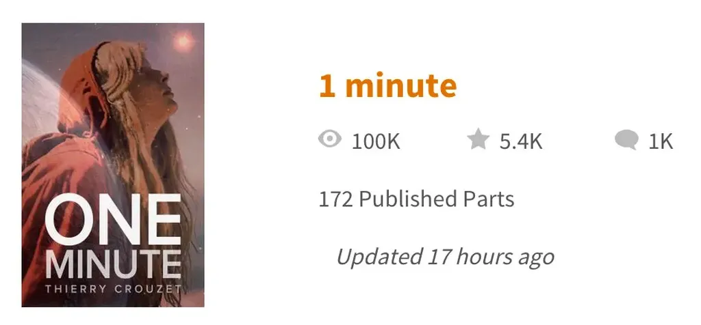
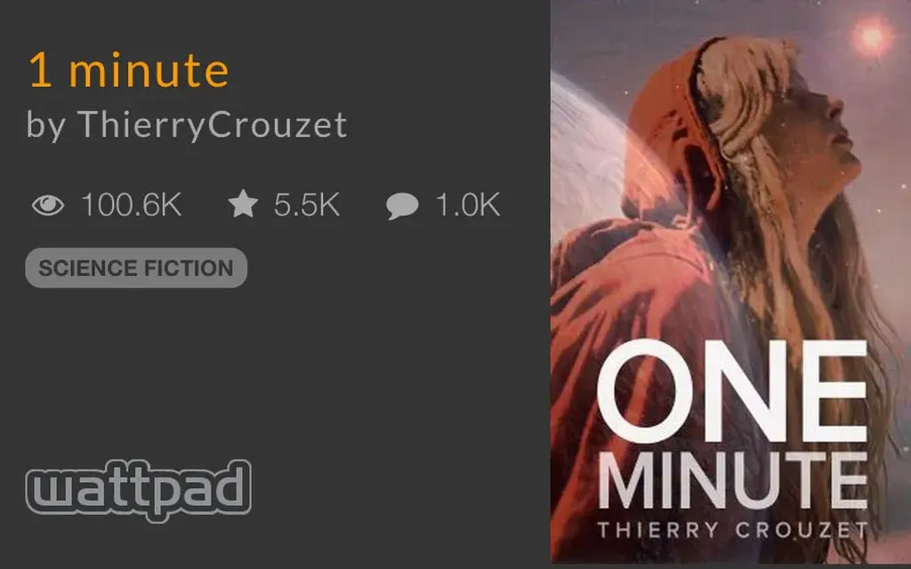

# L’histoire n'avance pas dans le temps, seulement dans l'espace

Je prends peu à peu conscience que travailler avec Ulysses et publier sur Wattpad influence en profondeur mon feuilleton *1 minute*. Grâce à son système de recherche, Ulysses m’aide à naviguer dans mes fragments, à gérer une quarantaine de fuseaux horaires, des centaines de lieux et de personnages (inimaginable avec Word, encore plus avec des fiches papier). Tout en facilitant la diffusion d’un récit par épisodes, Wattpad m’envoie, quant à lui, des lecteurs fidèles, curieux, perspicaces.

Dans un commentaire, vixii\_ecrivaillon résume mon projet : « L’histoire n’avance pas dans le temps, seulement dans l’espace. » Quand je me suis lancé dans le roman, je n’avais qu’une vague conscience de cet enjeu formel. L’histoire ne progresse que quand on se déplace de ville en ville, de fuseau horaire en fuseau horaire, de personnage en personnage. Le temps, lui, a été figé, pendant que tous les autres paramètres se transforment. *1 minute* est un roman géographique qui vient naturellement après mon *Ératosthène*. C’est logique en quelque sorte, mais je n’y avais pas pensé avant ces derniers jours.

J’avais bien sûr quelques intentions littéraires :

1. Dégommer les personnages principaux au profit d’une multitude de personnages secondaires, afin de montrer que l’Histoire dépend de tous et non de quelques héros, tout cela en accord avec la théorie de la complexité (c’était déjà le projet de Tolstoï dans *La Guerre et la Paix*).
2. Laisser le lecteur se réinventer un récit continu à partir de quelques centaines d’échantillons qui, dans la version finale du récit, pourront être recombinés à l’infini selon une navigation non linéaire (géographique, thématique…).

Je n’avais pas pensé que pour atteindre cet objectif, tuer le temps était un passage obligé.

#netlitterature #sur_1_minute #breves #y2015 #2015-6-22-12h22
