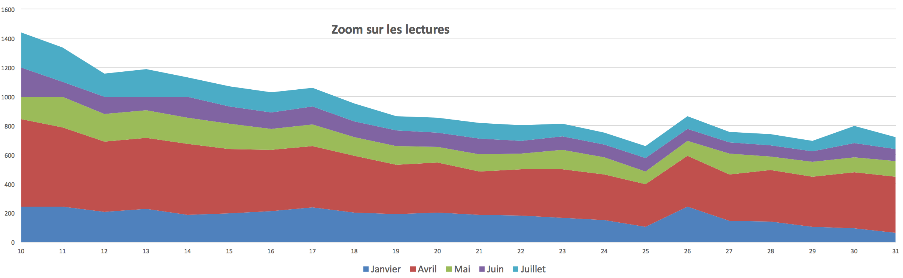
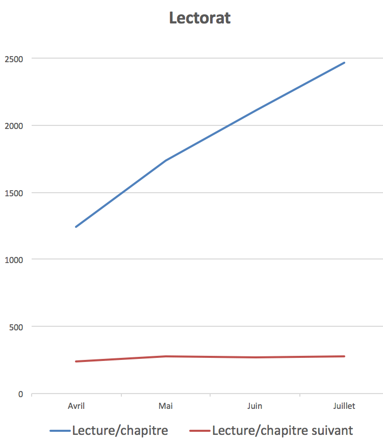

# Faire son nid sur Wattpad

Mois après mois, Wattpad ajoute une petite couche de lecteurs à [*1 minute*](https://www.wattpad.com/story/29694130-1-minute). Il suffit de zoomer sur la courbe du lectorat pour comprendre la mécanique.

Je me demande comment nous pourrions réussir ce tour de force sur les blogs où nos billets, sauf effet improbable de référencement, captent leur lectorat en quelques jours puis stagnent dans nos archives (certes ils progressent dans le temps, mais de façon moins spectaculaire que sur Wattpad).

Cette différence entre les deux modèles me tracasse. Parce que, si mon blog n’est pas capable de ramener les nouveaux lecteurs en début de narration, je ne peux y publier de narration, et seulement des billets indépendants, ou vaguement connectés dans un projet où chaque étape doit être facultative, [mes vagabondages par exemple](../../2014/11/le-je-lappareil-photo-et-limprimante.md) (preuve s’il en faut que l’outil influence l’écriture comme j’essaie de le montrer dans *[La mécanique du texte](../../page/la-mecanique-du-texte)*).

Imaginez une démonstration mathématique où on ne découvrirait que quelques étapes. Mieux, un programme informatique dont certaines routines seraient absentes, ou une horloge où il manquerait des rouages. C’est un peu ça un blog littéraire. Nous sommes forcés d’y publier des séries non linéaires, lisibles en tout sens, et surtout qui supportent les trous (vous me direz que là modernité pointe dans cette direction).

On s’en tire comme ça, mais c’est un aveu de faiblesse par rapport au romancier, qui lui doit tenir son public du début à la fin. En fait, le blogueur se fiche de son public. Il recommence presque à chaque billet, au gré de Google. J’exagère à peine. Tu sautes des pages et des pages et ce n’est pas grave. J’aime bien cette idée : donner de la liberté, de la flexibilité. Je sens bien aussi que cette méthode enlève une sacrée pression éditoriale. Tu peux publier n’importe quoi puisqu’un échec est sans grand effet.

Je ne souhaite pas que les nouveaux lecteurs de mon blog soient obligatoirement dirigés vers le premier billet, mais je ne souhaite pas non plus qu’ils se limitent au dernier billet repéré par un like. D’où mon expectative actuelle. Un blog pour se vouloir littéraire doit être capable d’un effet Wattpad. Cela implique de repenser les interfaces et de nous éloigner de la métaphore de la presse, qui est bien peu littéraire.

Attention, j’aime la non-linéarité. Je n’ai jamais rien rêvé de plus topologique comme narration que [*1 minute*](https://www.wattpad.com/story/29694130-1-minute), mais je veux que cette non-linéarité prenne le risque de tenir son lecteur. Parce que Wattpad peut aussi être violent. Et faire mal. La courbe globale montre combien mon feuilleton peine à garder les lecteurs qui découvrent les premiers chapitres (et c’est parce que le blog est moins douloureux pour l’ego qu’il encourage un dilettantisme littéraire).

J’ai essayé de faire parler cette courbe autrement. Le lectorat moyen des 31 premiers chapitres ne cesse d’augmenter, alors que celui des chapitres suivants se stabilise (à 279 lectures/chapitre en juillet). Wattpad recrute donc bel et bien sur le début du roman, mais le roman lui-même peine à profiter de cette manne.

Alors la tentation du blog est forte. Tout recommencer à zéro. Passer à un autre échantillon de la série, indépendant même si construit selon le même cahier des charges. Pourtant, non, je persévère dans la direction choisie, parce qu’elle me rend heureux, parce qu’elle me tient… et parce que le blog, c’est implicitement subir la dictature des chiffres, même quand on ne consulte jamais ses statistiques. C’est une façon de la subir en creux, parce que le lectorat d’un jour n’influence que faiblement celui du jour suivant. 

Il me faudra à l’avenir réfléchir à la différence entre le billet et le chapitre, entre l’échantillon d’une série et l’épisode d’un feuilleton. Tout se joue dans le rapport entre l’auteur et le lecteur. C’est une question de responsabilité (par exemple celle de tenir en haleine). Et je l’avoue, bloguer est bien moins exigeant que tenir un lecteur sur la distance d’une histoire ou d’une réflexion. En tout cas, si on se laisse aller à l’indépendance naturelle des billets, sans en faire une contrainte esthétique.

#netlitterature #wattpad #dialogue #y2015 #2015-8-1-12h39
