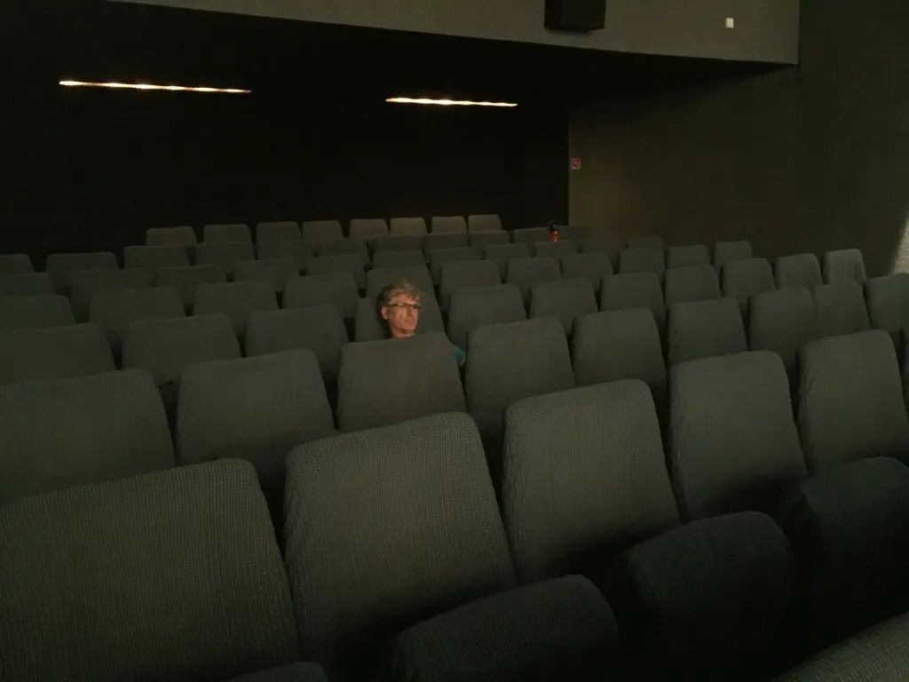

# Le Web que nous aimions tant

Nous avons tous lu [le billet écrit par Hossein Derakhshan à sa sortie de prison](http://ecrans.liberation.fr/ecrans/2015/07/20/six-ans-apres-internet-se-recroqueville_1351044). Il se plaint de la disparition du Web qu’il aimait tant six ans plus tôt, il regrette que plus personne ne le lise, il se lamente de devoir promouvoir ses textes sur les réseaux sociaux… Il formule la critique que nous répétons avec de plus en plus d’insistance depuis 2007/2008 (au point que de guerre lasse j’en ai pété une durite en 2011 et me suis déconnecté, une façon de m’exiler hors du Web).

Paradoxalement, le billet d’Hossein a été reproduit sur des centaines de sites, traduit dans des dizaines de langues. Six ans plus tôt, il n’aurait jamais eu la même audience. Il n’a pas été lu chez Hossein, sur son blog, en son lieu natif, mais partout, comme tout bon livre qui se respecte et qui a vite fait de quitter la maison de son auteur.

De toute évidence, Hossein s’est trompé pour une chose : des centaines de milliers de lecteurs lui démontrent qu’il n’est pas moins lu. Reste que le Web des origines est bien mort. Un autre émerge, différent du premier. Sur ce Web, un des billets d’Hossein a été lu, mais pas nécessairement les autres. La lecture ne s’effectue plus qu’à travers les recommandations sociales, donc à travers une forme de populisme qui, au lieu de favoriser une œuvre, plébiscite quelques icebergs flottants à sa surface (et cela à travers quelques grands acteurs techniques tout-puissants).

En même temps que l’œuvre s’efface, l’auteur passe à l’arrière-plan. On entre dans le Web consommable, où seuls comptent des morceaux d’histoires à partir desquels les lecteurs dessinent leur vision du monde. Ils créent leur œuvre en quelque sorte (version optimiste de l’affaire). On ne lit plus Hossein, mais le plus souvent des billets anonymes. Une civilisation post-individuelle s’invente (pour les créateurs de contenus par pour les capitalistes derrières les plateformes techniques). Ce n’est peut-être pas grave en soi, juste un peu gênant pour les natifs de l’ancienne civilisation (elle-même née avec le « je suis moi-même la matière de mon livre » de Montaigne, donc avec l’émergence des créateurs).

### Le Web que nous aimions

Décentralisation des services entre lesquels circulent des internautes nomades. Les auteurs publient chez eux, ils centralisent leur œuvre, fusionnant avec elle, amplifiant le mouvement inauguré par Montaigne... et deviennent eux-mêmes nomades en visitant les œuvres des autres. On voit se dessiner un réseau avec des routes entre une multitude de points.

### Le Web des capitalistes

Centralisation des services à travers lesquels circulent des contenus éclatés (avec éclatement des auteurs). Cette centralisation entraîne la sédentarisation des internautes en quelques points du Web (diminution de la curiosité, suivisme, mercantilisme, âge d’or des plateformes, star-system…). On en revient à une organisation sociale pré-web, et même pré-Montaigne, avec la perte de la figure tutélaire du créateur. Le contenu redevient un bien à échanger (un livre par exemple) comme dans le bon vieux paradigme cher au monde des arts plastiques (souvent politiquement ringard).

### La voie du milieu

Je ne suis pas sûr qu’elle existe. On peut jouer à l’irréductible Gaulois et faire comme si le Web n’avait pas changé, en restant chez soi. On peut aussi prendre en compte la nouvelle involution, provoquer soi-même l’éclatement de ses œuvres, pour essayer de les faire mieux circuler dans la nouvelle topologie de plus en plus pyramidale du Web. J’ai ainsi le cul entre deux chaises. Un petit exemple en guise de conclusion.

À l’éclatement de la lecture correspond un éclatement des discussions. À l’époque vantée par Hossein, on publiait à un endroit, on discutait à cet endroit. Désormais, ça chuchote partout. Je me trouve ainsi souvent interpellé sur Facebook, Twitter, par mail… Et je suis bien embêté pour répondre, parce qu’alors s’engage une conversation en quasi-tête-à-tête… C’est terminé le café du commerce généralisé avec l’hyper stimulation sociale. On ne fait plus œuvre des conversations elles-mêmes.

J’ai donc tenté d’adopter une nouvelle stratégie. Quand une conversation potentiellement féconde s’engage, je propose à mon interlocuteur de créer un document en partage dans lequel nous discutons avec l’idée de publier le texte final. [J’ai joué à ce jeu pour la première fois avec Daniel Bourrion.](../../2014/10/quand-le-web-aura-t-il-le-meme-statut-symbolique-que-le-livre.md) J’ai depuis ouvert d’autres docs, en proposant une sorte de contrat : soit on discute comme ça, soit on boit un verre à l’occasion, soit je refuse la discussion… Je n’ai pas envie de subir la forme éclatée des conversations imposée par le nouveau Web. Je n’ai surtout pas envie de nourrir les réseaux sociaux de textes qui, après tout, sont mon gagne-pain d’auteur.

L’idée est de publier la discussion, de la disséminer une fois terminée, pour qu’elle puisse être en quelque sorte transnationale, comme le billet d’Hossein, tout en conservant une espèce d’intégrité à l’ancienne. C’est une façon de résister à la mutation actuelle du Web, tout en s’appuyant sur elle.

Je viens toutefois de me heurter à une des limites de cet exercice du doc en partage. Après de nombreux échanges avec un interlocuteur, il a fini par me dire qu’il souhaitait garder l’échange privé. J’ai vécu ce souhait comme une trahison. Parce que j’avais écrit avec soin, avec l’idée de lecteurs. En quelque sorte, cet interlocuteur m’a ordonné de jeter mon travail. Il a changé la règle du jeu en cours de route. Je pourrais ignorer sa demande, l’envoyer purement et simplement balader et diffuser notre échange. Je retiens plutôt une leçon : à l’avenir, le doc en partage sera public. Il prendra la forme d’un Work In Progress, lisible par tous, avec l’impossibilité de se défiler lorsque l’échange devient embarrassant.

Cette mésaventure illustre la voie du milieu, comment nous devons jongler avec les outils pour essayer de résister à l’éclatement de la lecture, des conversations, des œuvres et peut-être tout simplement d’une idée de l’individu et de la civilisation.

[caption id="attachment\_42224" align="aligncenter" width="600"] Comment je me sens dans le nouveau Web.[/caption]

#netculture #dialogue #y2015 #2015-8-8-20h4
