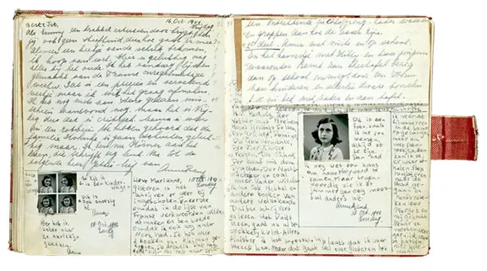

# Anne Frank entre dans le domaine public

[Anne Frank](https://fr.wikipedia.org/wiki/Anne_Frank) est morte en février ou mars 1945 sous la main des nazis, donc du totalitarisme. Soixante-dix ans après sa mort, un autre totalitarisme, celui de l’argent, voudrait empêcher son [*journal*](https://fr.wikipedia.org/wiki/Le_Journal_d%27Anne_Frank) de devenir un bien commun de l’humanité, tout cela pour défendre des intérêts particuliers contre l’intérêt général.

À titre personnel, et j’espère avec vous, avec [Isabelle Attard](http://isabelleattard.fr/blog/2016/01/vive-anne-frank-vive-le-domaine-public/), [Olivier Ertzscheid](http://affordance.typepad.com//mon_weblog/2016/01/anne-frank.html), [Calimaq](http://scinfolex.com/2016/01/01/liberer-anne-frank-pour-le-jour-du-domaine-public/), [Videodudroit](http://videoludroit.com/2016/01/01/annefrank-copyright/), [Daniel Bourrion](http://www.face-ecran.fr/2016/01/02/bienvenue-anne), [Cory Doctorow](http://boingboing.net/2016/01/02/anne-franks-diary-is-in-the.html), [Jef Mathiot](https://nonblocking.info/le-journal-d-anne-frank-s-eleve-dans-le-domaine-public/), [Bortzmeyer](http://www.bortzmeyer.org/anne-frank.html), [Clair et Lipide](https://clairetlipide.wordpress.com/2016/01/02/anne-frank-libre/), [Wikisource](https://nl.m.wikisource.org/wiki/Het_Achterhuis_(Anne_Frank)), [Tales of Tea](http://www.talesoftea.fr/?d=2016/01/03/14/55/25-anne-frank-et-le-domaine-public)… je me dresse contre toutes les forces qui, sur tous les fronts, tentent en ce moment de réduire nos libertés jusqu’à notre liberté de lire librement et de publier librement. Impossible de ne pas penser à [*Fahrenheit 451*](https://fr.wikipedia.org/wiki/Fahrenheit_451). Interdire par le droit un livre d’être entre toutes les mains, même les plus démunies, c’est une façon de brûler ses exemplaires les plus économiques.

[caption id="attachment\_43201" align="alignnone" width="576"] Impossible de trouver plus de quelques pages scanées sur le Net.[/caption]

[Avec beaucoup d’autres, je diffuse aujourd’hui sous forme de texte numérique la version néerlandaise originale](https://app.box.com/s/znchz3d5lp8elfbv9azynugs6cqtngib), faute de disposer d’un scan du manuscrit. Notre prochain travail sera de traduire le texte en français.

Je vous invite à diffuser le plus largement possible ce texte pour déborder les ayants droit censeurs, pour les empêcher de nous intimider par leurs menaces, [telle l’injonction envoyée à Olivier Ertzscheid](http://affordance.typepad.com/mon_weblog/2015/12/reponse-avocat-fonds-anne-frank.html).

Ironie de circonstance. La semaine dernière un certain Jason Labruyère m’envoie un mail qui m’a beaucoup fait rire. Extrait :

> J’aimerais vous présenter la société dans laquelle j’exerce, la société MaPreuve. Juriste au sein de celle-ci, nous proposons à tout artiste, tout auteur, à toute société innovante, de protéger leurs créations et œuvres de l’esprit et ce, de manière totalement dématérialisée. Nous offrons la possibilité d’acquérir une preuve d’intégrité et d’antériorité sur tout fichier numérique (peu important sa taille et son format) de manière rapide, confidentielle et peu coûteux. Cette protection, valable en justice, est rendue possible grâce à la technologie de notre société mère, la société Dhimyotis, Tiers de Confiance de l’Etat. Celle-ci respecte les normes techniques permettant d’horodater et de signer électroniquement le document objet du dépôt. Nous ne remplaçons pas un titre de propriété industrielle mais nous permettons l’octroi d’un avantage probatoire contre tout contrefacteur.

Non, merci. Pour empêcher que des batailles juridiques un jour se jouent autour de mes textes, je les libère tout de suite. Maximiser ses revenus me paraît une stratégie d’un autre temps, en tout cas incompatible avec ma philosophie de vie.

Copier, modifier, interpréter, réinventer, diffuser est un de nos droits les plus précieux.

#biens_communs #commonisme #edition #coup_de_gueule #y2016 #2016-1-1-11h15
