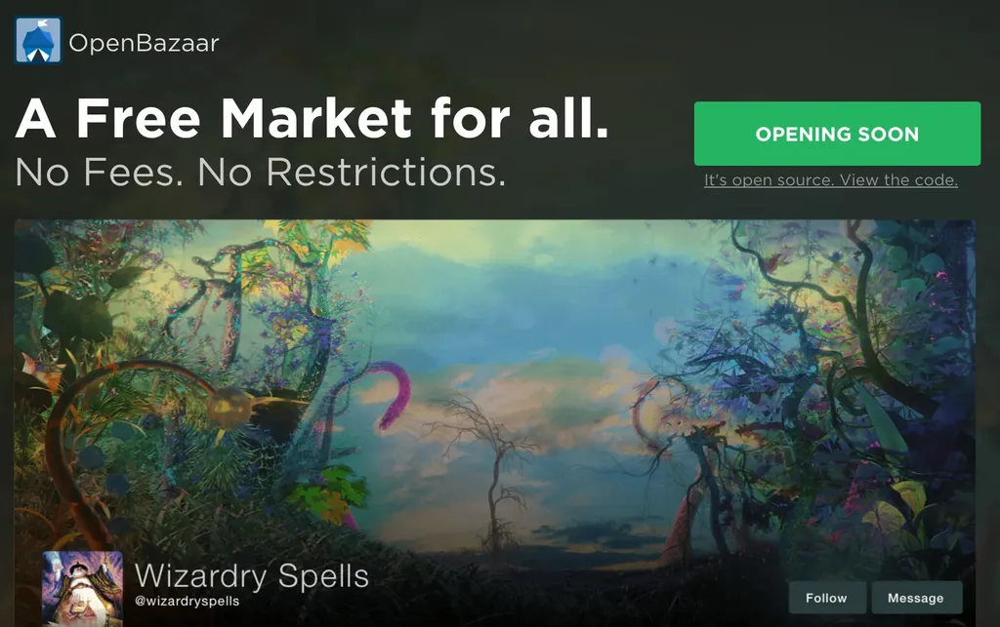

# Le Web n’a rien changé à l’édition, blockchain pourrait faire le ménage

C’est de notoriété publique, [l’édition n’innove pas](http://the-digital-reader.com/2015/12/14/95091/?utm_content=buffer63743). Nos éditeurs sont des conservateurs et nous autres auteurs ne valons pas mieux, et même nous autres qui squattons le Web. Regardez-nous. Du haut de nos blogs, de nos réseaux sociaux, nous diffusons nos textes dans une pure approche top-down. Nous sommes incapables de nous détacher de la distribution traditionnelle selon le mode du « un vers tous ». Nous aimons notre piédestal. Nous ne voulons pas en bouger. Nous n’avons jamais rien remis en cause.

J’ai beaucoup parlé politique avec des amis durant les fêtes. J’ai estimé que créer un site pour fédérer des initiatives divergentes serait contre-productif, et même philosophiquement antinomique. Ça m’a conduit à voir [blockchain comme une solution plus démocratique](et-si-blockchain-revolutionnait-la-democratie.md). Avant même de songer à blockchain, j’ai imaginé un autre modèle pour l’édition, que je pique d’ailleurs aux hypos de *[One Minute](../../page/une-minute)*.

Plutôt que de publier un énième manifeste, écrivons chacun le notre, donnons-le à nos amis, demandons-leur de le compléter, de le modifier et de le faire suivre à leurs propres amis. Créons une sorte de chaîne politique, fédérée par un geste fort, un don de la main à la main. Un objet transactionnel serait presque plus puissant qu’un fichier. Un petit livre de quelques pages, non pas rouge mais riche d’autant de couleurs que de versions.

Alors, pourquoi ne pas reprendre cette approche dans l’édition indépendante. Dans la distribution traditionnelle comme sur le Web, l’auteur se place au cœur d’une des innombrables étoiles [d’une architecture décentralisée](les-maux-du-web-sont-dans-sa-topologie.md), les lecteurs formant les branches des étoiles.

Basculons sur une architecture distribuée, faisons disparaître les étoiles au profit d’un tramage, une sorte de grillage, qui en relie les nœuds à la façon des routes entre les villages dans les campagnes. L’auteur alors ne peut plus s’adresser à tous, mais seulement à ses proches sur le réseau. Il leur donne ses textes de la main à la main. Il en fait quelque chose de précieux et d’intime. Aux amis, s’ils le jugent utile, de transférer plus loin les textes. Au réseau de décider s’il accepte l’offrande ou s’il la refuse. La diffusion devient un contrat de confiance.

Sur cette idée simple du « un vers un » arrive la technologie blockchain. Les livres circuleraient de personne en personne telles les devises d’une cryptomonnaie. L’auteur pourrait toujours mettre à jour son contenu où qu’il se trouve (il a le droit d’écrire dans la base de données) et personne ne pourrait venir censurer ses textes. Une fois lancés dans la chaîne, ils seraient tout aussi inviolables que des livres papier une fois sorti de chez l’imprimeur.

On peut même imaginer fixer un prix pour le transfert d’un livre d’un nœud à un autre, prix qui deviendrait un revenu pour l’auteur (et pour nul autre, car la chaîne étant décentralisée, elle n’est administrée par personne). Pour le coup, on éliminerait réellement les intermédiaires.

Si un auteur travaille avec un éditeur, ça ne change rien. Les deux ensembles peuvent utiliser la même stratégie de diffusion par capillarité sociale plutôt qu’à coup de bazooka. D’ailleurs, bien des livres connaissent un succès viral. Il s’agirait simplement d’accepter une fois pour toutes ce mécanisme. D’en faire le chemin normal de propagation des œuvres, en utilisant les lecteurs comme point de relais.

Quand je n’ai pas envie de donner un livre à mes amis, il arrête sa course. Quand au contraire il m’enthousiasme, il percole dans le réseau, blockchain autorisant un suivit statistique bien plus précis que le Web actuel (et également la lecture collective avec la fédération des commentaires).

Abandonner le top-down n’est pas simple. Nous sommes prisonniers des vieux modèles de penser. Nous nous croyons porteurs d’une parole que tous doivent entendre. Il s’agirait pour nous de prendre une position plus humble. De ne rien imposer, de ne rien crier, de juste tendre la main et voir si des gens nous la serre avec chaleur.

Déjà des projets open source, comme [Open Bazaar](https://openbazaar.org/), imaginent des solutions de vente de proche en proche en s’appuyant sur blockchain. Je me vois bien tenter de diffuser des textes de cette façon, en faisant une totale confiance aux lecteurs et en refusant toute forme de push marketing (ça reste du marketing, mais à chacun de s’en emparer, et ça me paraît particulièrement important pour les textes).

#blockchain #edition #dialogue #y2016 #2016-1-5-11h46
