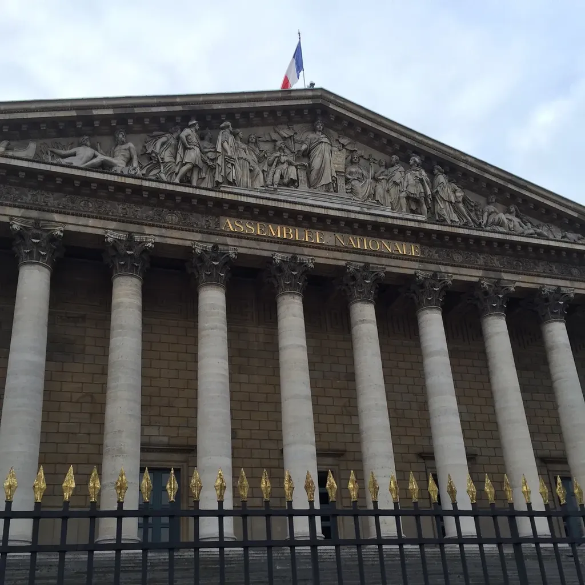

# Nous vivons à flanc de montagne

Je voudrais reprendre une analogie chère aux stoïciens. Selon eux, nous ressemblons à des billes, lâchées sur un plan incliné. Impossible de ne pas rouler vers le bas jusqu’à notre mort, victime du destin, avec tout au plus l’habilité de légèrement dévier notre course.

Je ne suis ni fataliste ni stoïcien, mais j’aime cette analogie. Du point de vue d’Einstein, vous vivons dans un monde vallonné par les puits de gravité où il serait facile de tomber si notre vitesse de chute en réaction ne nous maintenait pas en orbites plus ou moins stables. Reste un vecteur qui nous attire vers le bas et contre lequel nous devons lutter. Cette force est indissociable de la topologie de l’univers.

Dans l’espace social, il existe des forces semblables. Et dans l’espace social construit au-dessus d’Internet également. La structure physique du réseau influence toutes nos activités sur ce réseau, exactement comme la gravité. Nous pouvons de temps en temps nous en affranchir, au prix d’une belle dépense d’énergie, mais toujours elle nous rattrape.

Internet, au niveau physique, possède une structure décentralisée. Je parle des câbles, des rooteurs. En tant qu’usager, je suis directement connecté à mon provider, qui devient une étoile sur le réseau. Pour discuter avec un autre usager, je dois passer au minimum par le cœur de mon provider, voire le cœur d’autres providers et fournisseurs de services.

Ce réseau ne pourrait être physiquement distribué que si nous pouvions nous connecter des uns aux autres en direct (via nos routeurs WiFi par exemple). C’est techniquement possible, mais encore du domaine du hacking.

Sur ce réseau physique décentralisé, nous avons construit le Web. Techniquement, il est distribué, puisque tous les sites peuvent pointer directement vers tous les autres. Reste que dans la pratique, sous l’effet notamment du trou noir Google, il ne cesse de se centraliser autour de quelques étoiles monstrueuses. Par rapport aux autoroutes qui mènent vers elles, nous ne tressons entre nous que de minuscules sentiers, qui ne réussissent pas à brouiller l’architecture massivement décentralisée du Web (des centres interconnectés par leur cœur).

Pour construire un espace plus égalitaire, plus collaboratif, plus indépendant, il nous faut reprendre en main les connexions directes entre nous. Sinon nous subirons de plein fouet les forces propres à la topologie décentralisée. Elles nous aspireront vers leurs centres respectifs, quels que soient nos efforts. Nous serons enchaînés.

On ne peut pas se réfugier derrière la complexité du réseau en disant qu’il est à la fois centralisé, décentralisé et distribué selon ses couches et qu’il faut faire avec (la gravité ne nous a pas empêchés de voler). Il existe bel et bien une topologie dominante du net : Paul Baran l’a nommée sans doute mal à propos décentralisée (en ce sens que plutôt qu’un centre il en existe de nombreux). Passer de la centralisation à la décentralisation aura été comme passer de la dictature à l’oligarchie. Il nous faut maintenant passer de l’oligarchie numérique à un réseau démocratique, et donc topologiquement distribué (l’absence de centre garantissant en quelque sorte une égalité de tous les agents). Comme nous n’avons que partiellement la possibilité de réformer la structure physique, il nous faut lui ajouter une couche réellement distribuée, ce à quoi s’emploie le P2P et blockchain.

C’est à la fois un projet technique, il nous faut des outils de connexion et de partage de pair à pair, mais également un projet social, ou plutôt un désir de davantage d’indépendance et de liberté chez certains individus. Seule cette envie, ainsi que quelques contraintes de type surveillance massive, pousseront nombre d’entre nous à expérimenter des formes d’interactions plus distribuées.

Il ne s’agit donc nullement d’un constructivisme politique, de type communiste, mais plus simplement d’une possibilité à saisir et à développer à partir de quelques graines éparses, avec tout au plus l’espoir de voir germer des forêts, avec également la conscience que le réseau contrairement à la gravité reste à construire. Il n’est ni immuable, ni une fatalité. Sa topologie profonde dépend de son histoire, elle-même basée sur des protocoles comme TCP/IP. La physique des rooteurs peut être réécrite pour qu’elle ne fasse pas pencher l’édifice vers la centralisation/décentralisation. Et plutôt qu’elle soit réécrite une fois pour toutes et pour tous, on doit imaginer de la réécrire dans quelques coins, de la tester, de la déployer éventuellement si elle fonctionne.

Pour moi, c’est un projet politique que je n’hésite pas à qualifier de démocratique (à l’opposée de la dictature de la majorité propre au modèle représentatif). Il doit être lui-même distribué. Naître de graines diverses et toutes différentes. La transition repose sur une germination multiple, avec apprentissage par essais et erreurs. La nouvelle topologie doit faire pencher la structure sociale vers le centre de chacun plutôt que vers quelques-uns en particulier (et toutes les solutions envisageables à nos maux seront renouvelées).

Le Web n’a pas été structurellement assez robuste pour résister à la topologie physique d’Internet. Il s’y est plié, et nous avec lui. Il faut inventer l’équivalent de l’avion numérique capable de résister à la gravité. Blockchain pourrait être une sorte de long courrier, placé en orbite haute, loin des puits de gravité. Nous resterions des passagers, mais avec le pouvoir de remonter la pente de la montagne plutôt que de nécessairement dévaler vers la vallée où passent les autoroutes.

Il suffit de regarder une image satellite de nuit de la France pour découvrir sa centralisation à outrance, pour comprendre que la physique influence le politique et réciproquement. Aujourd’hui, les images du Net ressemblent à celles de la France. Chacun avec nos moyens et nos envies, nous pouvons redessiner la cartographie en même temps que nous rêvons de réformes politiques. L’une de ces deux tâches ne peut aller sans l’autre.

La forme du territoire limite les possibilités de ce que nous pouvons y faire.

*PS  : Ce billet est une réponse indirecte à [un long commentaire de Narvic](les-maux-du-web-sont-dans-sa-topologie/#com43261.md).*

[caption id="attachment\_43407" align="alignnone" width="600"] Quand toutes les routes mènent là, toutes les réponses viennent de là.[/caption]

#blockchain #centralisation #decentralisation #netculture #dialogue #y2016 #2016-1-20-10h39
