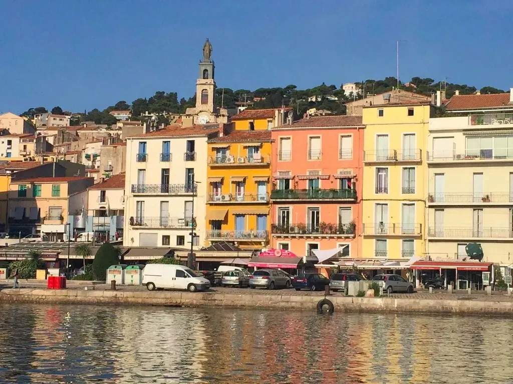
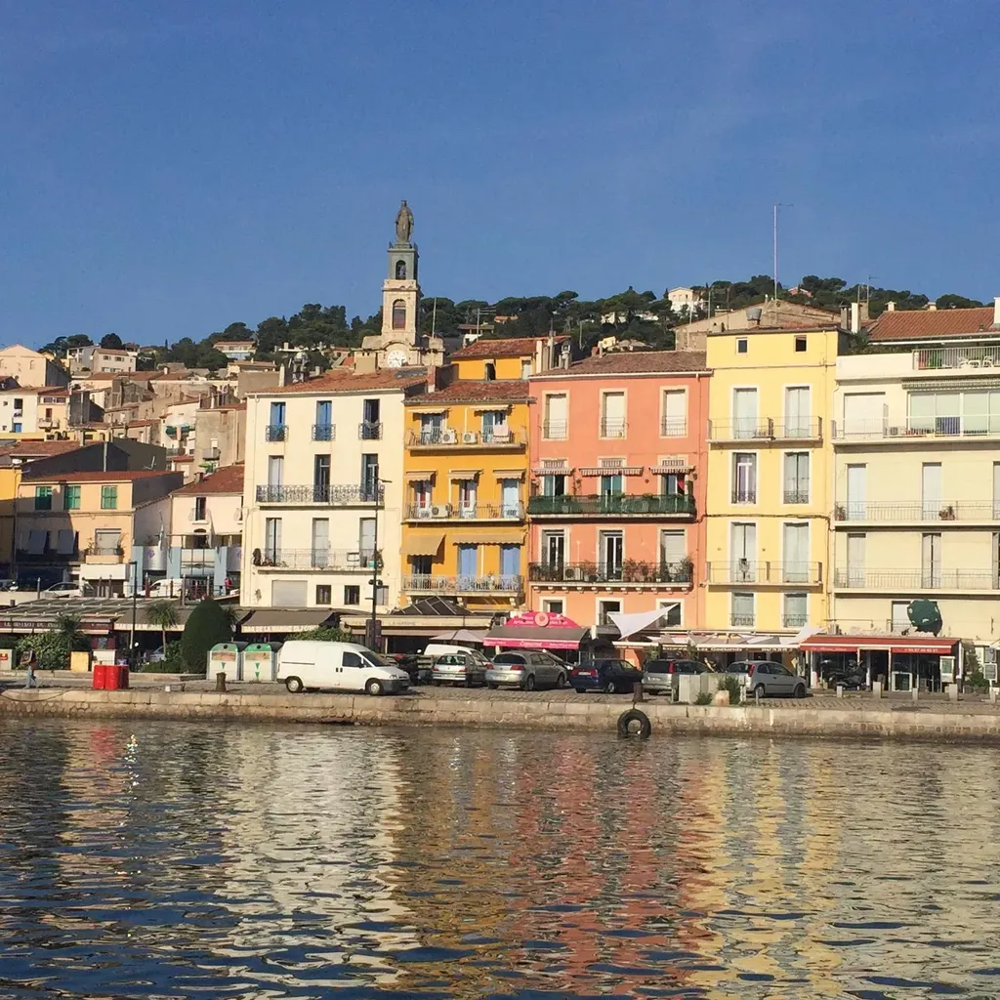
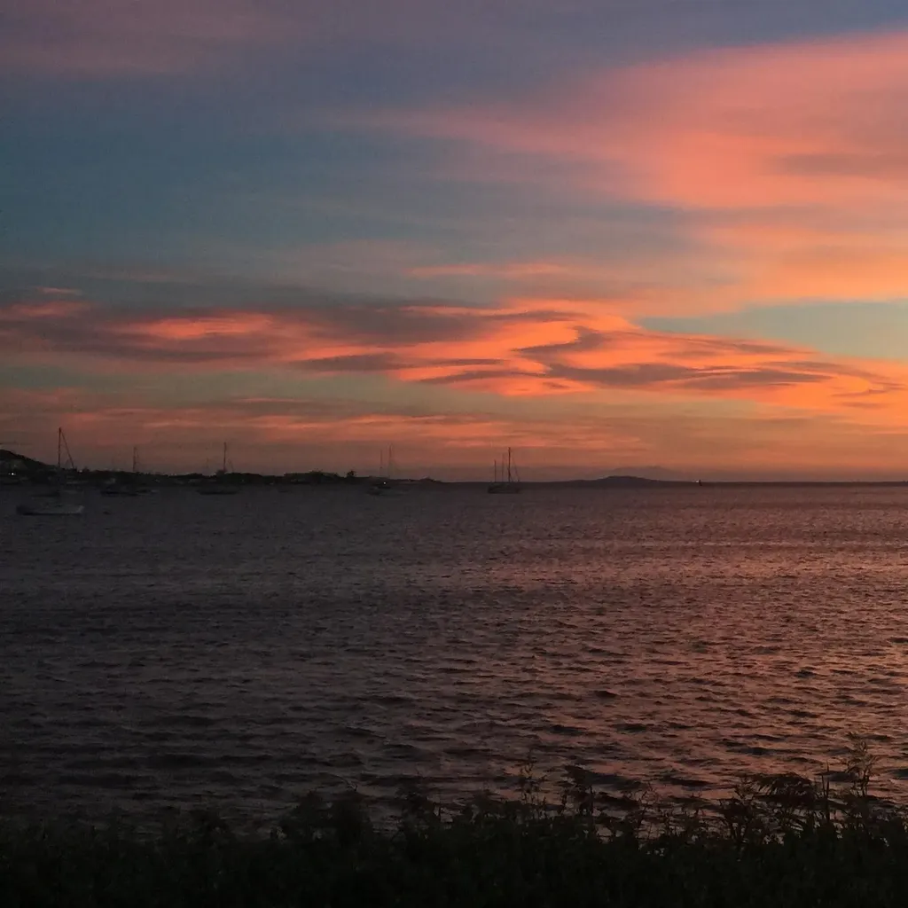
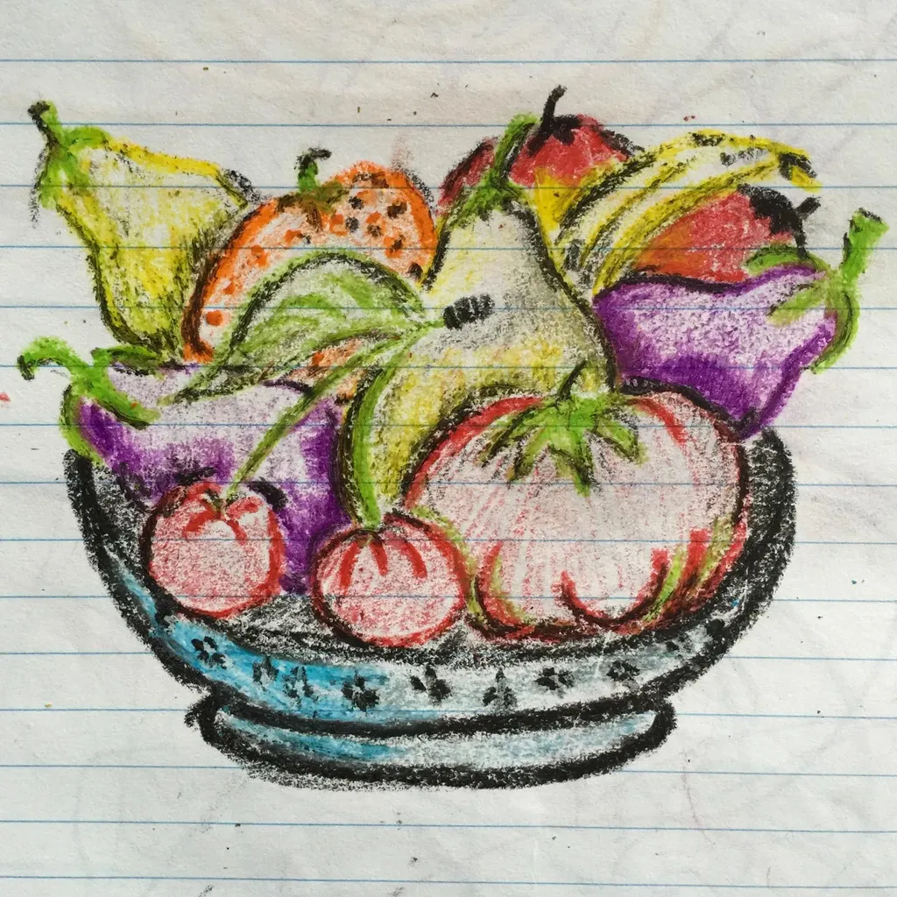
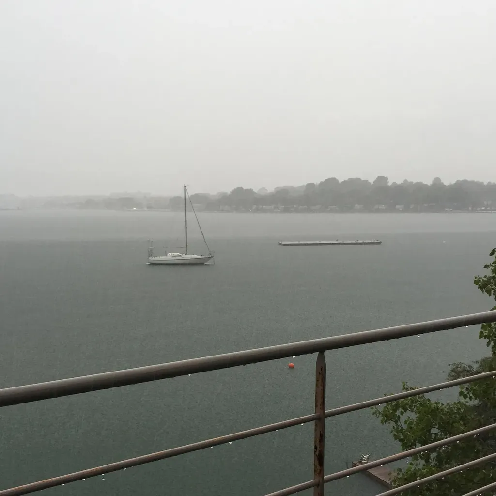
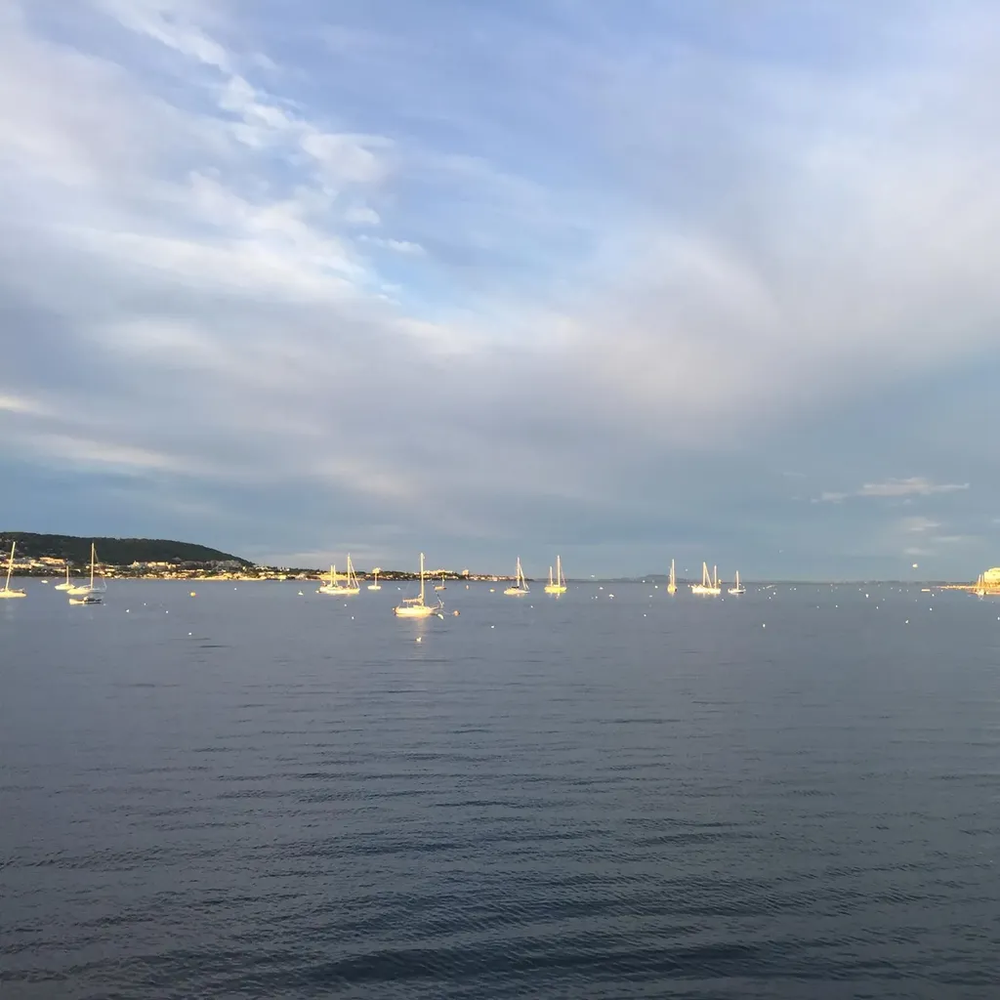
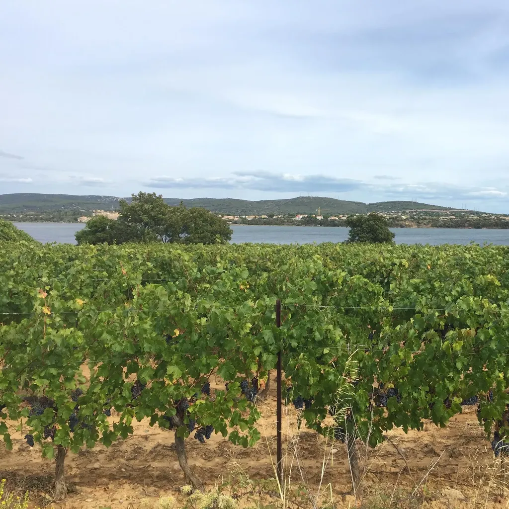
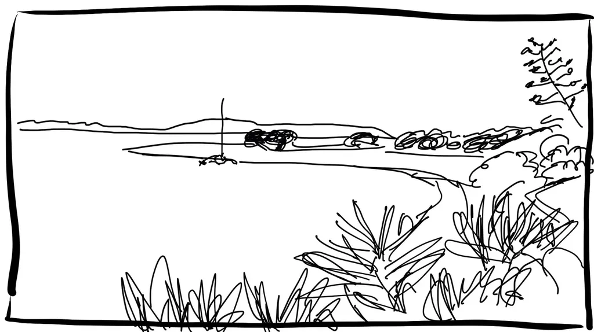
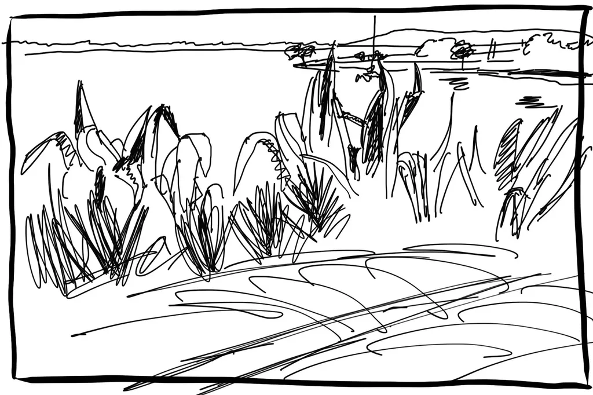

# Septembre 2016

### Jeudi 1er, Sète

Vue de loin, la vie des gens est magnifique. Je les vois marcher de l’autre côté du canal sous le soleil déjà torride, ou en vélo, en moto, sur le quai de la criée où ne passe pratiquement aucun véhicule. Les chalutiers sont en mer, les enfants à l’école, les travailleurs au travail, et il ne reste que les désormais rares touristes pour se photographier devant les façades colorées.

Le temps file à une vitesse vertigineuse. Je me dois de l’arrêter en m’arrêtant moi aussi, comme ce matin, et je devrais ne faire rien d’autre tout au long de l’année, ne plus écrire que pour moi, ne plus discuter de chaque phrase de *Résistants* avec Lilas, parce qu’au final ça ne sert à rien de les lisser encore et encore. Dans leur majorité, les lecteurs contemporains ne s’attachent pas au style, simplement à une vague légèreté qui doit les emporter sans trop les marquer. Le succès d’un livre dépend d’une musique qui ne se corrige pas, et ce travail que nous faisons depuis le début août ne changera rien au destin de ce livre.

Alors j’ai besoin de ne faire que ce qui compte pour moi, et me moquer des autres, les accepter bien sûr, mais sans les courtiser. Je ne recherche que de véritables amitiés, dans un monde qui les condamne par sa vitesse.

Le Net transformé en société des spectacles ne m’attire plus. Je n’arrive plus à me passionner pour ce qui s’y passe, car tout cela est l’exact reflet de ce que les médias ont toujours montré par ailleurs. Dans ce tumulte, mes amis auteurs s’efforcent encore de faire du bruit, pour rien, parce que nous ne sommes rien dans cette marmite infernale.

J’accepte d’être lu plus tard, peut-être, quand nos vitesses intérieures rejoindront celles d’un autre temps où jouir sera une obligation. Un temps où nos obscures petites niches numériques attireront à nouveau la lumière du soleil.

### Vendredi 3, Balaruc

Je n’ai supprimé aucun blog de mon fil RSS mais je n’y vois presque plus que des articles de médias pure-player, signe que les blogs que je suivais sont morts ou quasi silencieux, comme le mien d’ailleurs, qui s’anime plus que par intermittence.

Alors je devrais chercher de nouvelles sources, ou peut-être me résigner à me retirer de ce monde numérique devenu superfétatoire. La vie est définitivement ailleurs en ce moment, sans que je puisse affirmer que ce soit mieux qu’avant. J’éprouve une certaine nostalgie de la décennie qui vient de s’écouler, exactement comme j’ai éprouvé de la nostalgie quand je me suis éloigné du monde du jeu de rôle.

Il se passe certes encore des choses sur le Net, mais dans ses replis obscurs.

### Dimanche 5, Balaruc

De publier mon journal en différé, ça me permet d’écarter de mon esprit tous les sujets passagers avec lesquels j’ai trop longtemps perdu du temps, et du coup d’autres choses surgissent, plus importantes. Changer la contrainte temporelle change l’écriture, alors que le support de publication reste le même. Ce qui me fait penser que le numérique n’engendre une rupture esthétique que parce qu’il altère notre rapport au temps.

### Lundi 6, Balaruc

J’apprends que [5 à 15 % des ados US se tiendraient volontairement à l’écart des réseaux sociaux](http://www.wsj.com/articles/teens-who-say-no-to-social-media-1472136877). Si j’avais leur âge, je les imiterais.

À la fin des années 1970, tout le monde écoutait du disco, et je faisais partie des quelques pour cent qui écoutaient du punk rock. Les mouvements de masse m’ont toujours instinctivement effrayé et j’ai toujours tenté de m’en tenir à l’écart.

Alors je me dis que je devrais fermer tous mes comptes sociaux, ne plus garder que mon blog, y accueillir les gens qui veulent discuter avec moi et aller chez ceux avec qui je veux discuter. Au même instant, quelqu’un me pingue pour donner une information intéressante que j’aurais regretté ne pas apprendre.

Plutôt que claquer la porte, j’ai donc choisi de passer mon chemin, de ne pas y perdre plus qu’une paire de minute quotidienne. Un peu comme quand j’étais Punk rock et que j’entendais du disco malgré moi.

Je sais juste une chose : si je me réveillais aujourd’hui après vingt ans d’hibernation, je fuirais le Net social avec le même acharnement que la télévision dans les années 1990. Je n’accepte le Net contemporain que parce que j’ai vieillis avec lui, que parce que j’ai appris à y mener une vie discrète, que parce que j’y trouve des pépites cachées.

---

J’envoie la V2 de *Résistants* en relecture. Si mes lecteurs s’ennuient, je doute d’avoir la force de reprendre cette histoire.

### Mercredi 14, Balaruc

Deux heures du matin, je me réveille comme souvent au milieu de la nuit. Immédiatement, j’entends le bruit de quelque chose qui tombe. Comme la veille j’ai démonté et remonté des stores pour changer des moteurs électriques défectueux, je me précipite dans le salon où tout est en ordre. Quant à eux, les volets sont bien accrochés aux façades. Je me recouche sans trop me faire de soucis.

Quelques heures plus tard, je suis réveillé par l’orage du 15 août, qui a cette année un mois de retard. Après c’est la course. L’ami qui devait amener les enfants à l’école noie sa voiture devant chez nous, c’est moi qui me charge du covoiturage. Une fois de retour, nous discutons un moment avec l’ami resté à la maison prendre un café, avec Émile qui nous tourne autour, parce que lui ne va pas à l’école le mercredi. Il finit par nous annoncer qu’il y a de l’eau dans la buanderie. L’analyse de la situation est rapide : le velux est ouvert alors que nous ne l’ouvrons jamais. Nous découvrons qu’Émile s’est fait une cabane dans la buanderie et qu’il a jugé bon de la ventiler. Résultat : cette nuit, le vent a fait basculer le velux, d’où le bruit, mais pas suffisamment pour qu’il ne pleuve pas dans la maison.

Nous passons une heure à essorer. Dans un cahier d’enfant de Tim, nous découvrons une nature morte dessinée par mon oncle Patrice. Elle nous explose à la figure au milieu des gribouillages enfantins et nous repensons à lui.

### Jeudi 15, Balaruc

Le style le plus merdique vend. Le succès n’est pas une question de style, retoucher les textes comme le font certains éditeurs ne change rien à leur réception, j’en suis de plus en plus convaincu, ça ne fait qu’effacer l’auteur, c’est devenu une mode stupide dans l’édition. Excepté le nettoyage de surface, pour respecter un peu le français, sans plus, un seul travail est nécessaire, le plus difficile, celui sur la structure, sur les coupes, les rallonges, les réorganisations, ça oui, c’est souvent vital, mais plus difficile que retourner des phrases pour rien, pour sa simple satisfaction de correcteur.

---

Aujourd’hui, [j’ai publié un billet](../9/le-web-une-croyance-partagee.md), j’aurais mieux fait de me contenter d’une remarque dans ce journal, moins de personnes l’auraient lu. La discrétion numérique passe par la diffusion en différé de gros posts sans titre.

### Vendredi 16, Balaruc

Isa rentre furieuse d’amener Émile à l’école. Sur France Culture, elle a entendu clamer qu’il n’y a plus en France d’intellectuels de gauche, mais uniquement des réactionnaires, genre Houellebecq. Pas étonnant, les intellectuels de gauche, dont je pourrais me réclamer, n’ont pas droit à la parole. Nous ne serions pas politiques. La plupart des gens sont incapables de voir dans nos propos du politique, tant ils sont englués dans leur conservatisme.

### Dimanche 18, Bouzigues

Nous faisons du vélo au bord de l’étang. Un sentier s’élève sur une minuscule falaise et rejoint une vigne chargée de belles grappes que les enfants s’empressent de dévorer. Ils n’ont aucune conscience d’être hors la loi. Je le leur rappelle sans trop d’insistance, tant les souvenirs de mes propres rapines dans les champs me réjouissent. Peut-être une réminiscence atavique de notre ancestrale condition de chasseurs-cueilleurs.

### Mardi 20, Balaruc

Dans la *Médiocratie*, Alain Deneault explique que les médiocres ont pris le pouvoir. Rien de plus logique puisque les gens conscients ont compris depuis longtemps que détenir le pouvoir dans une société hypercomplexe n’a plus aucun sens. Seuls les inconscients, les stupides, les ambitieux… poursuivent encore le pouvoir. Allez donc voter pour eux (et ainsi rejoindre leur troupeau).

### Mercredi 21, Balaruc

Toute phrase qui échappe au sujet verbe compléments, à une stricte linéarité, à l’implacable banalité syntaxique, est jugée raffinée par nos éditeurs grand public. Cet effort de normalité me fatigue. J’ai bien droit d’être raffiné, d’être moi-même, de ne pas être comme les autres et d’écrire à ma façon.

### Samedi 24, Balaruc

Hier soir, nous dînons à Montpellier. La ville envahie par des jeunes qui se promènent avec des bouteilles d’alcool. La murge généralisée à ciel ouvert. Ces jeunes s’emmerdent. Ils ne rêvent pas et ils s’oublient dans l’ivresse. À leur âge, je jouais à *Donjons & Dragons*, je ne sais pas si c’était mieux. Au moins, j’apprenais à raconter des histoires. Et parfois, je jouais à *Space Op* et rêvais de nouvelles technologies. Les punks se battaient contre le No Future. Aujourd’hui, ce slogan a été internalisé au premier degré.

### Mercredi 28, Balaruc

Il y a dix ans, j’étais sans cesse sur les réseaux sociaux. Depuis quelques années, je n’y allais plus que deux ou trois fois par jour. Depuis quelques mois, j’y vais épisodiquement, parfois pas plus d’une fois par semaine. J’y retrouve les mêmes qui radotent les mêmes choses qu’avant. Et moi-même je radote en dénonçant leurs radotages.

Un commentateur m’a dit qu’il trouvait le web plus formidable qu’avant parce qu’on pouvait publier sur des plateformes comme Medium. Je n’ai même pas pris la peine d’expliquer qu’on cessait ainsi de contrôler nos contenus et déléguait cette fonction à un tiers, comme dans le monde de l’édition, ce qui en soit ne dérange guère les auteurs depuis pas mal de temps.

Au nom de la littérature, l’auteur passe à côté de la politique, et sa littérature passe à côté de son temps, elle se vaporise dans un présent déjà loin derrière ses mots.

---

J’ai envie de lire de la science-fiction, d’écrire de la science-fiction…

---

Je me suis assis à côté d’une épave, à l’ombre parce que le soleil frappe encore fort. Je n’ai rien dans la tête, mon cerveau délavé par les dernières révisions de *Résistants* et par une longue course ce matin.

J’ai roulé jusque là avec mon vieux vélo pour essayer de dessiner et d’écrire sur mon nouvel iPad Pro, sans doute le meilleur système jamais conçu pour tenir des carnets de route (expérience à suivre : je vois quelques défauts, le clavier un peu sec, l’écran un peu lourd par rapport au clavier et il a tendance à basculer quand il est sur mes genoux, menaçant de tomber dans les algues à mes pieds, ce serait ballot).

Pour dessiner, je m’étais placé en hauteur et je voyais les muges chasser entre les bouquets de salicorne. De ma nouvelle position, je ne vois que leurs remous brouiller la surface à peine ridée de l’étang.

Je me sens loin du monde littéraire, des jeux du buzz. Le bruit produit par les autres me répugne. Je devais m’interdire d’écrire ce genre de pensée, surtout de les publier, parce qu’elles peuvent paraître à leur tour destinées à attirer l’attention.

En vérité, non. Sur Internet, il suffit d’utiliser des titres génériques, genre carnet de route, pour passer inaperçu. Les gens ne recherchent que du croustillant, toute référence à une vie passée à observer le monde ne présente plus aucun intérêt, raison de plus pour que je me glisse dans cette zone abandonnée, et même abandonnée du Net.

Je n’arrive plus à m’intéresser au Net en général. J’ai l’impression qu’il s’éloigne toujours plus vite de moi, et quand je me retourne je me dis que je n’ai plus envie de le rattraper, parce que tout ce que j’y vois m’est déjà familier jusqu’à la satiété.

Un Américain prétend que les ebooks, c’est terminé. Les gens se disputent sur les chiffres. Je me fiche de tout cela du moment que je peux lire et que je peux donner à lire. Cette bataille créativement est terminée, il ne s’agit plus que de marketing.

Où est la bataille ? Le crabe qui se promène à mes pieds entre les algues ne se pose pas ce genre de questions. Il cherche à manger et moi je devrais me contenter de chercher à jouir de l’air de l’automne estival.

J’aurais gagné mon combat quand je serai capable de ne vagabonder que pour voir le monde et en faire des images avec les mots ou mon stylet sur l’écran tactile. Il me faut dépasser la condition de l’écrivain pour être écrivain.

Mais le carnet n’est-il pas le dernier endroit où questionner la littérarité quand on s’y refuse dans ses autres textes ? Alors je peux encore le conserver comme un exutoire. Un chemin de méditation qui en même temps se traduit par des translations plus ou moins importantes dans l’espace.

#carnets #y2016 #2016-10-10-13h49
