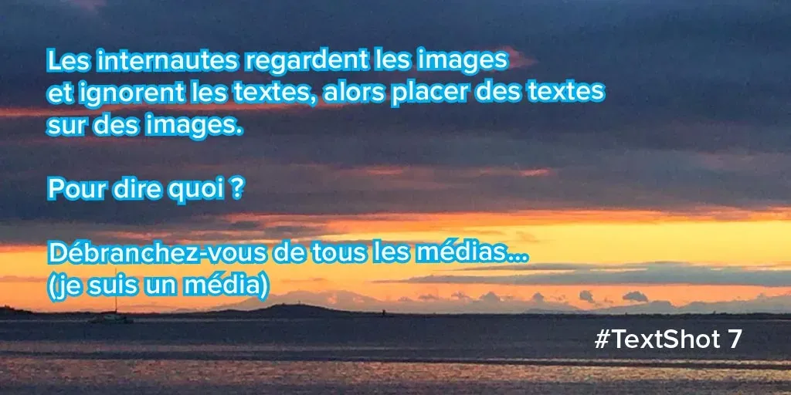
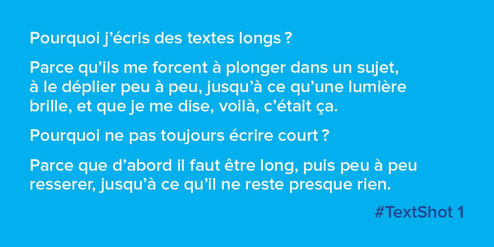
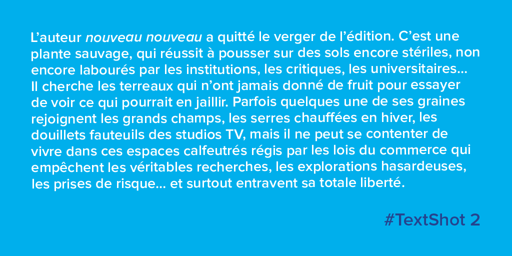
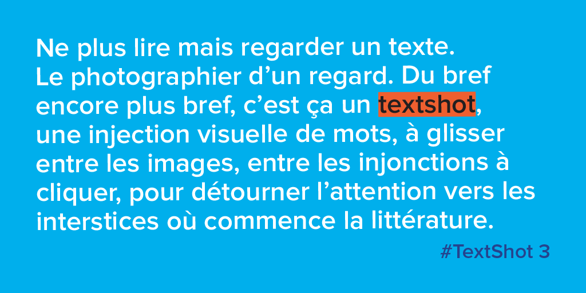
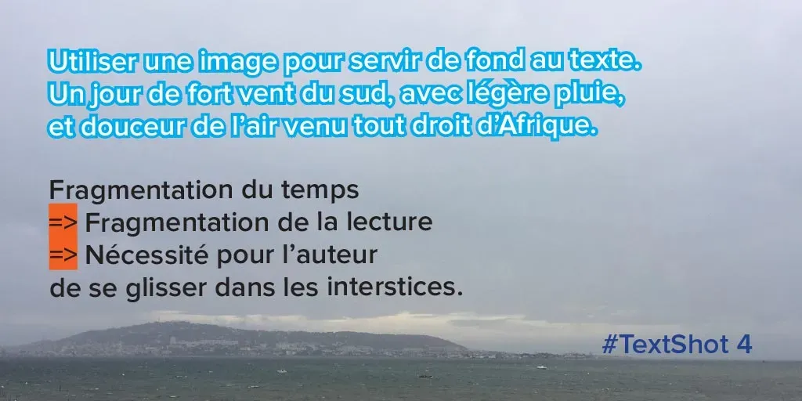
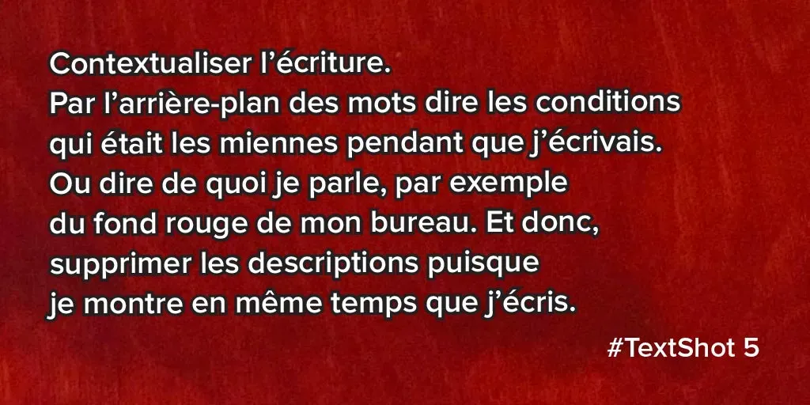
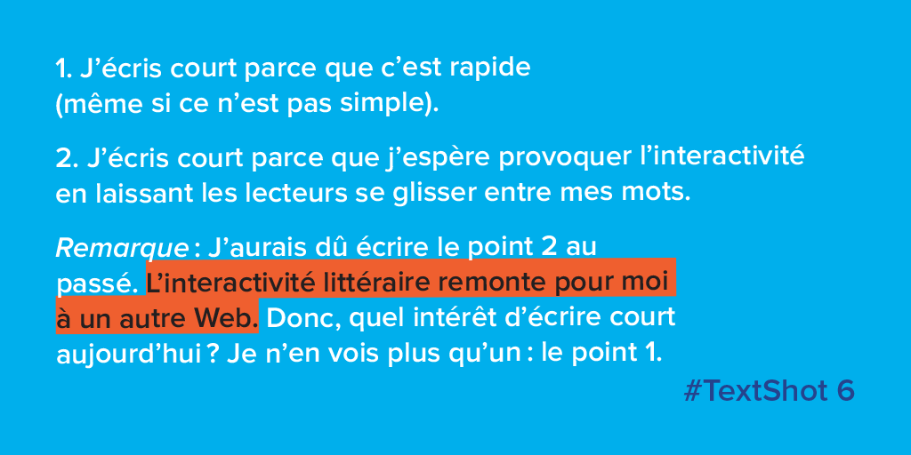
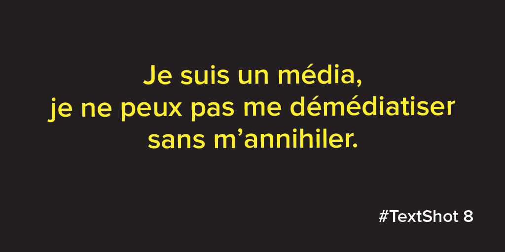
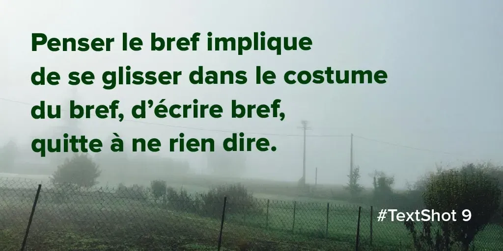
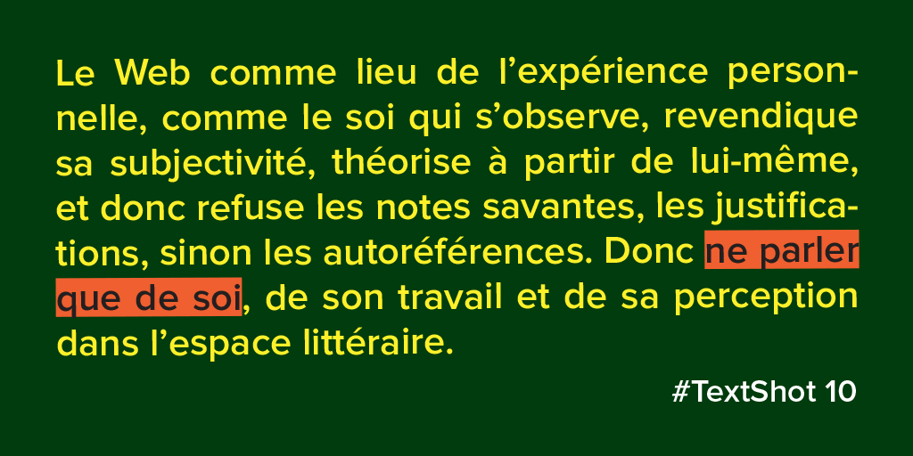

# TextShot ou comment subvertir le web social

Tout commence avec un appel à texte : [Web Satori](http://www.fabula.org/actualites/web-satorii_72990.php), proposé par Gilles bonnet. Ça date déjà, je n’ai pas le temps. Puis je découvre la fonction [Highlighting proposée par Medium](https://help.medium.com/hc/en-us/articles/214406358-Highlighting), sélectionner un texte pour l’envoyer comme capture d’écran sur les réseaux sociaux (ce qui augmenterait par trois à cinq les taux de clic).

Je pense aux [*Poèmes express* de Lucien Suel](http://academie23.blogspot.fr/search/label/Po%C3%A8me%20express), prendre une page d’un livre, marquer la plupart des lignes pour garder des bouts de phrases, qui deviennent des poèmes ([méthode utilisée dès 1966 par Tom Phillips](http://www.tomphillips.co.uk/humument/slideshow/1-50)). C’est très beau graphiquement et littérairement, une des plus belles choses que je vois passer sur mes fils sociaux.

Je repense aussi à ma [tentative de roman sur Instagram](../4/des-livres-sur-instagram.md). Et comme poster des photos est l’une des dernières choses qui me fait encore plaisir, pourquoi pas poster des textes sous forme d’image. C’est comme ça que je bafouille depuis une semaine des textshots (des screenshots de textes).

[Série en cours](#textshot) qui me mènera je ne sais où… sans doute nulle part.

[La suite…](#textshot)

#netlitterature #dialogue #y2016 #2016-11-26-11h32
