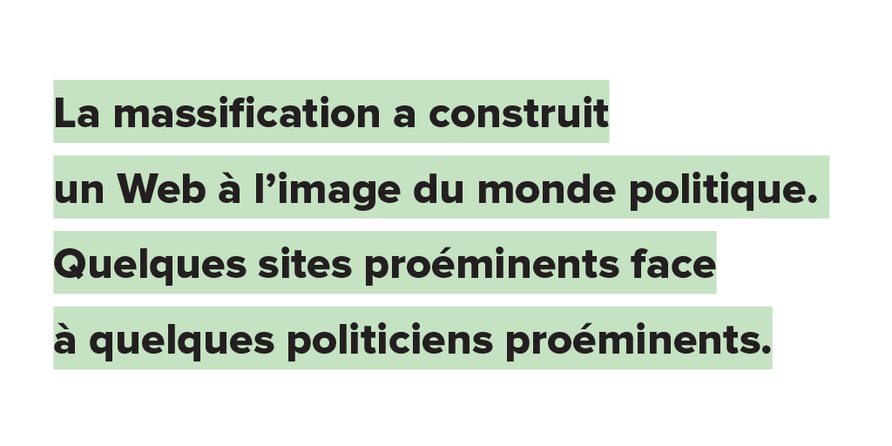

# Comment sauver notre Web ?

Après quelques papiers déprimés sur l’état du Net, qui répondent à bien d’autres ou leur font échos (chez [Philippe](https://philippe-castelneau.com/), chez [Neil](http://page42.org/a-mort-internet/), chez [Olivier](http://affordance.typepad.com//mon_weblog/2016/11/peur-sur-les-internets.html)), il est peut-être temps de réfléchir à ce que nous pouvons faire.

D’abord, il faut remonter à l’origine du mal. Nous devons sans doute entreprendre un travail historique. Il n’existe probablement pas une cause unique, mais on peut tout au moins repenser au Web que nous aimions, celui d’un monde libre où les sites étaient plus ou moins égaux et où les internautes vagabondaient des uns aux autres, et comparer ce Web à celui d’aujourd’hui, où quelques sites écrasent tous les autres et aspirent tous les internautes.

En quelque sorte, nous sommes passés du nomadisme numérique (dont j’ai fait l’éloge dans *L’alternative nomade*) à la sédentarisation numérique. Pourquoi donc le Web s’est-il centralisé ?

1. La première raison est mécanique : c’est à cause de [la loi winner-take-all](../../2014/11/sans-gouvernance-internet-devient-une-dictature.md), qui dans les réseaux tend à favoriser des acteurs géants.
2. La deuxième raison est technique. Le Net n’a jamais été neutre, nous autres internautes n’avons pas accès aux [protocoles multicast](../../2014/5/la-neutralite-du-net-mauvais-combat.md) : contrairement aux providers, nous ne pouvons pas faire en sorte qu’un internaute qui reçoit un de nos contenus le tienne à disposition des autres internautes (ce que le P2P nous permet de simuler). Il nous faut chaque fois renvoyer le tout. Voilà pourquoi nous diffusons nos vidéos sur YouTube. En voulant économiser notre bande passante, nous créons les géants du Net.
3. La troisième raison est bien sûr financière. En l’absence de multicast, pour diffuser les contenus de millions d’internautes, il faut disposer de gigantesques fermes de serveurs avec une gigantesque bande passante.

Le winner-take-all engendre la création de nœuds géants, l’absence de multicast pousse à se tourner vers ces nœuds qui de fait sont les seuls à pouvoir se payer les infrastructures, et la boucle recommence, sans cesse, sans que nous ne sachions désormais l’arrêter. C’est un peu comme si le réchauffement climatique avait franchi un seuil irréversible et que nous assistions à un emballement. C’est une spirale assez terrifiante.

Face à elle, nous sommes relativement impuissants. Au winner-take-all, nous aurions pu opposer une loi antitrust, interdire législativement la massification du Web. Sauf que cette massification sert la classe politique, puisqu’elle implique une réduction du nombre de médias influents, nous maintenant dans la logique top-down du modèle télévisuel. La massification a construit un Web à l’image du monde politique. Quelques sites proéminents face à quelques politiciens proéminents. C’est l’éloge de la représentativité plutôt que le sacre de la participation, l’unicast par opposition au multicast.

Je n’ai donc aucun espoir du côté politique. La massification du Web entraîne une massification de l’électorat (et réciproquement). Scrutin après scrutin, on assiste à une plongée dans l’horreur. La spirale nous entraîne. Pour casser ce processus, il faut casser la propagande, donc casser la centralisation du Web.

1. En tant qu’internaute, il nous faut nous détourner des plateformes centralisées pour à nouveau vagabonder.
2. Cela implique de ne pas perdre courage et d’expliquer encore et encore les dangers de passer sa vie chez les maîtres du réseau plutôt que chez les indépendants.
3. Il faut également ouvrir de nouvelles routes. Sous l’influence de Google, nos blogs se sont repliés sur eux-mêmes. Nous devons en revenir au principe des blogrolls. Créer des liens vers les blogs amis. Non dans un but de référencement, mais avec l’espoir que nos visiteurs effectuent un pas de côté, cela depuis chez nous, sans remonter jusqu’à Google ou un réseau social.
4. Il nous faut entretenir une circulation sanguine indépendante. Le Web le permet (et nous devons ignorer Google qui nous en défend). Si nous ne nous lions pas aux autres, cela revient à dupliquer à notre échelle ridicule le modèle top-down. Le Web libre ne peut être que coopératif. Sur le Web, la première coopération est de se lier.

Je suis conscient d’ainsi opposer bien peu de résistance à la massification, mais nous devons reconstruire un terreau à partir duquel notre idéal peut tout au moins survivre.

### Le côté cuisine

J’ai exporté en OPLM la liste des sites que je suis dans [Feedly](https://feedly.com), je l’ai importée dans la blogroll de WordPress et j’ai réactivé [la page qui affiche cette blogroll](../../page/blogroll).

J’ai par ailleurs ajouté un lien vers les amis à la fin de mon menu, ainsi que quand les lecteurs cliquent sur les **•••** associés à chacun de mes billets.

Ce n’est pas grand-chose, mais si nous prenions tous l’habitude de faire de même, sans doute que nous rouvririons bien des routes que les broussailles sont en train d’envahir.

On pourrait presque imaginer un bouton qui deviendrait aussi universel que celui ouvrant les menus et qui pointerait vers la liste des amis. Un bouton qui serait bien visible, une incitation immédiate au vagabondage.

#netculture #dialogue #y2016 #2016-12-1-14h24
