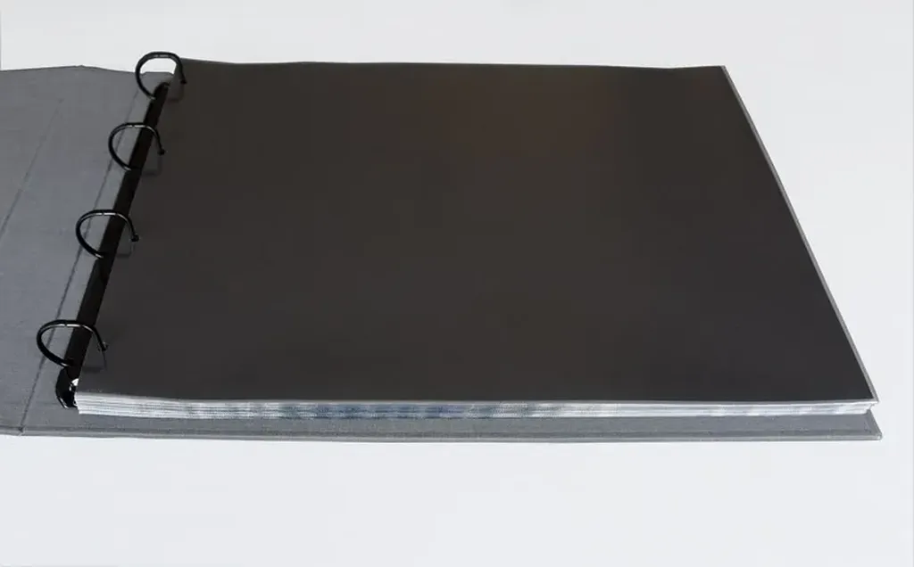

# Apple annonce l’iFolio et tue le livre papier

Des rumeurs circulaient depuis quelque mois au sujet d’un appareil révolutionnaire qui ferait passer l’iPad au rang d’antiquité. On doutait, car depuis la disparition de Steve Jobs en 2011, nous n’avions rien vu venir d’extraordinaire. Une fois n’est pas coutume, des infos ont fuité avant le prochain keynote.

La nouvelle merveille des laboratoires de Cupertino sera donc l’iFolio. Il s’agira ni plus ni moins d’un livre de 96 pages, chacune pas plus épaisse qu’une feuille de papier, chacune comparable à un écran d’iPad. Sur cette machine, il sera donc possible d’afficher 96 écrans simultanément, de disposer donc virtuellement de 96 iPad et de sauter des uns aux autres en tourant les pages.

Jonathan Ive, le chef designer d’Apple, raconte que depuis qu’il possède des iPad, il n’est plus capable de lire des magazines du début à la fin. Après avoir annulé tous ses abonnements papier, il avoue en avoir souscrit de nouveaux. « Dispercer des magazines imprimés dans les pièces de la maison, c’est comme avoir autant d’iPad qui ne se déchargent jamais. »

Selon Ive, les livres papier conservent des avantages sur leur version électronique, ce qui explique la stagnation du marché des ebooks. La navigation en profondeur, c’est-à-dire dans l’épaisseur, serait la fonction manquante qu’aucun logiciel n’aurait jamais réussi à simuler.

L’iFolio résout ce problème en empilant 96 iPad sur moins de 10 mm d’épaisseur. Qui plus est, terminé les écrans rétroéclairés fatigants pour les yeux. Apple adopte l’encre électronique, sans pour autant renoncer à la couleur et à la résolution Retina.

Outre de révolutionner la lecture et le marché du livre, l’iFolio transformera notre façon de travailler. Chaque page sera une sorte de bureau, potentiellement distribué sur une double-page. En fonction du moment de la journée, nous ouvrirons notre livre numérique à la page correspondant à notre activité.

À ce stade, je ne peux en dire davantage et nous devons encore patienter quelques semaines avant d’en savoir plus. Une chose est sûre, demain les ventes d’ebook repartiront à la hausse. Dans un premier temps, le seul frein à la mort du livre papier sera le prix sans doute un peu excessif de l’iFolio.

---

J’ai imaginé cette annonce fictive à force de lire partout la mort des ebooks et de me voir railler pour les avoir défendus. En 2016, les ventes connaissent un plateau, voire régressent, parce que la technologie n’a pas évolué depuis 2010. Nous avons besoin d’un rendu de l’épaisseur du livre, nous avons besoin de la couleur, nous avons besoin de pouvoir écrire partout sur nos pages. Un ebook doit être plus qu’un livre et non pas comme c’est le cas aujourd’hui un livre augmenté par certains côtés, mais diminué par d’autres. Cet iFolio imaginaire arrivera tôt ou tard sur le marché et la course en avant des ebooks repartira.

#edition #dialogue #y2016 #2016-2-29-11h14
