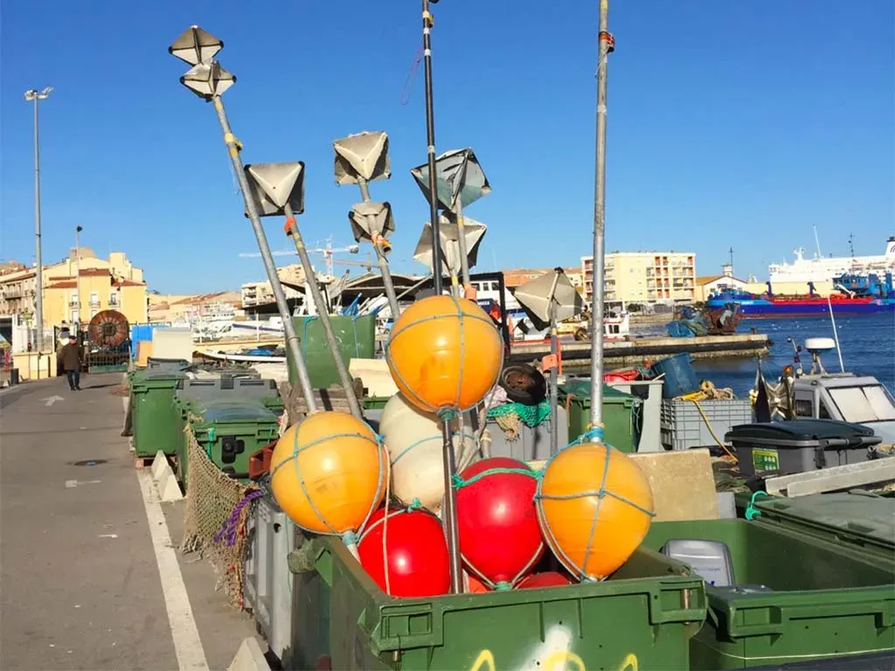
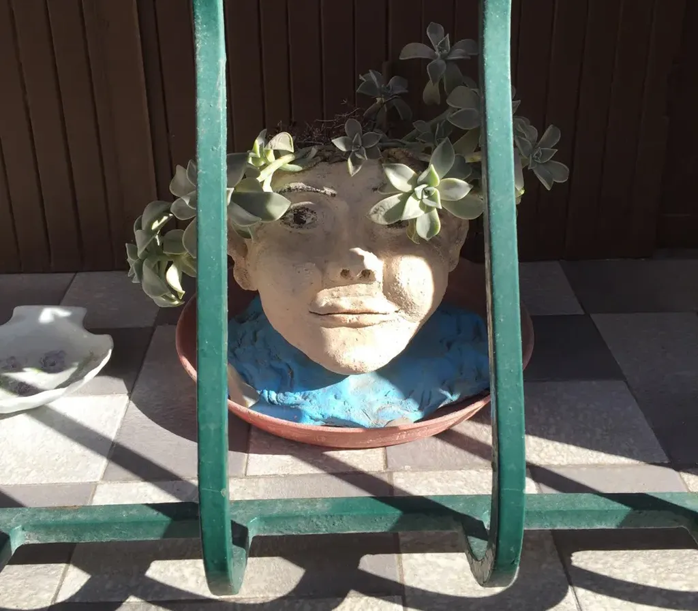
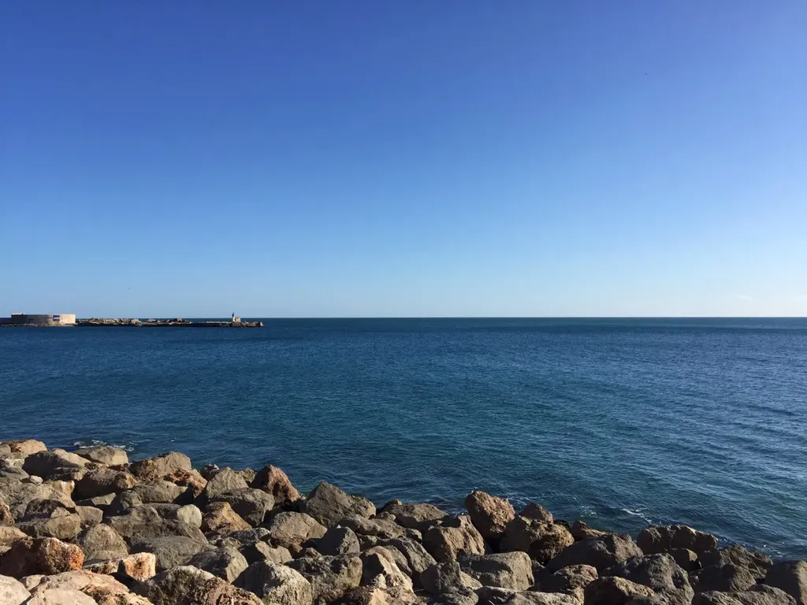
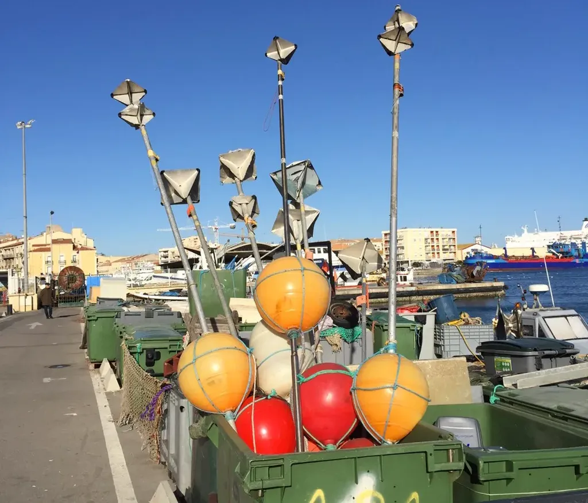
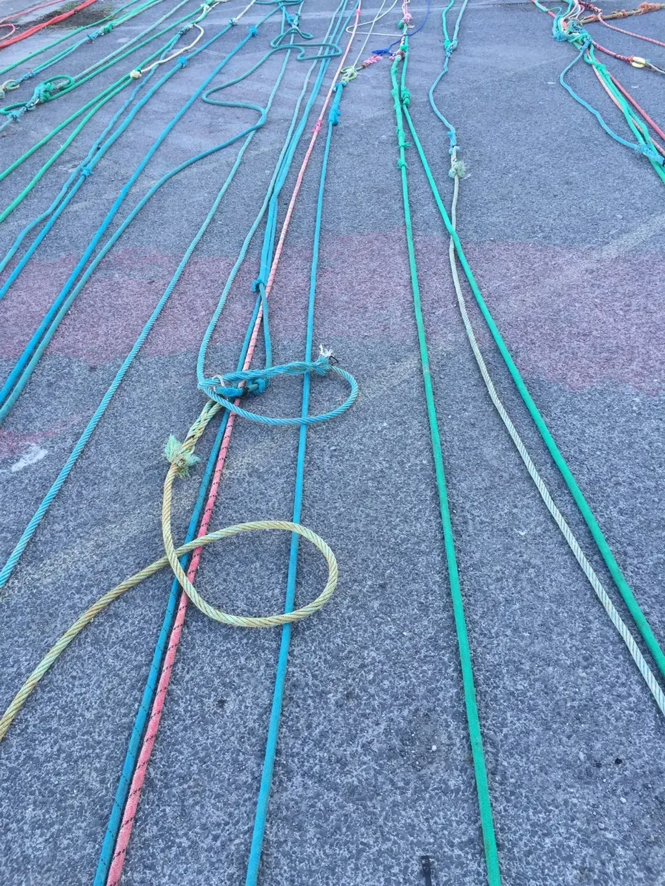

# Demain il sera trop tard pour l’art d’aujourd’hui

J’en oublie qui je suis. Il faut que je marche dans Sète, grande rue Haute, avec la mer hachée au loin par les rues traversantes, les yeux plissés par les éblouissements du mistral, le bonnet de marin enfoncé jusqu’aux lunettes de soleil… alors je me replace dans mon espace, loin du bruit du Net, des interactions toujours un peu guerrières, jamais aussi belles que si nous étions là une dizaine assis derrière le rempart du môle Saint-Louis, avec pour point de mire un tanker posé sur la ligne de l’horizon.

Je me retrouve aussi par ces mots, par ces premières phrases, dictées par les impressions, par la musique des risées et de quelques automobiles. Je ne cherche ni à être compris, ni à séduire, juste à me dire pour mieux me vivre. Je me fiche que cette écriture n’intéresse presque personne, elle est la seule qui vaille, toutes les autres orbitent plus ou moins loin de son foyer flamboyant.

Je ne suis pas poète, je ne suis qu’un sismographe abandonné à tous les séismes du monde. Il ne devrait rester que ça, tous les efforts oubliés, écartés, utiles que pour en arriver là. Si je ne faisais qu’écrire pour être lu, j’en négligerais la chaleur de la pierre sous mes mains, l’inconfort du caillou trop pointu pour mes fesses, le simple bonheur de n’avoir aucun objectif, sinon celui de ressentir.

Sur Wattpad, on me dit que celui qui écrit vite parle. Est-ce que je parle de cette façon ? J’en doute. Quand j’écris vite, sous le coup du monde, j’exprime ma musique naturelle, une fonction de ma circuiterie cérébrale modelée après des années d’entraînement.

[caption id="attachment\_43499" align="alignnone" width="600"] J’ai aussi croisé Paul Valéry.[/caption]

La vitesse associée au travail m’éloigne au contraire de la parole. Elle engendre les mélodies purement écrites, et qui pourraient être dites sur une scène, mais non lors d’une conversation entre amis.

Le soir ou le matin, ou au milieu de la nuit, je m’écris souvent des textes dans ma tête, exactement comme en ce moment même, porté par la musique autant que par le sens, un sens toujours repoussé, que j’aimerais garder fuyant, un objectif lointain, dont l’atteinte ne procure pas beaucoup de plaisir.

Des drapeaux bleus flottent à une encablure du rivage. Des goélands somnolent sur le brise-lames, tout à côté du phare de tribord, le vert. Un jeune homme pêche, la canne avachie. Il porte un pull à rayures noires et rouges. Fermer les yeux, absorber la douceur.

[caption id="attachment\_43500" align="alignnone" width="600"] Avant de m’arrêter là.[/caption]

---

Les cris des gabians me réveillent quelques cumulus plus tard. Les premiers chalutiers rentrent au port avec leurs escortes criardes. Je ne me retiens pas de regarder mon mobile. On me remercie pour mes photos de Sète, prises alors que je venais me poser sur le môle. On me dit que la littérature n’est qu’une convention et que je n’ai pas à m’occuper de vraisemblance. Oui, toute narration n’est qu’un contrat avec le lecteur (les lecteurs de best-sellers l’oublient, persuadés qu’il n’existe qu’une forme possible, la seule qu’ils lisent).

Le pêcheur au pull rayé à disparu. Un motard somnole, d’autres corps écroulés un peu plus loin. J’ai perdu la musique. J’attends qu’un niveau d’eau imaginaire s’abaisse dans mon cerveau, pour en libérer les organes perceptifs.

Quand je pratiquais abondamment l’art du carnet, ma mise en condition passait souvent par cette sieste. C’était l’occasion d’une césure, d’une concentration, que mon téléphone a brisée, parce qu’il m’a ramené à ma vie ordinaire (une vie extraordinaire et inimaginable pour les hommes nés quatre ou cinq décennies avant moi). J’en oublie ce miracle. Être assis au bord de la mer, à écrire sur une machine connectée au monde. Nous sommes si nombreux à partager cette expérience que nous n’en mesurons pas l’incongruité à l’échelle historique. Nous avons cette opportunité d’être les premiers à jouer avec tout cela.

Nous nous plaignons de la folie du monde, un monde fou parce que tout change, abreuvons-nous au contraire de ce changement, digérons les côtés noirs, pour plonger dans cette ubiquité numérique, dont nous sommes encore incapables de juger les beautés nouvelles, même si nous sommes engagés à les produire.

Écrire sur un clavier… Consulter en même temps des messages éparpillés sur une foule de services… Publier en direct des photos… Tout ça agit en nous d’une manière ou d’une autre. Nous devons dépasser notre désir d’être vu, d’être reconnu, nous devons simplement jouir de tout cela, parce que c’est neuf et procure des sensations jamais éprouvées avant nous.

Des merveilles en jailliront. Comme les romanciers du XVIIIe ou du XIXe, âge d’or du romanesque, nous parlons un art que nos futurs lecteurs admireront, un art pur, non réflexif, non obsédé par sa filiation. Nous nous saisissons chacun de notre voix, nous la laissons chanter avec nos cordes technologiques, sans nous soucier de la façon adéquate de les pincer.

Je n’ai personne à regarder, à vouloir imiter ou dépasser. J’ai juste quelques amis qui, ailleurs, jouent leur musique sur des registres aussi spontanés que les miens. Quand nous en oublions les écoles anciennes et nous acceptons dans notre temps, nous appartenons à son esthétique encore indéfinie. Demain, il sera trop tard pour l’art d’aujourd’hui.

#vagabondage #y2016 #2016-2-4-21h25
