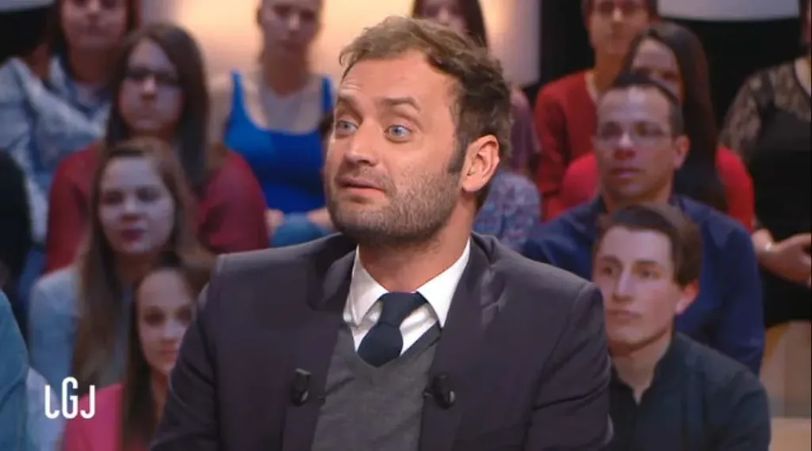

# Lettre amicale à Augustin Trapenard : les auteurs comme docteurs

Cher Augustin,

Je te dis tu, même si on ne s’est vu qu’une fois lorsque tu m’as reçu au Carnet d’or sur France Culture. Tu as une belle voix, une belle intelligence, une belle passion pour la littérature, c’était agréable d’être en ta compagnie. Tu m’as invité en tant qu’auteur Fayard, mais tu ignorais alors que j’étais aussi un indépendant, et un défenseur de l’indépendance sous toutes ses formes.

Je voudrais te poser une question. Est-ce qu’il t’arrive de consulter un médecin généraliste de temps en temps ? Je me permets de répondre pour toi par l’affirmative. Quand tu as la grippe, tu ne vas pas aux urgences consulter des médecins hospitaliers, donc fonctionnaires et en rien indépendants quand on les compare aux généralistes.

C’est un peu la même chose pour les écrivains. Certains exercent dans des sociétés, souvent privées que nous appelons éditeurs, d’autres ont ouvert leurs officines, souvent sur les rues du Net. D’autres enfin, comme moi, travaillent tantôt à leur compte, tantôt pour celui des éditeurs, un peu comme les médecins qui ont en même temps un cabinet en ville et un autre dans une clinique ou un hôpital.

Pourquoi ce qui ne choque presque personne pour les médecins te choque pour les écrivains ? L’indépendance n’est-elle pas une valeur que nous inculquons aux enfants ? N’est-elle pas indispensable à la construction de soi ? N’est-elle pas essentielle pour un artiste ? Nous lui demandons justement de se libérer des contraintes, des modes, des écoles, pour construire une œuvre unique et irréductible. Qu’il pousse cette logique jusqu’à se libérer d’un éditeur ne devrait pas te choquer.

Je reviens à ma question pour tenter d’y répondre. Si un médecin indépendant ne te choque pas, je suppose que c’est parce qu’il a été diplômé par la même université que le médecin hospitalier. Tous deux, dûment adoubés, choisissent alors leur vie comme ils l’entendent en fonction de leur conception du monde. En écoutant tes propos, j’en déduis qu’il ne pourrait en aller de même pour les auteurs faute de ce diplôme.

Mais qui le leur décerne ? Selon toi, j’imagine qu’il s’agit des éditeurs. Un écrivain ne pourrait se revendiquer de cette profession que si une entreprise l’a marqué au fer rouge de son logo commercial. C’est assez étrange de confier à des sociétés privées ce soin habituellement l’apanage de l’État ou de la communauté. C’est d’une certaine façon faire l’apologie du privé. « Moi, Gallimard, Fayard, Grasset ou Seuil, je te déclare auteur. »

Est-ce bien raisonnable de confier une décision aussi importante à des entreprises ? Je ne les crois pas malhonnêtes, mais je n’oublie jamais qu’elles ont l’obligation de gagner de l’argent, obligation pas forcément compatible avec la défense d’œuvres novatrices ou ne serait-ce qu’engagées dans des chemins de traverse.

Voilà tout le problème. Personne ne décerne un diplôme d’auteur, ni les éditeurs, ni les lecteurs, ni les libraires, ni les ministres, ni les universitaires. On se déclare auteur, on se vit auteur, et ça s’arrête là, tant que nous avons la force d’œuvrer. Tu peux bien sûr penser le contraire, mais je te promets que faire exclusivement confiance à une seule instance ne paraît pas raisonnable. Des auteurs indépendants sont plus lus que certains édités. Des auteurs de best-sellers ne méritent pas d’être immortalisés. Je pourrais indéfiniment poursuivre cet inventaire qui floute les frontières, d’autant que les universitaires commencent à étudier les œuvres des auteurs indépendants du Net.

T’écrire m’aide. Ces derniers temps, j’hésitais à me déclarer 100 % indépendant. Grâce à toi, je découvre que l’analogie avec les médecins me convient. Je peux très bien être tantôt indépendant, tantôt édité, tout cela en fonction des textes, des rencontres, du public. Il me paraît ridicule de m’enfermer dans une catégorie ou dans une autre, ce serait en quelque sorte renoncer à mon indépendance, à ma liberté.

Donc, merci pour ta sortie un peu impulsive et irréfléchie. Elle m’a aidé à me positionner dans un monde éditorial en grand chamboulement. Tu vois, nous aurions mieux fait de parler de littérature que de choses sans grand rapport avec elle.

#edition #dialogue #y2016 #2016-3-27-15h4
