# L'impossibilité de résister au numérique

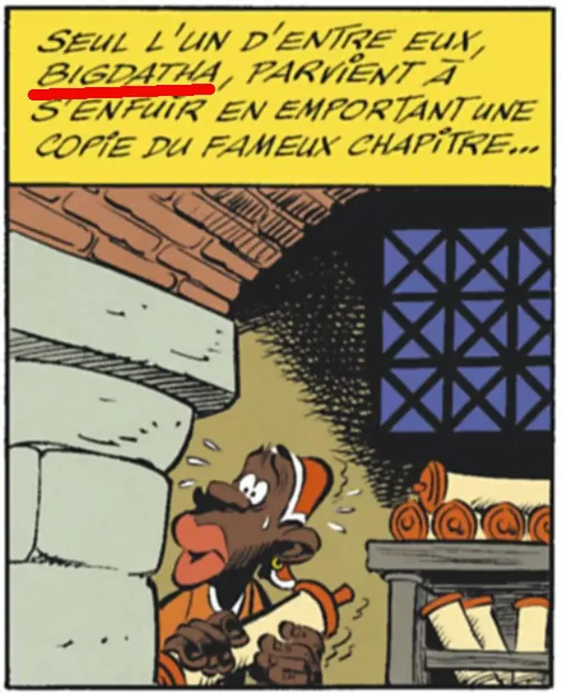

En 1492, cinquante ans après l’invention de l’imprimerie, [Johannes Trithemius](../../2012/9/johannes-trithemius-ou-les-451-croulants.md) a cru bon de faire imprimer un livre pour y défendre les manuscrits. Aujourd’hui, les chevaliers de l’édition traditionnelle nous abreuvent de tweets et de vidéos. C’est assez agaçant, mais, en même temps, l’aveu de leur défaite. La contagion est généralisée et irréversible. Pour preuve, dans *Le papyrus de César*, Ferri et Conrad multiplient les allusions au Net. C’est un comble.

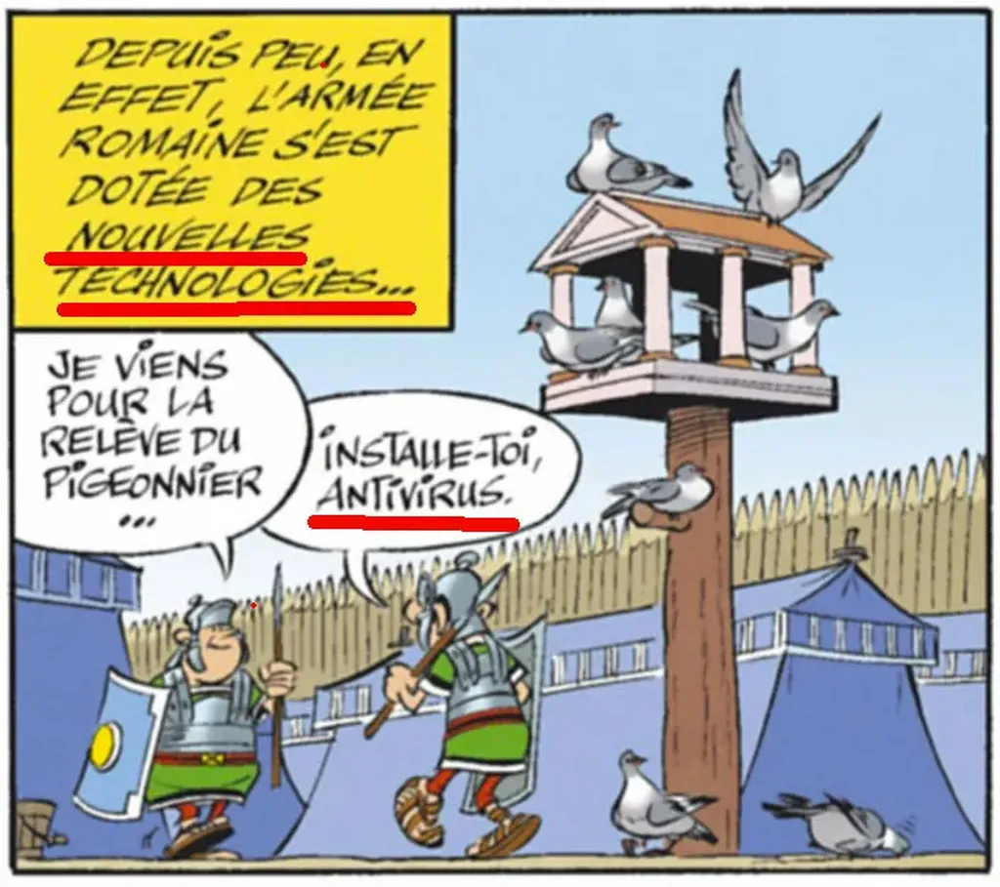

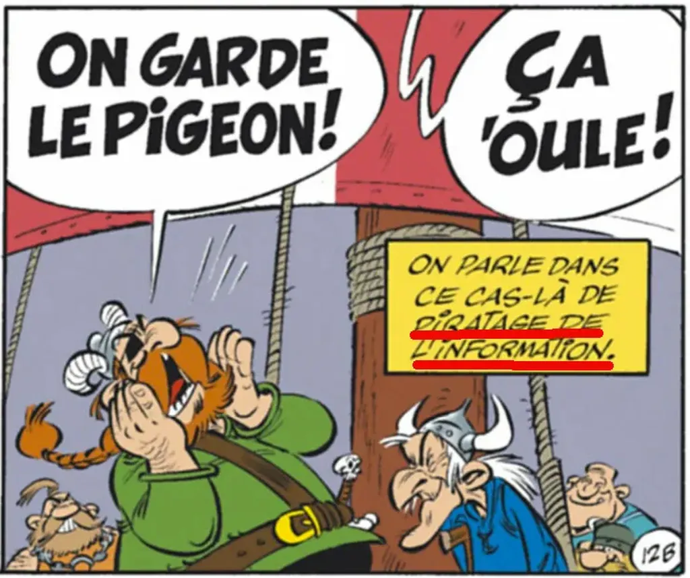

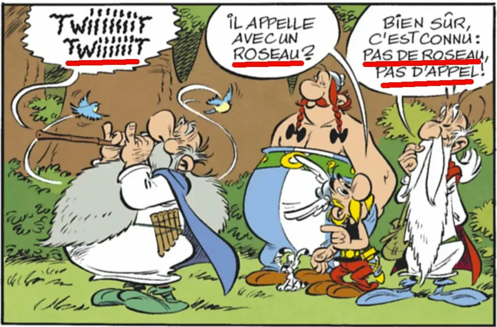

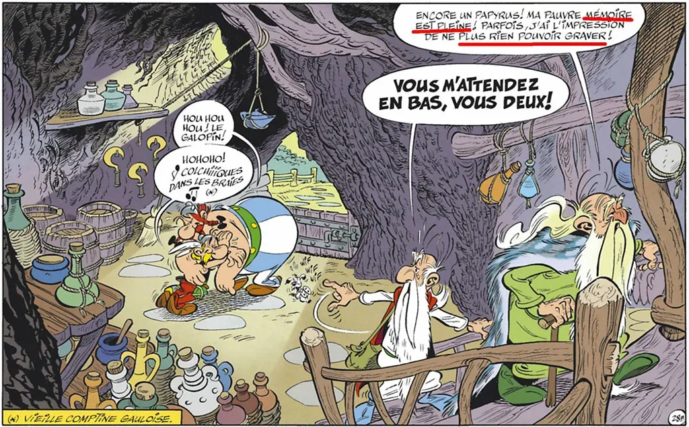

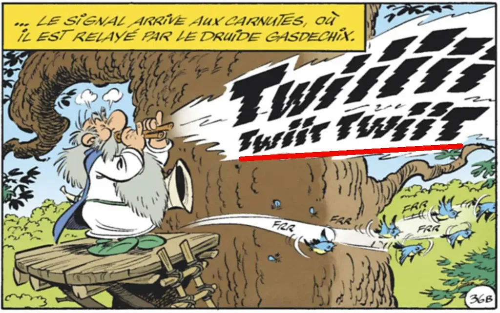

Le numérique a un pouvoir d’attraction irrésistible qui m’a d’ailleurs conduit au burn-out en 2011, mais ce n’était pas la première fois. Vingt ans avant de publier *[J’ai débranché](../../page/jai-debranche)*, j’ai déjà fait une overdose.

Après avoir appris à programmer au tout début des années 1980, après une école d’ingénieur, après un travail d’ingénieur puis de journaliste spécialisé en informatique, j’ai fini par ne plus vouloir entendre parler du numérique. Je ne rêvais alors que de livres objet, en papier bien sûr, et même cousus main. J’avais un besoin éperdu de rematérialiser ma vie.

Quand je replonge dans mes textes des années 1990, je constate que je n’ai pas plus que Ferri et Conrad résisté au numérique. Je le chassais par une porte, il rentrait par une autre, et ses codes d’écriture naissants s’imposaient contre ma volonté. Identifier ces codes intéressera peut-être les généticiens littéraires. Alors voici une rétrospective lacunaire et en images de mes années 1990 (une période où je tentais encore de séparer ma vie numérique de ma vie littéraire, un divorce assez difficile à vivre).

### Genius Locus

Quand j’attaque [ce roman](../../page/genius-locus) au printemps 1992, j’en ai quatre autres derrière moi, tous refusés par les éditeurs, ainsi que des dizaines de scénarios de jeu de rôle. Je suis alors journaliste, rédacteur en chef du magazine *PC Direct* et bientôt *PC Expert*, donc plongé dans le numérique jusqu’au cou. Je m’habitue à penser l’écriture dans la page. Je passe ma vie derrière les maquettistes penchés sur Quark XPress. Dans mon roman, je commence à séparer le récit des descriptions. Assez vite, j’invente une forme de lien hypertexte : les mots en gras dans le texte principal renvoient aux encadrés où je range les descriptions dont la lecture est facultative. Plus tard, j’imagine de mettre en page le roman sous la forme d’un carnet. Finalement (et après des années de réécriture reformatage), [je me contente à d’une forme minimaliste](../../page/genius-locus).

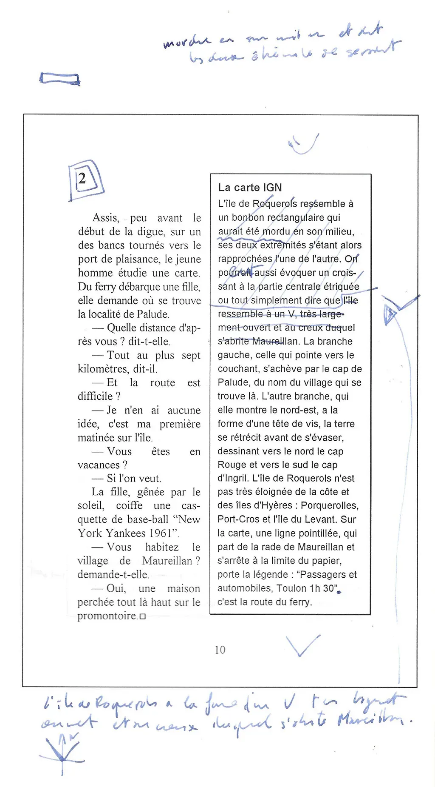

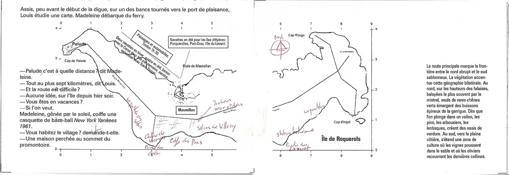

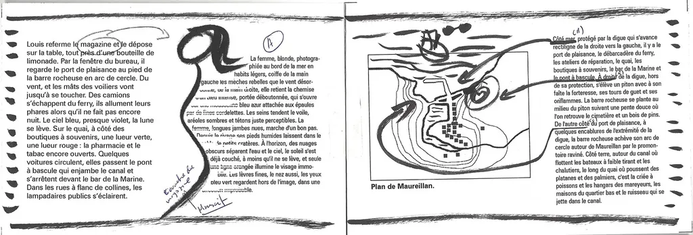

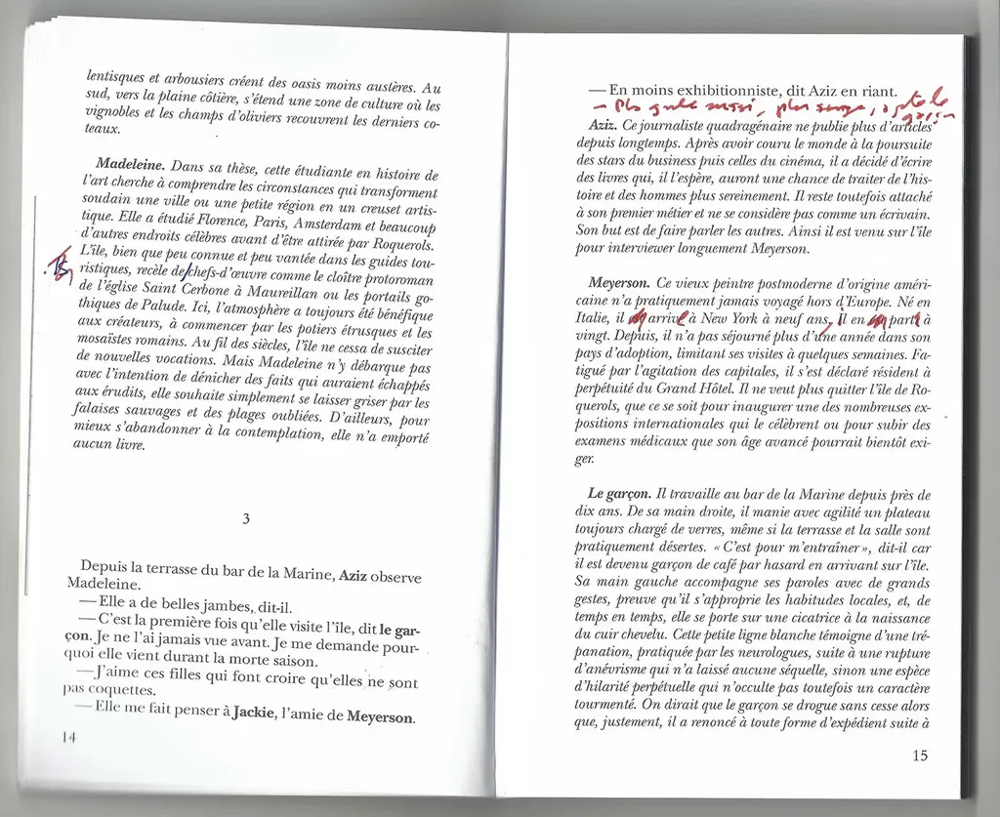

Cette irruption du lien hypertexte est pour moi symptomatique de la puissance du numérique. Je voulais cantonner cet univers dans ma sphère professionnelle et il imprégnait malgré moi ma sphère créative.

Je crois qu’il est impossible de résister à son temps, de ne pas l’enfermer dans ses œuvres. Celui qui ne le ferait pas ne serait tout simplement pas artiste. En 1992, nous n’avons pas encore de navigateur Web, Moasic n’arrive que l’année suivante, mais les liens ont été inventés en 1965 par Ted Nelson et on en trouve déjà un peu partout dans le monde numérique avant le Web. Bien sûr, les quelques éditeurs à qui je soumets *[Genius Locus](../../page/genius-locus)* le refusent.

### Décalage

Après avoir bouclé la première version de *[Genius Locus](../../page/genius-locus)*, je m’attaque à un sixième roman, *Décalage*. Je suis de plus en plus obsédé par la page, notamment après avoir lu *L’empire des signes* de Barthes et découvert en Italie les manuscrits enluminés par Fra Angelico. J’aboutis à une première version en octobre 1994. Sur chaque page, trois textes se juxtaposent : un récit principal (avec des encadrés descriptifs), un récit en bas de page, des aphorismes dans les marges et parfois des dessins. Tout cela fait penser à la presse, mais évoque le Web qui est en train de s’ouvrir et dont bientôt les pages ne seront pas très éloignées de celles que je tentais de monter. Et comme si ça ne suffisait pas, j’avais intercalé entre les parties romanesques des essais avec une mise en page différente.

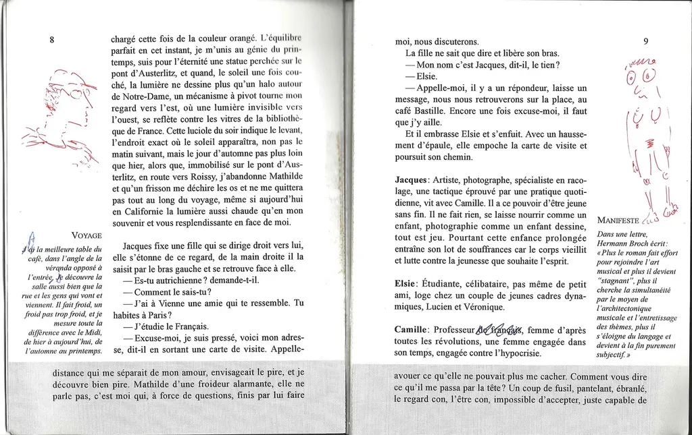

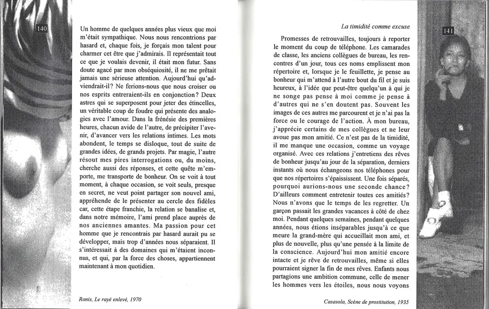

Le numérique implique la non-linéarité et sans m’en rendre compte elle m’obsédait, alors même que je ne voulais faire que du papier, et me refusais d’envisager un récit hypertexte distribué sur disquette ou CD-ROM. En voulant créer des livres objet, je créais en fait des textes non linéaires, et surtout j’autorisais une lecture non-linéaire (inspiré bien sûr par *L’Invention de Morel* de Bioy Casares mais bien décidé à dépasser le recours aux notes de bas de page).

La lecture non-linéaire est sans doute la chose à retenir de cette affaire. Dans la tradition de l’œuvre ouverte théorisée par Umberto Ecco, je voulais laisser le choix au lecteur, mais pas pour qu’il participe à la construction de l’œuvre, pour qu’il la découvre selon son propre cheminement. C’est exactement ce que le Web allait nous offrir (et un plus tard [*La maison des feuilles*](https://fr.wikipedia.org/wiki/La_Maison_des_feuilles), écrit à la fin des années 1990, publié en 2000, contrairement à *Décalage* resté dans mes cartons).

### Chronique d’un licenciement

En 1994, j’ai quitté la presse informatique avec perte et fracas. J’ai raconté mon licenciement dans [un petit livre destiné à mes amis](../../2014/6/vintage-chronique-dun-licenciement.md). Je le leur ai offert pour le Noël 1995. J’y résume mes expérimentations sur les encadrés et les liens hypertextes.

Nouveau paradoxe : j’imprime moi-même ce livre, puis je le relie et peint les couvertures pour faire de chacune un original. Je me veux résolument à l’opposé du numérique et dans la matérialité, et en même temps j’utilise tous les outils numériques disponibles pour créer mes objets (XPress pour la mise en page, Photoshop pour les images, un soft de morphing, une LasertJet pour l’impression en recto-verso - il fallait alors retourner les pages et les replacer dans le tiroir de l’imprimante).

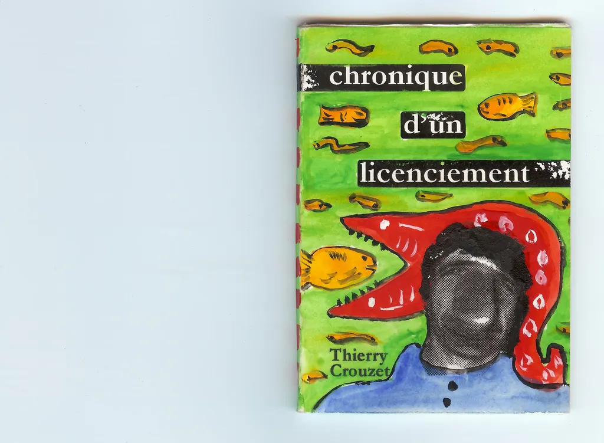
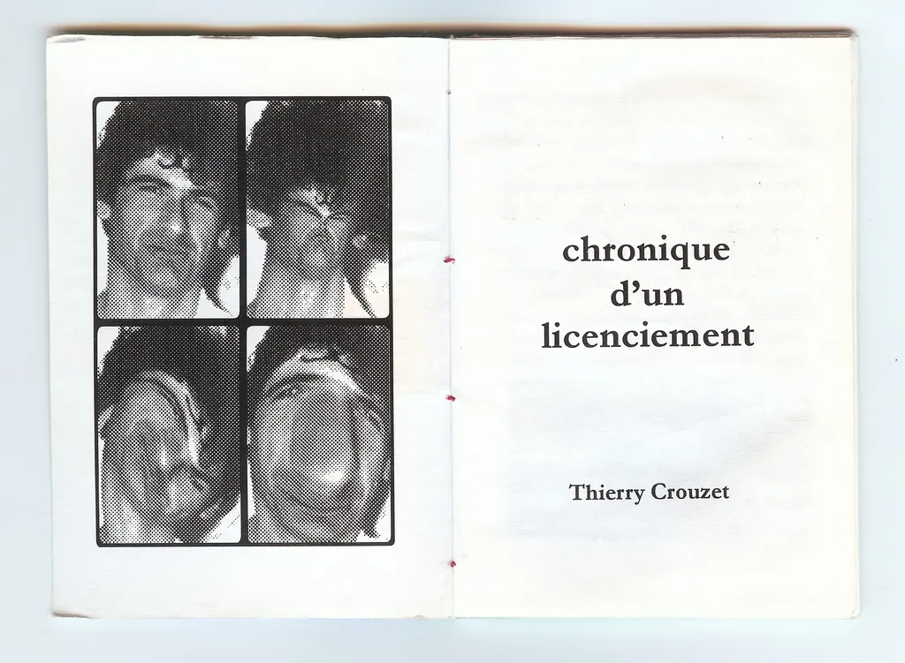
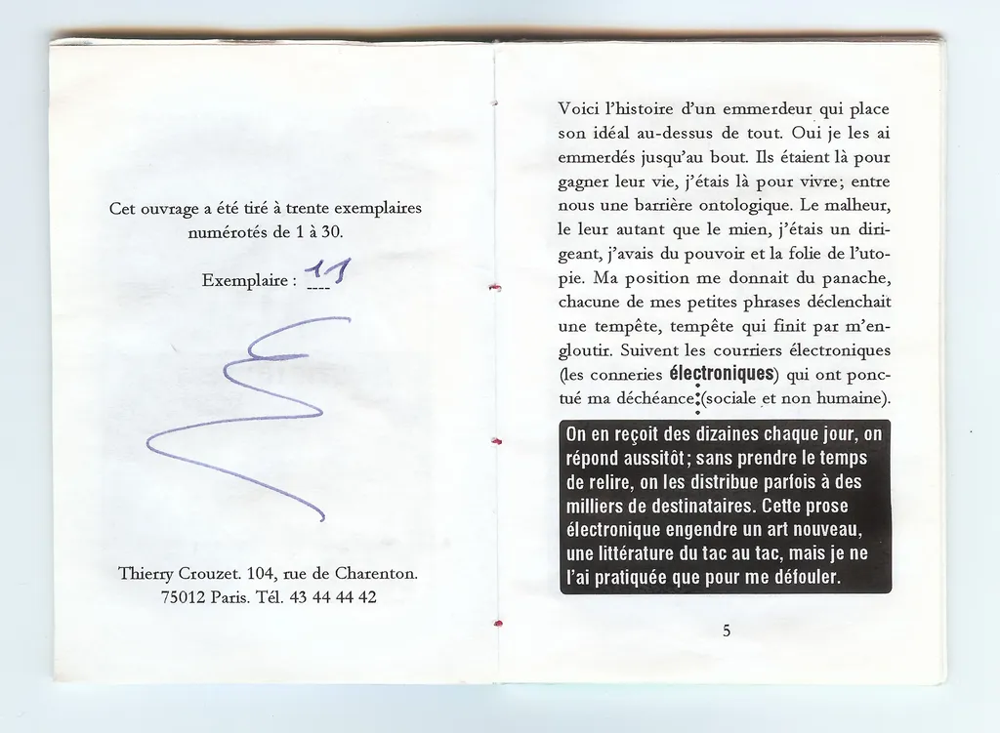
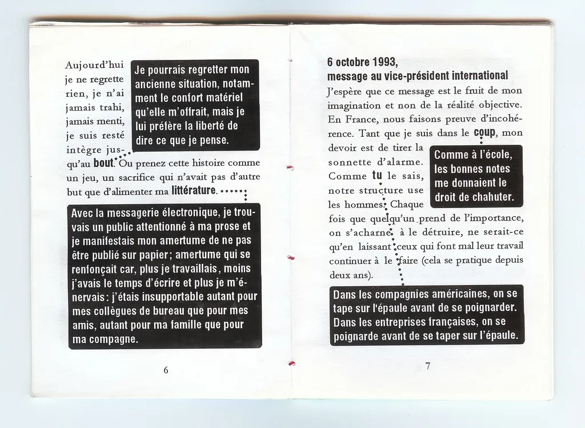

En rassemblant les captures d’écrans pour illustrer ce texte, je découvre dans le premier encadré au sujet des mails une définition bien à propos : « On en reçoit des dizaines chaque jour, on répond s ; sans prendre le temps de relire, on les distribue parfois à des milliers de destinataires. Cette prose électronique engendre un art nouveau, une littérature du tac au tac, mais je ne l’ai pratiqué que pour me défouler. » J’avais totalement oublié cette réflexion. Elle ressurgit du passé. C’est assez flippant, comme si j’avais déjà tout dit il y a plus de vingt ans.

À cette époque, j’envoyais des mails comme aujourd’hui des statuts sociaux, ou même comme des posts. J’avais des centaines de lecteurs. Ça giclait de partout comme au plus beau temps de la blogosphère. Voilà une autre chose dont je prends conscience en réveillant ces souvenirs. La plupart des internautes n’ont pas conscience que tout était déjà en place durant les années 1990, que nous y avons tout expérimenté en avant-première.

### Ne rien faire sans fainéanter

Après *Décalage*, j’ai perdu espoir de séduire un jour un éditeur. J’en viens à rejeter le romanesque, forme que je juge soudain inadaptée à notre modernité. La seule manière d’être contemporain est pour moi de saisir l’instant. Alors je remplis des dizaines de carnets de notes et de dessins. En 1995, je travaille à un nouveau livre objet. Son sujet : l’hyperconscience, moment où nous nous sentons vivre avec une intensité démultipliée. Je voulais que le discours théorique se déroule en parallèle de l’expérience analysée, captée en direct dans mes carnets, avec l’ambition que la conjonction des deux lignes narratives provoque le même effet chez le lecteur.

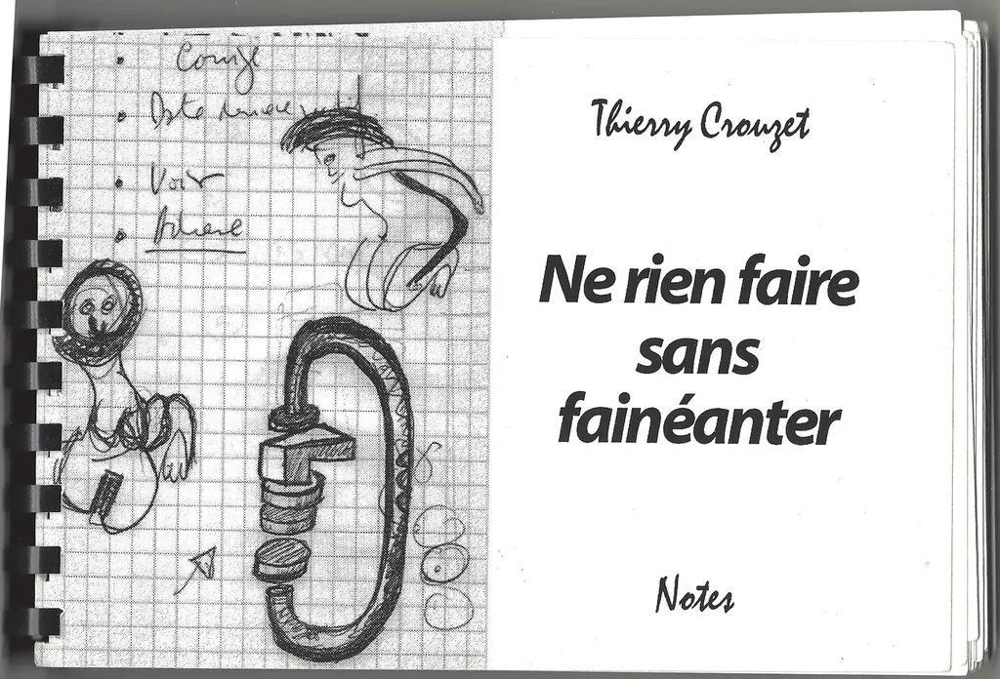

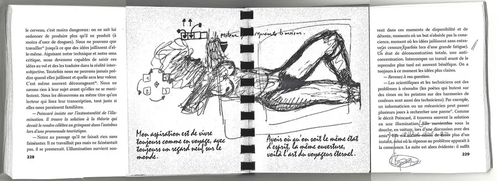

Aujourd’hui, il me semble que ces tentatives de 1995 illustrent une des particularités du numérique : toujours la possibilité d’un autre texte. Par le passé, on pouvait certes ouvrir un autre livre, désormais c’est plus immédiat, c’est même notre quotidien, nous déroulons plusieurs textes en même temps. Encore une fois, je faisais du numérique en voulant faire tout le contraire.

### Pensé de Sicile

En 1996, je continue furieusement de remplir des carnets. En juin, j’ai l’idée bizarre [de publier un passage sur le Net](http://lab.tcrouzet.com/sicile1996/). Je vois alors tant de choses se multiplier en ligne que je ne résiste pas d’y poster un texte très loin des préoccupations numériques du moment. Une façon de bloguer sans le vouloir.

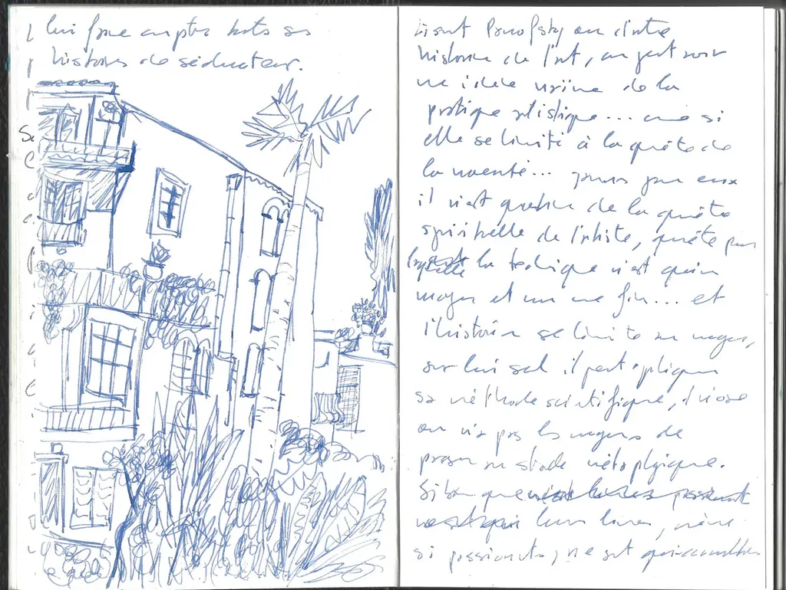

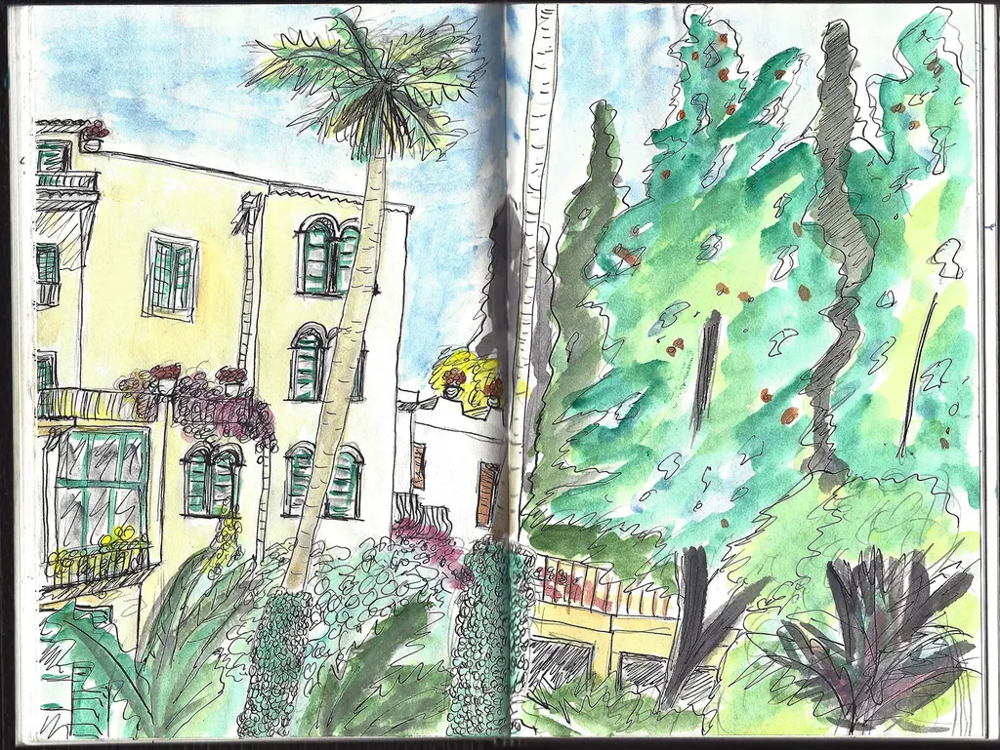

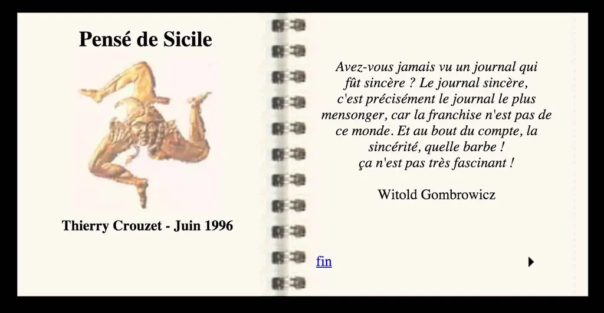

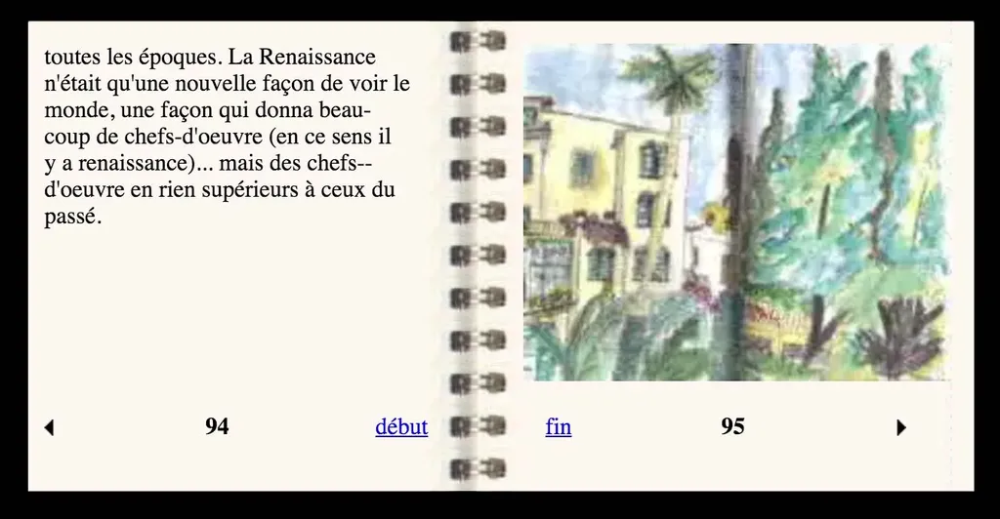

Depuis quelque temps, je me pose beaucoup de questions au sujet de cette première publication web. Ce texte, [depuis republié sur mon blog](../../1996/5/avion-pour-la-sicile.md), est-il différent de ce que nous écrivons aujourd’hui en pensant blog ? Je n’en suis pas sûr. Bien des textes publiés en ligne n’ont rien de spécifiquement numérique. Le Net est envahi de chevaux de Troie, de textes pensés pour le papier et publiés en ligne (exactement, mais inversement, comme mes textes papier des années 1990 étaient perclus de numérique).

Il est ainsi possible d’esquisser une classification.

1. Textes diffusés en papier et non influencés par le numérique (écrit par des Martiens sans doute).
2. Textes diffusés en papier et influencés par le numérique (chevaux de Troie envoyés par le nouveau monde).
3. Textes diffusés en numérique et pensés pour le papier (innombrables chevaux de Troie envoyés par le vieux monde).
4. Textes diffusés en numérique et pensés pour le numérique (les moins nombreux).

### Bug

Tous les textes précédents ont une dette à l’égard du numérique, mais ils auraient été partiellement possibles sans lui (j’avais tout de même besoin de nombreux softs pour mes montages). Pour la Noël 1998, j’ai préparé un petit livre qui en revanche doit tout au numérique. Au fil des années, j’ai collectionnés des bugs d’impression que j’ai rassemblés et encadrés d’un petit essai sur le hasard. *Bug* illustre les textes de la seconde catégorie, c’était un cheval de Troie envoyé dans l’ancien monde.

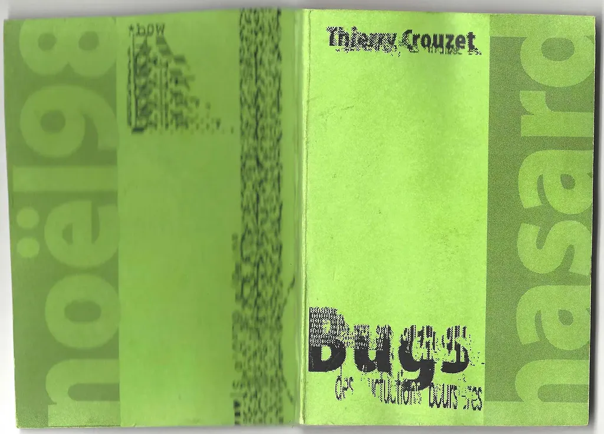

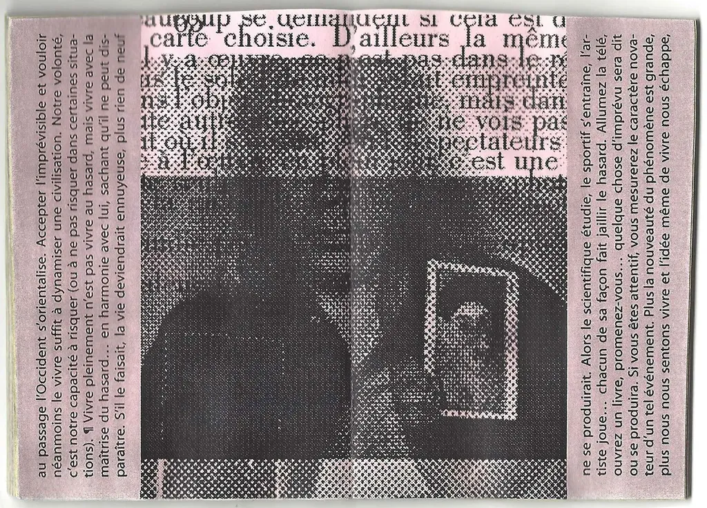

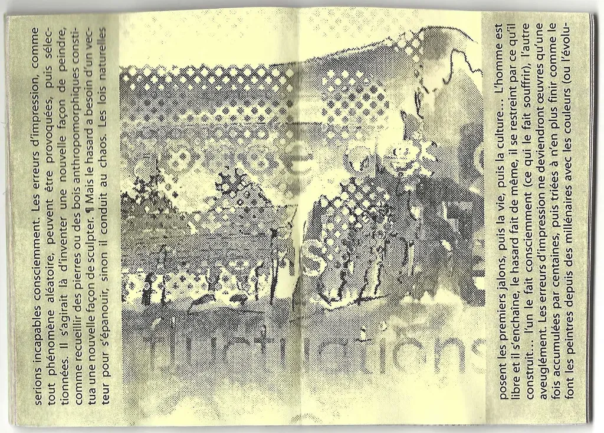

### Conclusion

 Quelques constantes de l’écriture numérique étaient potentiellement en œuvre à l’époque du papier :

1. L’abondant usage de la technologie (les softs de PAO pour créer des in-octavo).
2. Les liens (avec déjà les appels de notes…).
3. La non-linéarité.

D’autres me paraissent plus spécifiques :

1. Le Send (j’écris, je publie, en 1994 je parlais de littérature du tac au tac).
2. Interaction en temps réel (avec les commentateurs, les tags, le search, les autres auteurs…).

Une dernière idée me vient pour terminer. La plupart des romans publiés aujourd’hui peuvent être homothétiquement projetés sur papier ou sur ebook, sans ne rien perdre de leur forme ou de leur structure. Ils sont donc ni spécifiquement papier, ni spécifiquement numérique. Ils flottent entre les deux supports.

En revanche, certains de mes textes des années 1990 ne peuvent pas être transformés ebook (en PDF, oui, mais le PDF, c’est le vieux monde du papier). Il nous manque encore des liseuses pour rendre la double-page, avec ses possibilités de mise en page complexe. Ces œuvres sont encore pour quelque temps spécifiquement papier (et les créateurs devraient s’attacher à exploiter ces dernières spécificités).

Inversement, des œuvres numériques ne peuvent être projetées sur papier, sans perdre une grande partie de leurs caractéristiques (par exemple, mon *[One Minute](../../page/une-minute)*, dont la forme finale sera applicative).

Le numérique aura avalé le papier quand quasiment toutes les œuvres pensées pour lui pourront être rendues en numérique et lisibles avec un grand confort. En attendant, le papier se traîne à la poursuite du numérique, tentant de l’absorber mais toujours à contre-temps tout en voyant son espace d’innovation sans cesse réduit.

En attendant, ne soyons pas homothétiques, soyons créatifs.<:p>

*PS : Texte écrit pour le séminaire* [Internet est un Cheval de Troie](http://www.fabula.org/actualites/colloque-internet-est-un-cheval-de-troie_67661.php) *des 10 et 11 mars 2016 à Lyon.*

#netlitterature #dialogue #y2016 #2016-3-10-11h31
