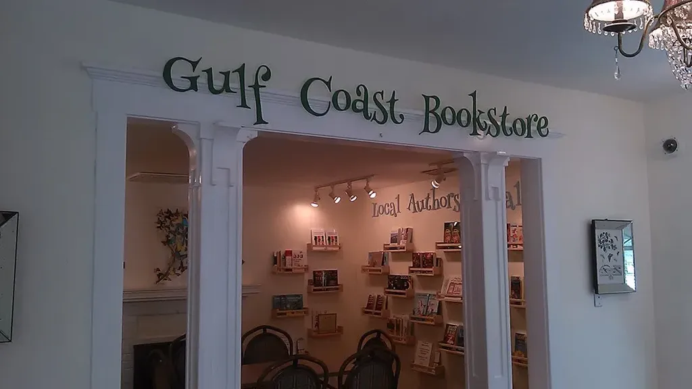

# Si les libraires osaient, la littérature en serait changée

C’est un paradoxe : alors que de plus plus d’auteurs se [déclarent indépendants](declaration-dindependance-des-auteurs.md), les libraires restent attachées aux éditeurs, les mêmes qui pilonnent semaine après semaine les nouveautés qui ne se vendent pas (et qui ont été mises en place avant d’être remises en carton, aïe ! mon dos). Il est peut-être temps de questionner cette relation parfois consanguine.

Pourquoi ne pas s’inspirer de la librairie [Gulf Coast Bookstore](http://www.gulfcoastbookstore.com/). Installée en Floride à Fort Myers, elle ne diffuse que des auteurs indépendants. Sans aller jusque là, il serait possible pour les libraires français d’ouvrir un rayon « indy ». Ce serait très judicieux chez les libraires autosurnommés indépendants. Ils allieraient ainsi les mots aux actes.

Entre Orlando et Miami, Gulf Coast Bookstore loue ses rayonnages aux auteurs qui touchent 100 % des revenus. On peut imaginer un autre modèle : dans une librairie généraliste, disposant déjà de plusieurs employés, le libraire pourrait se partager les bénéfices avec les auteurs, auteurs qu’ils sélectionneraient et avec lesquels il deviendrait partenaire.

Les libraires « indy » pourraient faire émerger de nouvelles voix, en revenir à la fonction originelle du métier, celle du primo découvreur (aujourd’hui, les libraires se contentent de découvrir dans la présélection effectuée par les éditeurs, tous persuadés de connaître le marché et les goûts du public). Le libraire retrouverait son rôle d’éditeur comme au début de l’imprimerie (et jamais délaissé par un [José Corti](http://www.jose-corti.fr/)). Depuis son officine ouverte sur la rue et le Web, il pousserait les textes qui lui tiendraient à cœur et que peut-être nul autre que lui n’aurait encore jugé intéressants. Son métier en serait enrichi d’une fonction plutôt excitante que s’accaparent les éditeurs.

Une certitude : si le nombre d’auteurs indépendants augmente, si leur part de marché augmente, les librairies n’ont aucun intérêt à laisser cette part du gâteau à Amazon. Elles doivent oser un pas vers les auteurs qui tentent encore de faire bouger la littérature hors de ses rails sclérosés par les anciennes règles du business (vite résumées en : il faut que je vendre beaucoup pour couvrir mes coûts de fonctionnement).

La synergie libraire auteur est bien plus fondamentale que la synergie libraire éditeur. Celle-ci n’est qu’un aléa historique provisoire lié à une phase particulière de l’histoire du capitalisme. Si on y réfléchit : les éditeurs ont dépossédé les libraires de la fonction édition. Les libraires ont enfin une chance de prendre leur revanche.

*PS : Je serais plus amusé de voir *[One Minute](../../page/une-minute)* diffusé dans une poignée de librairies indépendantes motivées que lancé au petit bonheur la chance dans le flot des 70 000 nouveautés et rééditions de l’année.*
*PS, jeudi 9:22 : Un gros libraire me dit être intéressé. Il suffirait de quelques autres volontaires motivés pour qu’on lance une petite opération expérimentale.*

#edition #dialogue #y2016 #2016-3-23-15h40
