# Mars 2016

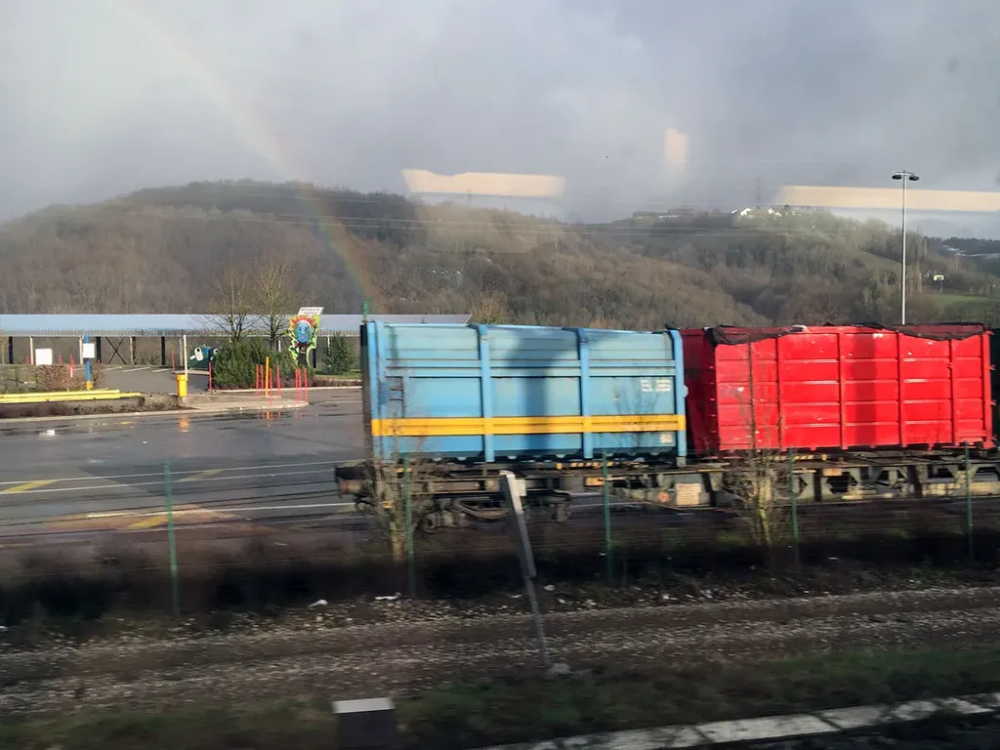

### Mardi 1er, Gap

Émile s’est fracturé le tibia lors du hors-piste. Une racine a retenu son ski gauche. Je viens de le retrouver aux urgences où il a été transporté en hélico. Nous attendons une échographie dans une promiscuité effrayante. Une femme hurle des insultes. Les malades vont et viennent sur les brancards.

Je me revois ainsi assis avec mon clavier sur mes genoux lorsque mon père a fait son infarctus. Difficile de retenir mes larmes. J’écris parce que ça aide, j’écris toujours pour cette raison, ça aide à jouir de la vie comme à la supporter.

Quand l’infirmière a transfusé Émile, elle n’a respecté aucun des cinq moments de l’hygiène des mains. J’étais terrifié, je n’ai rien osé dire. Je l’ai vu sortir dans le couloir, serrer la main à quelqu’un, disparaître, revenir tripoter Émile, sans une fois se désinfecter les mains.

J’ai un peu plus tard entamé une conversation avec les infirmières. Elles m’ont dit que le gel attaquait leur peau, qu’elles ne le supportaient pas et qu’elles préféraient le savon (or, c’est le savon qui est mauvais pour la peau).

Les heures passent. Émile est pris en sandwich par deux brancards, dans une pièce où rien d’autre n’entre. D’un côté, Francis qui a fait un énième malaise cardiaque. Il attend depuis trois ans une transplantation cardiaque. De l’autre, un jeune homme qui en snow s’est fait vingt-quatre fractures au genou gauche.

Émile s’en tire bien. Demain, il sera plâtré. Pas besoin de chirurgie. Le bonhomme a été courageux.

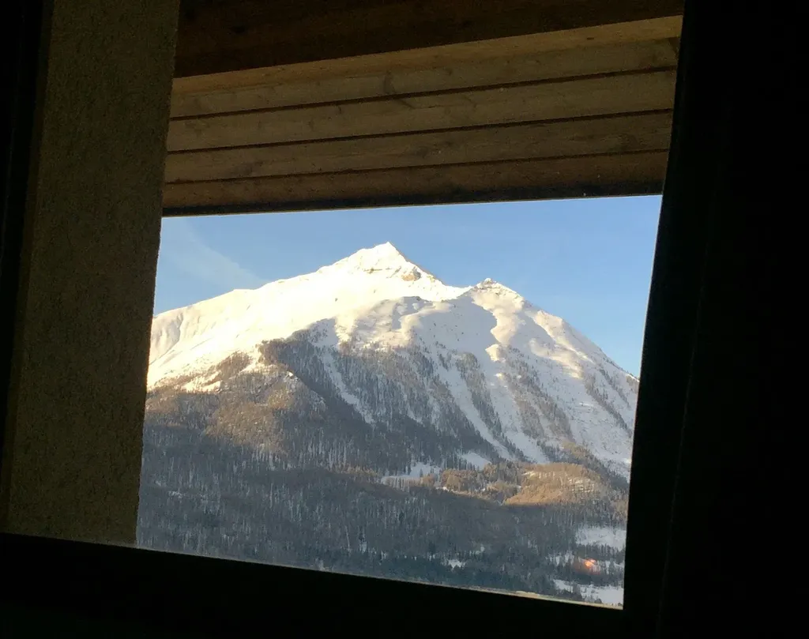

### Dimanche 6, TGV Genève

Je laisse Isa seule à la maison avec les enfants, surtout Émile qui ne maîtrise pas encore les béquilles et que nous avons bien du mal à faire quitter son fauteuil roulant. En route pour retrouver Didier Pittet et travailler sur le scénario de *Résistants*.

---

Je n’écris pas, terrassé par le quotidien. Je lis *L’Homme qui répare les femmes*, la vie maladroitement racontée du docteur Denis Mukwege, avec qui je dîne mardi soir. Un grand gâchis ce livre. En se refusant le trash, l’auteur nous empêche de comprendre cet homme qui soigne gratuitement les femmes violées par milliers au Congo.

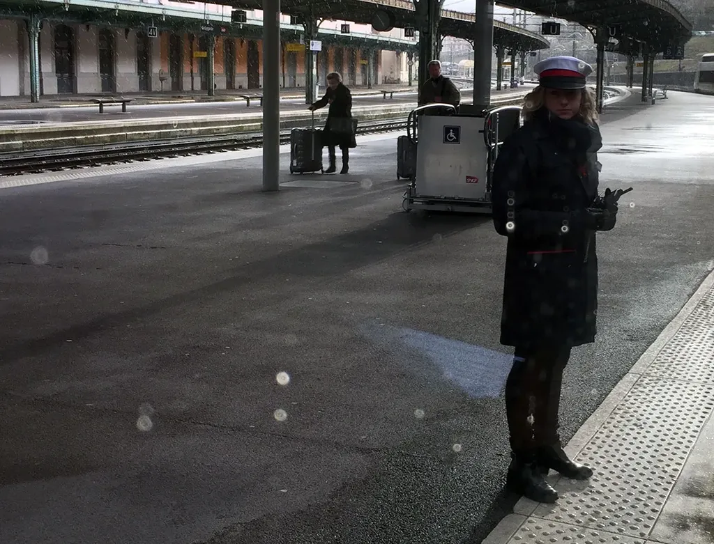
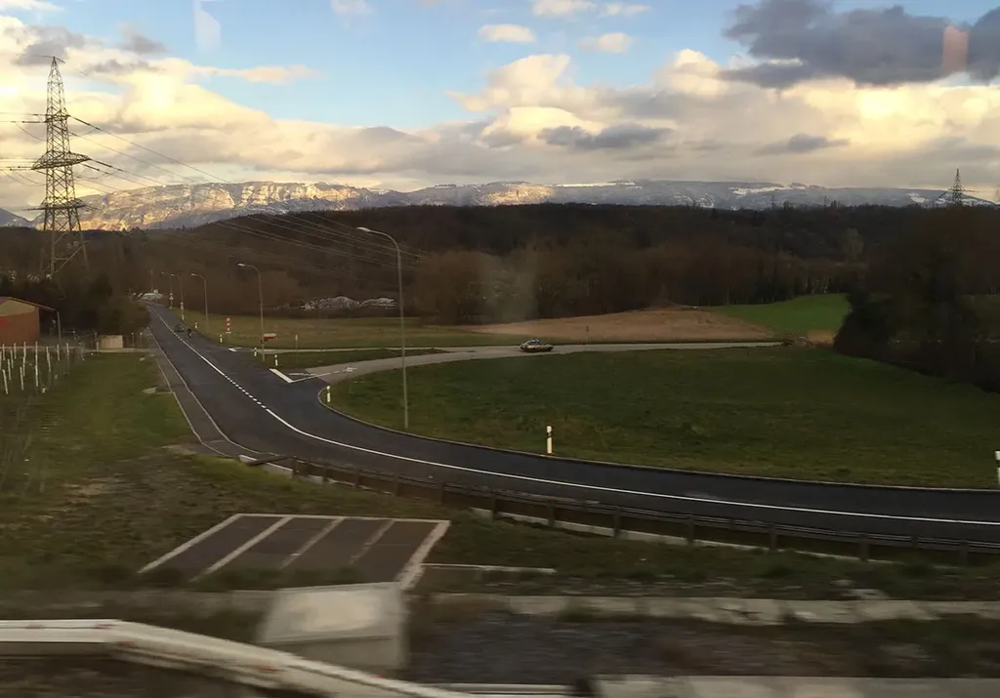
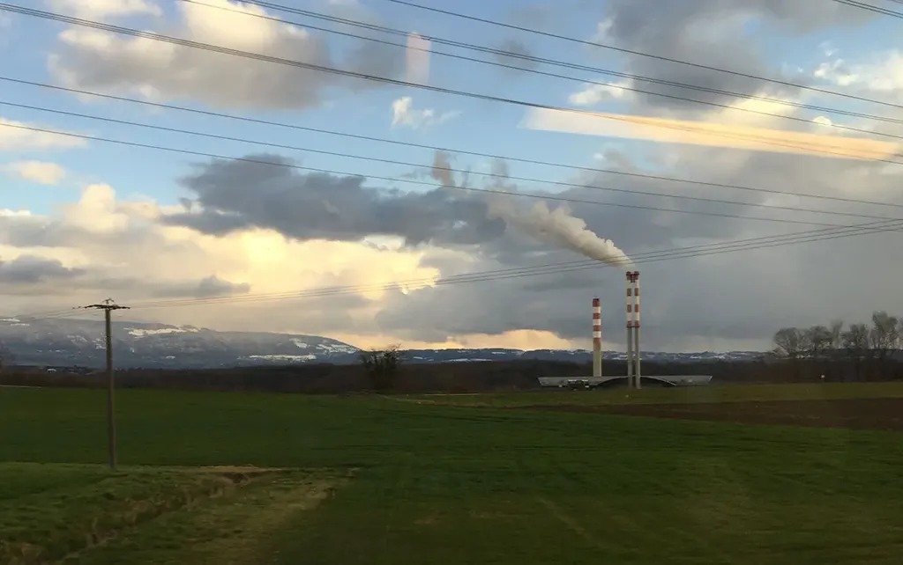

### Lundi 7, Croix de Rozon

Pour la première fois, je suis nègre. [J’écris un article pour Didier](http://www.huffingtonpost.fr/didier-pittet/sante-droits-de-lhomme_b_9417130.html) qui le publiera sous son nom. J’y raconte que la Déclaration des droits de l’homme de 1948 subordonne la santé à l’économie, qu’elle fait passer la santé après le droit de propriété et qu’elle ne fait donc pas de la santé un droit humain élémentaire. Elle a été écrite dans la seule perspective du capitalisme. C’est assez terrifiant de voir autant de gens se revendiquer de ce faux humanisme.

---

J’ai assisté à la projection de *L’homme qui répare les femmes*, le reportage qui raconte la vie de Denis Mukwege. Il souffre des mêmes défauts que le livre. En oubliant la dimension esthétique, en nous offrant des images mièvres, il ne réussit pas à transcender cette histoire tragique et à glorifier le travail de Denis Mukwege. En voulant tout dire, il finit par nous ennuyer. Ce film a toutefois le mérite de documenter une horreur de plus. Quand est-ce que les massacres cesseront ? Le film oublie de chercher à comprendre pourquoi des hommes en viennent à la barbarie allant jusqu’à violer des bébés de deux mois. Parce que voilà le sujet, le trou noir au fond de nous tous, et qui arrache des larmes à Denis Mukwege.

### Mardi 8, Croix de Rozon

Nous tournons et retournons le scénario épidémiologique de *Résistants*. Nous avançons doucement, mais peu à peu les choses s’emboîtent. Il ne me restera bientôt plus qu’à écrire.

---

Je participe à une conférence sur le revenu de base pour lequel les Suisses voteront en juin. Ses défenseurs le comprennent encore trop mal pour qu’ils puissent le défendre jusqu’à la victoire.

Par exemple, ils montrent très bien comment notre système monétaire en exigeant sans cesse le remboursement des intérêts pousse à une croissance infinie incompatible avec les limitations de la biosphère (en attendant son extension spatiale).

Puis, après cette belle démonstration, ils expliquent qu’il faut mieux répartir l’argent. « Mais non ! » Si nous nous contentons de distribuer entre tous, nous distribuons entre tous la nécessité de détruire le monde. Plutôt que de gros capitalistes soient responsables, nous partagerions tous la responsabilité. Il faut au contraire construire un nouveau système monétaire qui ne nous impose pas la croissance infinie.

### Mercredi 9, Croix de Rozon

Hier soir, j’ai donc rencontré Denis Mukwege. Une soirée discrète dans le luxueux hôtel intercontinental. Nous étions une vingtaine. Des ambassadeurs, des riches donateurs, des représentants du festival des droits humains et moi, avec mon pull de marin, mon jean, mes basquets entre tous ces souliers vernis. Ma façon de porter le costume en quelque sorte. J’étais dans mon rôle tout autant que les autres.

Je n’ai échangé que quelques mots avec Denis. Je l’ai senti fatigué, un peu terrassé par l’accueil que nous lui faisons, et sans aucun doute par le décalage infini de nos vies et celle qui est la sienne quand il rentre au Congo. C’est un peu comme si nous voulions nous acheter une bonne conscience. Nous aurions mieux fait de nous retrouver dans un vulgaire café, de moins manger, de mieux manger, et d’envoyer l’argent économisé à des familles congolaises.

Le monde tourne à l’envers. Et c’est toujours étrange pour moi de me retrouver mêlé à ses engrenages viciés. Je ne devrais pas écrire cela, surtout pas le publier. Je ne peux m’en empêcher.

Moi qui vit discrêment dans le Midi, loin de la vie mondaine, de la pseudo bourgeoisie de province, je m’y trouve mêlé à Genève par l’intermédiaire de Didier, mais aussi parce cette ville est comme un concentré de la totalité du monde tant les nations et les expériences s’y focalisent.

Alors que je discute avant le dîner, appuyé à une porte, je me plante une écharde dans le pouce droit. Une écharde à un million de dollars. Une écharde arrachée au montant d’une porte d’un hôtel de luxe. C’est assez ironique.

### Jeudi 10, direction Lyon

Faut-il tout dire ? Aux amis, oui, sans aucun doute. En tout cas, très souvent. Et au sujet d’une chose publique, aussi. Quand les deux se rejoignent, j’hésite d’autant moins. J’ai vu hier soir le film *Clean Hands* sur l’histoire de l’hygiène des mains et de Didier. J’apprécie l’équipe, mais je ne suis pas convaincu. Pas d’engagement esthétique, pas d’émotion, pas de perspective politique, pas de narration. Pendant 52 minutes, je me suis retrouvé devant un reportage qui au JT ne dure que trois minutes, et c’est bien suffisant pour ce genre d’exercice.

---

Je profite d’une correspondance pour faire quelques pas dans Bellegarde, cette ville où je passe d’habitude sans m’arrêter, cette ville en dévers, mystérieuse, où j’aimerais vagabonder à tous ses étages pour en saisir les empilements cubiques.

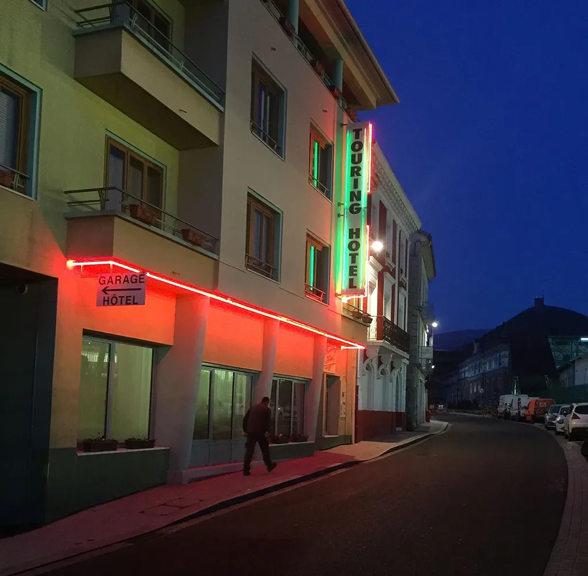
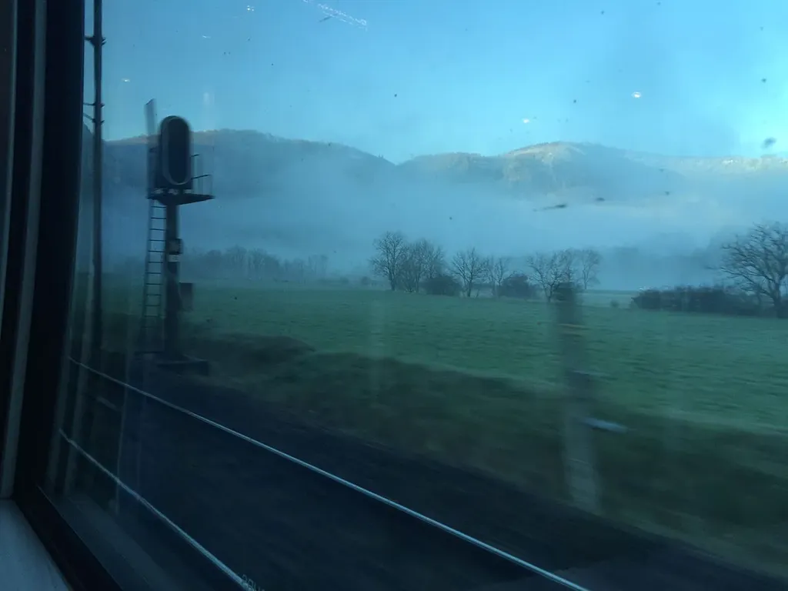

---

Ce matin, assis aux toilettes, je vois un homme apparaître dans les granules du carrelage. Je le photographie, le matérialise, j’ai toujours ce projet rêvé de capturer les paréidolies et de les détourer.

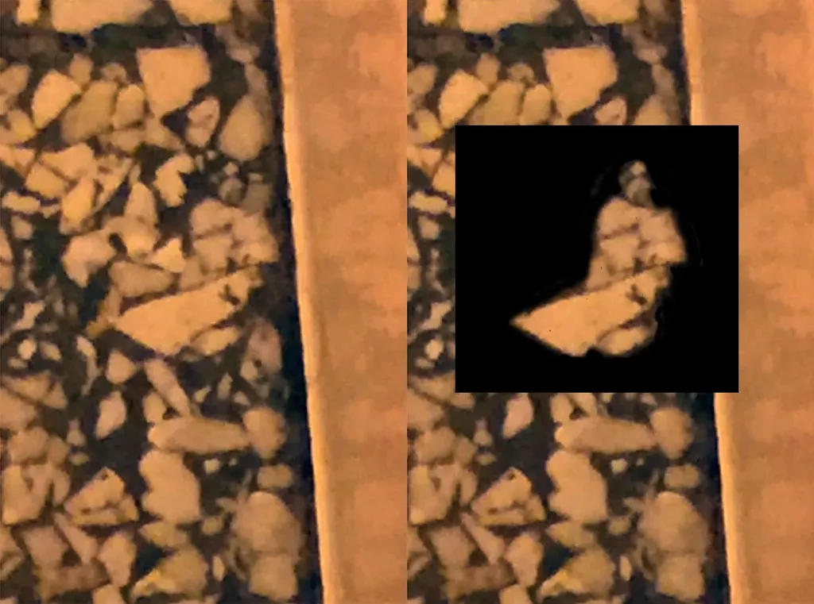

---

En gare de Culoz, j’aperçois trois locomotives bleues [BB 6700](https://fr.wikipedia.org/wiki/BB_67000), un peu délavées, les mêmes qui rutilaient dans les méandres de mes trains électriques. J’ai du mal à admettre que j’ai plus de cinquante ans. La vie n’est qu’un instantané. Quand à Genève, je croise tous ces gens riches et costumés, je me sens enfant à côté d’eux. Il ne me vient pas à l’idée d’user du pouvoir de mes cheveux blancs. Je reste celui qui jouait au train électrique.

### Jeudi 10, Lyon

J’ai marché dans trois villes aujourd’hui. Genève pour aller prendre mon train, Bellegarde en attendant ma correspondance, Lyon en tout sens avec escalade indispensable de Fourière et photographie des derniers rayons de soleil.

Puis j’ai cherché un café, un véritable café, avec des tables pour écrire. J’ai dû marcher, encore. Même les grands cafés ont disparu, remplacés par des chaînes de junk food ou de fringues. J’ai fini par dénicher l’endroit parfait avec des banquettes en Molesquine.

Alors que j’écris, j’entends soudain le mot « Littérature ». Je lève la tête, je vois une chevelure blanche dépasser d’une banquette, je retrouve François Bon, [Sébastien Rongier](http://sebastienrongier.net/) et [Philippe Liotard](https://fr.wikipedia.org/wiki/Philippe_Liotard), comme si certains lieux nous attiraient, nous autres écrivains, par leur magie antinomique avec la normalisation commerciale.

Notre encontre n’est que relativement hasardeuse. Nous avons participé à un colloque universitaire dédié aux écrivains qui seraient Web mais ne seraient pas sur le Web. Une sorte de truisme, puisque le Web imprègne désormais la société. Un sujet plus intéressant aurait été de chercher ce que les écrivains exclusivement papier ne comprennent pas, ou ne saisissent pas, du Web.

Je discute avec François de Bellegarde. Je lui suggère une mission commando. On devrait à plusieurs envahir la ville durant une journée et chacun l’écrire, la déshabiller, la réinventer. Cette ville ou une autre, mais Bellegarde a en elle une puissance romanesque.

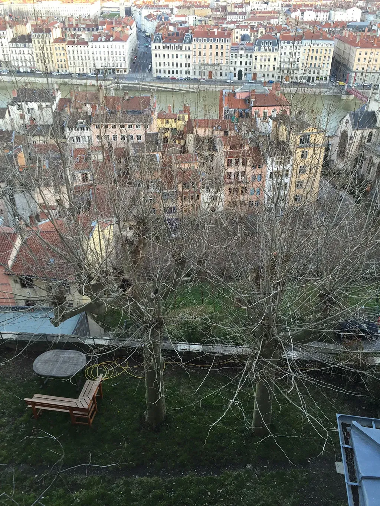

### Samedi 12, Balaruc

La communauté est puissante, elle suffit à combler une vie, et point besoin d’être innombrables. Nous étions une vingtaine à Lyon, unis par notre goût pour la littérature et cela a suffi à donner une saveur particulière à notre séjour.

---

Je vais courir sur la plage. Au loin, je vois une femme, assise en tailleur, je me dis qu’elle médite ou dessine. Quand j’arrive, elle regarde son portable. Un peu plus loin, un homme le torse nu, à demi caché par une jetée, fixe le sol. J’imagine qu’il a découvert un coquillage. Quand j’arrive, je découvre sa femme à ses pieds, les yeux rivés sur son portable.

---

J’essaie de lire les livres évoqués à Lyon. Je suis agréablement surpris par la tenue de *La Théorie de l’information* d’Aurélien Bellanger. Au début, plus déroutant, *la Féerie générale* d’Emmanuelle Pireyre m’amuse. Deux livres très houellebecquiens, très de notre temps, sans être à l’avant-garde.

En revanche, je bloque sur *Autour du monde* de Laurent Mauvignier, pourtant le texte qui devrait le plus m’intéresser, puisqu’il s’inscrit en partie dans la logique de *One Minute* ([remarque d’Oriane Deseilligny](../../2015/11/one-minute-une-lecture-theorique-doriane-deseilligny.md)). Impossible pour moi de supporter les répétions de « comme », non pas employés à la manière proustienne pour ouvrir des abysses, mais simplement pour introduire des analogies. Je m’interdis ce « comme une fleur » parce qu’il est si commun qu’il en devient lassant, autant quand j’écris que quand je lis. Et quand Mauvignier ne mitraille pas ses « comme », il enfourche le « semble ». Dans son texte tout est comme et tout lui semble, rien n’est tel qu’il devrait être. Je ne peux pas aller plus loin que les premières pages.

### Dimanche 13, Sète

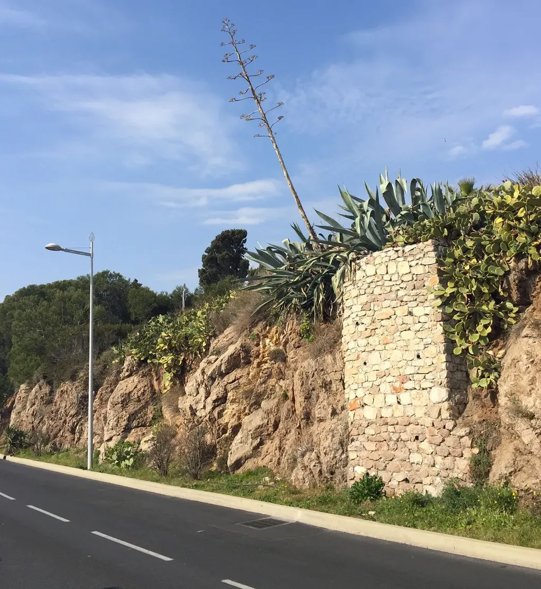
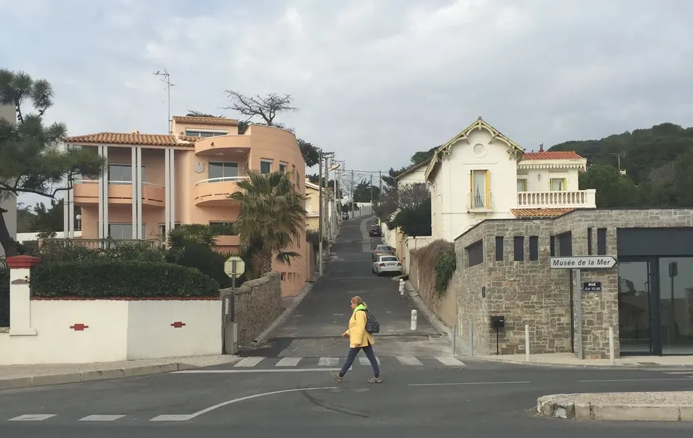

### Lundi 14, Balaruc

Quand je veux me mettre au travail, Isa branche un chauffage d’appoint qui fait sauter l’installation. En remettant tout en ordre, je découvre que la ligne qui alimente mes disques durs, mon NAS et ma box a fondu (au risque de faire cramer la maison). Je dois recâbler. Je ne retrouve mon clavier qu’à onze heures avec la nécessité de replonger dans la narration de *Résistants*. Reprendre une écriture, c’est aussi difficile que reprendre le sport après des années d’arrêt. Je dois me faire violence.

### Mercredi 16, Balaruc

Je passe mes journées à lire des articles scientifiques sur les bactéries. J’en ai le tournis. C’est à me dégoûter, à me donner envie de tout envoyer balader. Les premiers pas dans un domaine sont toujours décourageants, car je me heurte à une barrière apparemment infranchissable, et qui repousse l’écriture à plus tard. Je dois néanmoins écrire, les choses se mettront en place qu’à cette condition.

---

« Tu n’as qu’à écrire *Résistants* avant de le publier en ligne, me suggère Isa. Tu pourrais te lancer tout de suite, avant de tout savoir sur le sujet, quitte à tout revoir après. » Si je voulais juste écrire un roman, je devrais suivre son conseil. Mais un tel roman ne m’intéresse pas. Je recherche le contact avec le lecteur, l’interaction, j’ai besoin de cette adrénaline pour écrire de la fiction qui sinon, en elle-même, ne serait pas très littéraire. Je veux pratiquer une littérature du happening.

### Jeudi 17, Balaruc

Je viens de lire *Economix*. J’avais déjà lu le non moins génial *Logicomix*. Depuis longtemps une amie me suggère d’écrire avec un dessinateur *Digicomix*… Cette BD raconterait le numérique depuis l’origine. Le narrateur serait un addict des réseaux sociaux qui prendrait conscience que mieux comprendre tout ça l’aiderait à mieux vivre.

---

Idée de roman. Bernard Maris, assassiné lors des attentats de Charlie-Hebdo, dénonçait le monopole de la création monétaire par les banques. Pourquoi ne pas imaginer un complot, un attentat commandité pour le faire taire, pour orienter vers une fausse piste, l’islamisme radical, et détourner l’attention du véritable problème qui gangrène le monde, problème à l’origine aussi de l’islamisme. Ce pourrait être un façon de mettre en scène les aberrations de notre monde. Un texte absurde sur l’absurdité officielle.

### Mercredi 23, Balaruc

Apprendre à vivre avec la possibilité de l’attentat, d’un incident nucléaire, de la dictature, d’un afflux de migrants, de la montée des eaux… Cool l’avenir si on n’y ajoute pas des prouesses techniques, des découvertes scientifiques et esthétiques, des embrassades et des passions.

#carnets #y2016 #2016-4-8-17h30
