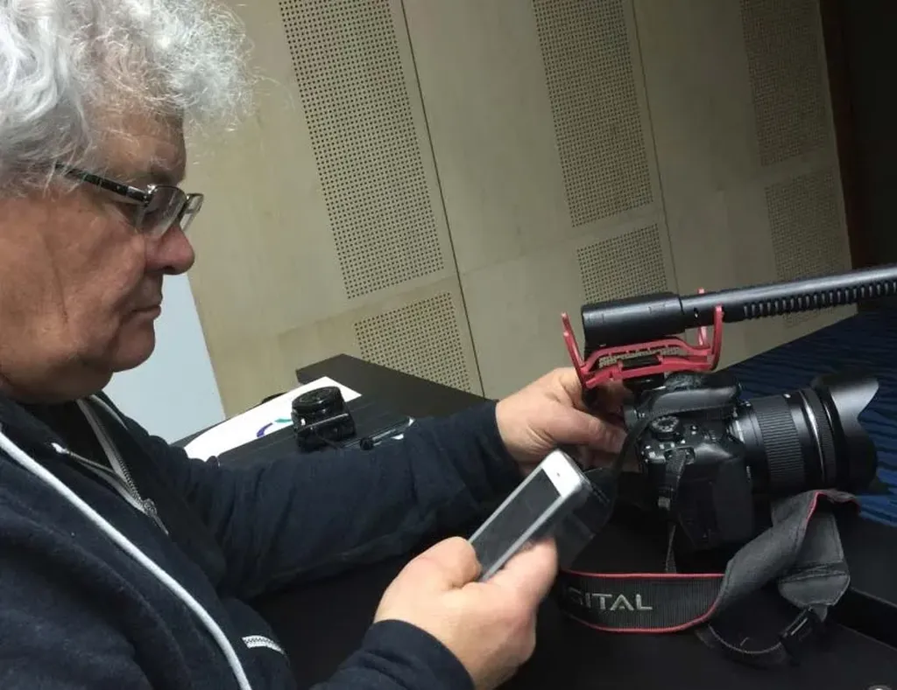

# Comment reconnaître les auteurs contemporains

Et déjà une difficulté : je ne peux pas écrire « Il, l’auteur » puisqu’il existe plus de femmes auteurs que d’hommes. J’ai donc décidé d’écrire « Nous, auteurs », ce qui donne un ton manifeste à un texte qui n’est qu’une mise au point.
* Nous n’avons pas besoin d’un éditeur pour nous prouver que nous sommes auteurs, mais seulement de quelques lecteurs.
* Aucune institution, entreprise, université ne nous légitime.
* Nous n’avons pas peur de dire ce que nous pensons puisque nous ne risquons pas de fâcher ceux qui nous légitiment.
* Nous n’avons rien contre travailler avec des organismes de légitimation du moment que nous tirons la nôtre seulement de nos lecteurs.
* Nous n’avons rien contre gagner de l’argent avec nos œuvres, mais nous ne faisons pas de cet objectif une priorité, sinon nous nous assujettirions à notre notoriété.
* Nous assumons notre indépendance et la manifestons par une liberté de parole que nous étendons à tous les domaines que nous jugeons bons.
* Nous ne nous interdisons pas de changer de genre, de style, de public. Nous ne sommes pas des produits toujours disponibles dans le même rayon.
* Nous dénonçons ce qui nous paraît intolérable, sans peur des représailles. Nous tapons même sur nos amis dès qu’ils manquent de lucidité.
* Nous retirons notre confiance à ceux qui trahissent nos idéaux, notamment ceux qui refusent que nous assumions notre indépendance et tentent de nous la dérober.
* Nous évitons si possible de signer des contrats contraignants, car ils finissent souvent par s’interposer entre nous et nos lecteurs.
* Nous explorons les nouvelles possibilités créatives et ne les détournons pas pour simplement diffuser les œuvres que les organismes de légitimation refusent.
* Nous expérimentons, nous essayons et nous trompons.
* Nous reconnaissons que nous ne pouvons rien seuls, que nous avons besoin d’une communauté, déjà celle de tous les humains qui nous ont précédés et sur lesquels nous nous appuyons, et auxquels nous devons jusqu’à notre existence. En conséquence de quoi, nous n’avons pas la prétention d’être les seuls auteurs de nos œuvres et nous les versons volontiers dans le domaine public, sans que ce soit systématique, car cette attitude systématique serait une contrainte opposée à notre indépendance de pensée et d’action.
* Nous ne pouvons affirmer notre indépendance sans une myriade d’outils, certains promus par des entreprises dont nous réprouvons les valeurs, mais que nous dénonçons en retournant contre elles leurs propres forces (la stratégie du judoka).
* Nous n’hésitons pas à gagner notre vie en dehors de notre champ créatif si cela maximise notre liberté de création.
* Nous sommes impitoyables avec nous-mêmes et avec les autres (nous reconnaissons avoir un problème avec ceux qui se cachent derrière de prétendus éditeurs pour se croire auteur, refusent le contact direct avec les lecteurs que souvent ils n’ont pas, passent leur vie à courtiser les institutions pour arracher des subventions légitimantes, réduisent le Web à un média de diffusion, restent politiquement correct pour ne fâcher personne… Par leur faiblesse de collabo, ils compliquent notre position et font de nous des marginaux).

[caption id="attachment\_43653" align="alignnone" width="600"] Portait de l’auteur contemporain…[/caption]

#edition #dialogue #y2016 #2016-4-28-9h12
