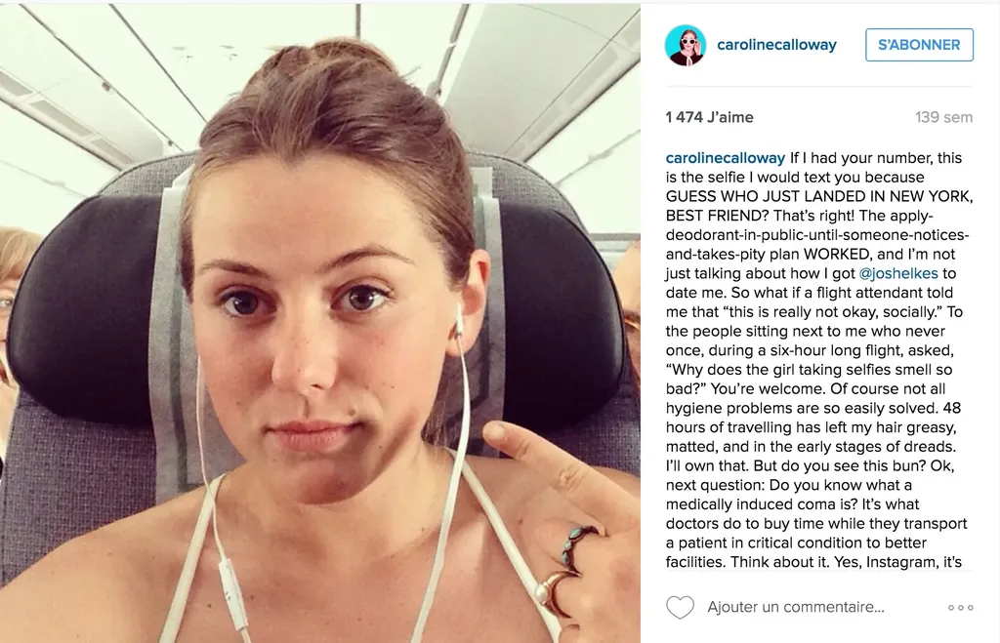
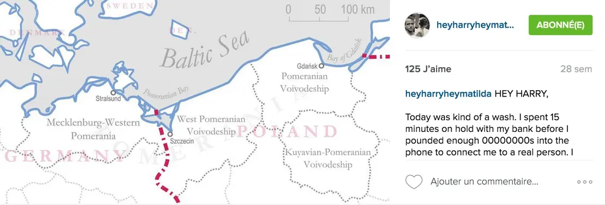
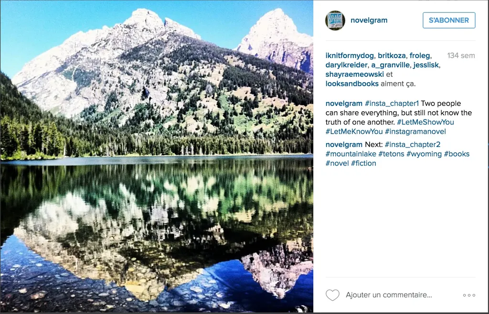
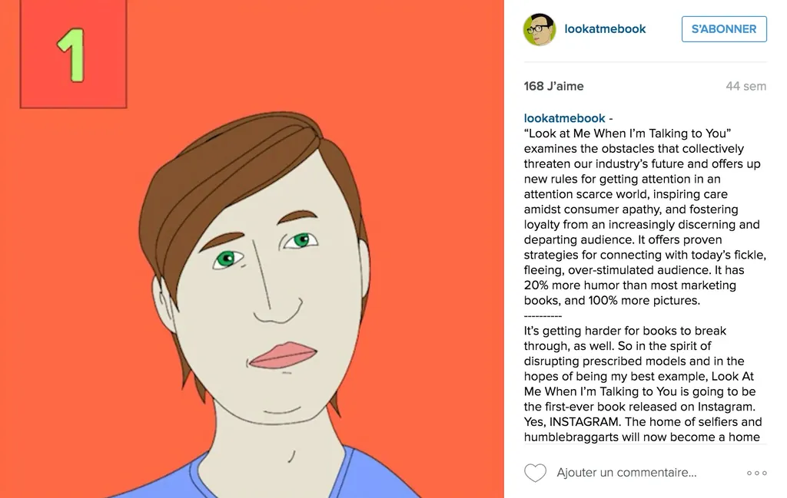

# Des livres sur Instagram

Après Twitter, la littérature gagne Instagram. J’étais passé à côté avant de décider d’écrire [*Résistants*](/resistants/) sous forme de posts publiés par une adolescente sur les réseaux sociaux et d’en déduire qu’il me faudrait une image d’appel à chaque post. Sans image, personne ne clique. C’est un triste constat, mais c’est comme ça.

Comme je publie souvent [mes photos sur Instagram](http://instagram.com/tcrouzet), j’ai logiquement pensé à des textes et images spécialement conçus pour cette plateforme. Les contraintes sont simples :

1. Le texte ne peut dépasser 2 200 caractères. Il est impossible de l’enrichir ou d’insérer des liens, à l’exception de hashtags ou des noms d’autres utilisateurs.
2. Les images ont une taille maximale de 1080 x 1080 pixels et une taille minimale de 1080 x 566 pixels. J’ai choisi cette dernière parce qu’elle se prête mieux à une mise en page livre et blog.

Ce n’est qu’après avoir posté mon [premier chapitre](https://www.instagram.com/p/BDqAY2tn-4j/) que j’ai songé à regarder ce qui se faisait sur Instagram en matière de romanesque.

J’ai tout de suite retrouvé [*Hey Harry Hey Matilda*](https://www.instagram.com/heyharryheymatilda/), lancé en grande pompe le 15 septembre 2015 par Rachel Hulin avec des articles dans tous les médias US (annonçant le premier roman sur Instagram).

Comme souvent je ne m’en tiens pas aux discours marketing. Je découvre [*Instagram a novel*](https://www.instagram.com/novelgram/) un roman publié entre le 4 septembre 2013 et le 13 novembre 2013. Une expérience de roman photo/vidéo en fait, avec peu de texte, mais un usage très intéressant des hashtags pour créer une sorte de navigation (je tenterai d’expérimenter ça).

Plus qu’un roman, [Caroline Calloway](https://www.instagram.com/carolinecalloway/) raconte sa vie sur Instagram qu’elle transforme en plateforme de blogging avec des centaines de milliers de followers. Expérience débutée en juin 2012 et qui en 2016 [devient livre](http://carolinecalloway.com/).

J’ai même découvert un auteur qui, pour attirer l’attention vers [son livre de marketing](https://www.instagram.com/lookatmebook/), l’a publié en intégralité sur Instagram, le sujet du livre étant comment promouvoir un livre.

Chacune de ces expériences s’enrichit des commentaires des lecteurs, affichés immédiatement à la suite du texte principal et qui fusionnent avec lui, au point d’être presque indifférenciables. Un dialogue initialement entre deux personnages s’ouvre soudain à tous les lecteurs. C’est une expérience de lecture interactive assez neuve, tant ailleurs les commentaires sont distinctement séparés du contenu lui-même. 

Reste que, si je poste mes courts chapitres en priorité sur [l’Instagram de Tequilla](https://www.instagram.com/tequila__fr/), la [version officielle de *Résistants* sera sur Wattpad](https://www.wattpad.com/story/61038614-r%C3%A9sistants). Je ne corrigerai le texte qu’à cet endroit, parce que c’est plus pratique, Instagram restera pour l’instant (en fait, je ne sais pas où tout cela me mènera).

#netlitterature #resistants #dialogue #y2016 #2016-4-2-13h35
