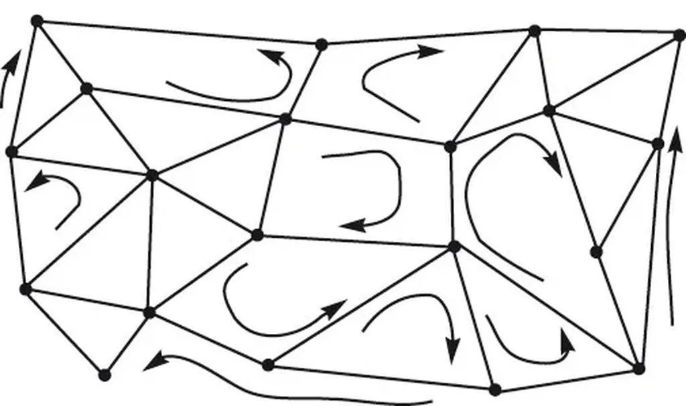
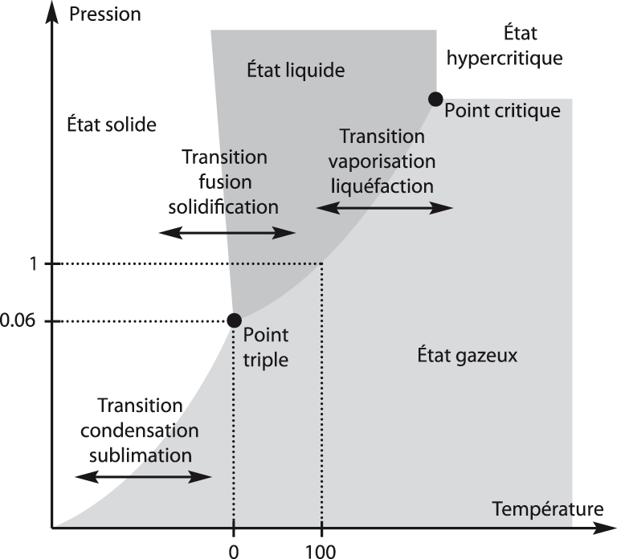
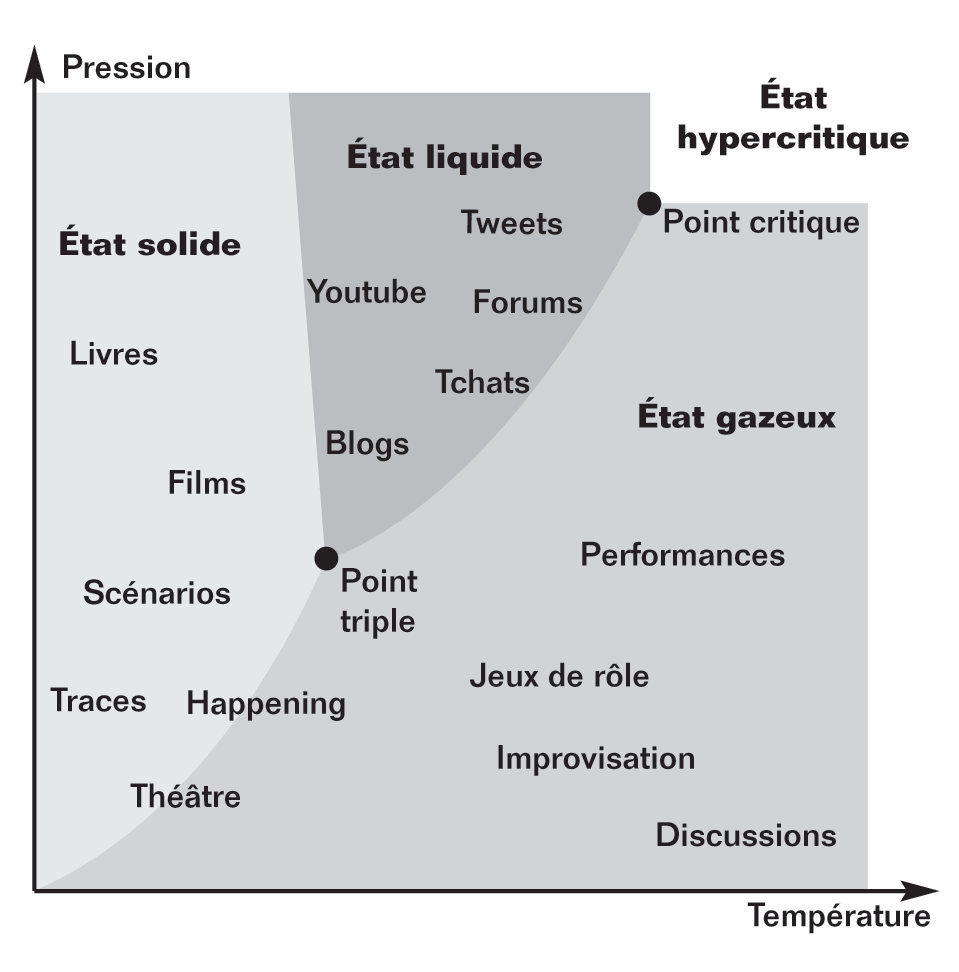
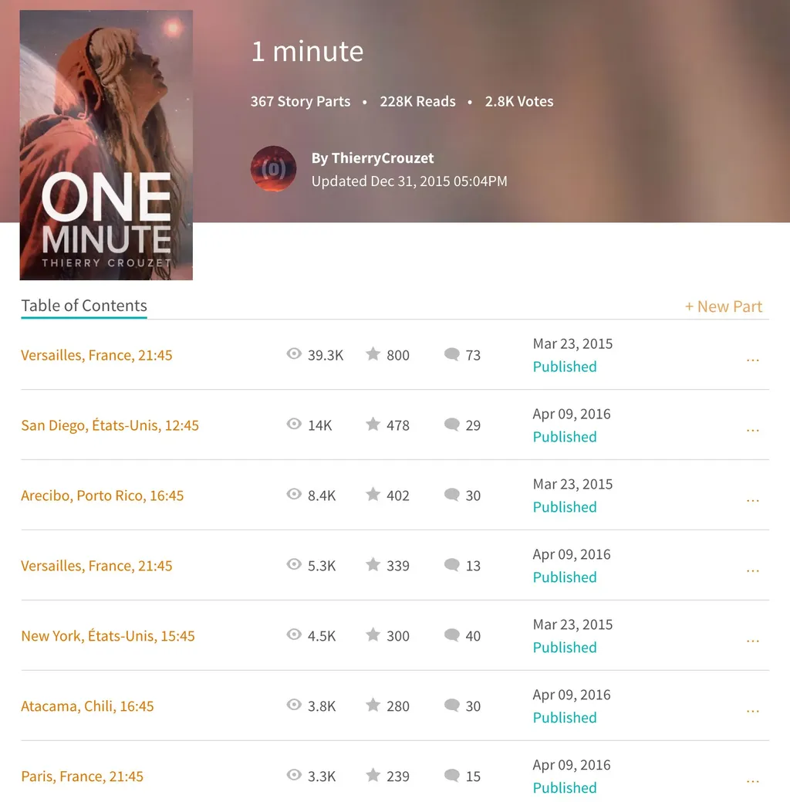
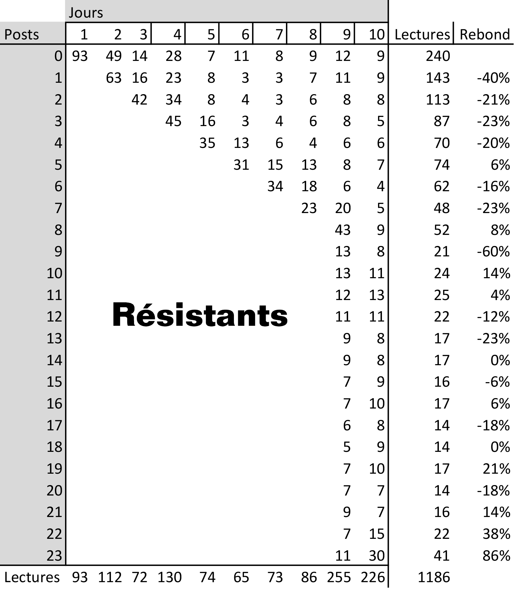

# La littérature comme happening

Quand on parle d’happening en art, on pense à un mouvement qui débute avec l’urinoir de Marcel Duchamp et se ramifie depuis avec l’art conceptuel, les installations, les performances. Trois choses me paraissent importantes dans cette aventure esthétique :
1. L’idée de l’œuvre importe plus que l’œuvre.
2. Souvent l’œuvre n’existe que le temps de sa représentation et seuls des enregistrements ou des vestiges en témoignent par la suite.
3. Le public peut parfois interagir durant la performance et participer à l’œuvre.

Je suis tombé dans ce creuset par hasard et sans conscience en 1983 quand j’ai commencé le jeu de rôle. Voici une situation de jeu typique :

> Un vieux magicien, assez secret, vous a demandé d’escorter un sarcophage géant jusqu’à une ville portuaire. Deux licornes le tractent, conduites par deux charretiers au service du magicien. Vous avez pris la route depuis trois jours et chaque nuit vous avez l’impression d’entendre des raclements en provenance du sarcophage. Le soleil vient de se coucher, vous venez d’établir votre campement à la lisière d’une forêt.

Imaginez-vous à la place des aventuriers. Que faites-vous ? Soulevez-vous le catafalque qui enveloppe le sarcophage bien que le magicien vous l’ait défendu. Tentez-vous d’ouvrir le sarcophage ? L’aventure ne se poursuivra qu’en fonction de vos réactions.

En tant que scénariste, j’ai quelques idées en tête. Si vous tentez d’ouvrir le sarcophage, les charretiers essaieront de vous en empêcher. Vous devrez sans doute les tuer (et les licornes vous chargeront pour les défendre). Si vous ne faites rien, le surlendemain une bande d’Orques vous tendra une embuscade pour s’emparer du sarcophage (et, d’ailleurs, ils vous attaqueront dans tous les cas).

Si vous ne succombez pas, vous pourrez remonter jusqu’à leur repère et découvrir qui les commandite. Peut-être en apprendre un peu plus sur ce sarcophage. Vous pourrez une nouvelle fois essayer de l’ouvrir et constater qu’il vous résiste grâce à un sortilège. Dans tous les cas, l’aventure ne fera que commencer.

J’ai imaginé un scénario avec des possibilités, des évènements, des personnages. Le tout ne deviendra une histoire que lorsque vous la jouerez. Le scénario n’est pas en lui-même une œuvre d’art, mais une sorte de marche à suivre pour la faire émerger temporairement avec la participation des joueurs. Autre exemple de scénario : acheter un urinoir dans un magasin de la société J. L. Mott Iron Works à New York, l’exposer dans une galerie et attendre les spectateurs. L’œuvre n’a vraiment existé que lorsque des gens l’ont vue pour la première fois au printemps 1917.

À la fin des années 1980, j’ai progressivement pris conscience que je participais avec le jeu de rôle à une aventure esthétique initiée par le ready made de Duchamp. J’entrevoyais une nouvelle façon d’écrire et bientôt d’imaginer la littérature. Mais j’ai finalement cessé de jouer parce que je me suis heurté à une limite, que je ressentais à l’époque comme un mur infranchissable, une limite assez floue, mais qui m’a forcé à changer de direction. 

J’ai compris depuis la nature de cette limite et toute l’ambiguïté de ma position d’alors : j’étais autant attaché à l’œuvre au sens classique qu’à l’œuvre éphémère propre à la performance. Je voulais réunir ces deux possibilités sans ne rien sacrifier à l’une des deux voies. Faute de cette analyse, je me suis banalement mis à écrire des livres, seul, dans mon coin, me contenant de les donner à lire à quelques amis et à quelques éditeurs, qui les ont longtemps refusés. Plutôt que renoncer à l’œuvre, j’ai renoncé à l’interactivité.

### Une lente redécouverte

Bien que long et douloureux, ce passage n’a pas été inutile : j’ai appris à écrire, à me construire une esthétique classiquement littéraire et ce n’est qu’en 2006, donc presque vingt ans après avoir plus ou moins renoncé au jeu que j’ai découvert une nouvelle possibilité.

En novembre 2005, j’ai lancé mon blog pour accompagner la sortie en janvier suivant du *[Peuple des connecteurs](../../page/le-peuple-des-connecteurs)*, un livre qui se voulait le manifeste d’une génération éprise d’horizontalité plutôt que de verticalité et qui voyaient venu le temps d’une révolution politique, sociale, philosophique…

J’avais ouvert ce blog d’abord pour faire la promo du livre, aussi pour répondre aux premiers lecteurs. Je n’avais pas pressenti qu’il changerait ma vie et me permettrait enfin de réunir l’œuvre et la performance.

Souvent quand je parle de l’art du blog à des amis écrivains qui n’écrivent que des livres, ils ne voient pas ce que ça change à l’écriture. Ils ont l’impression qu’ils blogueraient la même chose que dans la solitude. Il faut s’adonner au blog pour découvrir que soudain tout se transforme. La présence immédiate du lecteur comme la capacité de publier immédiatement le moindre texte bouleverse notre rapport au temps éditorial, à ce que nous pouvons dire ou ne pas dire. 

J’ai bientôt pris l’habitude de poster des billets presque tous les jours et d’échanger avec des dizaines de commentateurs et d’autres blogueurs. Soudain, je n’écrivais plus seul, mais avec les autres. Je retrouvais le plaisir du jeu de rôle. Chaque billet invitait à une aventure dans les commentaires qui engendraient à leur tour de nouveaux billets. Une œuvre se construisait dans l’interactivité sans qu’il soit besoin d’une « photographie » pour en témoigner. Plus besoin de traces, ou de se souvenir, tout restait disponible dans l’œuvre elle-même (le happening a souvent besoin de quelque chose hors de lui-même pour en témoigner : photos, vidéos, vestiges…).

Quand mon éditeur d’alors m’a demandé d’écrire un essai sur l’influence des blogs en politique, je me suis ouvert à mes lecteurs. Nous avons commencé à discuter, à chercher un titre, c’est ainsi qu’a émergé l’idée d’un *[cinquième pouvoir](../../page/le-cinquieme-pouvoir)*. Tout au long de 2006, j’ai travaillé à cet essai en symbiose avec ma communauté ainsi qu’une partie de la blogosphère, notamment le groupe des Freemen et Freewomen. C’était une période assez folle. Nous avions des espoirs insensés. Les journalistes et les hommes politiques nous prenaient au sérieux. Nous étions invités partout.

J’aurais pu devenir un spécialiste de la politique numérique. En vérité, seule la littérature m’intéressait. Sans la dimension esthétique, tout ça ne valait pas la peine, d’autant que les blogs ont vite commencé à perdre de leur influence avec l’arrivée de Facebook et Twitter, et l’émergence des médias pure-player qui ont peu à peu cannibalisé la blogosphère.

Au printemps 2007, au cours de la campagne présidentielle, j’ai dit stop. J’ai renoncé à monter à Paris pour un oui et pour un non et je me suis remis à mon *[Ératosthène](../../page/eratosthene)*, un roman qui m’occupait depuis 2000. Un an plus tard, après un travail à nouveau solitaire, et très douloureux, j’ai envoyé la énième mouture de ce roman à mon éditeur qui l’a refusé (et à juste raison, [la version finalement publiée en 2013](../../page/eratosthene) étant bien plus aboutie). De toute façon, en 2008, je n’avais pas le temps de m’apitoyer, les idées fusaient en tout sens. Avec Narvic, François Bon, Karl Dubost et d’autres, nous théorisions tout en mettant en œuvre nos théories. Je travaillais alors à ce qui est bientôt devenu *[L’Alternative nomade](../../books/alternative-nomade.md)*.

Fin 2008, j’ai attaqué l’écriture d’un thriller sur Twitter. Tout s’est mis en place dans ma tête : j’étais en train de réunir le jeu de rôle et la littérature. Mes lecteurs se glissaient entre chacune de mes phrases twittées, pour les influencer, les réorienter et écrire une histoire avec moi, et cela avec une intimité bien plus grande que sur mon blog. J’ai ainsi découvert que la fragmentation de l’écriture ouvre la possibilité pour l’interaction (et que ce désir de l’interaction explique sans doute la constante du fragment dans la littérature numérique). Si les textes sont trop longs, le lecteur ne sait où intervenir. Il faut lui ouvrir des portes. Sur Twitter, c’était entre chaque phrase. Impossible pratiquement d’ouvrir plus largement l’atelier de l’écrivain.

Quand début 2010, j’ai bouclé *[La quatrième Théorie](../../page/la-quatrieme-theorie)*, j’avais conscience d’avoir vécu une expérience extraordinaire, une espèce de soirée de jeu de rôle prolongée sur dix-huit mois, un véritable satori. Le livre lui-même qui en découle, un vulgaire thriller publié en 2013 chez Fayard, n’est que la trace de ce que nous avons vécu. Il n’est pas l’œuvre qui elle n’a existé que le temps de l’écriture. J’avais rejoint le happening, sans encore réussir tout à fait à produire une œuvre digne de ce nom (si on exclut le blog, que je considère comme mon œuvre principale, mais qui aujourd’hui encore n’a pas de statut esthétique reconnu par la critique).

J’ai résumé cette expérience dans *[La stratégie du cyborg](../../page/la-strategie-du-cyborg)*, un petit essai publié initialement en italien. Un cyborg est un humain augmenté par la technologie. J’avais l’impression, et j’ai toujours cette impression, que les technologies sociales peuvent nous augmenter. Quand nous ouvrons l’écriture aux lecteurs, nous étendons notre cerveau aux leurs, et l’auteur forme un être étendu. La socialisation est la drogue d’aujourd’hui et nous l’expérimentons en art comme d’autres avant nous ont expérimenté des drogues aujourd’hui dépassées en ce sens qu’elles ont déjà contribué à l’histoire de l’art.

### Pourquoi c’est possible…

Dans *[L’alternative nomade](../../books/alternative-nomade.md)*, je démontre que plus nous créons de liens entre nous, plus nous nous libérons (parce qu’en augmentant la complexité nous rendons de plus en plus difficiles le contrôle et la coercition).

> Si L=Liberté et l=nombre de liens, alors L=f(l)

Nous complexifions en créant un flux d’informations de plus en plus dense et actif (nous devenons des propulseurs, [Marcello Vitali Rosati](http://vitalirosati.com/) dirait des éditorialistes).

Si ce flux a toujours existé, son débit en bits/s est aujourd’hui sans commune mesure avec celui des époques antérieures (le débit augmente exponentiellement). Cette prouesse est liée aux progrès techniques, mais pas seulement.

Songeons à l’eau dans un tuyau. Si elle est glacée, il faut la briser en petits cristaux et la pousser. Idem si elle est à l’état vapeur : il faut la compresser, la contraindre. En revanche, il suffit de la moindre pente pour qu’à l’état liquide elle s’écoule. Nous obtenons alors le débit maximal avec un coût énergétique minimal. Dans *[L’alternative nomade](../../books/alternative-nomade.md)*, j’ai émis l’hypothèse que l’information approcherait de l’état qui maximisait son débit dans le flux.

Cet idéal n’est accessible que grâce à la plasticité procurée par l’état liquide, plasticité elle-même liée à une densité intermédiaire entre celle trop lâche du gaz et celle trop serrée du solide. Un liquide se transforme, se contorsionne, sans pour autant que ses liens internes se désintègrent.

Dans le flux d’informations, les bits remplacent les molécules d’eau dans la rivière. En physique, la température, donnée macroscopique, mesure l’agitation microscopique des atomes. La pression n’est autre qu’une force extérieure appliquée à une structure, avec pour effet de rapprocher ou d’éloigner les atomes. Température et pression liées par la célèbre formule :

> PV=nRt

Quand nous parlons, les liaisons entre les informations circulant de bouche à oreille s’effilochent très vite dans le temps (la pression est faible). Les mots traversent nos esprits et ne s’y fixent qu’imparfaitement. Nous sommes dans une situation comparable à l’état gazeux. En revanche, quand nous écrivons, les liaisons sont fixes (la pression est forte). Nous nous retrouvons avec un état solide de l’information. Dans le flux, les liaisons sont innombrables, mais plastiques, souples, provisoires, nous aurions donc l’équivalent d’un état liquide.

McLuhan nous a habitués à parler de la température de l’information : un scoop est une information chaude, une biographie une information froide. On pourrait définir la température comme la mobilité des bits. Plus le flux est animé, plus la température informationnelle est grande. Un texte gravé dans le marbre est moins mobile qu’un tweet.

Nous nous retrouvons donc avec une pression informationnelle proportionnelle à la quantité de liens et une température informationnelle proportionnelle au débit dans le flux, ou tout au moins dans une région du flux. Ainsi à quantité de liens équivalente, un livre papier est moins mobile qu’un livre électronique, et une information purement papier aurait une température plus faible qu’une autre numérique et disponible en open source sur le Net. On peut donc supposer l’existence d’une loi du type :

> PV=f(t) avec P=f(l), V (quantité d’information exprimée en bit) et t=f(débit)

On est bien sûr dans un jeu intellectuel, mais sans doute pas dénué de fondements physiques (il faudrait développer la modélisation mathématique). En tout cas, si une telle loi existe, elle implique un diagramme des phases.

Quand on regarde le diagramme des phases de l’eau, on y trouve des frontières ainsi que des points remarquables. On peut le transposer à l’information et s’amuser à y disposer des objets connus comme livres, scénarios, discussions, performances… Se dessine une frontière entre état solide et gazeux qui s’apparente à la barrière à laquelle je me suis heurté avec le jeu de rôle et où devrait se situer le happening comme œuvre d’art : léguer à la postérité une œuvre solide, bien que née dans l’interaction et la performance.

À ce titre, le blog, bien qu’originaire du flux, peut aspirer à la frontière entre l’état liquide et l’état solide. Il peut même avec la multiplication des commentaires glisser progressivement vers le point triple, avec la tentation d’une nouvelle forme d’art total. Mais attention, l’interaction n’est pas automatique. Se tenir à la frontière entre trois états de l’information est un jeu d’équilibriste dangereux. (Je laisse la zone hypercritique à l’avenir.)

### Data Driven Creation

Jusqu’en 2015, à l’exception du blog lui-même, toutes mes expériences autour de l’écriture interactive ont fini par ressembler à l’urinoir de Duchamp, à une trace solidifiée de quelque chose de gazeux, voire de liquide, une trace qu’on ne peut pas appeler œuvre, et qui ne devient œuvre qu’associée à son histoire.

J’ai peut-être franchi une étape avec *[One Minute](../../page/une-minute)*. Ce roman se compose de 365 fragments qui racontent tous la même minute selon au moins autant de points de vue. Je l’ai publié au jour le jour tout au long de 2015, recueillant beaucoup de commentaires qui ont influencé la narration et l’ont transformée en performance sans que je considère le texte résultant comme une simple trace de ce que nous avons vécu. Je me vante bien sûr, mais j’ai la sensation d’avoir réussi à me poser exactement à la frontière entre solide et liquide, un endroit peut-être pas très éloigné du point triple, à la conjonction du durable et de l’éphémère.

Trop content de ma réussite, encore non reconnue par un éditeur, j’ai décidé de renouveler l’expérience avec *[Résistants](../../page/resistants)*, un roman de commande qui doit vulgariser la problématique de la résistance croissante des bactéries aux antibiotiques.

Je ne conçois pas d’écrire ce texte sans ma dose de drogue sociale. Je n’ai même pas le choix. J’ai l’exigence de faire grand public, sinon je passe à côté de l’objectif principal : vulgariser, sensibiliser, éveiller les consciences… Je dois donc me livrer en direct aux lecteurs avec à nouveau cet espoir insensé qu’ils m’aident à me dépasser.

L’exigence de popularité est un peu folle, vu que personne ne lit la plupart des livres. Mais j’ai la chance avec mon blog, Wattpad, les réseaux sociaux, de disposer de plateformes pour évaluer l’efficacité de ce que j’écris.

Après quelques tests live en janvier et février 2016, qui ont reçu un bon accueil, j’ai commencé le premier avril à publier quotidiennement, sur Wattpad et ailleurs, des textes du format de *One Minute*, mais chronologique. Je ne me suis pas éloigné totalement de l’expérimentation formelle puisque chacun de mes chapitres est [un post publié sur Instagram](https://www.instagram.com/tequila__fr/), avec toutes les contraintes propres à cette plateforme (j’ai publié non seulement sur Instagram, mais mon héroïne aussi).

Tout paraît clair, sauf qu’au bout d’une semaine il ne s’est rien passé. J’ai publié dans le vide, sans fidéliser plus d’une quarantaine de lecteurs sur Wattpad, surtout sans déclencher la moindre interaction constructive, avec en prime une évidente diminution du lectorat de post en post. Si j’avais continué sur cette lancée, le fiasco était assuré. Les chiffres parlent.

D’habitude, je ne m’intéresse pas aux statistiques quand j’écris.

1. Mes [*Carnets de route*](../../2015/9/carnet-de-route-aout-2015.md) et mes [*Vagabondages*](../../2014/11/le-je-lappareil-photo-et-limprimante/1.md) suffisent à mon bonheur. Je les partage en ligne avec une centaine de lecteurs et pour rien au monde je ne renoncerais à cet exercice. Dans ces textes, je n’interagis pas avec les lecteurs, mais avec la totalité du monde.
2. De même pour mes billets de blog. Ils jaillissent de coups de sang, de rencontres, d’interactions. C’est une écriture coup de poing, rapide, directe, qui après coagulation peut donner des essais. C’est une écriture spontanée. J’expulse ces textes pour ne pas qu’ils m’étouffent. Paradoxalement, ils sont souvent plus lus que mes autres textes. Mais c’est sans importance. Je dois avant tout me libérer de leur poids.
3. Mes textes romanesques, toujours expérimentaux d’une certaine façon. Pour *One Minute*, je n’avais pas l’espoir de séduire les foules. Pour *Résistants*, c’est une forme de contrainte, sans garantie de réussite, mais qui en elle même est expérimentation pour moi qui ne suis pas un auteur populaire, et j’ai donc une exigence de résultat, d’où mon regard attentif aux chiffres.

Je vise désormais le point triple, ce qui implique l’interaction. Et quand un roman vise aussi le grand public, l’interaction doit se doubler de l’audience. En vérité, ces deux données sont liées : plus il y a de lecteurs, plus il y a d’interactions.

Avec *Réistants*, j’ai voulu répéter le scénario de *One Minute* : le feuilleton quotidien alternant des chapitres très courts. Ça ne marche pas parce qu’il n’existe pas de recette miracle. Il me reste trois possibilités :

1. Recommencer selon une nouvelle approche narrative plus susceptible de déclencher l’interactivité (ce que je vais faire).
2. Renoncer à la fiction pour aller vers le récit comme je l’ai fait avec *[Le geste qui sauve](../../page/le-geste-qui-sauve)* (où alors j’interagis avec les gens que j’interviewe).
3. Renoncer tout court, ce qui n’est pas dans mon caractère.

Tout ça pour dire que la littérature comme happening est dangereuse. Elle peut procurer un bonheur d’écriture incomparable ou, au contraire, nous détruire. L’analogie avec les drogues est une nouvelle fois patente. Quand on marche à la frontière entre deux ou trois états de l’information, on a toutes les chances de se casser la gueule.

*PS : Texte écrit en préparation de ma conférence lors du colloque [ECRiDiL 2016](https://ecridil.hypotheses.org/).*

#netlitterature #dialogue #y2016 #2016-4-12-14h57
