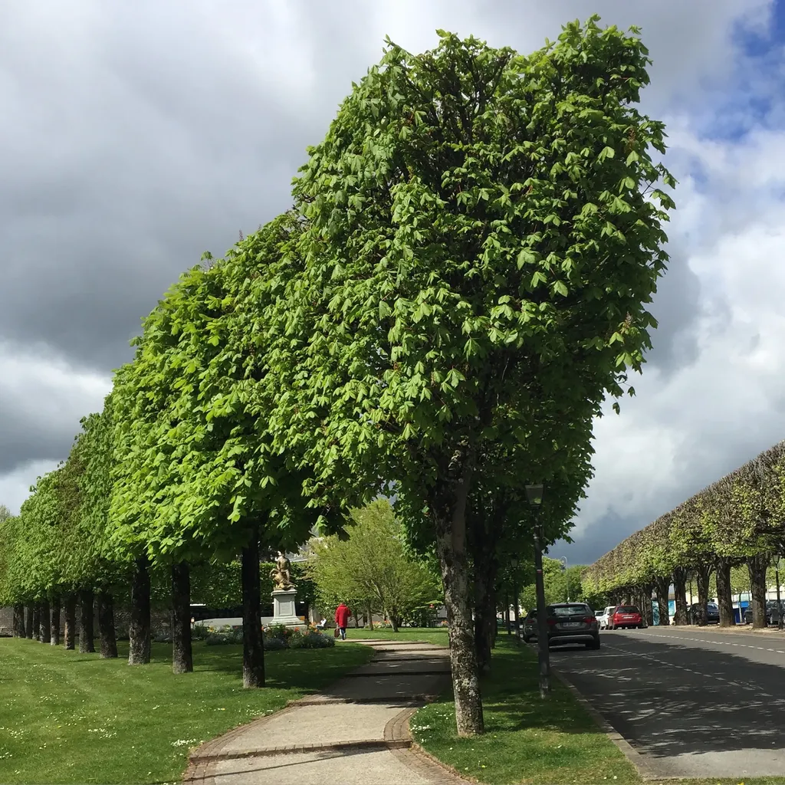
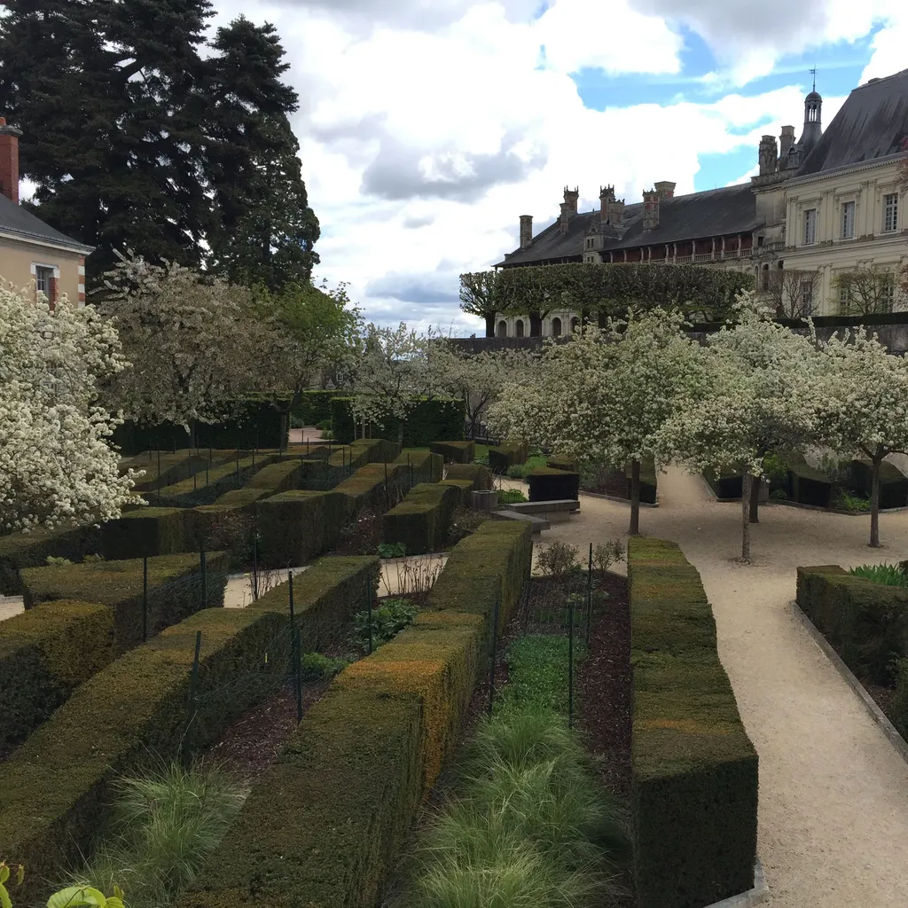
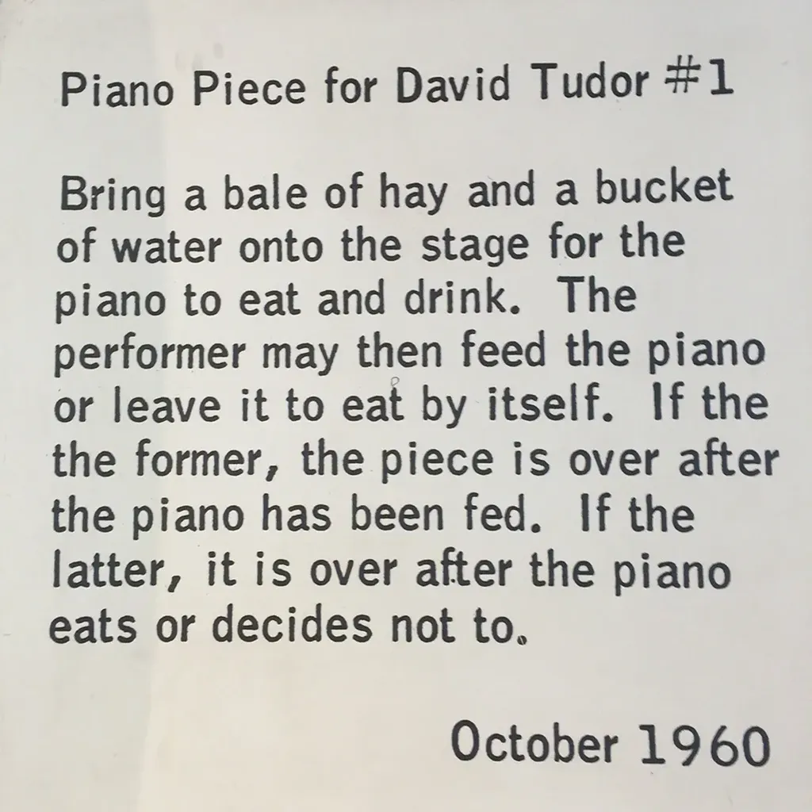
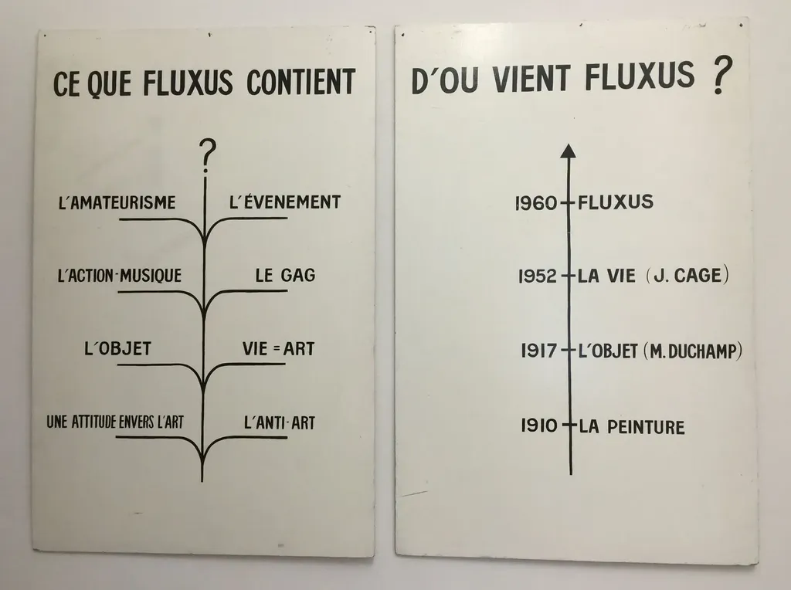

# L’auteur qui maximise sa liberté

Blois est un grand jardin fleuri avec des alignements d’arbres qui ouvrent des perspectives sur des empilements de toits chargés de cheminées baroques, de chiens couchés, de mansardes où j’aimerais dormir et me réchauffer, parce que le soleil en cette fin avril est encore incertain, la brise glaciale et mon autonomie d’artisan en extérieur plutôt limitée. Alors j’avale les fleurs, les verts, les chants des oiseaux, je stocke tout ça pour quand je serai au chaud.

Des pensées parasites me traversent comme toujours dans ces moments de rêverie. Elles font écho à des mots aigres reçus sur le Net où plus je dis ce que je pense, plus les gens se sentent attaqués dans les châteaux de cartes qu’ils se construisent, et que j’aime détruire, cela depuis que je suis enfant, parce que recommencer est toujours préférable pour moi à me tenir immobile.

Certains croient que j’hésite en tant qu’auteur, que je refuse de choisir l’indépendance. Ils ne comprennent pas que je ne cherche qu’à maximiser ma liberté de créer. Pourquoi au nom d’une idéologie, dont demain je me débarrasserais peut-être au profit d’une autre mieux pensée, devrais-je faire des choix qui limiteraient ma liberté d’expression et d’interaction ?

Je suis intransigeant quant à certaines positions d’ordre politique, mais pas regardant sur mon dérisoire statut juridique d’auteur, un statut de privilégié, quoi qu’on dise. Regardez. Je suis invité à Blois, je suis même payé pour être ici, et je n’ai rien d’autre à faire qu’à ouvrir mes yeux et me laisser traverser par des sensations sublimes. Dois-je me plaindre ?

La plupart des auteurs contestataires ne le sont que par manque de possibilités. Quand l’édition se ferme à eux, ils la conspuent, mais sans raconter toute l’histoire qui expliquerait leur position, et qui ne vaut que pour eux. Je n’aime pas les mouvements politiques ou syndicalistes, je suis trop libre pour me joindre à une clique.

Hier soir, j’étais à Paris place de la République avec les #NuitDebout, et avant la bastonnade ordonnée par le gouvernement. Je n’ai éprouvé aucun plaisir à être parmi cette foule amassée devant un mégaphone, donc devant une seule voix alors que toutes doivent se faire entendre en même temps, quitte à ce que ce soit la cacophonie. J’aime le Net parce que nous y crions tous à la fois.

De gros nuages chargés de pluie fondent vers moi. Le bout de mes doigts et mon nez picotent, je me remets en route jusqu’au prochain escalier, à la prochaine envolée de béton prise entre la verdure frémissante et tendre de ce printemps encore fantasmé par ces latitudes du bord de Loire.

---

Blois, ville presque parfaite, avec ses multiples niveaux, ses ruelles, ses perspectives volées sur la Loire, avec au loin, à l’est, les deux cheminées menaçantes d’une centrale nucléaire. Aussi une surabondance de jeunes en vadrouille, abandonnés à eux-mêmes par quelques lycées ou déversés d’autobus d’excursion garés non loin du château royal. Par leur nombre, ils faussent la typologie sociale et me plongent dans une ambiance touristique, au factice renforcé par les enseignes « Pub » à chaque coin de rue. J’ai l’impression d’être dans un Londres de pacotille, d’autant que je croise un groupe d’Anglais éméchés. Demain, un match de rugby ? Plus loin, c’est alignement des Kebabs, une généralisation de la malbouffe à laquelle je succomberai si je ne trouve rien de plus appétissant.

Je suis perché au sommet des escaliers Denis Papin, sur les bancs disposés au sommet de cette enfilade magique. Une fille dit à sa copine : « Nous voilà au sommet du monde. » Elles se demandent quelles photos publier sur Instagram, soucieuses de leur image.

Trop penser à ce que les autres pensent de nous est nocif, surtout pour un écrivain. J’ai aussi cette faiblesse. Même si je le plus souvent je ne me censure pas, j’y mets encore trop de forme, je ne dis pas tout, je montre presque trop d’empathie pour mes cibles qui néanmoins se sentent blessées et me détestent, peut-être parce que je ne les ai pas achevées du premier coup.

La liberté ne se résume pas à ignorer les autres, mais à multiplier les occasions d’être avec eux, et cela qu’ils soient morts ou vivants ou même encore non nés. Mes devanciers m’ont offert cet escalier en belvédère sur une longue avenue, un chef-d’œuvre d’architecture, un raccourci pour les piétons, où les amoureux se serrent et s’embrassent.

Des images me reviennent. Je me souviens d’une sieste sous un des grands cèdres du château de Chaumont. J’étais déjà venu à Blois, en 1994. Je ne me souviens que de cette avenue déroulée sous moi parce que je m’y suis disputé avec ma compagne d’alors. Une grande explosion, première secousse d’une rupture inévitable.

Au fond, je n’ai pas changé. Je suis toujours prompt aux embrasements, et je n’aime l’écriture qu’ainsi, en giclées incontrôlées, abandonnées, quitte à les reprendre, mais pas trop, pour ne pas affaiblir leur irruption impropre à la belle littérature mâchouillée d’innombrables repentis.

Je pratique une écriture sismique en phase avec la vitesse du Net. L’objet livre est une façon de poser au-dessus de tout cela un couvercle pour garder au chaud, avec le risque que l’augmentation de pression réveille l’ébullition, mais à contretemps, de manière potentiellement néfaste, parce qu’alors j’ai toujours la tentation d’améliorer ce qui n’est plus de l’ordre de l’instant.

Cet art du vite n’est possible qu’après un long entraînement, qu’après avoir cessé de penser pour que les mots se déroulent d’eux-mêmes, pour que par instants extraordinaires ils découvrent des connexions lumineuses (plus que le ciel de Blois qui après un instant de soleil tiède revire au gris grumeleux).

---

Sur les hauteurs, du côté de la cathédrale et des jardins, les rues somnolent en ce milieu de journée. Des silhouettes marchent au loin et disparaissent à l’embrasure des portes, de rares voitures filent ou se rangent, jamais avec précipitation, toujours avec application. Il suffirait qu’elles disparaissent pour que je plonge dans un autre siècle.

J’aime ces rues vides, en courbes qui cachent leur destination, ces brusques descentes avec des rampes métalliques polies par les mains d’innombrables vieillards. Un peu plus tôt, j’ai suivi un couple âgé, l’homme et la femme accrochés à une rampe semblable, et je me suis vu les imiter dans un avenir pas si lointain, sans en éprouver de crainte, mais avec la certitude qu’il faudra tout de même se risquer sur ces dénivelés quelles que soient les douleurs, toujours regarder le monde, le vivre comme à l’instant, parce que rien d’autre n’a d’importance que ce flux avec lequel nous communions, et qui quand nous le délaissons nous fait oublier que nous vivons.

Sur un banc, une fille, un garçon, à l’opposé de mes deux vieux, les cheveux soyeux de vitalité, leurs corps souples et qui ne songent qu’à l’amour. Je ne sais plus où regarder. Ça s’aime, ça se cherche, ça se tourne autour. Nous ne sommes qu’une espèce d’oiseaux ordinaire. C’est assez déprimant, surtout quand cette farandole est un peu lointaine dans la vie et que d’autres vertiges nous attirent.

Blois est un théâtre. Je pourrais y passer quelques jours sans trop m’y attarder, de peur de me perdre dans les décors et de ne jamais plus m’en échapper. Je finis mon escapade justement dans un décor, celui de la Fondation Ben, tout à l’honneur de Fluxux, un mouvement dont je me revendique sans grande hésitation quand je pratique l’écriture interactive. Un lieu où je m’échoue après avoir rencontré un de mes lecteurs qui m’a géolocalisé par mes photos et mes messages sociaux et avec qui j’ai bu un verre, avec qui j’ai partagé des rêves et des craintes.

#liberte #vagabondage #y2016 #2016-4-30-8h51
