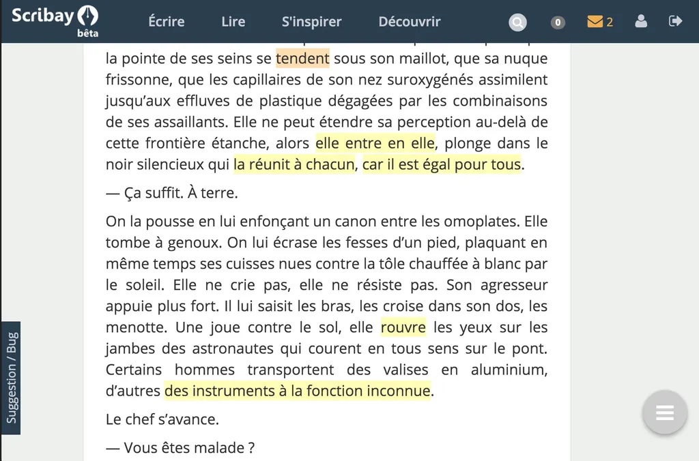

# L’interactivité, c’est pas automatique

J’ai vécu hier une journée un peu folle sur [Scribay](https://www.scribay.com). Des dizaines de lecteurs ont annoté mon énième premier épisode de *[Résistants](../../page/resistants)*, chacun me trouvant une phrase de travers. Au début, j’ai joué le jeu, modifiant, republiant, ajoutant des fautes bien sûr tant j’allais vite. Le soir, j’étais épuisé, j’avais réécrit dix fois mon texte, sans l’avoir amélioré en rien, au contraire.

Quand j’écris un livre, je marche en avant, je ne m’arrête pas sur les détails. Les détails, je les règle au fil des relectures répétées sur de longs mois. Et puis chaque imperfection relève les particularités d’un auteur. Un correcteur n’a pas à faire intervenir ses goûts dans les corrections, pas plus que de chercher une idéale perfection de la langue (je vise l’idéale imperfection).

J’ai vu des textes passer entre les mains de plusieurs correcteurs professionnels, chacun revenant sans le savoir sur les corrections des autres. Ce jeu infini n’a aucun sens, surtout au cours du processus créatif. 

Si je continue ainsi sur [Scribay](https://www.scribay.com), je n’écrirai tout simplement pas, j’en crèverais. Les critiques sont si nombreuses, si divergentes, que je n’en retire aucune motivation, aucune inspiration, aucune ébriété, aucune direction. Et c’est pourtant ce que je recherche dans l’écriture interactive, le shoot d’adrénaline, et non qu’une multitude de correcteurs me tombe sur le coin de la tête alors que je n’ai pas écrit plus de dix pages d’un texte qui en comportera des centaines. Je me fiche bien à ce stade d’avoir quelques phrases bancales avec quelques fautes d’orthographe.

Hier, j’ai été stérilisé, écœuré par mon métier. Plutôt que me shooter à l’interactivité, je me suis tapé un very bad trip terminé par le premier épisode de la saison 6 de *Games of Thrones*.

Comme les antibiotiques, l’interactivité n’est pas automatique. Dans l’écriture, elle a besoin de conditions favorables. J’ai vécu l’extase durant cinq expériences fort différentes :

1. Quand j’écrivais *[Le cinquième pouvoir](../../page/le-cinquieme-pouvoir)*, je discutais sur le blog de mes idées, je publiais des articles pour les esquisser, mais je construisais le texte dans mon coin. Mes premiers lecteurs interagissaient avec moi sans avoir accès au texte, sans avoir la moindre possibilité de le critiquer, ils ne pouvaient que discuter les idées, les questionner, les enrichir. C’est une très bonne méthode pour un essai.
2. Avec *[La quatrième théorie](../../page/la-quatrieme-theorie)*, tout était donné à lire sur Twitter phrase après phrase, mais en quelque sorte le texte d’ensemble n’était pas entre moi et les lecteurs. De fait, ils ne pouvaient pas en critiquer les détails, mais seulement en influencer le devenir, notamment au niveau de l’intrigue et des personnages. C’était génial à vivre.
3. La structure même de *[One Minute](../../page/une-minute)* a incité à l’interactivité. Une fois le cadre narratif posé, et cela dès la première minute, les lecteurs ont suggéré des idées de minutes. Les corrections de détails sont restées de détail parce que nous étions tous portés vers les minutes suivantes.
4. Pour *[Le geste qui sauve](../../page/resistants)*, j’ai interagi avec la communauté médicale et avec quelques lecteurs proches et bienveillants. C’est une forme plus classique, mais très efficace, je ne dois pas l’oublier pour la suite de *Résistants*, même si son côté non numérique me frustre.
5. Le blog a longtemps été un lieu magique d’interactivité. Là, plus qu’ailleurs, j’ai écrit sous l’effet du shoot social. C’est moins le cas aujourd’hui, mais tout de même encore en partie. Je focalise ici toutes mes interactions et j’en fais le témoin de mes expériences, qui souvent impliquent l’interaction.

À côté de ces expériences merveilleuses, j’ai connu deux moments douloureux, et finalement très semblables. Pour le *[Le monde de i](../../page/le-monde-de-i)*, j’avais créé une communauté fermée sur un blog dédié, avec la possibilité d’annoter chaque paragraphe, un peu à la façon de Scribay. Résultat : trop de pinaillages, pas assez de vue d’ensemble. J’étais tiré vers le bas plutôt que pousser en avant. J’ai surtout était si dégoûté que j’ai finalement jeté l’éponge, au bord de la déprime. Je n’ai jamais terminé ce texte. Et je revis exactement la même chose avec *Résistants*.

Je n’accuse pas les lecteurs, mais la forme même du texte. Trop long dans ma tête pour pouvoir être offert en pâture avant d’avoir pris consistance par une multitude d’aller-retour. Si j’avais donné à la critique les premières lignes d’*[Ératosthène](../../page/eratosthene)*, *[Ératosthène](../../page/eratosthene)* n’existerait pas.

C’est en soi alarmant. À un certain moment, l’interactivité m’immobilise, elle me fait faire du surplace, plutôt que d’étendre mon cerveau, elle le limite. Pour ma santé, je dois en tirer les conséquences. Faire la seule chose possible, arrêter. Me réfugier en moi pour pondre le texte qui viendra du plus profond de moi, de mes interactions avec les médecins, avec mes amis, avec vous sur le blog et les réseaux sociaux, mais sans que le texte soit entre nous.

 Je tire de mes expériences trois règles.

1. Ne pas placer le texte entre soi et les lecteurs/commentateurs, mais derrière, pour aller de l’avant en s’appuyant dessus (c’est la règle fondamentale).
2. Ne s’exposer à l’interactivité que quand on a tout donné sur ce texte placé derrière.
3. Si un texte est long, non fragmentaire, il faut d’abord aller au bout, et donc l’interactivité ne sera pas créatrice, mais éditrice.
4. La possibilité de pinailler tue l’interactivité. Il ne faut autoriser que les commentaires d’ensemble.

Voilà, je me remets au boulot, je reprends tout depuis le début, j’en reviens à mes intentions premières, notamment le récit à la première personne. Vous pouvez continuer de m’envoyer des liens sur les antibiotiques et les bactéries, je ne lâche pas l’affaire, mais il temps désormais pour moi d’avancer, car ce livre doit être bouclé pour la fin de l’année, et je commence à ne plus être trop en avance.

Merci en tout cas à ceux qui ont joué le jeu. Nous apprenons tous ensemble. Interagissons désormais sans que le texte soit entre nous. Interagissons comme si nous étions des amis et parlions de notre travail. Ce que je continuerai à faire le plus souvent possible. Mais le fruit de ce travail, vous le découvrirez dans quelques mois, peut-être même en primeur sur Scribay quand il sera temps de l’éditer, et avant même qu’il passe entre les mains d’un relecteur professionnel.

[caption id="attachment\_43931" align="alignnone" width="600"] Trop de commentaires tue le commentaire.[/caption]

#netlitterature #dialogue #y2016 #2016-4-26-14h29
