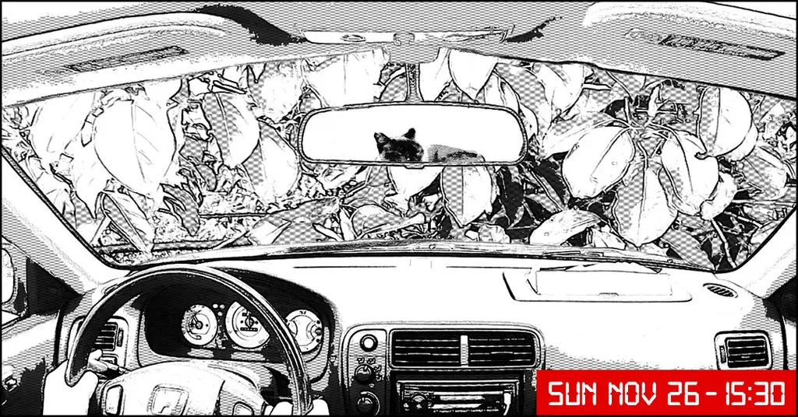

# Post|3

You don’t believe me, do you? Here’s the surreal chat I just had with my best friend on InLine: 

Alexa: This guy coming to rescue you in the woods, what’s he like?

Tequila: I swear to you I’m not kidding.

Alexa: Tell me all. Blond hair or brown? No, that would be too simple. A red-head, I’m guessing! Very pale, looks like a vampire. I’m scared.

Tequila: Shut up!

Alexa: He’s got a smile… that makes you melt down immediately. Your body quivers. It’s a matter of pheromones. You were just made to meet one another. In the forest or in an elevator, it was just inevitable.

Tequila: If I hadn’t done my nails last night, I’d be biting them.

Alexa: Now I’m starting to take you seriously.

Tequila: My mom’s message, the SUV, that counts for something, doesn’t it? 

Alexa: You’re repeating yourself.

Tequila: My mom isn’t crazy.

Alexa: I wasn’t accusing her.

Tequila: Just suppose for two seconds it’s all true. What would you do, if you were me?

I’m still waiting for the reply. Alexa must be thinking of her next put-down. I can call the police, except it may be the police following me. I can stay here all night with my teeth chattering and being scared to death. I can also go on, hoping I only dreamed that someone was tailing me. I text my mom, but she doesn’t answer.

Mystic leaves her perch on rear shelf to rub up against me. She scrapes the corner of her lips against my hand. I push her away. I’m not in the mood for a cuddle. She sits on her hind, in her sphinx position. She looks at me loftily, then leaps on top of the dashboard and swipes the windshield with her paw, making the same hissing sound as when you clean a window pane thoroughly. She wants out. I crack my window to let some air in. I don’t hear a thing. Maybe the highway in the distance. Mystic keeps up her act.

No, you’re not getting out.

She moves closer to the glass, pricking her ears. Sometimes, she reminds me of a hunting dog.

Alexa: I’ve thought about it.

Tequila: And?

Alexa: Better run.

#instaresistants #y2016 #2016-4-6-16h9
