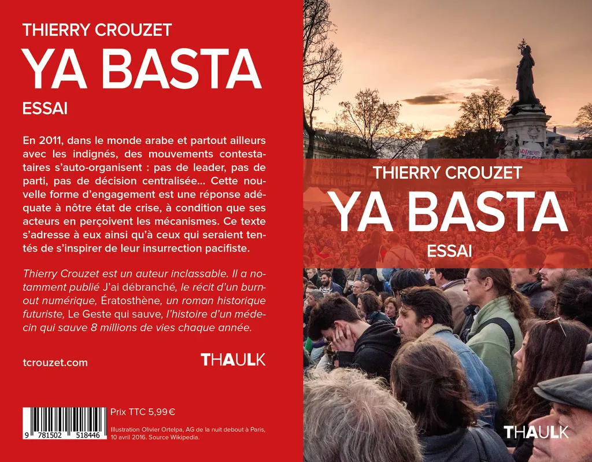

# Ya Basta, édition #NuitDebout

En 2011, à la suite du printemps arabe, les indignés Espagnols criaient « Ya Basta », c’était un cri contre l’ancien monde des autocrates et un appel à des alliances non partisanes et surtout populaires. Plus question de défiler dans les rues pour simplement clamer son désaccord contre telle ou telle mesure instituée par les autocrates, il était temps de nous réunir pour penser l’avenir et le construire sans tarder, selon notre perspective et non la leur, inféodée à la finance et la croissance insoutenable. La place publique est devenue notre point de ralliement, notre forum, notre bibliothèque, notre cantine, notre base, sans que l’importance de ce choix soit mesurée par les forces politiques traditionnelles.

En 2016, quand en France le mouvement renaît sous le nom #NuitDebout, la compréhension n’est toujours pas là. J’ai entendu à la radio le préfet de Paris lancer un appel aux organisateurs du mouvement. Comment lui dire que son appel n’a aucun sens ? Nous sommes tous les organisateurs de notre vie. Voilà ce qui a changé de façon désormais irréversible, voilà pourquoi nous devons nous rassembler et discuter, et non simplement défiler derrière des slogans prémâchés par des idéologues.

À la télévision, Bruno Lemaire, ancien ministre et annoncé candidat à la présidentielle 2017, lance aux #NuitDebout « Plutôt que palabrer la nuit rejoignez les partis. » La fracture politique se creuse entre ceux qui pensent partis ou syndicats, organisés du haut vers le bas suivant une logique pyramidale et ceux qui pensent coopération et transversalité. Les premiers croient encore aux vertus du « Tous pour un », le « un » étant Sarkozy, Hollande, Le Pen… ; les seconds croient au « Tous pour tous », chacun avec ses compétences, ses envies, ses passions. Nous ne voulons plus amener quelqu’un au pouvoir, pour qu’il nous impose sa volonté et nous trahisse tôt ou tard. Nous avons fini de rêver au sauveur et commençons à rêver à notre propre destin.

Vous voulez en savoir plus, lisez *[Ya Basta](../../page/ya-basta)*. Je distribue ce texte sous licence CC0. Vous pouvez le télécharger librement en [epub](https://app.box.com/s/qxmgy1wnl9y3rbxjzrdmunqur2jflzic) ou [PDF](https://app.box.com/s/e28njz1lhp7gx4e2k3jqaw2b5tluom1z), ou même [l’acheter](../../page/ya-basta) et l’envoyer direcment sur votre liseuse.

#politique #dialogue #y2016 #2016-4-22-14h31
