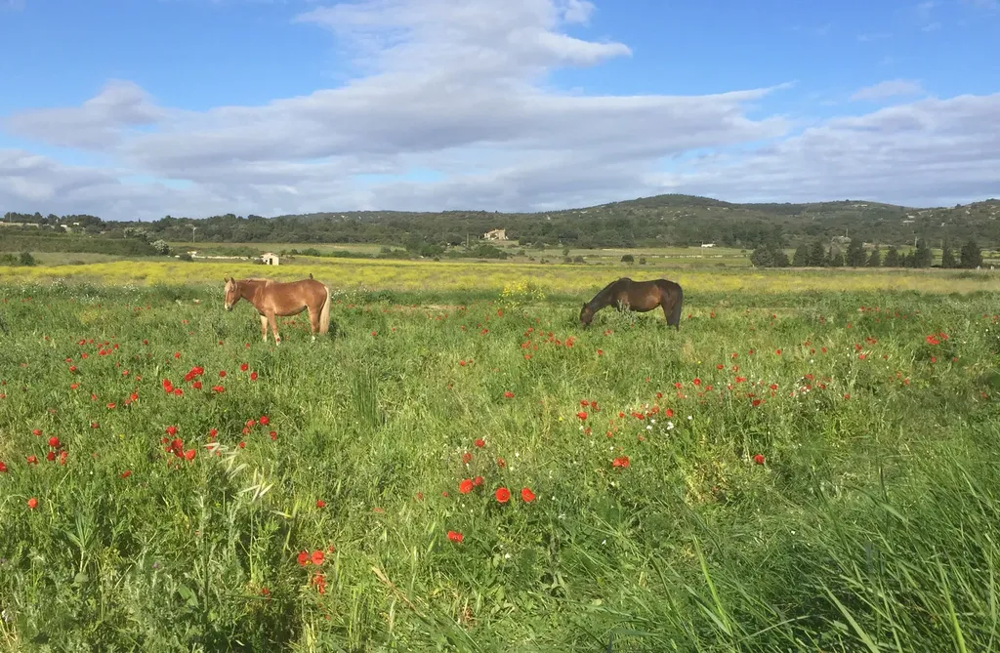
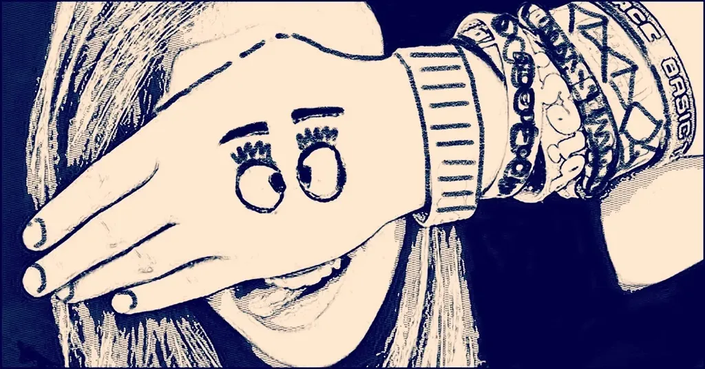
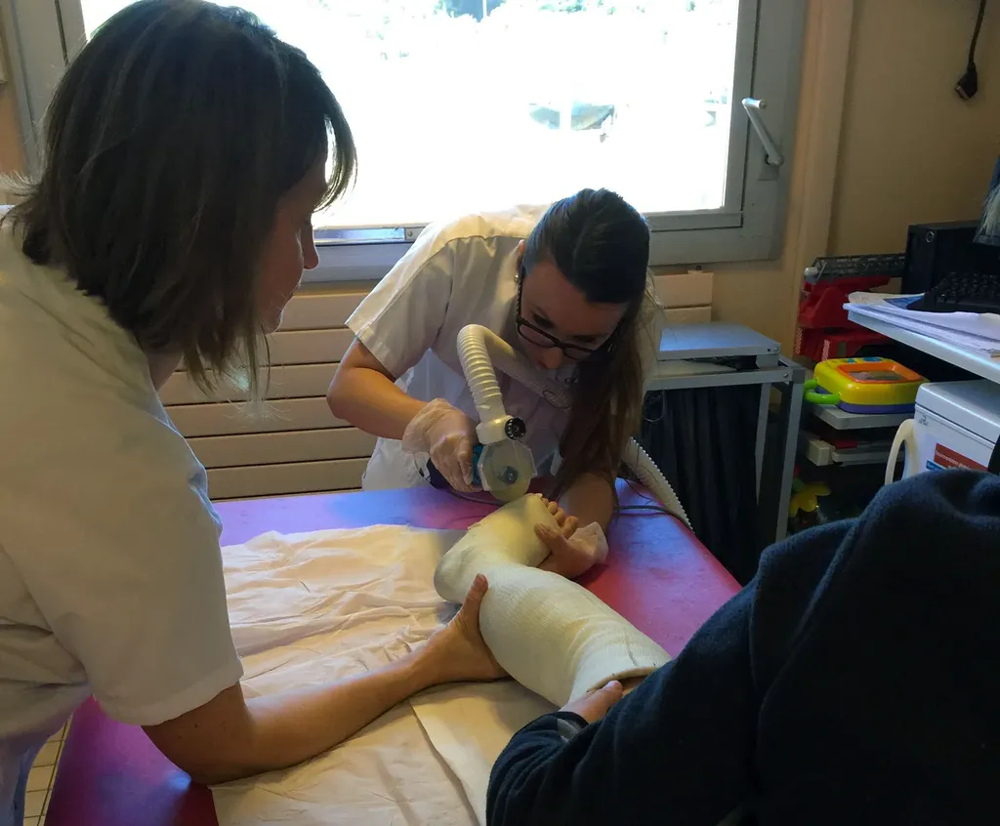
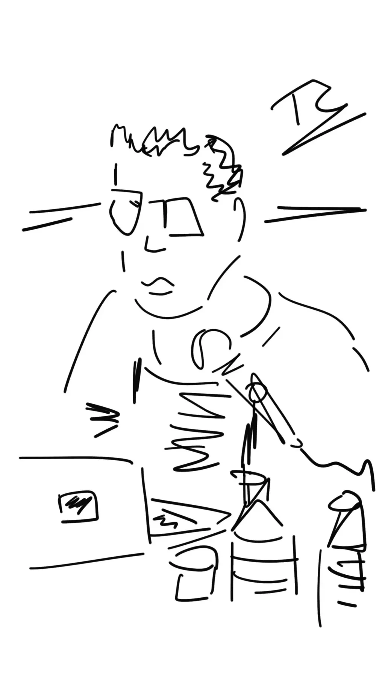
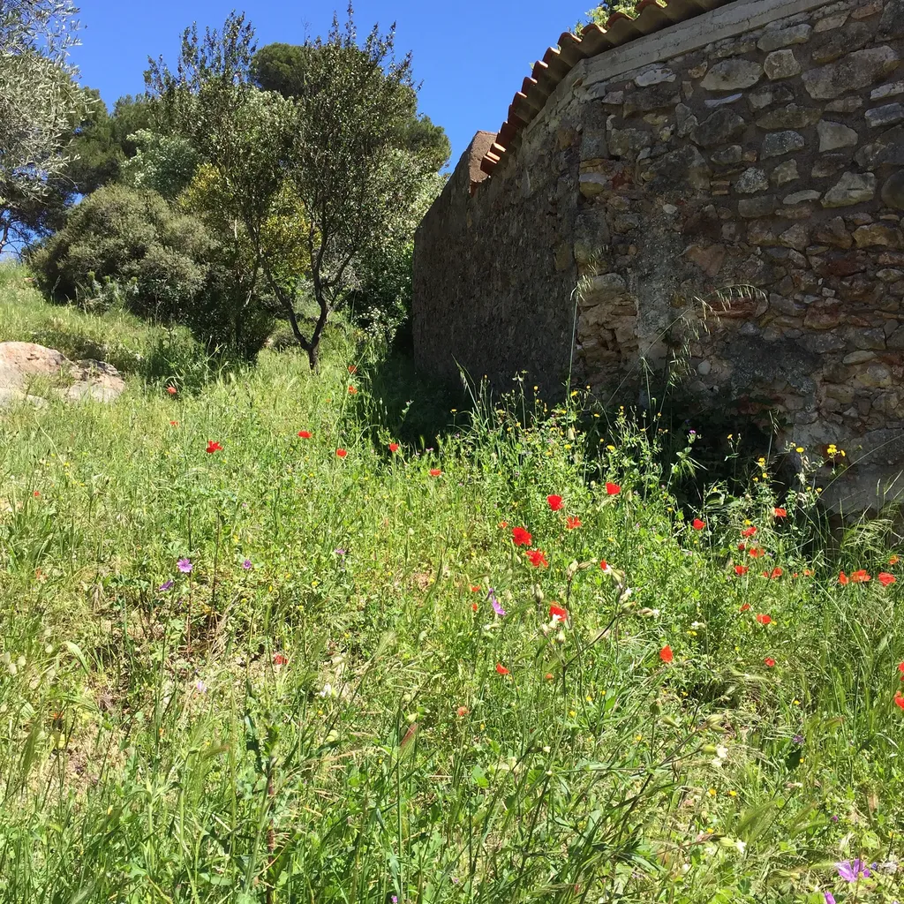
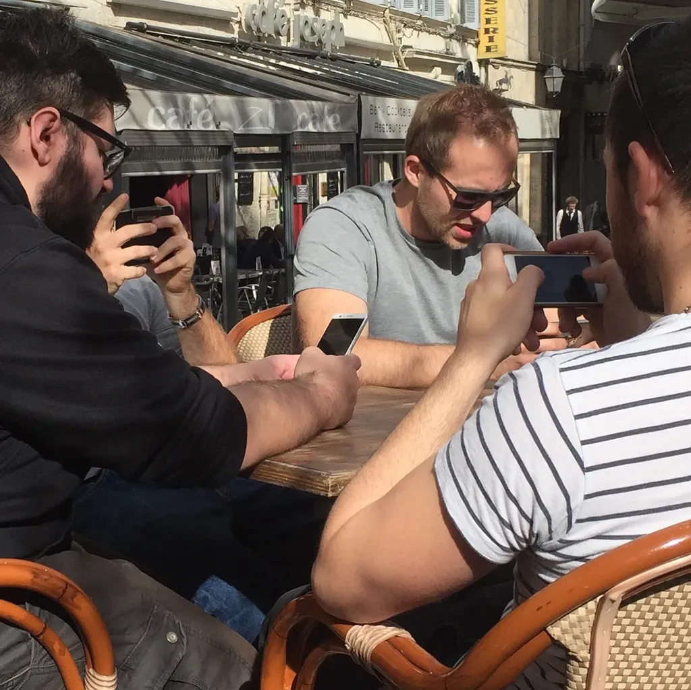
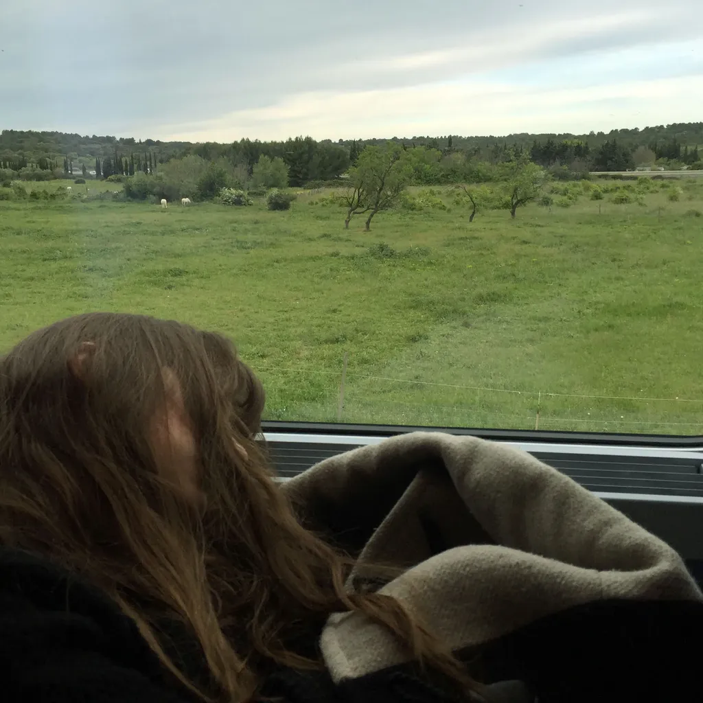
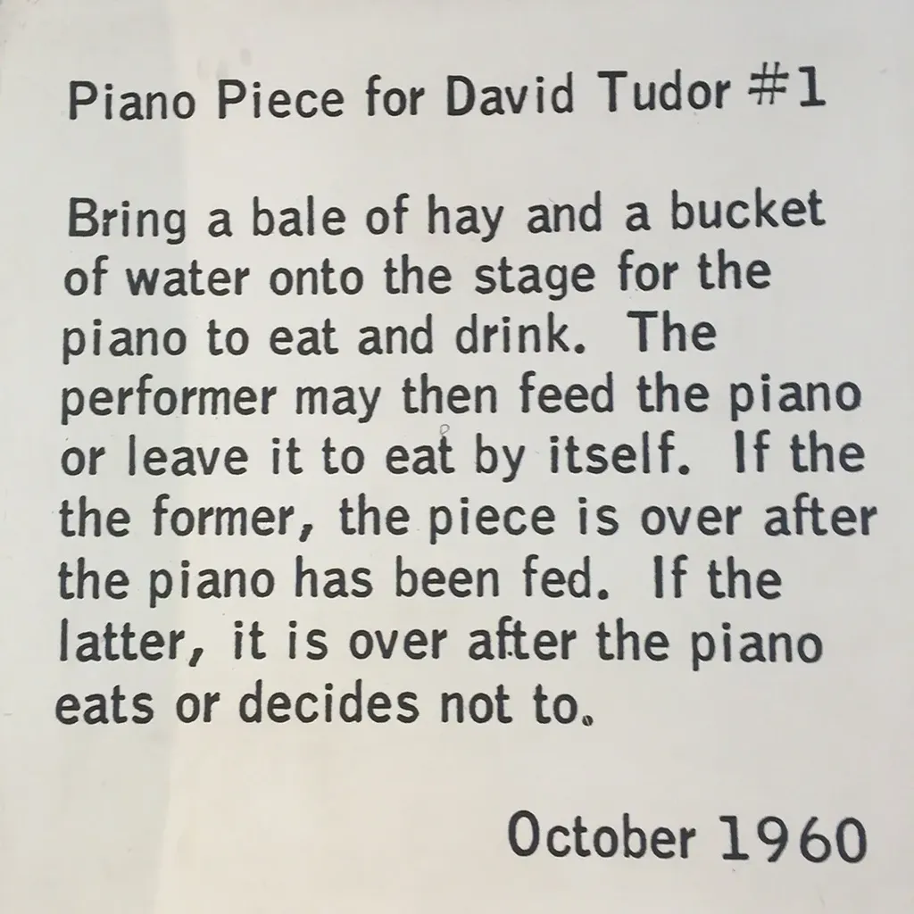

# Avril 2016

### Vendredi 1er, Balaruc

Je m’amuse à dessiner sur l’écran de mon iPad avec un stylet. Je retrouve un vieux plaisir jouissif et je sens le moment où enfin il devient possible pour moi de tenir un carnet numérique sans pour autant renoncer aux dessins et autres gribouillages.

### Vendredi 8, Balaruc

C’est un peu la déprime. Je lance *[Résistants](../../page/resistants)* et ça ne réagit pas, surtout sur Wattpad où il s’était passé quelque chose avec *[One Minute](../../page/une-minute)*. Je me demande ce qui foire, si c’est mon écriture, l’angle narratif, la difficulté croissante de capter l’attention des lecteurs… Envie de tout arrêter, mais je me suis engagé, il faut que j’avance d’une façon ou d’une autre, quitte à tout recommencer.

Le romanesque sous forme de posts est une façon d’échantillonner la narration. De la pousser dans la discontinuité typiquement numérique, et peut-être que les lecteurs de romanesque tentent de fuir ce rythme et de revenir à celui de la prose classique. Il en va ainsi de tous les livres à succès du moment. Pourquoi suis-je surpris de la réaction des lecteurs quand je ne leur propose pas ce qu’ils attentent ?

Cette question trouble mes nuits depuis une dizaine de jours. Il me faut patienter, faire autre chose, voilà pourquoi je viens ici abandonner quelques pensées pas très agréables, mais elles sont le quotidien de la plupart des auteurs.

Les médecins ont libéré le genou d’Émile aujourd’hui. Sa joie était magnifique. Je savoure à l’avance son plaisir quand il sera totalement débarrassé du plâtre (« De la résine », précise-t-il systématiquement avec expertise).

Je ne publie qu’aujourd’hui mon carnet de mars. Je retrouve la photo de la paréidolies évoquée à Genève. Impossible de repérer la silhouette d’un homme dans le carrelage. Puis soudain, alors que l’image est affichée sur mon écran depuis une dizaine de minutes, je vois surgir une sorte d’évêque à cheval. Une vision mystique à la Saint Suaire.

### Dimanche 10, Balaruc

*Résistants* me provoque des douleurs intercostales. Je ne peux pas continuer une expérience qui me rend malheureux. Je vais l’arrêter sous sa forme actuelle pour la recommencer une nouvelle fois. La nécessité du grand public me paralyse et me défie.

### Mardi 12, Nîmes

Pour gagner de l’argent, les auteurs font des choses étranges, comme des performances où ils se prennent pour des acteurs, lisant à voix haute, des textes qu’aucun lecteur peut-être ne mènerait à bout s’il les découvrait dans son canapé plutôt qu’attaché à un siège qu’il ne peut quitter sans déranger l’audience faussement attentive et qui rêve d’autre chose.

### Lundi 18, Balaruc

Je tente une nouvelle version de *Résistants*, ça commence à me fatiguer cette histoire. L’écriture sociale peut être grisante tout autant que déprimante. Au final, je suis mon pire critique. Alors il ne me sert à rien de publier des ébauches en ligne parce que je n’en retire aucun enseignement, il ne me sert tout simplement à rien de publier en ligne. Me contenter d’envoyer des textes à des lecteurs n’a aucun intérêt. J’écris pour provoquer des échanges.

### Mardi 19, Balaruc

Ce matin les Pyrénées nous explosent à la figure. Nous photographions pour ne pas oublier cette limpidité.

Nous sommes en train de nous perdre… J’arrive avec des idées noires à Sauramps où nous devons rendre hommage à Ayerdhal. Face aux tables chargées de centaines de livres, tous aussi flamboyants les uns que les autres, je me demande pourquoi en ajouter un de plus. C’est très futile ce désir de rejoindre la multitude. Être publié n’a rien d’original, c’est d’une banalité terrifiante. Je suis plus tranquille dans mon chez-moi numérique. Par son infinité, le Net me laisse vivre au milieu du désert sans que les textes des autres ne me narguent de trop près.

### Mercredi 20, Balaruc

À quoi bon publier en numérique si c’est pour subir la pesanteur de l’ancienne chaîne du livre ? Le numérique, c’est le flux, la liquidité de l’information avec interdiction de la figer et de la sanctifier derrière un processus éditorial.

### Vendredi 22, Balaruc

### Dimanche 24, Balaruc

Écrire, réécrire, c’est mon quotidien. Partager l’atelier parfois ne me renvoie qu’une information : impossible de plaire à tout le monde. Un tel aime telle version que tel autre déteste, et c’est le contraire avec la version suivante. Je ne retire de cette expérience rien de positif, rien d’autre qu’un immobilisme de mes mots. L’interactivité fonctionnait merveilleusement avec *One Minute* parce que les lecteurs qui n’aimaient pas un épisode sautaient au suivant sans grande conséquence. Dès que les textes s’allongent, l’interactivité devient plus exigeante pour les contributeurs, elle implique un regard professionnel que les amateurs les mieux intentionnés ne peuvent offrir, et qui, plutôt que de donner leurs sentiments, cherchent à justifier l’injustifiable.

### Lundi 25, Balaruc

Quand après des années un texte ne s’est pas vendu ou ne se vend plus, pourquoi ne pas le libérer dans le domaine public ? Nous avons plus à gagner en donnant une seconde chance à nos œuvres plutôt qu’en les gardant derrière les barreaux de fer d’une prison éditoriale. En cinq ans chez publie.net, *[Ya Basta](../../page/ya-basta)* a été moins téléchargé qu’en 48 heures sur mon blog.

### Mercredi 27, Poussan

### Jeudi 28, TGV

### Vendredi 29, Blois

Je vagabonde jusqu’à la fondation Ben. Quand l’art devient concept, le musée n’a plus d’utilité : il suffit de livres pour rendre compte des scénarios. Sous mes yeux, seulement des témoignages, textuels, photographiques, sonores… J’ai l’impression de me promener à l’intérieur d’un vieux numéro de *Paris-Match*. Ce n’est pas désagréable, alors je me dis que le musée lui-même devient une œuvre.

### Samedi 30, Blois

Au milieu de la nuit, je lis *The Stand* de Stephen King et je tombe sans cesse sur « grinning », tous les personnages grimacent. Je devrais faire lire mes textes à des anglophones maladroits en français. Ils repéreraient mes tics d’écriture plus efficacement qu’un correcteur professionnel. Comme « grinning » ne m’est pas familier, sa répétition me saute à la figure de chapitre en chapitre.

---

Plus mes textes sont littéraires, moins j’ai besoin d’éditeur, parce que sur mon blog je trouve plus de lecteurs qu’ils ne pourraient m’en offrir. Et si les auteurs engagés dans la langue cherchent des éditeurs, c’est pour exister en tant qu’auteur aux yeux de l’administration et des institutions qui les nourrissent à force de résidences et autres commandes. Il n’y a de fait aucune tension vers les lecteurs, aucune exigence de dialogue, s’en suit un repli narcissique et élitiste, avec au passage mépris pour les auteurs plus grands publics, les seuls qui ont une chance d’atteindre une petite postérité, car ils se tendent au-delà du cercle de leurs amis.

#carnets #y2016 #2016-5-1-11h37
