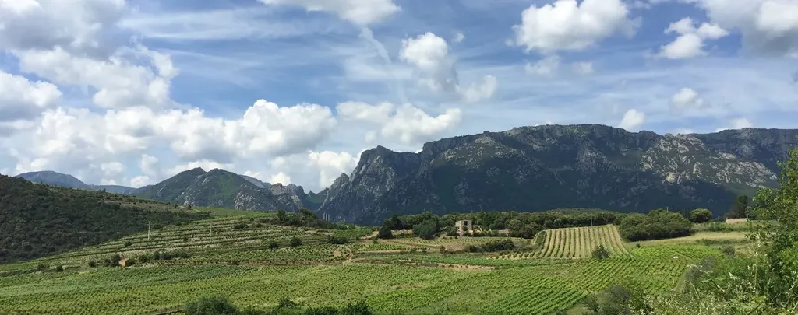
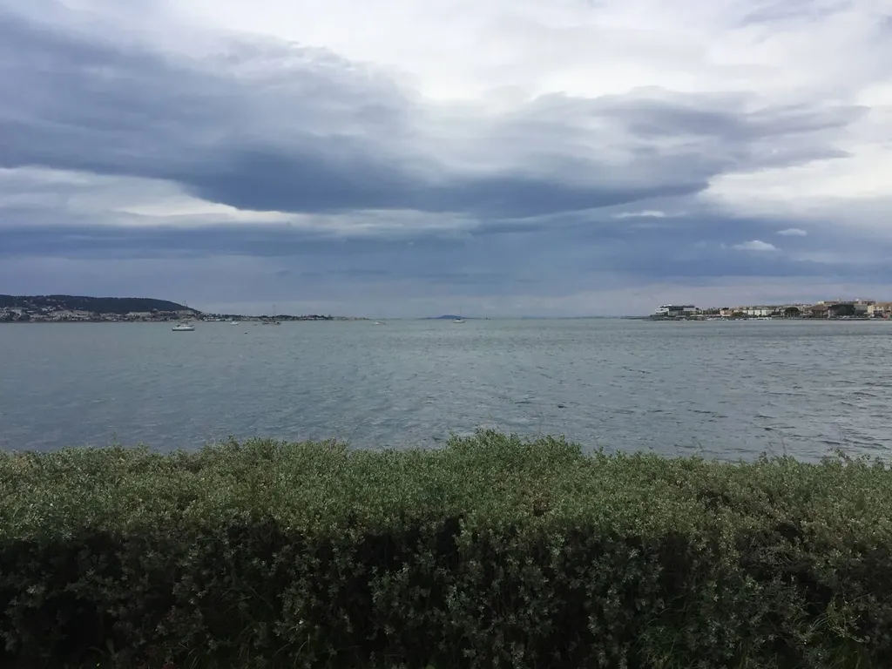
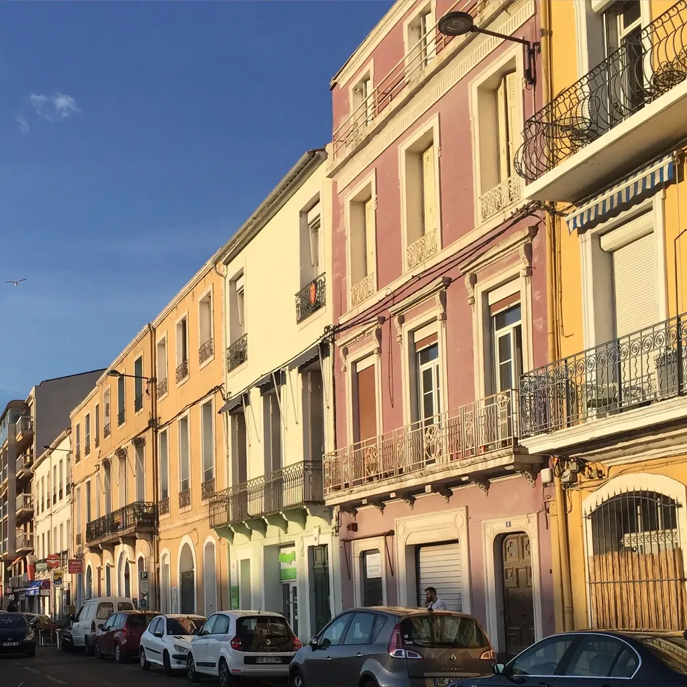
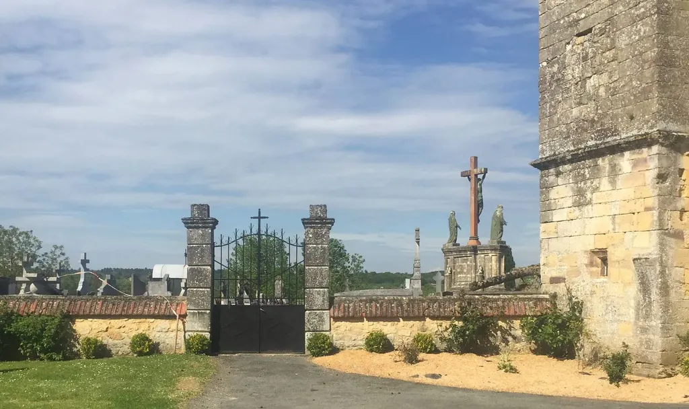
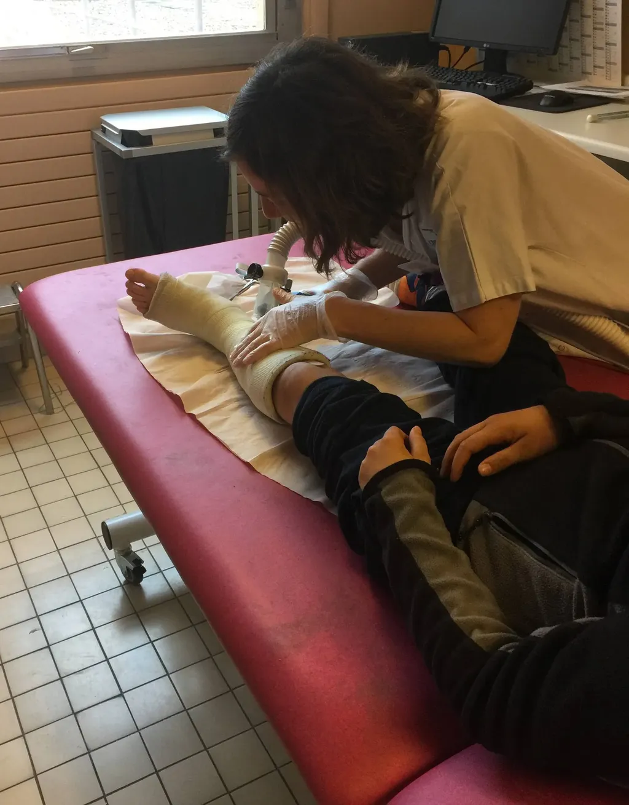
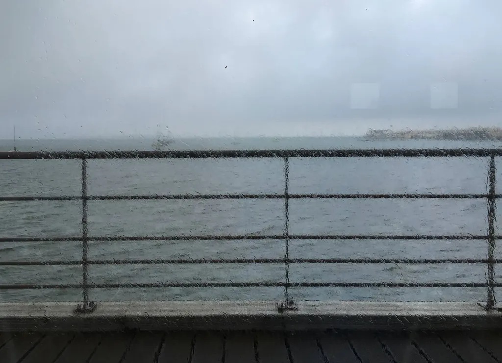
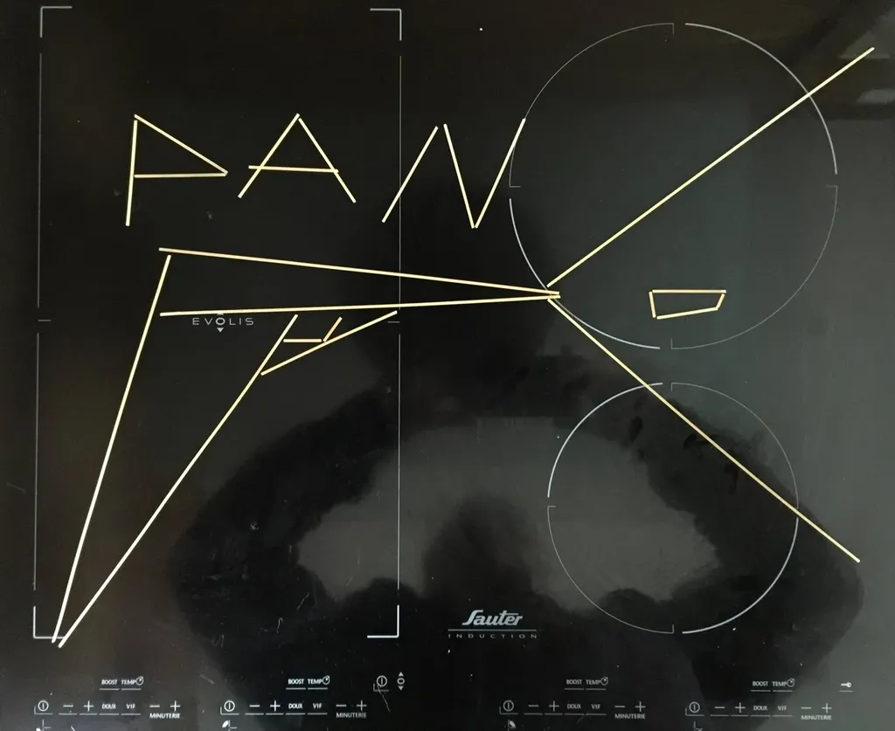
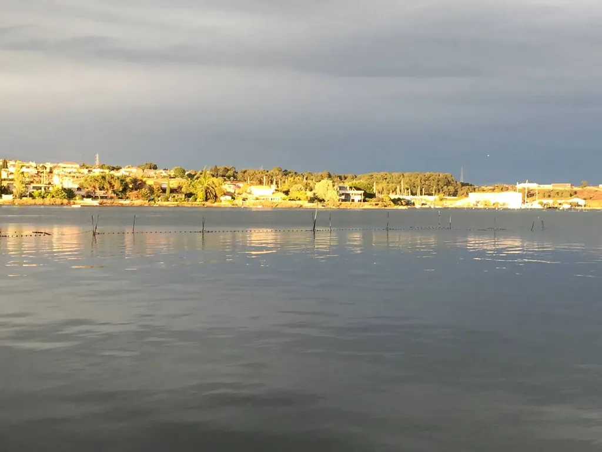

# Mai 2016

### Dimanche 1er, Balaruc

J’ai quitté Blois où il faisait froid pour rentrer dans le Midi où nous avons plus froid qu’au plus dur de l’hiver.

### Lundi 2, Balaruc

J’ai repris *[Résistants](../../page/resistants)* depuis le début avec une nouvelle histoire et un nouveau mode narratif. J’avance dans mon coin avec une grande liberté maintenant que je me suis libéré de la nécessité du feuilleton. Plutôt que me regarder écrire, j’écris, avec l’objectif de 10 000 signes/jour.

### Mardi 3, Balaruc

L’interphone sonne. Je décroche. Un homme dit qu’il voudrait deux heures de cours sur le logiciel Calibre. J’explose de rire. C’est le début de la gloire quand on te persécute jusqu’à chez toi. C’est tout de même un peu flippant ce type d’intrusion dans la sphère privée. Je demande au gars de m’envoyer un mail et lui promets de boire un verre avec lui (je n’ai jamais reçu de mail).

Nous invitons Émile au restaurant pour fêter ses neufs ans.

### Mercredi 4, Balaruc

La littérature sur le Net n’est plus une histoire de textes, mais de personnes. L’audience est si dérisoire que seulement les auteurs eux-mêmes se lisent et s’excluent les uns les autres de leur coterie pour gagner les parts d’un marché qui n’existe pas.

### Jeudi 5, Maillardou

Quand nous sommes des millions à écrire, à peine moins nombreux que les lecteurs, il ne reste pour nous que l’opportunité de créer quelques espaces textuels où inventer des osmoses créatrices.

---

Après un footing, je suis incapable d’écrire pour le restant de la journée. Courir le matin, c’est tuer ma créativité. Je suis assis en bas d’un champ sublime, avec une verdure explosive autour de moi, une brise bienvenue dans les hautes branches d’un chêne, et rien ne se passe en moi. Je n’ai que la force de contempler, et pas celle d’amplifier cette contemplation par mes mots. Jouir ne me suffit pas quand la possibilité de jouir plus existe sans que je sois capable de la mettre en œuvre.

---

Nous ne nous lisons même pas les uns les autres. Pourquoi espérons-nous avoir des lecteurs ? Ce n’est pas parce que l’écriture nous fait jouir que nous devons emmerder des lecteurs par nos mots. Je suis un adepte de l’onanisme littéraire, rien d’autre qu’un exhibitionniste. La véritable sagesse serait le repli : avoir la force non pas de me taire, mais ne pas me donner à lire.

### Lundi 9, Balaruc

La plupart des auteurs bataillent pour entretenir leur communauté de fidèles lecteurs. Dès qu’ils décèdent, leur communauté s’étiole et on les oublie. Tout leur travail n’aura servi qu’à illusionner leur ego. Je dis eux, car je suis méchant avec tout le monde. Un artiste devrait avoir pour ambition de plaire malgré lui, par-devers lui.

---

On me conseille des romans de genre. Je les lis en me disant qu’ils s’adressent à celui que j’étais avant mes vingt ans, avant que j’aie une culture esthétique. Et me voilà en devoir de faire de *Résistants* un roman de genre, entre la romance et le thriller. Personne ne m’a imposé cette sinécure. J’ai juste pour devoir de vulgariser, et donc d’être populaire. Je n’ai aucune raison de réussir, et j’éprouve le besoin d’autres sortes de phrases. Coller à une forme est une contrainte comme une autre.

---

Dans *Sapiens*, Yuval Noah Harari écrit : « Les longs intestins et les gros cerveaux dévorant chacun de l’énergie, il est difficile d’avoir les deux. En raccourcissant les intestins et en réduisant leur consommation d’énergie, la cuisine a sans le vouloir ouvert la voie aux jumbo-cerveaux des Neandertal et des Sapiens. » Je comprends mieux pourquoi je digère aussi mal.

---

Déplâtrage d’Émile, nouvelle radio où la marque de la fracture crève encore les yeux, mais la médecin nous rassure. Dans un mois, il pourra reprendre le sport.

---

Le web est peuplé d’auteurs pathétiques qui s’illusionnent les uns les autres. Dans l’ancien monde du papier, c’est la même farce, à la puissance mille, car les éditeurs, les journalistes et les libraires participent à cette imposture.

### Mardi 10, Balaruc

Être où les autres ne sont pas pour y jouir des beautés qui leur échappent. Être textuel parce que le texte n’intéresse plus personne. Être textuel parce qu’ainsi je vois mieux sans avoir besoin de me mettre quelque chose sous les yeux. J’aime photographier parce que l’appareil n’est qu’un instant entre moi et le monde. Je déteste filmer pour la raison inverse. Je peux écrire ou dessiner tout en regardant. Je ne peux pas faire autre chose que filmer, à moins de m’affubler d’une caméra qui tournerait en continu au-dessus de ma tête. Dépouiller toutes ces images impliquerait d’avoir une double vie, un double temps.

---

Je manque d’énergie ce matin, je n’arrive pas à me mettre au travail, alors je déroule mon fil social pour me retourner dégoûté de cette volonté de bruit. J’en viens à détester ce Net où nous nous exposons, où, de l’art à l’humanitaire, tout n’est que prétexte pour nourrir des ego privés de transcendance.

---

Maintenant que le numérique est devenu un enjeu est-ce encore un endroit pour faire de l’art ? Certains diront plus que jamais, pour moi il est peut-être trop tard. La plupart des artistes ne viennent sur ce territoire que parce qu’ils peuvent y exister par eux-mêmes, sans avoir à séduire un tiers de légitimation.

---

Durant le déjeuner, Isa se demande combien de personnes ont touché le yaourt qu’elle mange. Nous arrivons à la conclusion que de proche en proche presque toute l’humanité est impliquée. Alors nous avons l’idée d’un livre qui s’intitulerait *L’humanité dans un pot de yaourt* où il serait question de démontrer la complexité de notre civilisation et son ingouvernabilité selon l’approche top-down.

### Mercredi 11, Balaruc

Temps abominable pour un mois de mai, pluie, bourrasques du sud et soudain en milieu d’après-midi le vent vire à l’ouest. C’est une renverse.

### Mercredi 18, Balaruc

J’écris jusqu’à me faire exploser le crâne. Je fonce à fond de train dans *Résistants*, les épisodes de succèdent, les personnages se consolident et appellent deux-mêmes de nouveaux épisodes, où je glisse peu à peu tout ce que j’ai appris sur les antibiotiques. Cette écriture aussi est exaltante, celle de l’ivresse solitaire. Se donner à lire sur le Net se résume parfois à la peur d’être seul face à soi même.

### Dimanche 22, Balaruc

Moins je vais sur les réseaux sociaux, moins j’ai envie d’y aller. C’est un peu comme avec tous les trucs qu’on fait par habitude et sans nécessité. Il ne s’agit que de modes auxquelles on succombe et dont il faut se guérir.

---

Des auteurs aiment expliquer comment écrire, comme si nous écrivions tous comme eux. D’un livre à l’autre, je change de méthode.

---

Un auteur « littéraire » me dit : nous n’écrivons pas la même chose. Genre, « Toi tu écris des livres pour être lu, pire pour les vendre. » Être auteur, c’est savoir changer de genre, du moins oser tout essayer.

---

Première séance de vagues avec les enfants. Je ne perds pas une seconde Émile du regard. En théorie, il n’a pas encore le droit de faire du sport, sauf baignade. C’est donc limite, mais je m’éclate à le voir s’éclater. Nous rentrons sous l’orage comme souvent quand nous allons dans les vagues, puisqu’il faut un temps chargé avec vent du sud.

### Lundi 23, Balaruc

Parfois quand je commence un footing, j’ai les jambes lourdes, j’ai envie d’arrêter tout de suite. L’écriture romanesque me fait souvent le même effet.

---

De mieux en mieux. Des auteurs se chroniquent les uns les autres et prétendent qu’ils sont lus.

### Samedi 28, Balaruc

Aux commentateurs sur Wattpad, j’ai envie de dire lisez au lieu de poster des commentaires dans le seul but d’attirer de nouveaux followers.

#carnets #y2016 #2016-6-23-17h34
