# Juin 2016

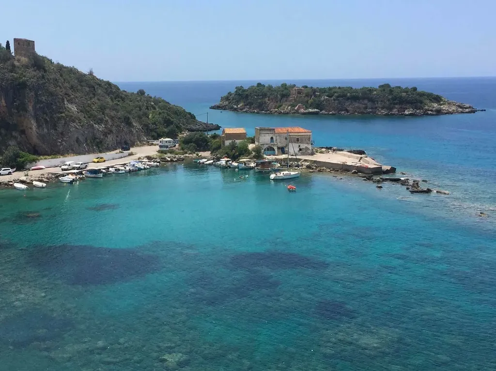

### Dimanche 6, Balaruc

Mise à l’eau du ponton, début de la saison estivale avec pas mal de retard cette année.

### Lundi 7, Balaruc

Je reçois les mails d’écrivains qui ne cessent de faire leur promotion. Ils me fatiguent à vouloir exister. Laissez ce travail à vos lecteurs (à moi de faire mienne cette règle). La VPRisation de l’auteur me fait pitié.

### Mardi 14, Balaruc

Petite prise de bec par mail au sujet de la notion de commun avec [Lionel Maurel](https://scinfolex.com/) (initée par un message où je lui disais qu’il avait écrit un très bon papier, c’est un comble). Je finis un peu tard par comprendre l’origine de notre différent. Quand Elinor Ostrom écrit « self-organization » (23 fois dans *Governing the commons*), Lionel entend autogestion. Je ne vois pas pourquoi dans ce cas Ostrom n’aurait pas utilisé en anglais « self-management ». D’autre part, c’est oublier qu’Ostrom vit la période intellectuelle où, dans tous les domaines (physique, biologie, sociologie, informatique…), la pensée de la complexité voit le jour et où on commence à comprendre comment certains systèmes complexes s’auto-organisent.

Selon moi, Ostrom emploie le mot « self-organization » dans le sens fort de son époque : un système décentralisé dont les agents respectent un jeu de règles favorisant les comportements émergeants et résilients. Elle a explicitement travaillé sur des jeux de règles et retrouvé en étudiant le management des communs une de leur propriété fondamentale : il n’existe pas de solution miracle pour favoriser l’auto-organisation et chaque système est un cas particulier. 

L’autogestion n’a guère de lien avec l’auto-organisation : des gens se rassemblent pour gérer ensemble une ressource sans recevoir de contraintes hiérarchiques extérieures. C’est une conception plus ancienne d’inspiration marxiste (l’extérieur étant souvent confondu avec le patron capitaliste). Dans autogestion, il y a gestion, ce qui implique que certains des acteurs aient explicitement des rôles de gestionnaire, rôles définis et distribués au cours des assemblées générales (l’autogestion peut être hiérarchique ou consensuelle).

Dans l’autogestion, la nécessité d’une gestion implique une forme ou une autre de centralisation qui empêche les comportements émergents (parce que la centralisation les limite). Dans un système auto-organisé, personne ne gère explicitement, la gestion se distribue entre tous les acteurs. Négliger [la différence entre auto-organisation et autogestion](#autogestion) revient à limiter les possibilités organisationnelles qui s’offrent à nous. Je croyais que cette distinction était claire depuis Edgar Maurin.

Si je n’étais pas en train de boucler le premier jet de *[Résistants](../../page/resistants)*, j’aurais écrit un billet pour éclaircir tout ça. Je ne reviens sur ces idées que parce qu’[Ostrom a déclaré que les antibiotiques étaient un commun](http://www.reactgroup.org/uploads/react/resources/100/The%20global%20need%20for%20effective%20antibiotics%E2%80%94Moving%20towards%20concerted%20action_DRU_Vol%2014_Issue%202_2011.pdf). Selon moi, il existe quatre types de communs :

1. Les communs gérés hiérarchiquement (Wikipedia par exemple, avec les strates de pouvoir des différents contributeurs, mais surtout tous les communs publics : jardin, parcs naturels, routes, bâtiments…).
2. Les communs autogérés (l’Antarctique, un jardin partagé, une bibliothèque partagée…).
3. Les communs auto-organisés (le Web à ses débuts, nombres des exemples proposés par Ostrom, notamment son exemple canonique de la nappe aquifère en Californie, qui peuvent impliquer des assemblées générales, à leur naissance par exemple, sans qu’elles soient nécessaires pour que l’auto-organisation se perpétue).
4. Les communs non encore gérés (Mars, la galaxie Andromède…).

Je me fiche que les spécialistes des communs effectuent ou non ces distinctions, je les effectue parce que nous ne choisissions pas les formes d’organisation par idéologie, mais par leurs adéquations aux structures à gérer. Opter pour une structure inadéquate conduit à la destruction rapide de la structure. Bonne chance à ceux qui veulent auto-organiser un jardin partagé (l’auto-organisation ne fonctionne qu’avec un système complexe).

---

Mon indépendance financière me permet de dire ce que je pense et beaucoup de gens se fâchent. Mon indépendance financière m’isole et me rapproche d’autres indépendants, c’est ainsi que les ghettos se forment.

### Mercredi 15, Balaruc

Je termine le premier jet de *[Résistants](../../page/resistants)*. Ça fait du bien de réussir à emboîter des concepts dans une histoire.

### Jeudi 16, Balaruc

En même temps, deux amis me demandent si je vais bien. Ils s’inquiètent parce que je ne donne aucun signe de vie sur les réseaux sociaux. C’est simple, je travaille.

### Samedi 18, Balaruc

Je m’amuse à dessiner une couverture pour *[Résistants](../../page/resistants)*, une façon de prendre de la distance avec le projet et de penser aux lecteurs.

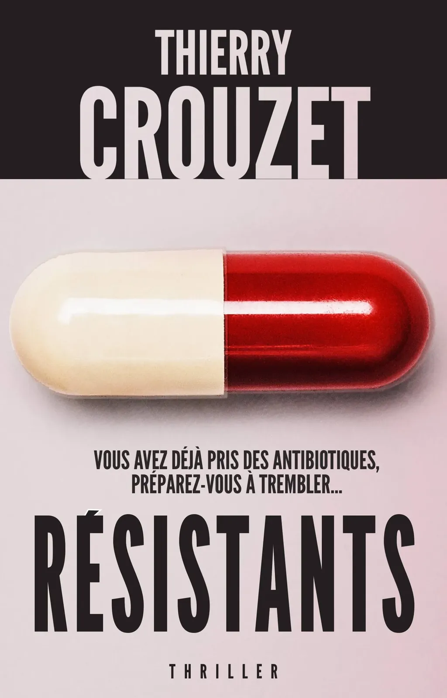

### Jeudi 23, Balaruc

Après une semaine d’uniformisation, j’envoie le premier jet de *[Résistants](../../page/resistants)* en relecture scientifique. Le début d’un long process commence. Il ne s’agit pas de raconter des blagues médicales ou de faire dire n’importe quoi aux scientifiques auxquels je fais jouer leur propre rôle.

### Vendredi 24, Balaruc

Les Britanniques ont voté pour sortir de l’Union européenne. Je me demande simplement si ce vote sera pris en compte ou si les financiers en contourneront le résultat.

### Lundi 27, Aéroport de Marseille Provence, Marignane

Nous partons en Grèce. Les enfants jouent à *Clash of Clans*, on pourrait les amener sur la lune qu’ils n’en seraient pas retournés.

Comme à chacun de mes voyages en avion, je replonge dans Proust. Mon Kindle l’ouvre dans le *Temps retrouvé*, où je l’ai laissé lors de mon dernier voyage, un passage sur la jalousie avec des cascades de "mais" et de "que" et des accumulations de phrases commençant par "Et" (à la façon d’un blogueur pressé).

Je dois paraître prétentieux de critiquer Proust. Je le trouve de plus en plus monotone et systématique. Il rajoute toujours une pensée, une nuance, à croire qu’il était incapable de synthèse et de simplicité. Plus jeune, cette façon m’a bouleversé, parce qu’elle correspond à l’écriture même et en illustre les mécanismes les plus profonds.

Proust m’a révélé un art que je pratique en ce moment, une collecte de tout ce qui passe et qui doit être enchaîné à la façon des perles sur un fil, avec l’ambition de l’exacte transcription de nos états intérieurs. J’aime cette écriture, j’ai aimé la lire chez Proust, il m’a initié au laisser-aller, je ne suis simplement pas sûr que cela intéresse les gens qui n’écrivent pas. Après Proust, cet exercice mérite-t-il d’être répété ?

### Mardi 28, Athènes

Nous ne sommes de passage qu’une demie-journée dans la capitale grecque, question de montrer l’Acropole aux enfants. Ils rechignent, ils n’ont jamais rien vu d’aussi horrible, Tim assailli par les odeurs, par la pauvreté (le malaise a commencé hier soir dès notre première promenade).

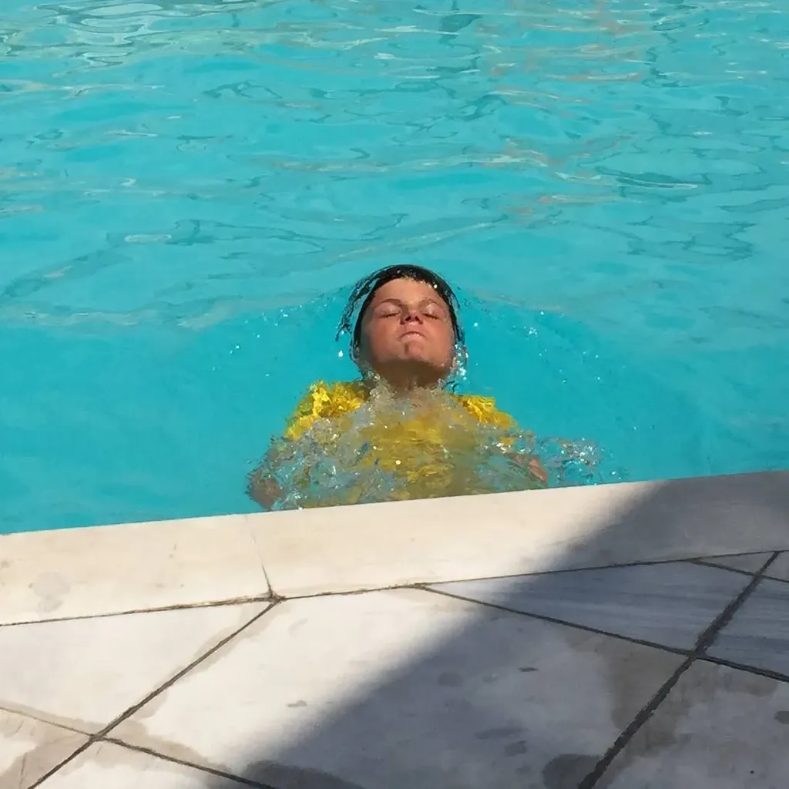

J’étais venu en automne, j’étais en mode rêverie et écriture, et je me retrouve à écrire ces quelques lignes devant la piscine de l’hôtel où les enfants ont trouvé leur Paradis. Ils sont aussi bien à la maison, en résumé.

Isa me dit que mon père n’a pas réussi à me faire aimer la chasse et la pêche, et que je ne peux pas reprocher aux enfants de ne pas s’intéresser aux vieilles pierres (et à l’informatique, et à la technique, et à mes propres passions…).

Pas simple de ne pas partager. Je comprends de mieux en mieux mon père, et la nécessité d’écrire sur lui devient de plus en plus urgente, une nécessité pour que je puisse vraiment devenir père. Isa dit que ce n’est pas par les mots que je dois m’attaquer à cette montagne, mais je ne connais aucune autre façon de faire.

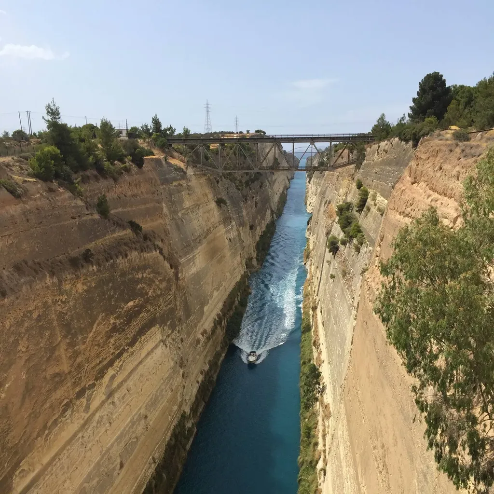

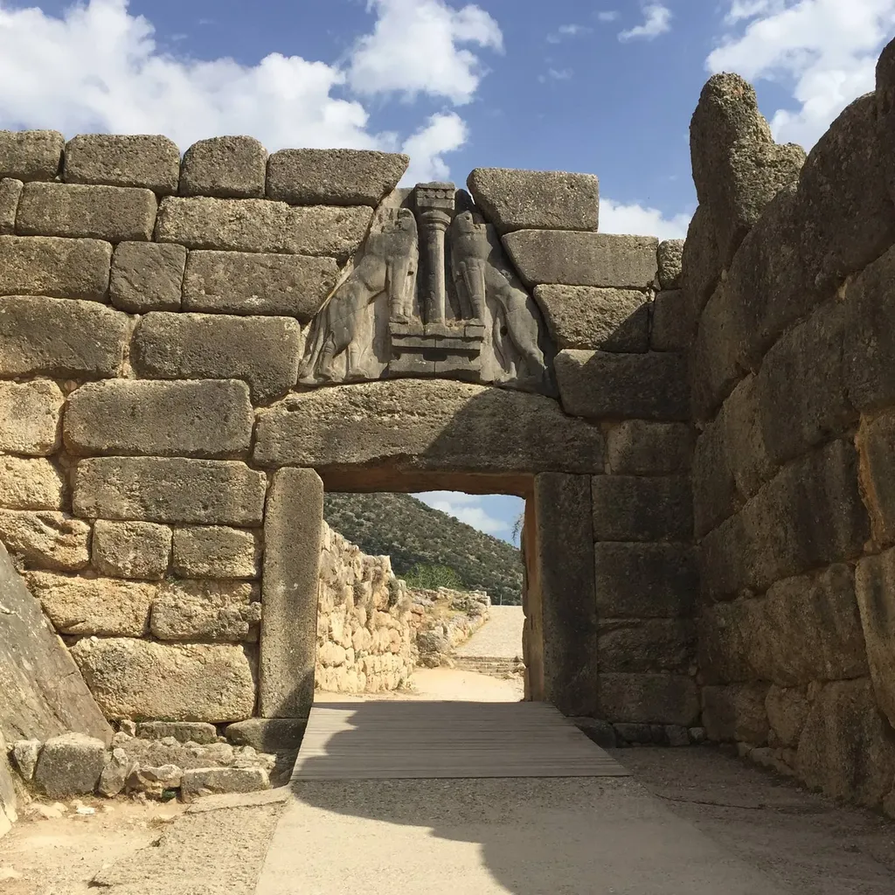

### Mardi 28, Épidaure

J’ai visité ce coin de Grèce il y a vingt ans, bien avant d’écrire *[Ératosthène](../../page/eratosthene)*. Je connais désormais l’histoire du canal de Coritnthe, creusé au XIXe, mais que les anciens franchissaient en traînant les bateaux sur des rails de bois, je connais le mont chauve de l’Acroconrinthe au pied duquel est mort le dernier roi de Spartes, je connais ces collines, ce relief, j’y ai vécu.

Nous nous sommes arrêtés à Mycènes. J’ai voulu montrer la porte des Lions à Isa. J’ai jadis médité du haut de cet empilement de blocs monumentaux. Nous avons dû faire du chantage pour que les enfants daignent sortir de la voiture et se déplacent jusqu’à la tombe d’Agamemnon.

Chaque étape est un combat. Ils n’ont retrouvé le sourire qu’une fois au village d’Épidaure, un petit port de pêche lové dans une anse, avec les montagnes qui se jettent dans l’eau, les pentes couvertes d’orangers et de pins. Ils se sont baignés, ils ont ri, on s’est détendu. Nous continuons de leur infuser un peu de culture, un peu de notre passé commun, pour qu’un jour cette humanité gargouille en eux.

La culture n’a rien d’universel, elle n’est qu’entraînement à aimer, comme chacune de mes lectures de Proust me le démontre : plus je vieillis, plus je le scrute, plus je le trouve médiocre et riche. Objectivement, il ne vaut pas un clou, culturellement, il est un monstre.

Épidaure est « rounze » comme on dit dans le Midi. Pas tout à fait fini, pas encore aux mains des designers qui auraient manucuré chacun de ses recoins. Le long de la plage : des épaves, des pontons de bric et de broc, une sorte de naturel humain qui me parle plus puissamment que bien des œuvres d’art. Ce désordonné jailli de l’activité est plus universel que l’art, et, quand on l’efface à force de manucure urbaine, on efface avec lui la vie.

Après le bain des enfants, dans une crique face à des îles et des presqu’îles lointaines et brumeuses, nous avons découvert une guinguette comme on en rêve encore, comme il n’en existe plus en France, où nous avons mangé avec joie le peu qui était offert : sardines grillées, rouleaux de feuilles de vignes, simple salade de tomates, gâteaux secs parfumés à la cannelle et à l’anis, abricots gorgés de sucre, d’une préparation secrète qui nous imposera de refaire le voyage jusqu’ici si nous voulons en regoûter de pareils.

### Mercredi 29, Épidaure

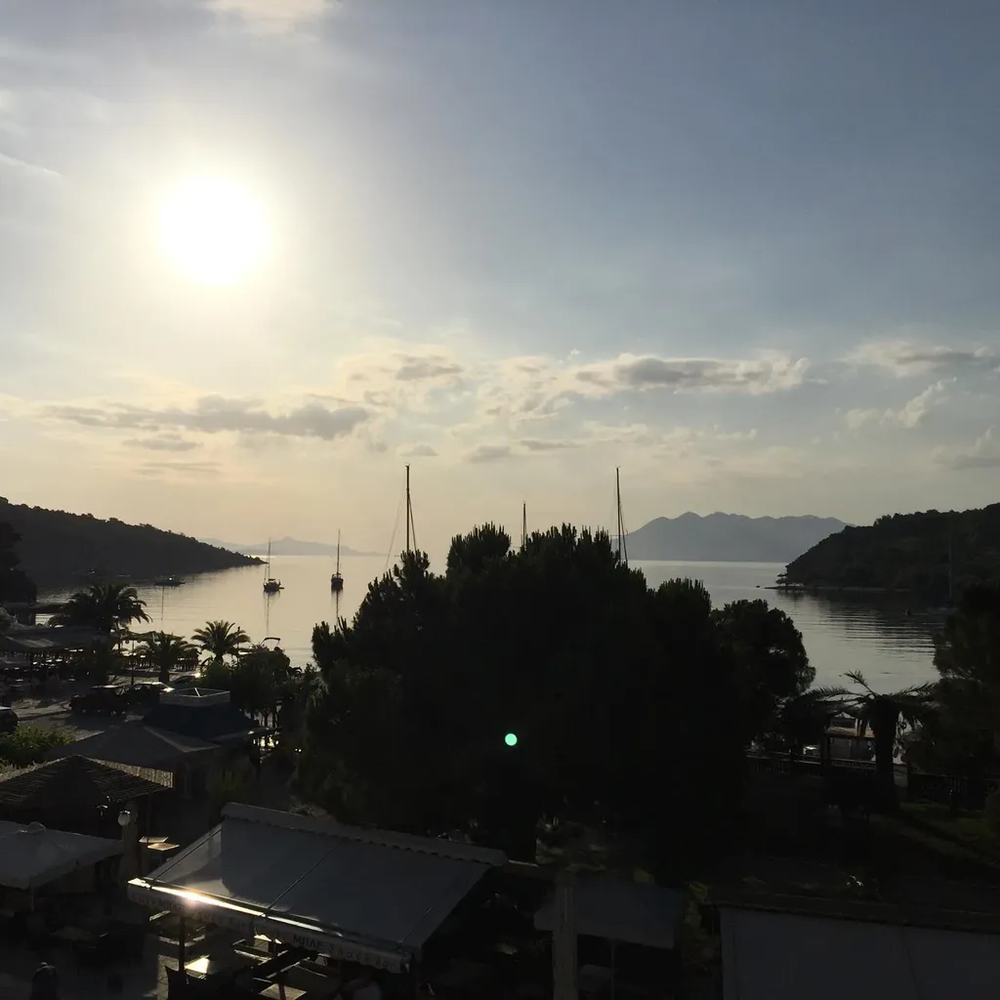

Nuit malheureusement trop bruyante (et qui s’achève pour moi par un torticolis). Réveillés à trois heures par un camion de livraison, puis à six heures par un clocher tout à fait kitch, puis par un marteau-piqueur… le tout devant un lever de soleil sublime, qui s’est posé sur une reproduction accrochée au mur de la chambre, à laquelle je n’avais pas avant prêté attention, une vue de la porte des Lions dessinée en 1821, où on voit la rampe d’accès encore encombrée de blocs, méconnaissable par rapport à aujourd’hui. Demain, les visiteurs découvriront tout autre chose, des murs peut-être plus hauts. J’imagine un Parthénon flambant neuf, reconstitué avec des imprimantes 3D géantes, et le travail minutieux des restaurateurs contemporains paraîtra ridiculement laborieux.

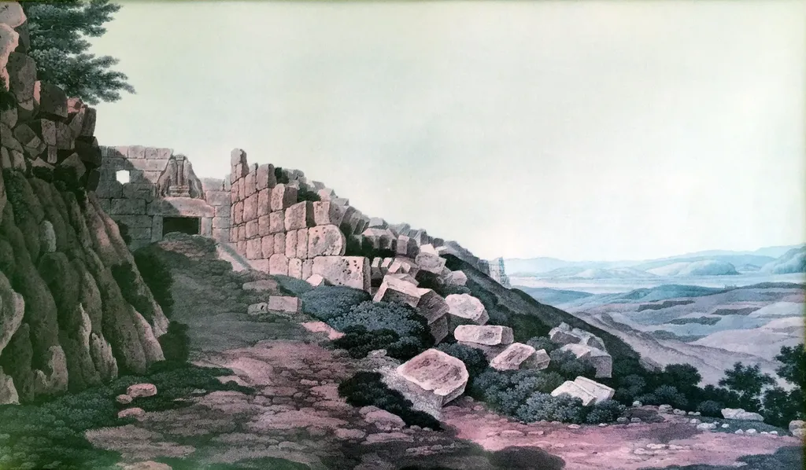

Nous ne comprenons pas comment les Mycéniens ont assemblé des blocs aussi imposants, et nos successeurs ne comprendront pas comment nous avons construit des structures gigantesques en béton sans posséder de micromachines… Il s’agit bien sûr d’une incompréhension philosophique. Comment des hommes ont-ils pu un jour s’échiner sur des marteaux-piqueurs ?

### Mercredi 29, Agios Nikolaos, Messinia

Nous avons dévalé le Péloponnèse pour descendre vers le bas de son deuxième doigt. Nous n’avons pas choisi cette destination, imposée par le mariage d’une cousine d’Isa.

Nous avons roulé avec en tête le théâtre d’Épidaure, que même les enfants ont apprécié, impressionnés par son effet amplificateur. Tour à tour, nous nous sommes placés au centre de la scène pour déclamer nos bêtises. J’ai crié que j’étais un super héros, les enfants que leur frère était stupide et Isa a entonné quelques notes du morceau qu’elle travaille avec son chœur lyrique. Elle a quitté la scène sous les applaudissements des premiers visiteurs.

Nous avons traversé Kalamata, une sorte de cap d’Agde, puis d’autres villes sans attrait, des sortes de Marseillan plage, sur une côte néanmoins superbe et j’ai commencé par me sentir mal, projeté dans le pire de mon Midi, et je n’ai pu m’empêcher de m’y sentir comme un des touristes que je vois déferler chez moi depuis mon enfance.

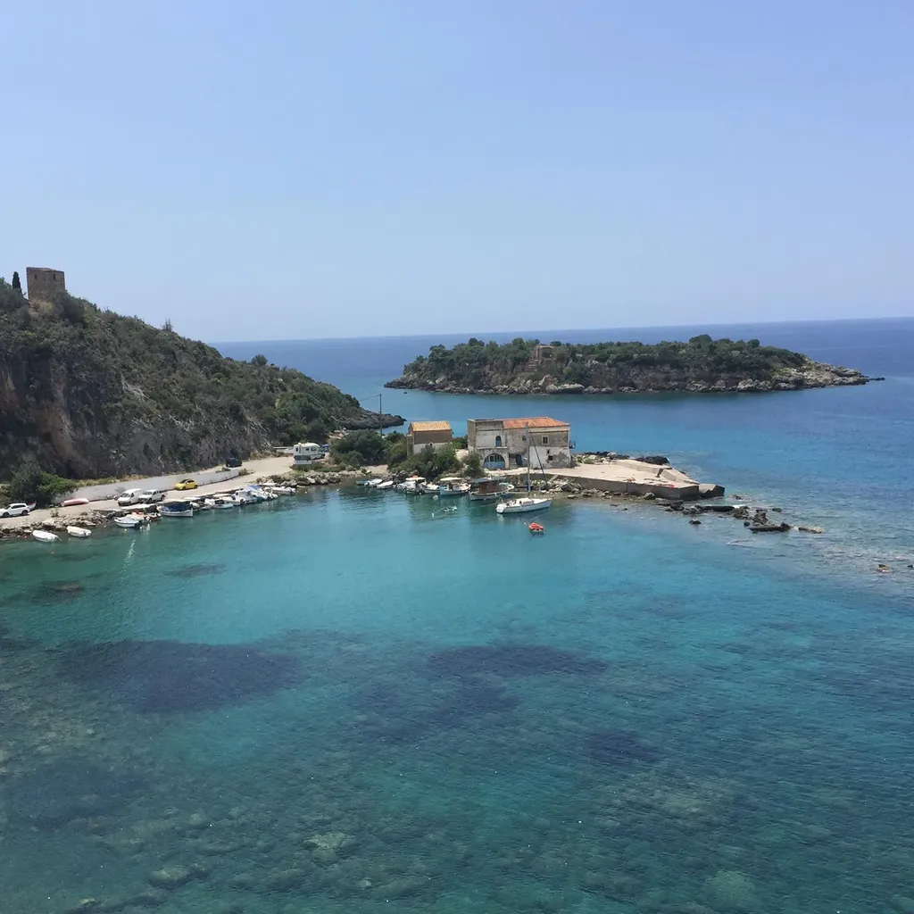

Après avoir franchi une montagne et changé de paysage, nous déjeunons dans un restaurant avec une vue de carte postale, mais où nous payons aussi cher qu’à Paris une bouffe réchauffée au micro-ondes, puis nous arrivons à Agios Nikolaos, où notre résidence n’offre qu’un accès dangereux à la mer, avec néanmoins un point de vue superbe sur les falaises.

Pendant que je fais la sieste, Isa amène les enfants à la plage la plus proche. Je les rejoins à pied. Des villas défendent l’accès à la mer. Je marche sur une route communale poussiéreuse. Je découvre une plage à l’unisson, avec néanmoins son eau turquoise.

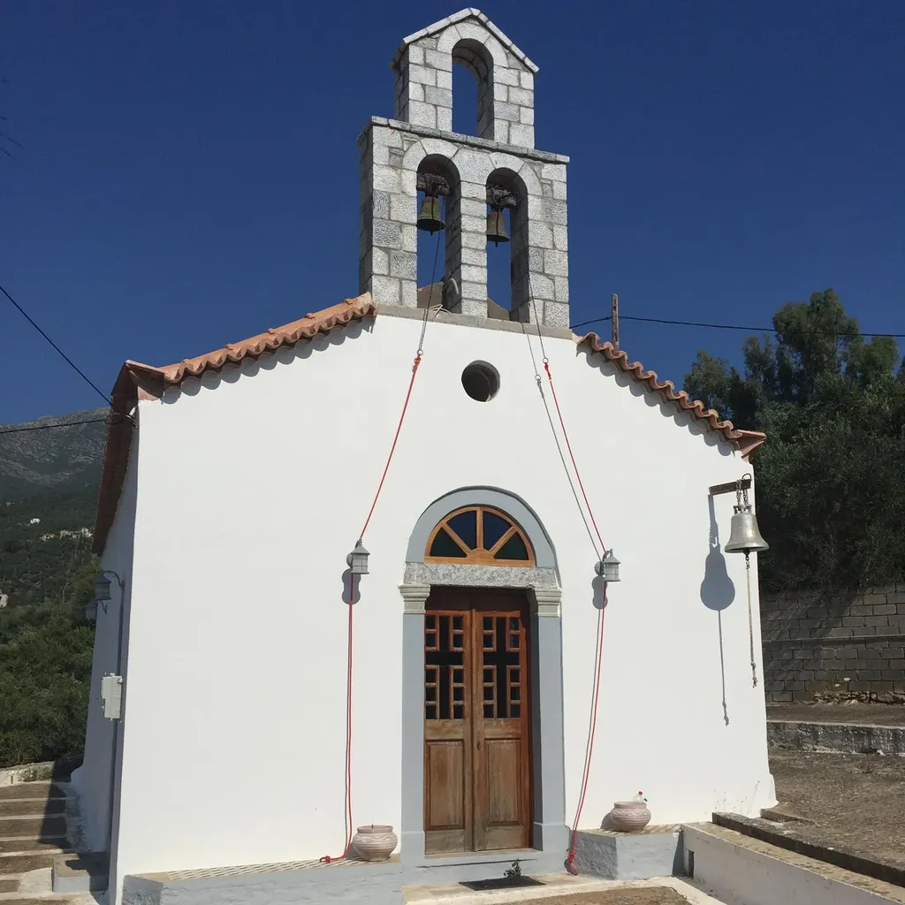

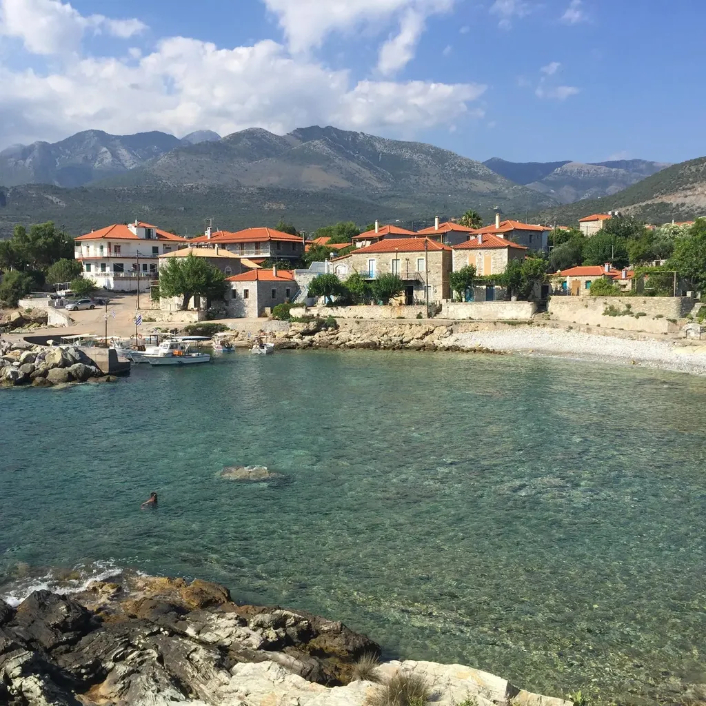

Nous enchaînons par un verre en terrasse d’un restaurant situé en surplomb d’une autre plage plus proprette, mais encore une fois aux prix parisiens, et avec les prix parisiens vient l’accueil à la parisienne, qui ne font déjà que me faire regretter la journée d’hier.

Les enfants parlent d’Épidaure, du théâtre, de la guinguette où nous avons soupé, même de Mycènes, et nous leur racontons la guerre de Troie, et ils nous disent qu’ils ne savaient pas, et ils aimeraient retourner voir les ruines, et le masque en or d’Agamemnon. La plage a sur eux un pouvoir merveilleux. Ils tentent à leur façon de combattre ma mauvaise humeur.

Je sais que j’ai souvent du mal à m’adapter à un nouveau lieu, surtout quand son génie propre ne me saute pas à la figure, et que j’en devine un de préfabriqué pour satisfaire les Nordiques privés de soleil tout au long de l’année.

### Jeudi 30, Agios Nikolaos, Messinia

Réveil en douceur avec le bruit des vagues au loin, rien qui ne bouleverse notre quotidien habituel. Isa analyse mon énervement d’hier : « Nous avons voyagé en Grèce pour ne pas bouger de chez nous. Mais nous sommes ici pour la famille. »

Je suis furieux de voir partout les gens se comporter de la même façon avec leur monde. Cette fureur ne me quitte jamais. Je ne sais pourquoi j’avais l’espoir insensé de découvrir un coin de Paradis, que la soirée à Épidaure n’avait dans mon esprit que préparé. Au final, je me retrouve parmi des Anglais et des Allemands, je ne suis que du bétail pour le commerce local et je ne vois pas comment en tirer avantage, sinon en résistant aux appels des marchands.

Le port d’Agios Nikolaos résume toute l’horreur méditerranéenne. Un magnifique empilement de maisons refermé autour d’une digue qui abrite quelques esquifs. Pas de voiture, rien que des restaurants qui tentent de nous harponner à notre passage, et entre les tables desquels nous devons nous faufiler, sous les regards inquisiteurs des consommateurs, aussi stupides que des sardines coincées dans un filet, avant d’être jetées dans une banque frigorifique.

D’un point de vue photographique, on pourrait croire à un lieu idyllique, qui s’avère un véritable enfer marchand quand on y est projeté.

Hier soir, au détour d’une rue, Isa aperçoit par une fenêtre ouverte une femme qui dessine et elle s’écrie : Martine. C’est sa tante. Nous sommes tombés par hasard sur elle et sa famille alors que nous ne devions les retrouver que demain pour un BBQ. Il ne reste donc que les gens, qu’avec eux envahir les lieux, pour y perpétrer nos propres rituels magiques.

Je n’arrive à me satisfaire de cet utilitarisme territorial. J’ai un désir du lieu, de sa visite en profondeur, toujours à la recherche de son génie, dont il m’arrive de ressentir sa force comme un vertige.

Dans le théâtre d’Épidaure, nous avons expliqué cette idée aux enfants. Ils y ont ressenti un peu de la magie qui seule prédispose à l’art du voyage. De vivre toute l’année dans un lieu où les gens passent leurs vacances m’a imposé de chercher autre chose qu’eux en vacances. Je ne peux me contenter de m’allonger au soleil et de me reposer. Le seul véritable repos est de laisser le regard dévorer les choses qui d’habitude lui échappent parce que trop familières.

Je suis encore limité dans ma capacité à regarder. À cause de mon torticolis, je m’attarde sur le bruit des vagues que je vois lécher le pied de la falaise non loin de ma chambre de katafigio village. C’est l’heure de la sieste et je m’y abandonne, en songeant à la plateforme depuis laquelle, durant toute la matinée, nous avons plongé dans une eau translucide où fourmillaient des poissons bleus (un endroit caché au pied d’un escarpement, accessible par un escalier indiqué par la famille familière des lieux et que, simples touristes, nous ne n’aurions sans doute jamais découvert).

---

Je lis l’article d’un ami qui se demande si nous n’écrivons pas trop, ne publions pas trop, qui écrit un article de trop, qu’il n’aurait jamais dû publier. Seul le journaliste écrit pour être lu. L’écrivain écrit pour vivre. C’est toute la différence.

Si je suis lu, j’en suis heureux, éventuellement, pas toujours. Cette lecture ajoute, mais son absence ne retire rien à mon expérience. Je n’ai rien contre le succès, la réussite, elle n’est qu’une cerise sur le gâteau, telle est sa place et il ne faut pas lui accorder d’importance, au contraire ça tâche rouge peut même s’avérer disgracieuse.

Quand j’écris *[Résistants](../../page/resistants)*, je le fais avec la nécessité d’être lu. Je ne suis donc pas écrivain. J’utilise les mêmes outils, les mêmes mots, mais j’exerce une autre profession. C’est un peu comme le cuisinier professionnel qui avec les mêmes ingrédients prépare des repas somptueux ou se contente de se nourrir, comme l’architecte qui construit une cathédrale ou une simple maison utilitaire. Encore que cette distinction soit impossible si on la tire un peu loin. Il y a de l’utilitarisme dans la cathédrale et de la beauté dans la maison, les limites se floutent, mais je crois qu’au moins deux directions peuvent à un moment ou un autre guider nos vies, et que leur réunion en une seule voix est pour le moins miraculeuse.

Ce miracle se produirait si mes carnets recueillaient soudain des milliers de lecteurs. Il se passerait alors quelque chose d’étrange, et même de dangereux. J’entrerai en résonnance avec mon temps au risque de ne plus être moi-même, mais seulement un reflet de ce que les autres pensent. Je ne serais plus celui qui s’abandonne, mais celui dont l’abandon rejoint les autres, et ne fais que les contenter.

---

Il fait une chaleur constante et mordante, comme elle l’était dans le Midi de mon enfance. J’ai le souvenir des débuts d’après-midi immobilisés par la sieste, au temps distendu, traversé de voyages imaginaires et de lectures aventureuses.

Soit le climat a changé dans mon sud, soit je n’y prends plus le temps de ne rien faire, et je dois venir ici, dans ce coin de Grèce pour retrouver la temporalité propre à un ennui que la fin d’après-midi fera éclater par sa douceur.

J’aime *Triptyque* parce Claude Simon a réussi à retranscrire avec une exactitude cette chaleur de mon enfance. Il a réussi à la fixer comme l’aurait fait un photographe. C’est une grande prouesse littéraire, la seule en fin de compte à laquelle j’aspire. Saisir cet instant pour ne jamais plus l’oublier.

---

L’après-midi nous découvrons la plage de Delphinia. Une crique avec des galets qui plongent dans l’eau grise et limpide. C’est simplement merveilleux, mais encore une fois nous ne serions jamais venus jusque là sans la famille et ses accointances grecques, pas plus que nous n’aurions terminé la journée dans une taverne éloignée du port et envahie de tendresse.

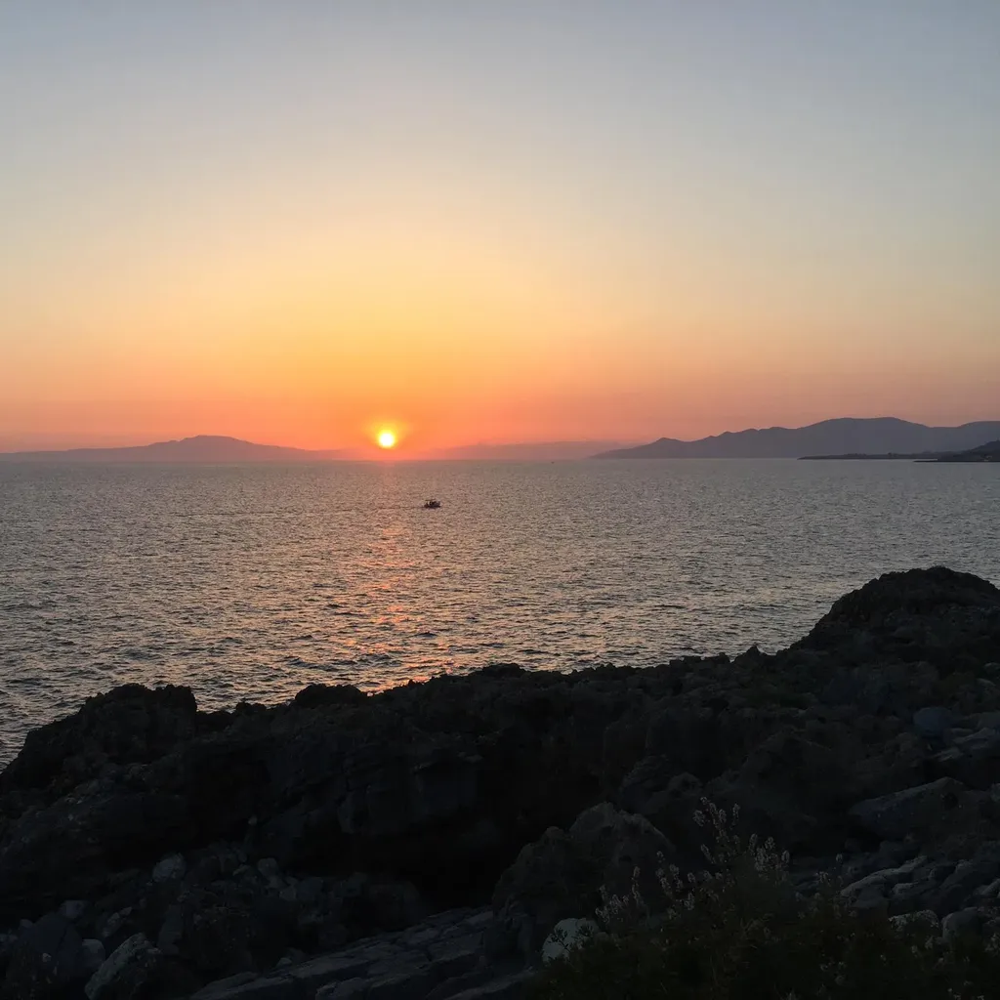

#carnets #y2016 #2016-7-23-11h31
