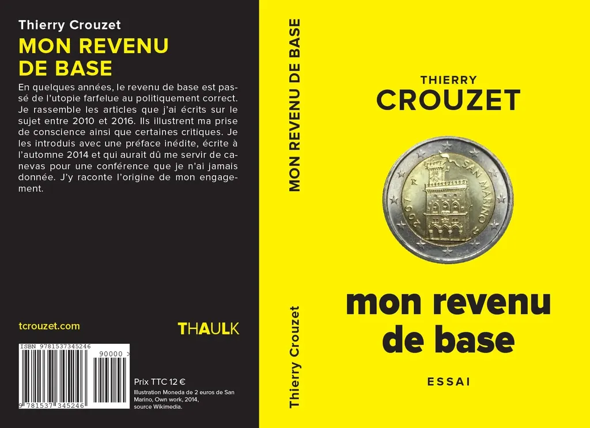

# Revenu de base, oui ou non ?

Je n’écris plus beaucoup sur le revenu de base, même si je l’évoque encore souvent dans mes discussions. D’un point de vue théorique, le sujet ne me stimule plus beaucoup, ce qui ne m’empêche pas d’avoir été réjoui puis atterré par [la déclaration de candidature de Benoît Hamon](http://www.lemonde.fr/election-presidentielle-2017/article/2016/08/17/revenu-universel-cannabis-proportionnelle-benoit-hamon-avance-ses-propositions-pour-2017_4983831_4854003.html?utm_campaign=Echobox&utm_medium=Social&utm_source=Facebook) : il a réussi à mettre dans le même sac la réduction du temps de travail et le revenu de base (et même le cannabis).

Pour ne pas rester tout à fait passif face à cette actualité, et pour obéir à une vieille envie, [j’ai compilé mes articles autour du revenu de base dans un livre](../../page/mon-revenu-de-base). Je les ai lissés et introduits par une longue préface inédite. Ce texte, désormais disponible en papier et ebook, montre comment on peut s’emparer d’une idée politique, la questionner et la critiquer.

Au fait, pourquoi ai-je été atterré par la déclaration de Hamon ? Parce que donner un revenu de base, devrait entraîner mécaniquement une baisse du temps de travail chez les salariés qui le souhaiteront. Le revenu de base devrait être un facteur de libération de tous les citoyens. C’est une mesure décisive, paradigmatique, philosophique, alors que la réduction du temps de travail n’est qu’un facteur d’ajustement, l’important selon moi étant que nous puissions choisir notre temps de travail, choix que devrait favoriser le revenu de base.

Maintenant que les politiciens ont le revenu de base à l’esprit, il est important qu’ils ne se lancent pas dans des promesses à l’aveuglette. Quand je parle de l’avenir avec un revenu de base, je parle désormais toujours au conditionnel, parce que nous n’avons aucune idée de ce que sera une société avec ce revenu.

Il ne s’agira donc pas de le lancer subitement, mais de l’expérimenter, sous différentes formes, différentes modalités de financement, dans différents endroits et de voir ce qui marchera ou pas. Il serait dangereux de le généraliser sans recul. Cette mesure est trop capitale pour qu’elle soit dilapidée sur l’autel électoral.

En attentant, si vous voulez toucher un revenu de base dès aujourd’hui, allez voir du côté de [Duniter](http://fr.duniter.org/).

#politique #revenu_de_base #breves #y2016 #2016-8-31-8h56
