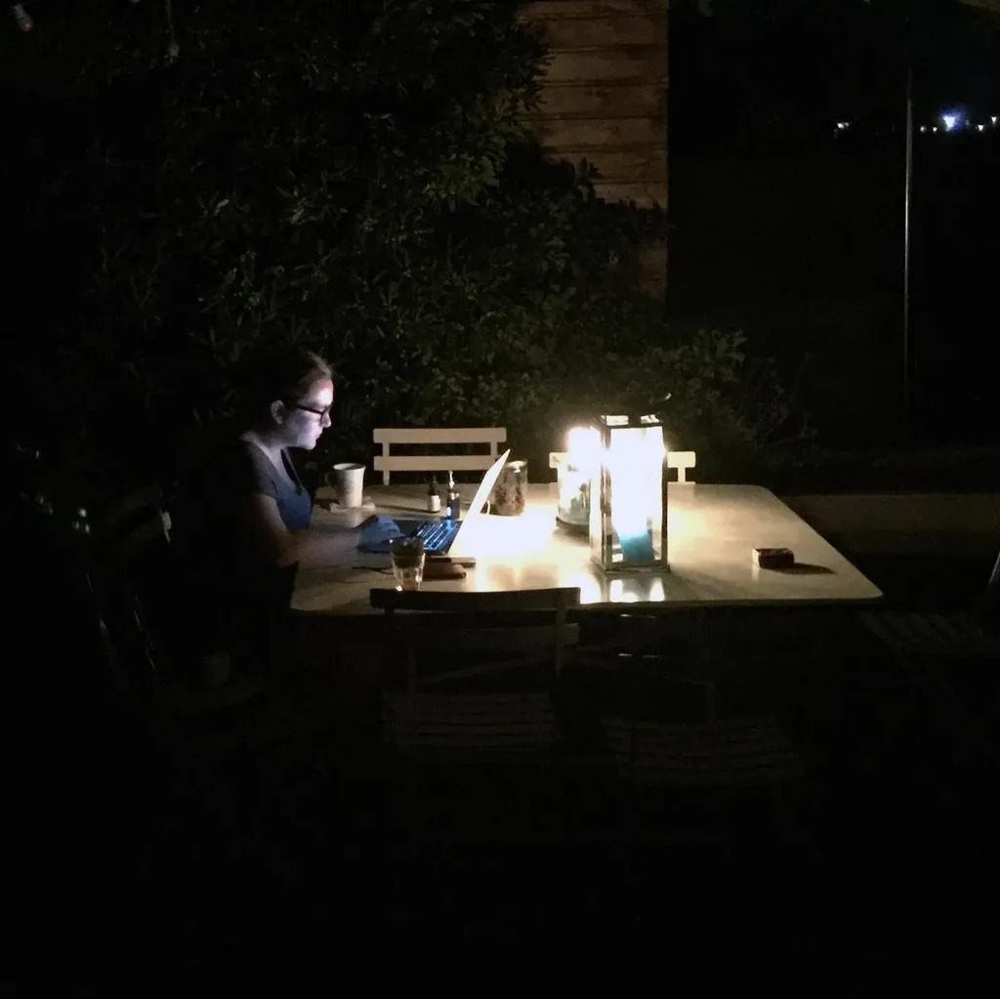

# Août 2016

### Lundi 1er, Balaruc

À peine plus d’une semaine que nous sommes rentrés de vacances et le temps déboule, victime de sa ritualisation, aussi des tâches imposées par la gestion du quotidien. Il n’existe pas de vie pleine hors du mouvement. Je ne peux être pleinement heureux que dans le nomadisme, ou du moins quand je suis loin de chez moi avec pour seul impératif de sentir le monde.

### Mardi 2, Balaruc

Le soir, quand nous chassons les Pokémons, nous entendons les commentaires méprisants des promeneurs, souvent les parents d’enfants en bas âge. Je me demande combien de temps ils passent eux-mêmes chaque jour devant la TV ? Ils ne sont même pas conscients que les médias ne peuvent qu’être contre *Pokémon Go* parce que le jeu leur arrache des parts d’audience. Et puis, en ce moment même, une voiture avec haut-parleur annonce un cirque pour ce soir. Combien y amèneront leurs enfants voir des animaux encagés à longueur d’année ?

### Vendredi 5, Balaruc

### Mardi 9, Balaruc

Depuis quelques jours je travaille avec Lilas sur *Résistants*. Nous effectuons un editing bien paradoxal : plutôt que de couper, nous rajoutons du texte. Je ne cesse d’écrire, j’ai même pondu un chapitre complet. Lilas a résumé merveilleusement ce qu’était un thriller médical : « Quand je donne un médicament à mon chien, je le glisse dans un bout de fromage. Il le mange sans en prendre conscience. » Je suis en train d’ajouter du gras pour faire passer la pilule. L’exercice m’amuse, mais en tant qu’exercice. Je préfère écrire pour emporter le lecteur avec moi, depuis le point où j’en suis vers celui où je rêve d’aller.

### Mercredi 10, Balaruc

J’ai toujours imaginé mes lecteurs comme mes clones, avec le même background, la même façon de penser. Je n’ai jamais cherché à expliquer, mais à vivre une expérience et à la partager. La littérature commerciale exige tout autre chose. Elle fait pencher l’écriture vers la pédagogie.

### Jeudi 11, Balaruc

J’ai tant aimé écrire *[One Minute](../../page/une-minute)*, que j’ai envie de reprendre le procédé narratif. Durant mon footing du soir, une idée me vient : *Cinq minutes de gloire*. Une compagnie genre Google lance un défit à la planète : « À 12:00 GMT le 1er janvier, nous offrirons dix millions de dollars à celui qui fera le plus parler de lui sur le Net en cinq minutes. »

### Vendredi 12, Maillardou

J’ai fixé un attelage à l’arrière de la voiture pour y accrocher un porte-vélos. Quand je recule pour quitter la maison, le radar bipe comme s’il y avait un obstacle. Avec Isa, nous nous regardons, effrayés : « On ne va pas faire 400 km avec cette alerte. » On plonge dans la doc de la voiture pour voir si on peut désactiver l’alarme de recul. Je sors, regarde mon montage pour voir si quelque chose cloche. Puis une idée me traverse : « En général, on ne roule pas en marche arrière. » Je remonte en voiture, passe la première et le radar se tait. Nous nous sentons ridicules, d’autant que Lilas, pliée en deux, est témoins de notre mésaventure.

### Dimanche 14, Maillardou

Je lis *Monsieur Teste* de Paul Valéry. Il réussit à ne parler que de l’homme, que de ses états intérieurs, que des ses pensées désincarnées, sans jamais se référer à des objets, à des lieux, à des évènements historiques. Je suis au contraire un écrivain des choses, des applications concrètes. Je viens après Perec. J’ai besoin des listes, des inventaires, même si j’évite de les aligner dans mes textes (et déteste les auteurs qui s’amusent à tout décrire, à tout lister, à tout surqualifier). Cette façon de Paul Valéry trahit chez lui un certain idéalisme, ou tout au moins la croyance en la singularité de l’*Homo sapiens*. Son *Monsieur Teste* ne me touche pas. J’ai l’impression qu’il me parle depuis une galaxie lointaine dont je ne comprends même pas la physique. Ce rapport distant à Paul Valéry me frustre d’autant que nous sommes nés dans la même ville, mais cent ans d’écart suffisent à nous faire étrangers.

### Lundi 15, Maillardou

Si enfant on m’avait dit que les guerres de religion feraient leur retour au début du XXIe siècle, j’aurais bien ri. Je pensais que la science et la rationalité avaient balayé les croyances les plus absurdes. S’il n’en est rien, c’est à cause d’un échec de la science. Si elle a prolongé notre durée moyenne de vie de quelques années, elle n’a pas réellement changé la dimension temporelle de nos existences. Je viens de perdre un nouvel ami à cause d’un cancer. La science médicale, quels que soient ses progrès, n’a pas encore réussi à nous faire franchir un palier suffisamment significatif pour avoir des conséquences philosophiques.

D’un autre côté, les sciences physiques, nous ont aidé à produire une multitude de technologies, la plupart aliénantes, et qui encore une fois ne nous approchent en rien de mes rêves d’enfance : pas de voiture avion pour voyager en toute liberté à moindre coût, surtout pas de conquête spatiale. Nous restons cloués au sol.

Alors, réduits à mener les mêmes vies que les anciens, nous réveillons leurs anciennes folies.

---

J’ai parfois l’impression d’être invisible. Quelqu’un que je n’ai jamais vu salue tout le monde sauf moi. Cette scène se répète souvent. Peut-être que les gens sentent instinctivement que je ne serais pas aimable avec eux.

### Mardi 16, Maillardou

On trouve du pain bio dans les supermarchés, mais guère chez les boulangers, donc chez les artisans, chez les gens normaux, ce qui démontre que la population refuse le changement et voudrait continuer coûte que coûte sur sa lancée mortifère. Cette peur du changement m’effraie, parce qu’elle prélude des horreurs sans nom.

### Mercredi 17, Maillardou

On s’est réabonné à la version papier de *New Scientist* et nous lisons chaque numéro d’un bout à l’autre, alors que depuis quelques années je me contentais de picorer le fil d’actualité du magazine.

Il faudra que j’interroge cette décision. Je ne m’imagine pas relire des romans sur papier, mais feuilleter un journal, ça reste plaisant, ça apporte quelque chose dont le numérique n’a pas encore réussi à se saisir.

[Dans un article](https://www.newscientist.com/article/mg23130850-200-who-we-think-we-are-and-why-it-matters/), j’apprends qu’il existerait trois définitions concurrentes de l’homme. 1/ L’homme est à l’image de Dieu (définition chrétienne). 2/ L’homme possède des capacités spéciales, telles que la pensée réflexive (définition philosophique). 3/ Les hommes ne se différencient des animaux que par leur patrimoine génétique (définition biologique).

Suivant notre définition de cœur, nous penserions l’éthique différemment. Il ne m’arrive jamais de chercher à définir ce qu’est un homme, ni même ce que je suis. Je n’ai pas besoin d’une telle définition pour penser l’éthique. Par exemple, je peux décider qu’il me paraît mal de faire subir aux autres créatures ce que moi-même je n’aimerais pas subir (position qui me pousse vers le végétarisme).

[Dans un autre article](https://www.newscientist.com/article/mg15621085-300/), je découvre que plus les oiseaux sont intelligents, moins ils ont besoin d’un vaste territoire pour se nourrir. Si je transpose cette découverte à l’homme, j’en conclus que les conquérants comme les fans de la croissance sont stupides. Ils sont incapables d’optimiser les ressources à leur disposition.

### Lundi 22, Maillardou

Sur la petitesse, la pingrerie, l’étroitesse d’esprit et la bassesse des employés d’Amazon (comme résumé du drame capitaliste). J’ai donné mon Kindle Paperwhite de première génération à mon beau-père. Quand j’ai voulu mettre à jour le logiciel, j’ai constaté qu’il était impossible d’y installer la nouvelle police Boukerly. Tout était semblable aux Kindle de générations ultérieures, sauf ce petit détail, refusé à seule fin d’inciter les utilisateurs à débourser cent euros pour renouveler leur matériel.

---

Je pourrais me définir socialiste, si le socialisme était autre que ce que les politiciens en font.

---

Petite balade jusqu’au château de Biron où quelques artistes du XXe siècle sont exposés (Sam Francis, Bram Van Velde, Jean-Luc Parant, Henri Michaux…). Je reste assis longuement face au nord, moutonné par la forêt à perte de vue, avec dans le lointain Monpazier. La beauté est parfois si puissante que je me réfugie dans l’écriture pour la contenir et reprendre mon souffle.

Elle déferle sur moi en vagues enivrantes, à me rendre fou. L’effet est étrange sur mon cerveau. Il me stupéfie, et quand j’entre dans les salles d’expositions, d’autres images, plus contenues, plus minutieuses ou au contraire plus désordonnées, m’envoient à nouveau cette pulsion étrange dans les synapses.

Je n’ai aucun mal à expliquer pourquoi je n’ai jamais éprouvé le besoin de me droguer, ou même de boire. Il me suffit de regarder et j’implose. Je ne sais pas d’où me vient cette puissance. Si j’étais religieux, je ne chercherais pas loin. Je préfère l’attribuer à une certaine topologie cérébrale. Je finirai par ne plus chercher que l’extase.

### Mercredi 24, Balaruc

Découverte d’une planète de type terrestre en orbite dans la zone habitable de Proxima du Centaure. J’attendais un évènement de ce type depuis mon enfance. Tous les télescopes vont dorénavant se pointer dans cette direction, pendant que les Français continueront de se demander s’il faut ou non interdire le burkini sur les plages !

### Jeudi 25, Balaruc

*Le robot est l’avenir de la femme*, titre d’un livre que je devrais écrire si je voulais avoir du succès, où je montrerai que les robots feront me ménage, la cuisine, l’amour… Et où bien sûr l’héroïne ne serait pas un robot, mais une femme qui se ferait passer pour tel afin de mieux étudier les hommes.

---

Sur France Culture, des historiens affirment qu’il n’existe aucune idéologie pour penser la pluralité contemporaine. Et la théorie de la complexité alors ? La pluralité peut-être pensée, bien heureusement, et cette pensée aide à mieux comprendre le monde et à mieux le vivre. Ce n’est pas parce que vous êtes ignares que vous devez nous assener vos bêtises.

### Vendredi 26, Balaruc

### Samedi 27, Balaruc

Je répare le portail qui devant la maison s’ouvre sur l’étang. Je le refais à l’identique, tel que mon père l’avait fait il y a près de quarante ans, et j’imagine revivre ce qu’il a vécu, chacun de ses gestes, de ses pensées, avec l’étang éblouissant pour point de vue, et j’imagine que dans quarante ans, si le niveau des mers ne s’est pas trop élevé, ce sera au tour de mes enfants de refaire ce portail.

### Mercredi 31, Balaruc

Une sirène me tire de ma sieste, la même sirène qui sonnait quand j’étais enfant tous les premiers mercredis du mois à midi. J’aimais ce moment, cette date que personne ne pouvait manquer. Un coup indiquait un accident, deux coups une noyade, trois coups un incendie. Ou quelque chose comme ça. La population comme les pompiers étaient alertés, c’était une forme de lien social à l’échelle locale.

En émergeant de ma sieste, j’ai compté les coups : cinq, ça ne correspondait à rien, surtout que la sirène a enchaîné plusieurs séquences. En même temps, j’ai replongé dans mon enfance, dans les mercredis midis avec mes parents, dans notre cuisine du rez-de-chaussée ouverte sur le jardin.

Plus tard, Isa m’a expliqué que l’ancien réseau d’alerte était en train d’être réhabilité partout en France. J’ai plus de chance ainsi d’apprendre une mauvaise nouvelle qu’en consultant les médias événementiels dont je me détourne avec obstination.

#carnets #y2016 #2016-9-1-13h36
