# Décembre 2016

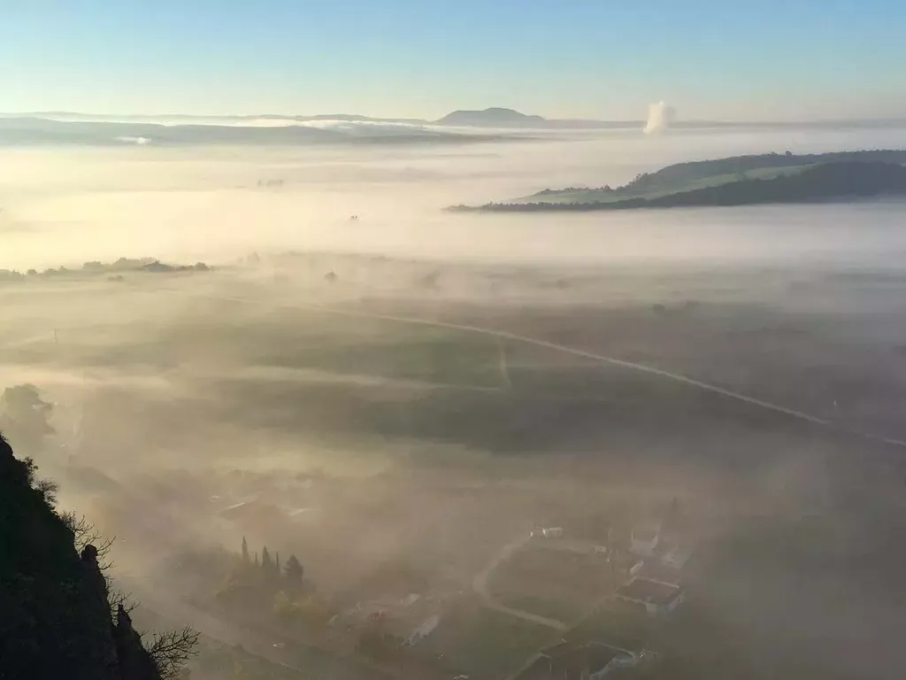

### Vendredi 2, Balaruc

Apprendre à accepter ce qui devrait être inacceptable, c’est peut-être devenir adulte, ou vieux.

---

Journée sublime, soleil et calme plat. Émile n’a pas école et on joue au tennis. Il me décoche des revers foudroyants.

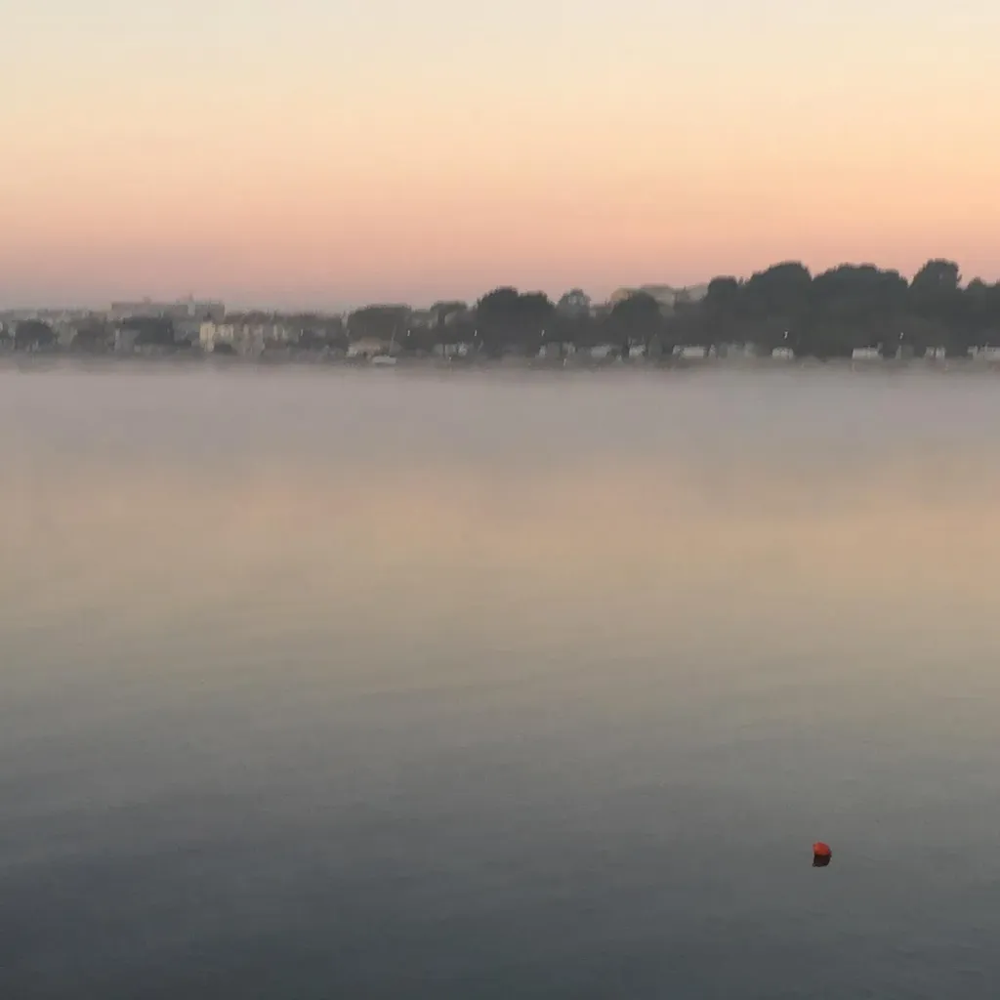

### Dimanche 4, Balaruc

Après-midi passée à retourner la terre, et quand la nuit tombe, alors que j’arrose une jardinière nouvellement plantée, je me sens bien, satisfait du travail accompli, et conscient que les fruits de ce travail me réjouiront peut-être durant des dizaines d’années. L’écriture ne me procure jamais la même satisfaction ni la même sérénité.

### Mardi 6, Balaruc

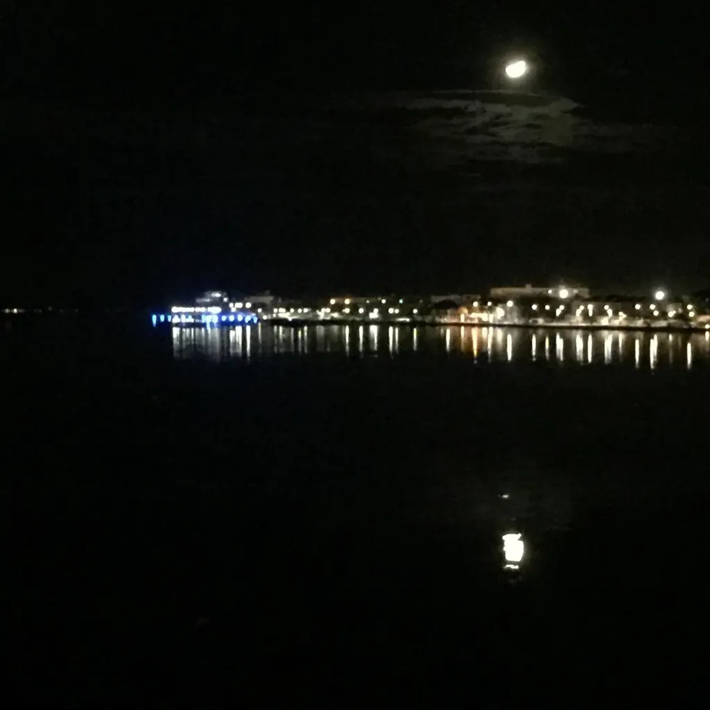

### Mercredi 7, Vias

Je me promène au bord de la plage pendant que Tim joue au tennis. Je photographie le soleil dans la même position qu’hier la lune. Image de saison.

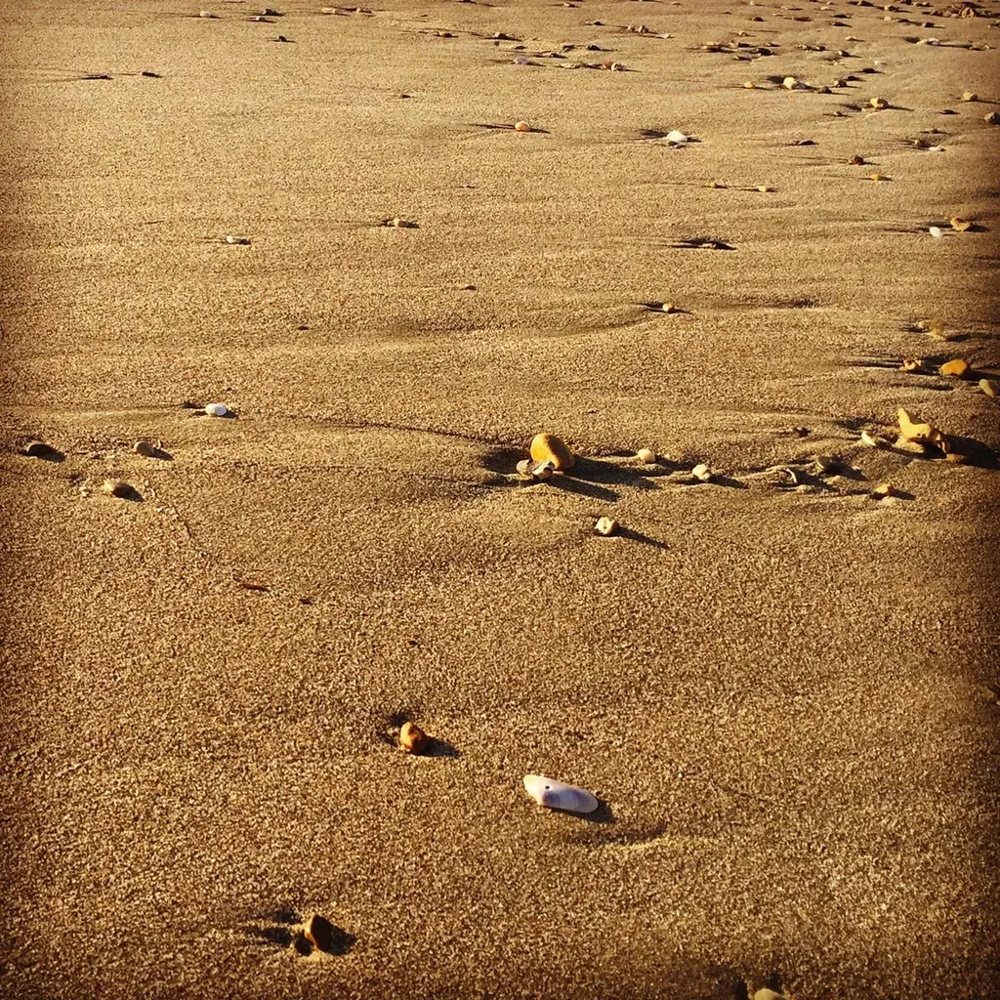

### Jeudi 8, Balaruc

[Je retourne le nouveau Mac](../../2016/12/pourquoi-je-retourne-mon-macbook-pro-2016.md) que j’ai reçu il y a trois jours et, sous l’influence de Narvic, je me cherche un appareil photo.

### Vendred 9, Balaruc

Je n’avais pas pensé qu’acheter un appareil photo un peu performant serait aussi compliqué.

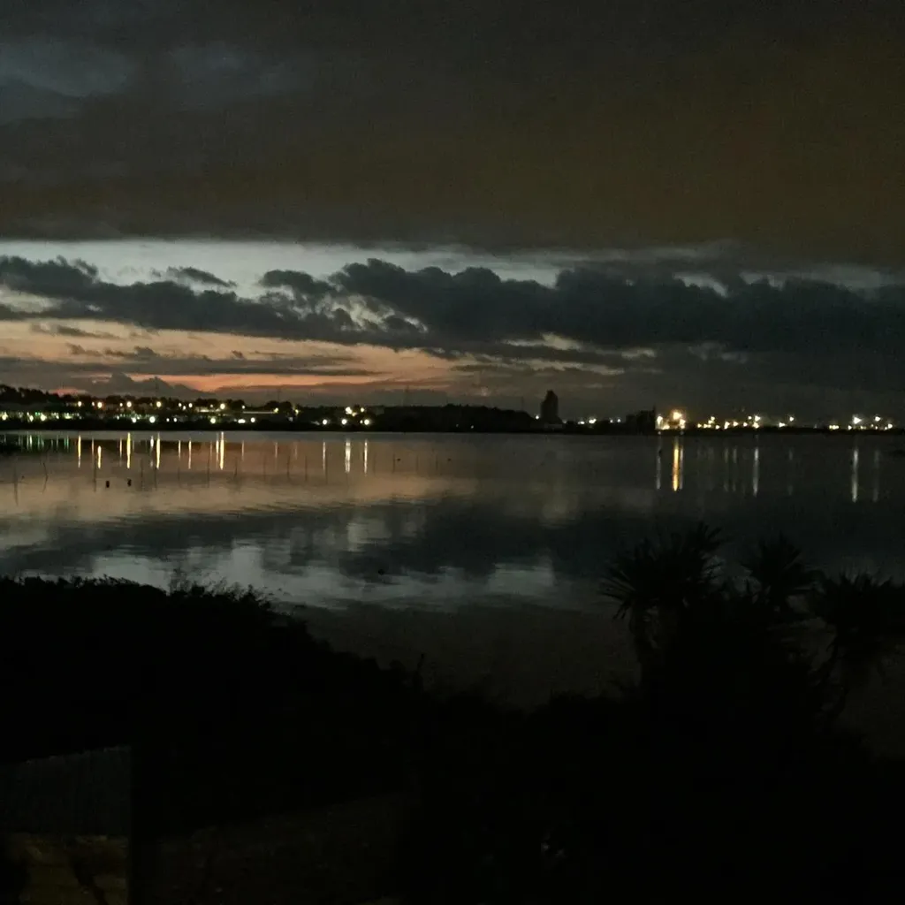

### Samedi 10, Balaruc

J’ai choisi un Panasonic Lumic Gx80. Je pourrai filmer en 4K, et savoir que je disposerai bientôt de cette fonction suffit à me donner des idées de vidéos. Les outils ont toujours un étrange effet sur moi. Ils dictent ma pensée.

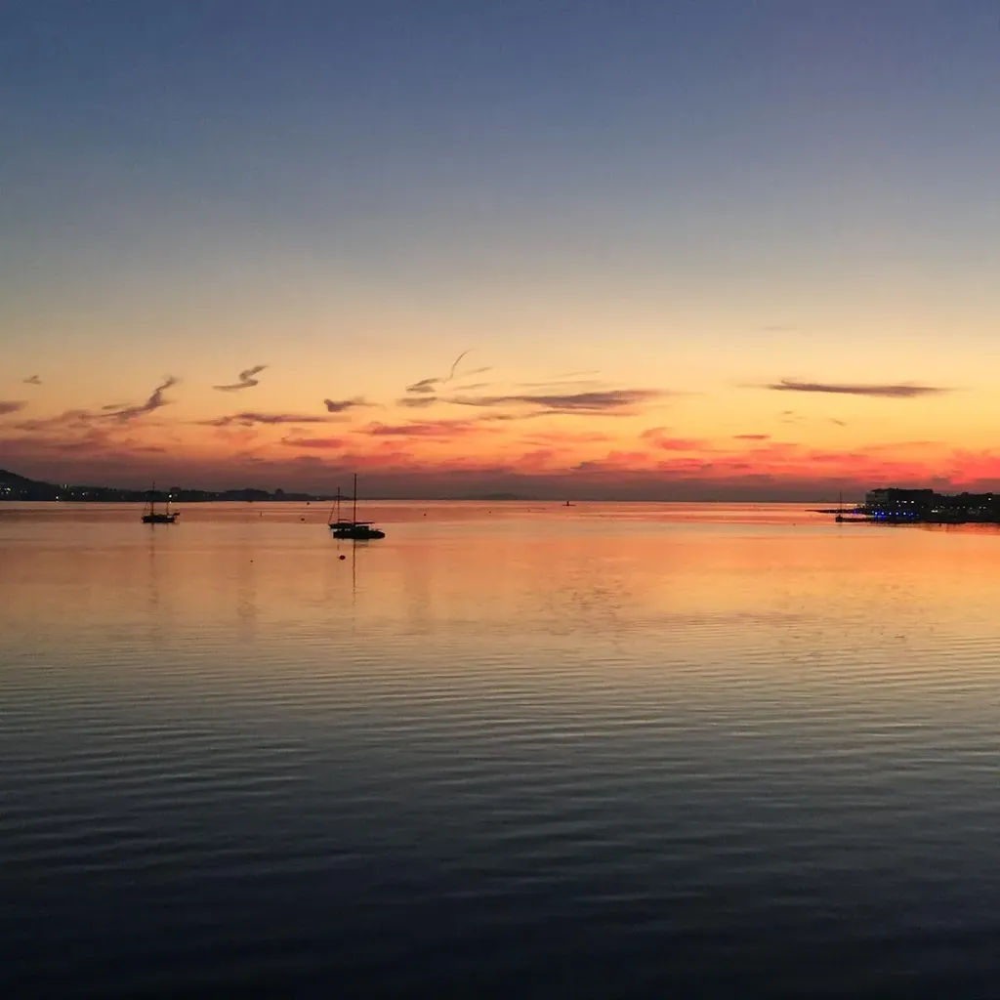

### Dimanche 11, Balaruc

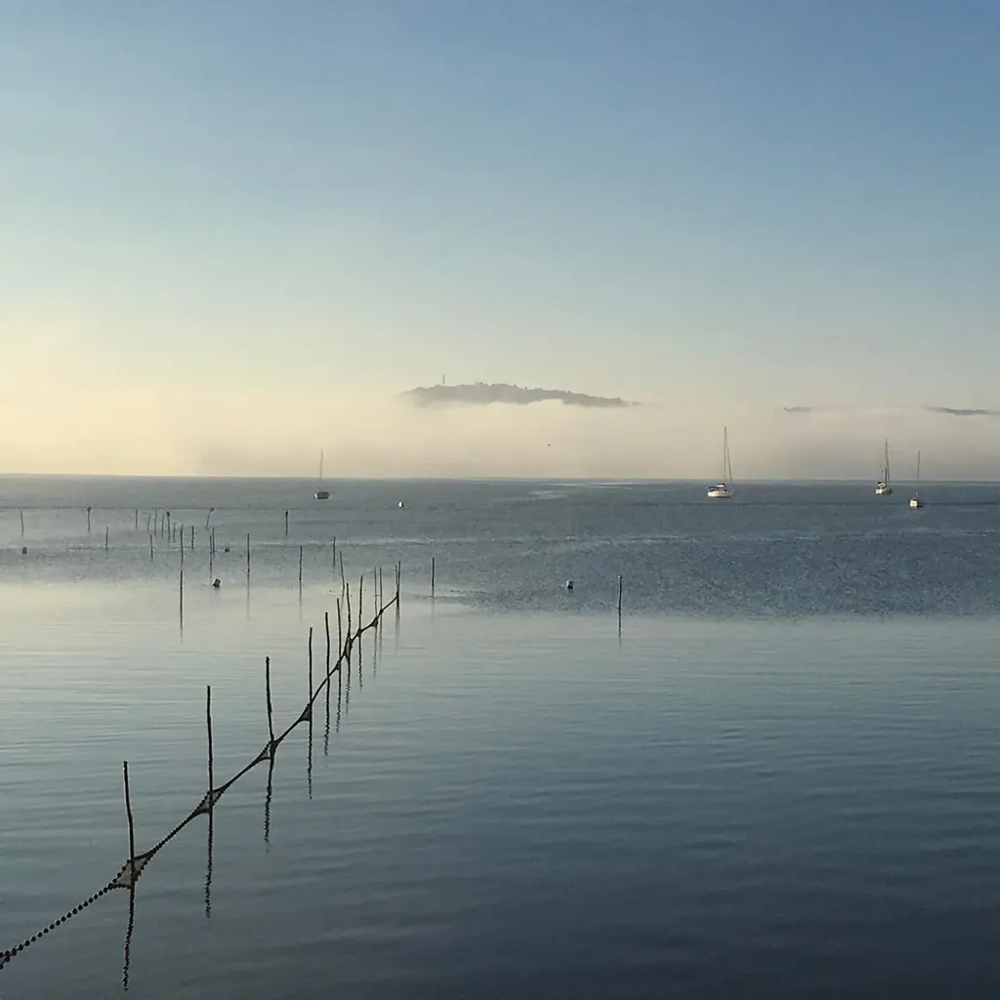

### Lundi 12, Balaruc

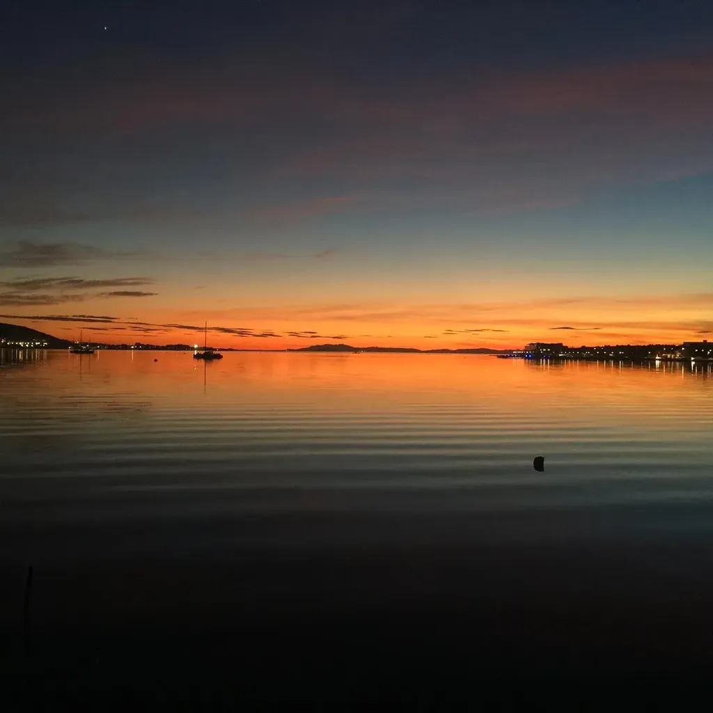

### Mercredi 14, Balaruc

Je suis allé ce matin à la maison du sport de Montpellier faire un test de l’effort. Je découvre à 53 ans que j’ai une capacité pulmonaire positivement hors norme, ainsi qu’un cœur qui tourne à très haut régime. Le toubib m’a arrêté de courir à 192 BPM, alors que théoriquement à mon âge je devrais tourner max à 167 ! Il m’a expliqué que mon seuil était à 177, donc que je devrais m’entraîner à ce rythme, alors que je me contente d’un 155 BPM, ce qui serait normal pour mon âge. Verdict : « C’est comme si vous ne faisiez pas de sport. »

Il m’a même déclaré que j’étais gros ! Moi, gros, ça a fait rire tous les gens qui me connaissent. Le pire, nous n’avons même pas pu mesurer mon VO2 Max. Plutôt que de plafonner, la courbe de consommation d’oxygène s’est soudain effondrée alors que j’étais à 16 km/h sur le tapis, comme si j’étais passé en apnée, mais, je vous jure, je respirais. Je suis bon pour refaire un test, avec d’abord le devoir d’apprendre à respirer. Oui, parce que j’ai aussi découvert que je n’aspire pas assez d’air pour oxygéner mes bronchioles (encore théoriquement).

Quand j’étais enfant, j’imaginais souvent que je n’étais pas un humain ordinaire, que je n’étais pas fait comme les autres… ça reste un sujet romanesque fascinant.

### Vendredi 16, Balaruc

Semaine passée à organiser un voyage en Islande pour juillet prochain, puis en express un séjour en Espagne pour la semaine prochaine, vu que la neige fait défaut dans les Pyrénées.

---

La sécheresse de mon carnet suffit à me démontrer que je ne vis pas sur le bon rythme. Pas le temps de rêver, d’attraper des pensées passagères, je ne suis que dans l’action.

### Dimanche 18, Arcos de la Frontera

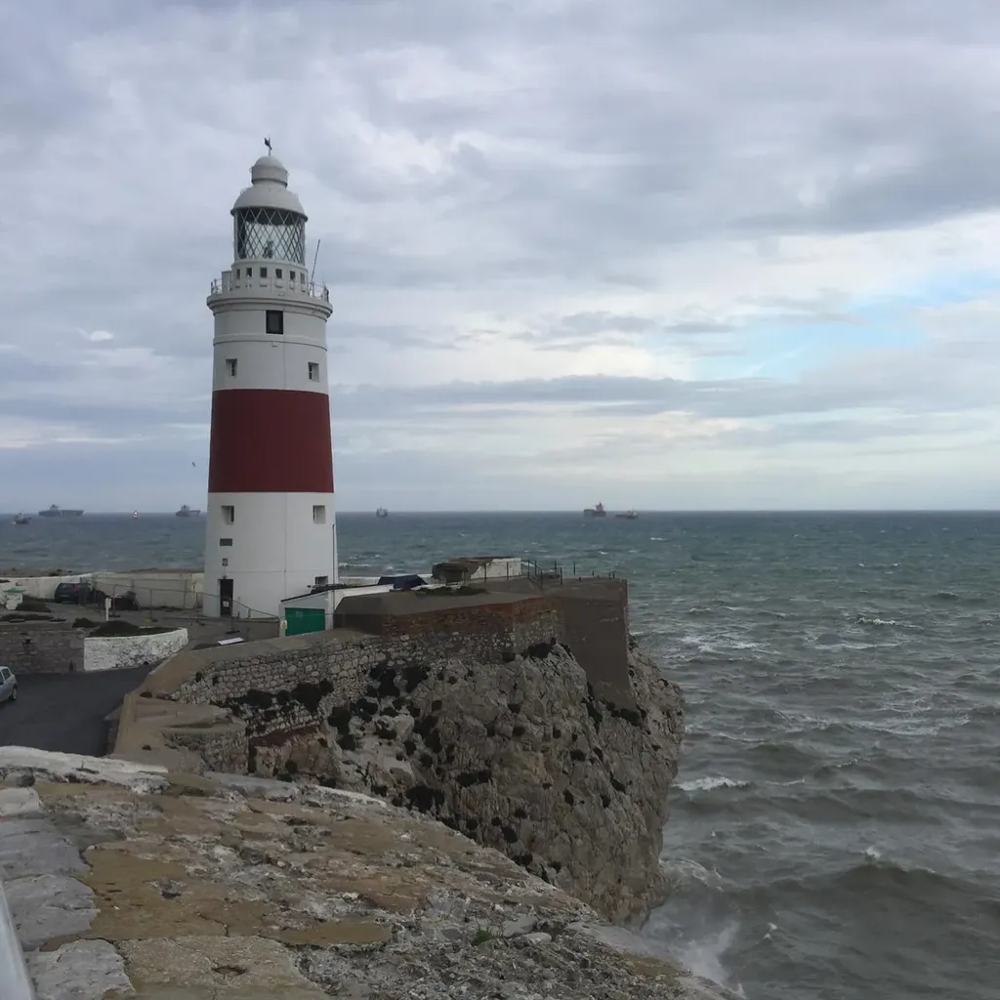

Depuis toujours je pense à Gibraltar comme à un bout du monde accessible en suivant la côte depuis la maison, sorte de fantasme de l’errance, que je situe l’été sous un soleil huileux à faire cuire les œufs sur l’asphalte nimbé de mirages.

J’ai atteint le rocher cet après-midi, en hiver, sous un ciel gris, après un voyage plutôt bref, pour l’essentiel en avion. J’ai voulu que nous allions jusqu’à Europa Point, pour être nez à nez avec l’Afrique, à peine visible sur l’autre rive des colonnes d’Hercule.

L’endroit est mythique, mais démystifié par les empilements de béton, accrochés sur la face atlantique, devant une baie ponctuée de tankers. Nous avons roulé entre les flancs abrutis d’immeubles sans attrait pour finir par rejoindre un parking arrosé par les embruns méditerranéens.

Pendant qu’Isa se réfugiait soigner son mal de gorge dans une cafétéria aux tarifs affichés en Pounds (nous avons même dû présenter nos passeports pour passer de l’Espagne à ce bout de Royaume-Uni), j’ai accompagné les enfants jouer entre les deux mers, alors que le vent humide ne cessait de nous gifler, puis nous sommes repartis, aussi vite que nous étions arrivés, avec cette vitesse propre aux voyageurs aéroportés. À la nuit tombée, nous nous sommes dirigés vers le nord, vers Arcos de la Frontiera, un village perché au sommet d’une falaise entre Cadix et Séville.

---

La semaine dernière j’ai reçu mon appareil photo. Depuis plus de dix ans, je ne photographiais plus qu’au smartphone. Habitude difficile à perdre, il faut croire, car j’ai oublié le nouveau boîtier à Barcelone où nous nous sommes arrêtés samedi chez des amis. Je n’ai même pas pris une photo avec et encore moins lu la notice. Impression qu’il existe deux mondes de complexité technique, et que les appareils photo restent volontairement ancrés dans un autre temps, pour se donner des allures d’outils de spécialistes avertis.

### Lundi 19, Arcos de la Frontera

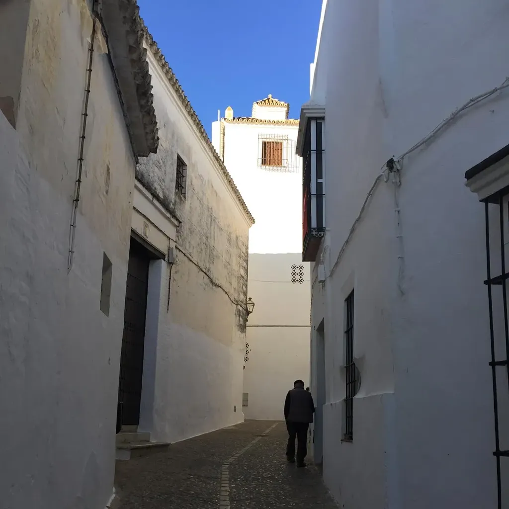

Avec nos enfants, les vacances doivent engager le corps. Visiter ne suffit pas. Alors en une journée nous traînons leur mauvaise humeur de Cadix à Séville, Cadix orthogonale sur sa presqu’île, ravagée sur sa rive sud par des immeubles qui, en seconde ligne des brisants, ont pour vertu, j’imagine, de couper en été les rafales brûlantes, et qui préservent au-delà un dédale entrecoupé de places plantées de Magnolas géants, des sortes de baobabs aux feuilles sombres et grasses à l’ombre desquels déambulent des citadins qui paraissent ignorer le stress, et puis, après une heure d’autoroute, c’est Séville, merveilleuse en cette saison, chargée d’oranges à tous les coins de rue, d’une douceur grouillante, les Espagnols traçant des serpents devant les kiosques de la loterie nationale.

Nous avons parcouru les rues dans le seul but de trouver du *chocolate con churros*, et nous avons fini par découvrir un café ouvert en 1904 où tout était parfait, et où je n’ai goûté qu’un bout de churros, car dès la seconde bouchée j’ai su que je devais renoncer pour éviter les remontées acides nocturnes.

Je dois m’appliquer avec de plus en plus de rigueur à résister aux sucreries qui assaillent mon regard. Les pâtisseries m’ordonnent de les dévorer. Je ressens un désir d’une puissance si entêtante qu’il exige en réponse toute ma volonté, jusqu’à la laisser exsangue, la privant de tout autre désir, celui de photographier, d’écrire. Je passe de rue en rue, de vitrine en vitrine, en me disant non, sachant que mon organisme a besoin d’un shoot qui laissera mon corps malade.

J’ai ignoré cette addiction durant des années, m’y abandonnant avec la même nonchalance qu’un ivrogne, jusqu’à ce que mon estomac ne supporte plus le sucre, jusqu’à ce qu’il me punisse jusqu’au supplice, mais le désir reste malgré tout, prêt à tous les sacrifices en échange d’un peu de plaisir.

### Mardi 20, Arcos de la Frontera

### Mardi 20, Ronda

Arcos de la Frontiera était un village blanc, merveilleusement tortueux, avec la nécessité de replier les rétros de la voiture pour atteindre le parking de l’hôtel. Nous avons arpenté les ruelles de nuit, sans trouver d’endroit confortable où boire un verre. La vie se joue dans la ville moderne étalée en contrebas de la falaise, et nous n’avons vraiment découvert la topographie d’ensemble qu’au moment de notre départ ce matin.

Sans les enfants nous aurions pu nous éterniser, mais ils ont une exigence de vitesse qui finit par avoir raison de notre patience. Nous avons donc sauté jusqu’à Ronda, une ville moins blanche, plus opulente, et même hors de prix d’après les tarifs constatés sur la terrasse où j’écris sous un généreux soleil.

Les villes ne m’intéressent plus, ou peut-être est-ce parce qu’elles n’intéressent pas les enfants, et que je me m’associe à leur insatisfaction. Plus je vieillis, plus j’ai besoin de nature et de perspectives qui regardent à l’infini.

Le lieu de vacances idéal : un hôtel avec piscine perdu au milieu de la nature où chacun de nous peut mener sa vie à sa guise : les enfants dans l’eau, Isa se promenant ou bouquinant, moi courant vers les sommets.

Nos vacances en Espagne sont trop courtes pour qu’un rythme d’oisiveté s’installe, pour que nous plongions sur nos Kindle et laissions le temps s’appesantir. Les enfants ont la conscience de la rentrée de janvier, une espèce d’urgence les pousse à profiter, et pour eux il ne s’agit pas de découvrir des lieux nouveaux, mais au contraire d’être chez eux avec leurs amis, avec leur vélo ou leur raquette de tennis.

Je tiens un journal pour apprendre à ne pas répéter mes erreurs, mais jamais on n’apprend à voyager, parce que la vie nous place sans cesse dans des configurations nouvelles, qui forcent à tout réinventer. Je voyage désormais avec la nostalgie de l’art du voyage appris alors que je n’avais pas d’enfant, et quand ils ne nous suivront plus, je serai plus vieux, j’aurais de nouvelles envies, et donc ce sera de tout autres voyages que je devrais adapter à mes goûts nouveaux.

Il est très simple de ritualiser les vacances, comme nous le faisons très souvent dans le Lot-et-Garonne, mais il ne s’agit plus alors de vacances. Nous nous translatons dans l’espace avec nos connexions et nos ordinateurs, et poursuivons simplement notre vie ailleurs.

J’écris sur le clavier de mon iPad et me rends compte qu’il est aussi détestable que celui des nouveaux MacBook Pro, touches trop petites alors qu’elles auraient pu être plus grandes, course ridicule qui irrite le bout des doits, tout cela se traduisant par une accumulation invraisemblable de fautes de frappe. Désagréable sensation que la technologie fait marche arrière, un peu comme la politique, trop souvent.

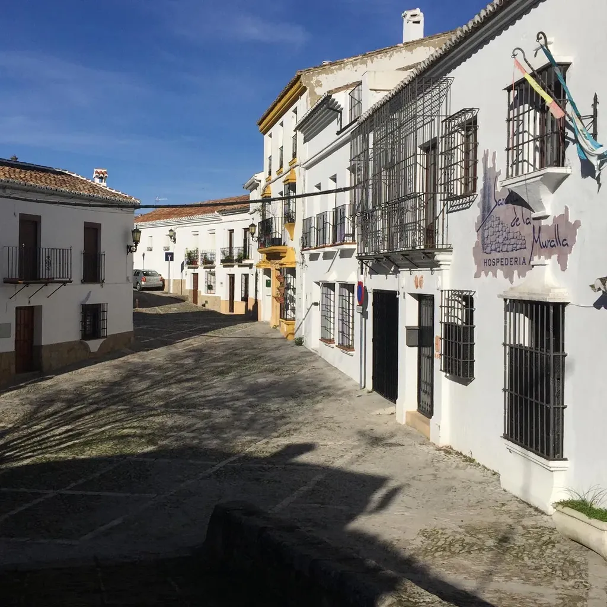
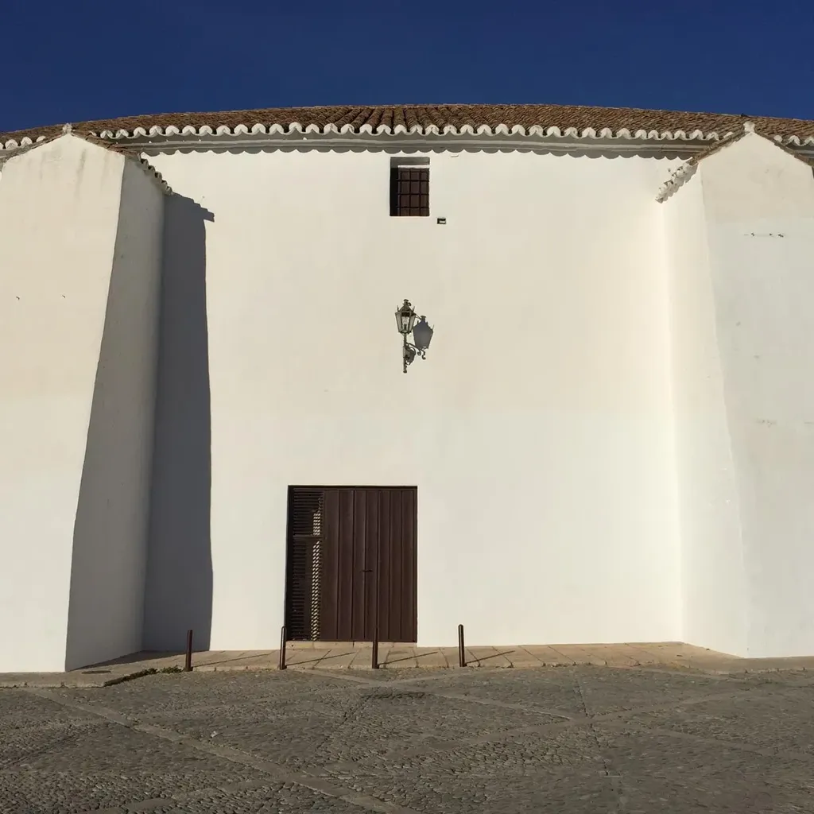

### Mercredi 21, Cordoue

C’est encore la bagarre avec les enfants, Tim provoque Émile qui tombe, se fait mal au genou, et ne bouge plus tant il est persuadé de s’être à nouveau fracturé le tibia. Difficile dans ces conditions de ressentir un quelconque génie du lieu dans la mosquée. J’étais sous les arches de briques en 1994, et si mon souvenir ne me trompe pas, j’étais seul ou presque. Cette fois : musique, préparation d’un concert, hurlements d’enfants, applaudissements de groupes… Plus le capitalisme se propage, plus les lieux célèbres sont infréquentables.

J’ai commencé *La fin de l’homme rouge*. Préface sublime et inquiétante quant à la nature intrinsèquement guerrière du Russe. Rien de très réjouissant dans notre contexte contemporain, comme la sensation que le monde pourrait très vite exploser par un excès de la russitude que Poutine semble incarner.

Et puis viennent les témoignages des Russes, leurs récits de l’utopie, de l’espoir éveillé par la Pérestroïka. Je pourrais coller leurs mots à mes propres attentes quant à un Internet libre et ouvert. Constat amer que nos rêves collectifs restent trop souvent des rêves, peut-être parce que, à un moment donné, nous leur accordons plus d’importance qu’à l’action.

J’ai théorisé, j’ai pensé, j’ai prêché, j’ai changé ma vie, pour me retrouver finalement presque seul. L’Histoire ne se dessine pas, elle se découvre *a posteriori*.

Alors nous voyageons, mal, rendant les enfants malheureux, ce qui nous rend malheureux en retour.

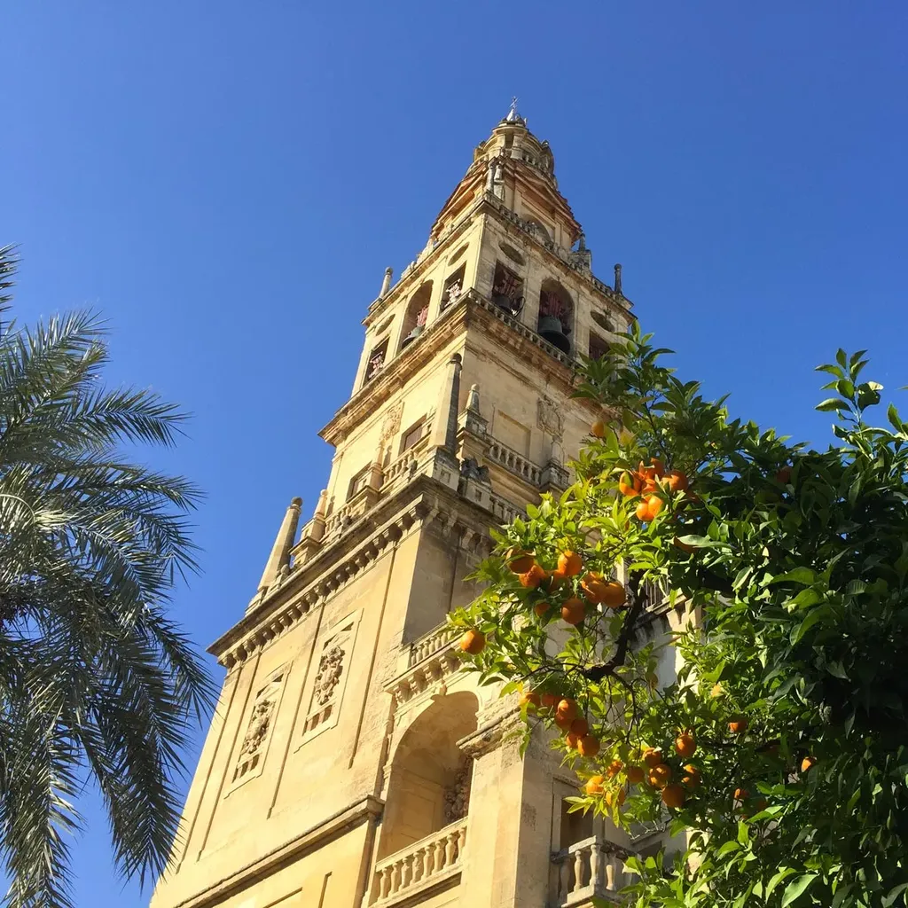

---

Hier, j’ai appris qu’on m’accordait [la bourse d’écriture numérique sur la narration géolocalisée](../../2016/11/des-livres-a-lire-sur-le-territoire.md), simplement on me demande un synopsis pour la fin janvier et un début de narration contextualisée, ce qui force à développer toute la technologie en préalable. Impossible, d’autant que je n’écris jamais de synopsis.

### Mercredi 21, Grenade

Tous les soirs, dans toutes les villes espagnoles, c’est le même choc. La foule envahit les artères commerçantes, des familles entières, des bandes de jeunes et de moins jeunes, dans une bonne humeur réjouissante. Impression de découvrir ce que devaient être les villes partout en France avant l’invention des centres commerciaux. Même les rues de Paris ne sont pas aussi animées.

### Jeudi 22, Grenade

Promenade dans la vieille ville, avec perspective sur la Sierra Nevada enneigée. J’espère tomber sur la place Joe Strummer, mais je refuse de la chercher, et elle m’échappe.

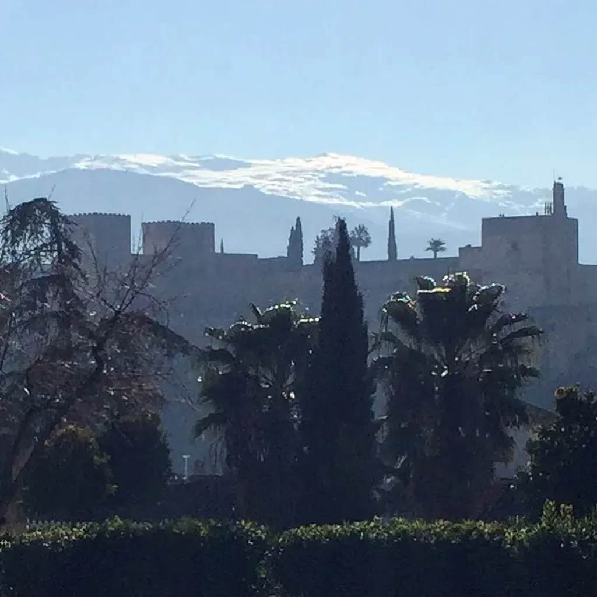

---

Au sommet de l’Alhambra, Émile, neuf ans, qui traite son frère de mythomane, parce que celui-ci prétend être capable de lancer des pierres plus loin qu’il ne semble possible.

---

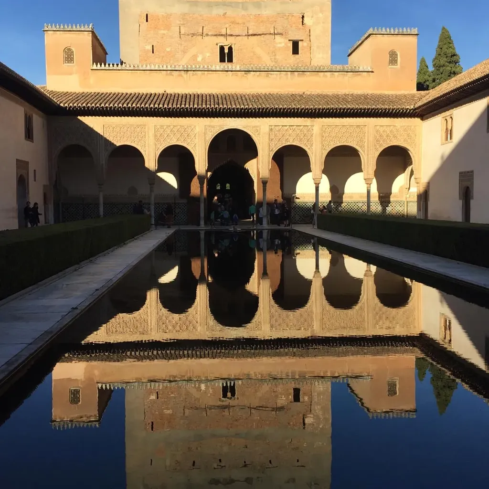
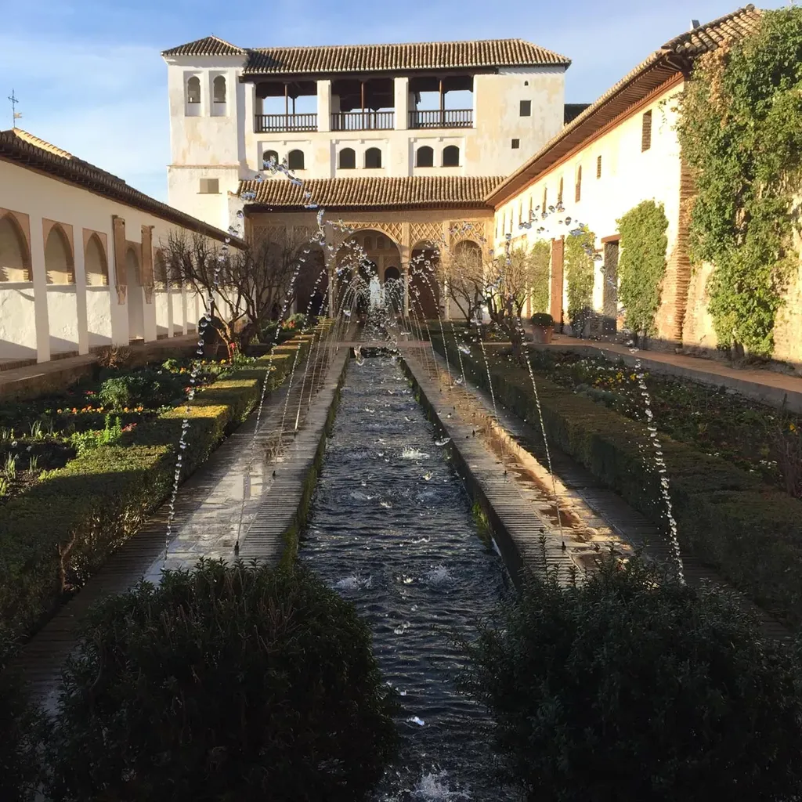

---

Je suis venu à Grenade en 1994 et je ne me souviens de rien, juste d’une puissante impression de légèreté devant les stucs de l’Alhambra, impression que le *poliçage* touristique interdit d’éprouver désormais. Je me demande comment j’ai pu oublier les jardins en terrasse avec les fontaines qui se déversent les unes dans les autres.

Émile essaie d’imaginer des fontaines qui s’alimenteraient elles-mêmes sans recours à une source d’énergie extérieure. Je lui explique que c’est impossible. Il complique son système en introduisant des moulins à eau qui font marcher des pompes. Je me souviens qu’à son âge je me croyais moi aussi capable d’inventer le mouvement perpétuel. J’ai expliqué à Émile que si cette prouesse était possible l’univers exploserait, car on pourrait lui ajouter une quantité infinie d’énergie. Il m’a fait remarquer que l’univers grandissait, et qu’il pourrait grandir infiniment sans exploser. Et si inventer le mouvement perpétuel revenait à inventer l’immortalité ? Une chimère comme une autre.

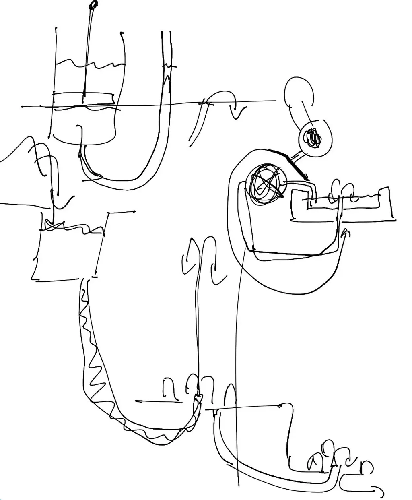

### Vendredi 23, Aéroport de Malaga

Retour à la case départ après notre boucle en Andalousie. Je suis reposé. Isa a toujours la crève, Tim est pratiquement sorti de la sienne, nous avons engrangé quelques images : les orangers chargés de fruits comme une promesse de paradis.

Avant de quitter notre hôtel de Grenade, nous entendons sur la BBC qu’il fera aujourd’hui 14°C à Londres. Nous nous réjouissons de la fin de notre civilisation.

J’ai commencé hier le cycle *Culture* de Iain Banks : entrant dans un monde, comme quand je lisais les classiques de la SF, avec l’envie de ne pas lâcher le texte, mais j’éprouve la même sensation que quand j’étais ado, alors à quoi bon répéter invariablement ce que j’ai aimé ? Cette œuvre de littérature mimétique cultive l’immobilisme.

### Samedi 24, Balaruc

Mon nouvel appareil photo rapproche les Pyrénées.

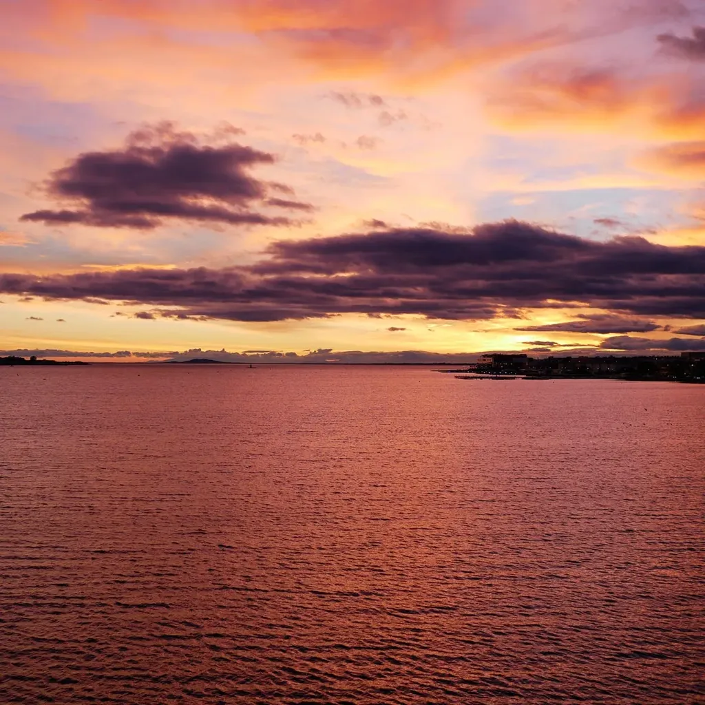
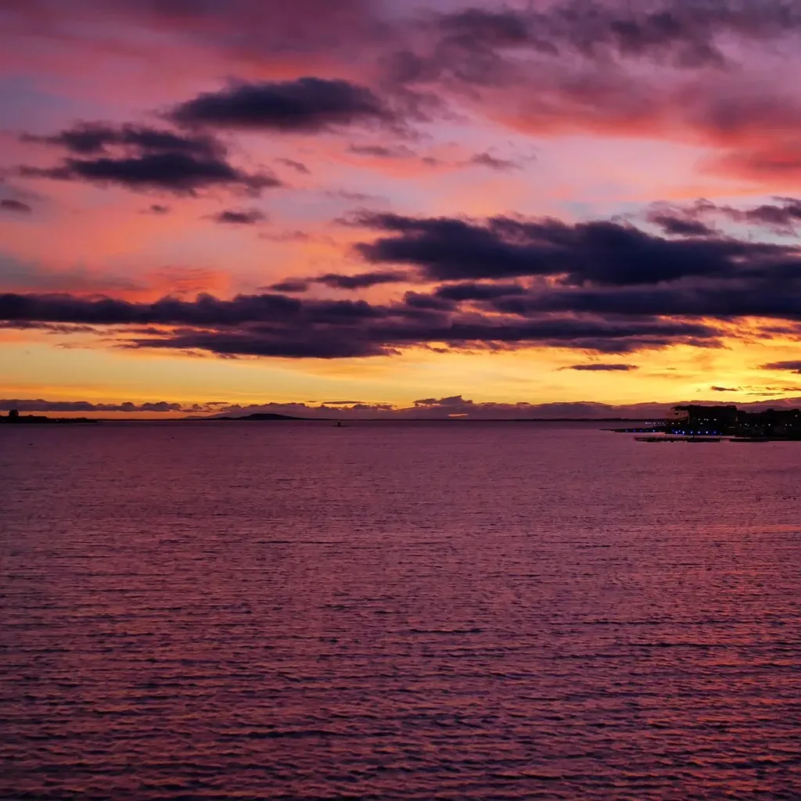
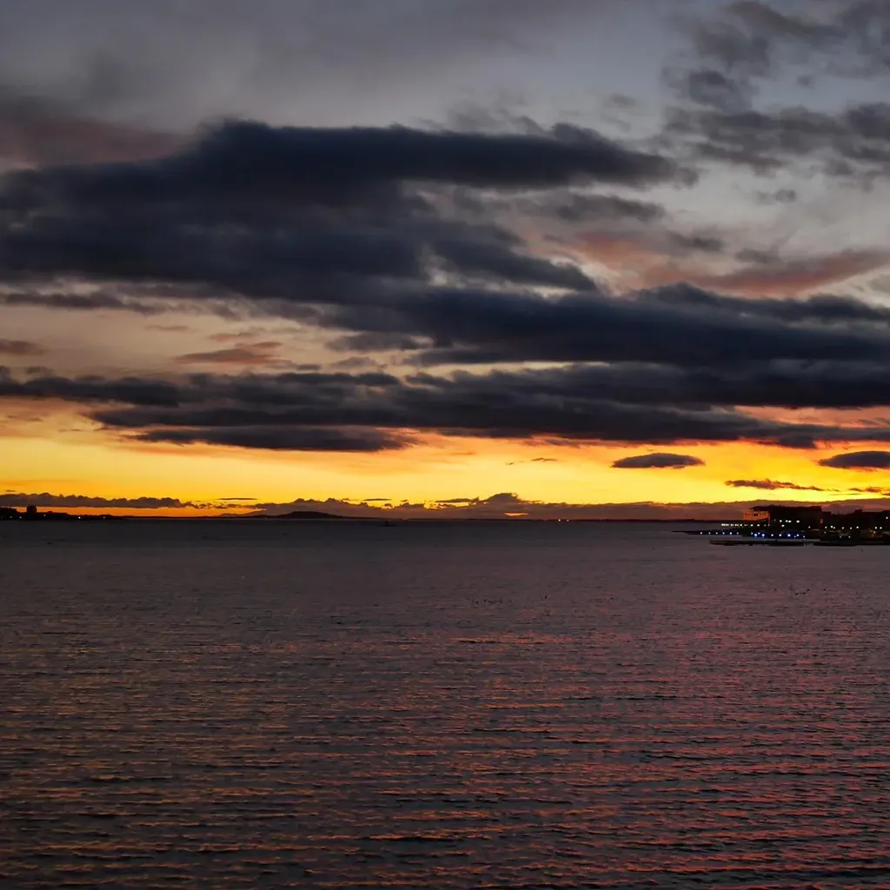

### Lundi 26, Nancy

À Barcelone, notre amie pharmacienne a découvert que les antidépresseurs administrés par les oncologues réduisent la performance des chimiothérapies. J’ai tout de suite imaginé un écrivain malade qui lutte contre ce scandale (écrivain poursuivi par des laboratoires qui veulent le faire taire). Le personnage d’un nouveau thriller médical a jailli dans ma tête alors même que *Résistants* n’est pas tout à fait en boîte. Ça ne va pas ! Je n’ai pas l’intention de devenir un spécialiste du thriller médical.

### Mardi 27, Nancy

Il existe durant les fêtes des journées douces comme en été durant les fortes chaleurs, des journées assez longues pour laisser du temps à la solitude, mais avec d’incessantes possibilités d’interaction. Je n’oublie pas d’autres circonstances où les fêtes étaient pour moi difficiles. La vie se joue par vagues qui se brisent par mégarde.

Je suis à un instant où je n’en veux à personne, je n’ai personne contre qui pester. Je suis détendu, ou peut-être endormi, peu désireux de répéter les éternelles rengaines contre mes ennemis politiques ou esthétiques. Je me fiche d’eux peut-être parce que je ne me suis jamais senti aussi impuissant.

Me faisant à l’idée que le monde entre en décadence, je me concocte un petit cocon que j’espère prolonger le plus longtemps possible. Attitude épicurienne propre aux époques troublées. Historiquement intenable, bien sûr, d’autant que cette idée de décadence n’est qu’une illusion médiatique. Il suffit de porter son regard sur les statistiques, « moins de morts violentes sur la planète d’année en année », toujours plus de merveilles du côté des arts et des sciences.

Demain quelque chose réussira à me rendre fou, comme les idées fausses sur notre monde. En attendant, je suis au café du Commerce, ambiance douillette, avec des bourgeois en grandes discussions. Simplement, je ne leur parle pas, et c’est ça qui coince, personne ne se parle, sauf ceux qui se connaissent, et encore, moi-même, je suis revenu à mon silence d’avant le Web, je n’entre plus en interaction, comme l’exigeaient mes préceptes du parfait connecteur.

Je suis sur le même rythme que *Culture* de Iain Banks. Je suis entré dans une barbe à papa, que le café bondé ne risque pas d’altérer. La vie pourrait continuer comme ça. Quelques courses, quelques retrouvailles avec des amis ou des parents, et puis s’ennuyer à mourir.

Dans cette journée si douce, je n’ai encore saisi aucune beauté. Je me contente de flotter avec plaisir, sans qu’une décharge m’électrise le cerveau. Je suis un toxico en sevrage, l’effet de manque ne tardera pas à me secouer.

### Mercredi 28, Paris

Une grande boucle me dépose place de la Contrescarpe, dans le café du même nom, où j’ai souvent écrit. Les rues de Paris ressemblent aux salles d’un musée assez immense pour que les visiteurs ne se marchent pas sur les pieds.

Comme dans un musée tout paraît nettoyé, renettoyé, astiqué jusqu’à briller avec ostentation. Les gens eux-mêmes se faufilent, sans créer les vagues observées la semaine dernière en Espagne. Là-bas, l’enthousiasme déborde, l’avenir est devant alors qu’ici nous regardons presque systématiquement en arrière.

J’aime ce Paris, mais c’est un Paris de vieux, un Paris pour somnoler, le danger étant de s’y croire encore au centre du monde. Je me sens davantage dans la modernité chez moi dans le Midi, dans mon bureau face à l’étang, connecté au monde par la technologie. Dans Paris, tout ce que je regarde, tout ce que j’entends me susurre une musique doucereuse.

### Vendredi 30, Monts sur Guesnes

Jour blanc, froid, nous ne mettons pas le nez dehors. Je ne sors que pour acheter le pain.

### Samedi 31, Monts sur Guesnes

Imaginons une civilisation où les parents décident du sexe de leurs enfants. On peut en conclure que dans cette civilisation il n’existe pas de sexe dominant, car sinon le sexe dominant serait surreprésenté, les parents étant peu désireux d’avoir des enfants asservis. Il en résulte que la technologie est l’avenir de la femme.

#carnets #y2017 #2017-1-2-11h34
