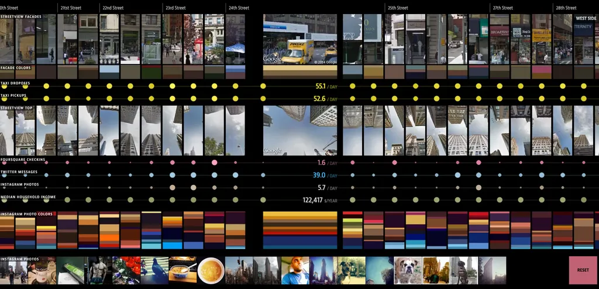
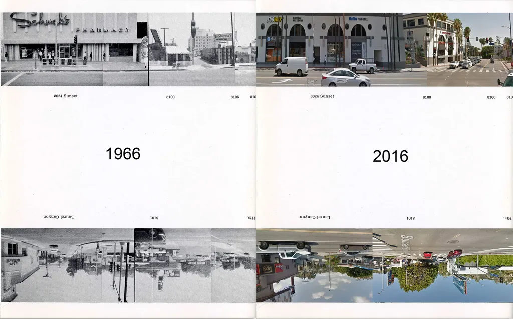
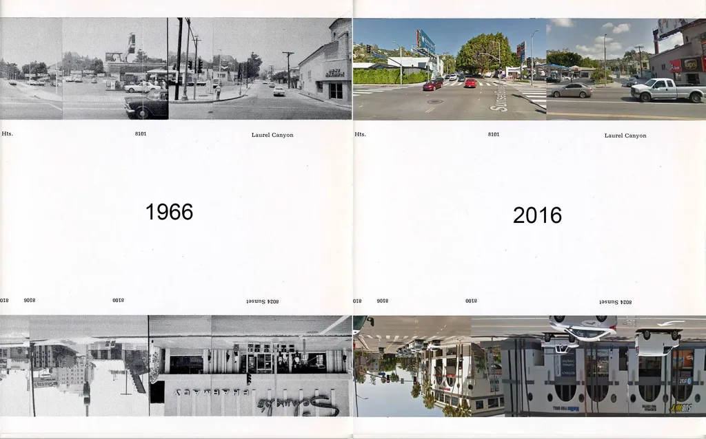

# Street View Art

J’aime l’art sériel. Les [*Trente-six vues du mont Fuji*](https://fr.wikipedia.org/wiki/Trente-six_vues_du_mont_Fuji) d’Hokusai. [Les châteaux d’eau](http://www.laboiteverte.fr/bernd-et-hilla-becher/) de Bernd et Hilla Becher. Les [*Twentysix Gasoline Stations*](%20https://fr.wikipedia.org/wiki/Twentysix_Gasoline_Stations) d’Edward Ruscha. Plutôt que représenter une chose en l’idéalisant, les artistes la montrent sous des dizaines de facettes, des dizaines de versions, comme pour affirmer que l’angle idéal ou la version idéale n’existent pas.

Chaque fois que je vois une de ces œuvres, je me dis qu’il serait intéressant de les reproduire à partir de Google Street View, de comparer ainsi deux époques et deux techniques de reproduction. J’ai un moment eu l’ambition de m’attaquer au célèbre dépliant *Every building on the Sunset Strip* du même Edward Ruscha, une œuvre qui m’a profondément marqué quand je l’ai découverte au début des années 1990, et qui me hante encore.

Et le temps passe, et je trouve toujours autre chose à faire. Et puis [François Bon évoque son envie de suivre la frontière mexicaine avec les États-Unis sur Street View](http://www.tierslivre.net/krnk/spip.php?article1955). Alors je repense à mon vieux projet. Je commence en ce début d’après-midi à faire des recherches, pour savoir si quelqu’un a déjà fait le boulot.

Je tombe sur [Tanner Teale](http://www.tannerteale.com/performing-ed-ruschas-every-building-on-the-sunset-strip/). En 2012, à partir de Street View, il simule le parcours de Ruscha sur Sunset Boulevard comme s’il était en voiture.

Je découvre ensuite [un article de Rob Walker](http://designobserver.com/article.php?id=37910) qui explique que, grâce à la technologie [Google Street View Hyperlapse](http://labs.teehanlax.com/project/hyperlapse), il a lui aussi refait sa version vidéo, mais je n’ai pas réussi à mettre la main dessus, les liens étant cassés et la techno Google Street View Hyperlapse en carafe ([mais ne pas rater la démo](https://vimeo.com/63653873)).

Grâce aux commentaires sous l’article de Rob Walker, je tombe sur [*The mother Road*, une œuvre de Hans Gremmen](http://www.hansgremmen.nl/themotherroad.php), une vidéo de type [hyperlapse](https://fr.wikipedia.org/wiki/Hyperlapse) qui refait le trajet Chicago-Los Angeles, les images ayant été capturées une à une sur Street View entre 2010 et 2011. J’ai immédiatement pensé à un court-métrage vu durant les années 1980 montrant, sur le même principe, un voyage de Paris à Marseille en accéléré. Je ne l’ai jamais revu, mais j’en garde un vif souvenir, car en quelques minutes ces images avaient fait remonter les souvenirs de mes aller-retour sur l’A6.

Après un passage par [New York et Broadway](http://on-broadway.nyc/app/), je m’en vais me balader sur Sunset boulevard, en commençant comme Ruscha au 8024, face à Laurel Canyon. Je fais une capture d’écran et je la colle sur l’originale de 1966. Par chance, un des bâtiments existe encore, ça me permet de trouver l’échelle. Mais quel boulot, une page me prend plus d’une heure. Je n’irai pas plus loin, mais ces montages espacés de cinquante ans me font de l’effet, je n’ai même pas besoin de les commenter.

#netculture #dialogue #y2017 #2017-1-30-19h52
