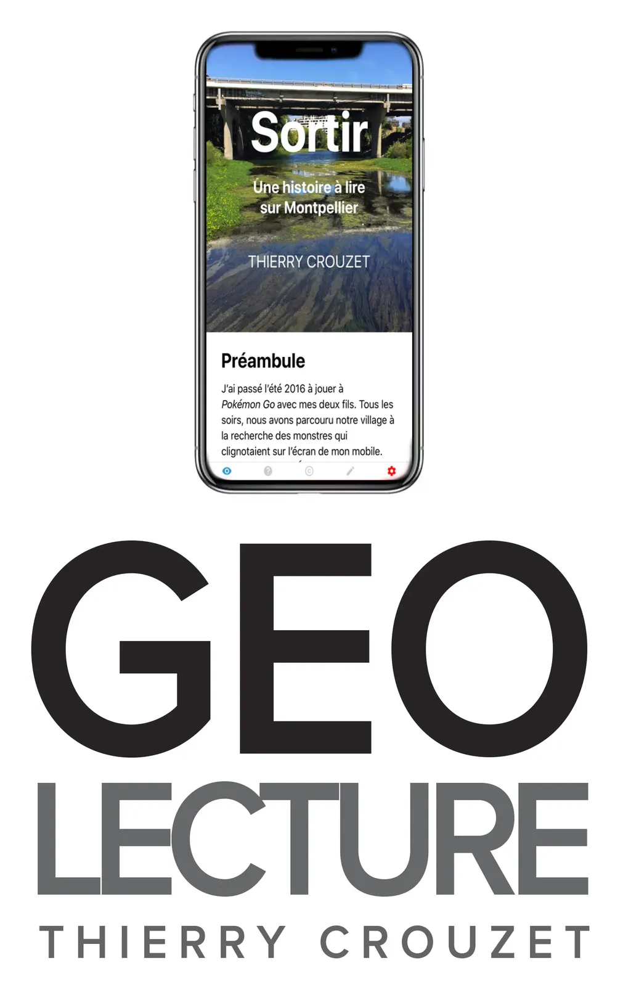

# Géolecture : testez la bêta

Depuis que j’ai joué à *Pokémon Go* pour [la première fois en juillet 2016](../../2016/7/pokemon-go-contre-ses-detracteurs-tuent-la-joie.md), j’ai cette idée d’écrire un texte dont les passages seraient géolocalisés (et le lecteur aussi).

En novembre dernier, avec l’aide de [Via Fabula](http://www.viafabula.com/), [j’ai rempli un dossier pour une bourse d’écriture numérique](../../2016/11/des-livres-a-lire-sur-le-territoire.md), que j’ai finalement reçue. En janvier, j’ai effectué des repérages sur Montpellier, j’ai esquissé un ou deux chapitres, puis je m’y suis remis en septembre. Tout est devenu plus compliqué. Comme je ne savais pas comment serait mis en forme le texte ni quelle serait l’interface, j’étais incapable d’écrire. Le texte était inconcevable indépendamment du dispositif de lecture associé. Et donc, plutôt que laisser [Via Fabula](http://www.viafabula.com/) développer l’application de son côté, j’ai décidé de façon unilatérale de m’y mettre seul, et tout de suite j’ai réussi à écrire en même temps que je codais, mon texte prenant une direction très éloignée de celle initialement prévue, et qui sera familière à ceux qui lisent [mes carnets de route](#carnet-de-route/?serial=1).

J’aurais dû anticiper cette difficulté et cette façon de m’en sortir. Depuis des années, je défends l’idée d’un auteur codeur, d’un auteur maître de ses outils, voire artisan de ses outils, et je ne sais pas pourquoi j’avais tenté de me décharger du code de la géolecture sur un tiers, un peu comme si j’étais un auteur BD qui confiait le scénario à quelqu’un d’autre, peut-être par peur de ne pas y arriver moi-même, par peur d’être un auteur d’aujourd’hui, qui non seulement pense le fond et la forme, mais pense aussi les dispositifs de lecture.

Au moment où je débuguais ma géolecture, [un appel à communications et performances](http://projekt.unimes.fr/auteur2018/) pour mars 2018 est paru, tombant à pic. Dans la présentation, sous l’égide de Stéphane Vial et Marcello Vitali-Rosati, on peut lire :

> À son insu ou non, l’auteur·e à l’ère numérique quitte peu à peu sa position traditionnelle d’utilisateur·rice des instruments scripturaux pour investir de plus en plus celle de concepteur·rice ou de co-concepteur·rice de ceux-ci, à la recherche d’une expérience d’écriture qui soit à la hauteur de ses attentes et des nouvelles possibilités offertes. Cela s’exprime par une diversité de stratégies. Tantôt l’auteur·e “braconne” de nouveaux outils d’écriture (p. ex. l’expérience de Thierry Crouzet avec Ulysses), tantôt elle et il expérimente de nouveaux arts de faire via des plateformes de partage littéraire (p. ex. Wattpad), tantôt (quoique plus rarement) elle et il prend part à l’invention de nouveaux dispositifs d’écriture et d’édition.

Je me suis dit tout de suite que je pourrais proposer une géolecture pour l’occasion, et, en même temps, j’ai tiqué, car cet appel laisse entendre que peu d’auteurs inventent leurs dispositifs d’écriture. Je crois qu’il s’agit d’une erreur d’analyse. Nous avons été nombreux à plier le blog à nos besoins, par exemple pour ma part quand je me suis attaqué au mode rouleau, [réflexion initiée dans un billet en 2014](../../2014/10/ce-qui-manque-au-blog-ou-la-revolution-litteraire.md), traduite en code quelque temps plus tard, formalisée dans *[La mécanique du texte](../../page/la-mecanique-du-texte)* en 2015.

Souvent les analystes ne veulent pas voir que la littérature numérique se cache dans les détails, dans la discrétion d’un petit bout de code, dans le minimalisme d’une interface, dans une contextualisation, une navigation, une taxinomie… Ils se laissent abuser par des dispositifs voyants, par des promesses, par tout un tas de trucs qui n’ont jamais intéressé le moindre lecteur et pas même leurs auteurs, souvent des opportunistes prompts à s’emparer de subventions.

On n’a presque jamais donné de financement aux blogueurs, aux adeptes du Web littéraire en général, pourtant c’est là et nulle part ailleurs que la révolution de la littérature numérique s’est jouée et se joue encore. Il me paraît important de le rappeler, au moment où je vous parle de ma géolecture, ou vous pourriez croire que je m’éloigne du Web alors que je ne fais que l’étendre, en utilisant les langages d’aujourd’hui et les possibilités de nos appareils de lecture actuels.

Un dispositif de lecture doit être viable, il ne doit pas être une boîte à exposer dans un musée d’art contemporain, mais un machin à mettre entre les mains des lecteurs, qui pourquoi pas éprouveront à son usage des sensations neuves.

Je dispose donc désormais d’une bêta que [je vous invite à tester](../../page/geolecture). En toute logique, pour profiter de cette application, il faut se trouver sur Montpellier, mais vous pouvez basculer en mode test et simuler des déplacements.

#geolecture #netlitterature #dialogue #y2017 #2017-10-24-20h22
