# Octobre 2017

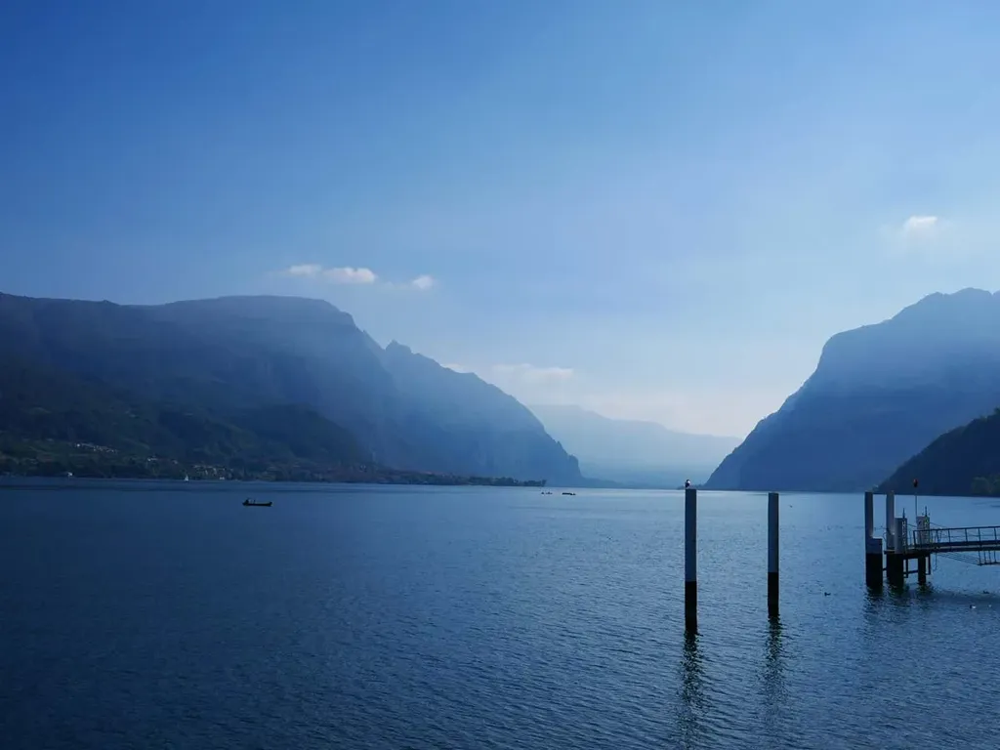

### Lundi 2, Balaruc

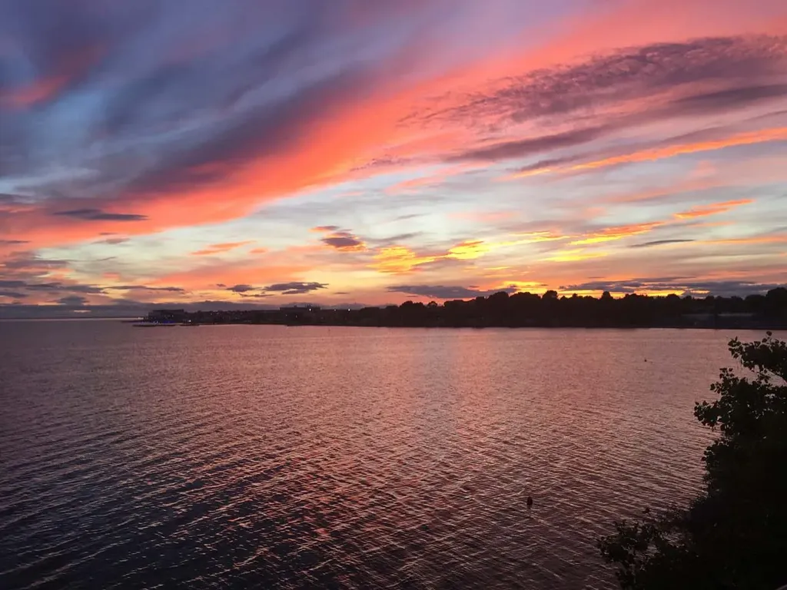
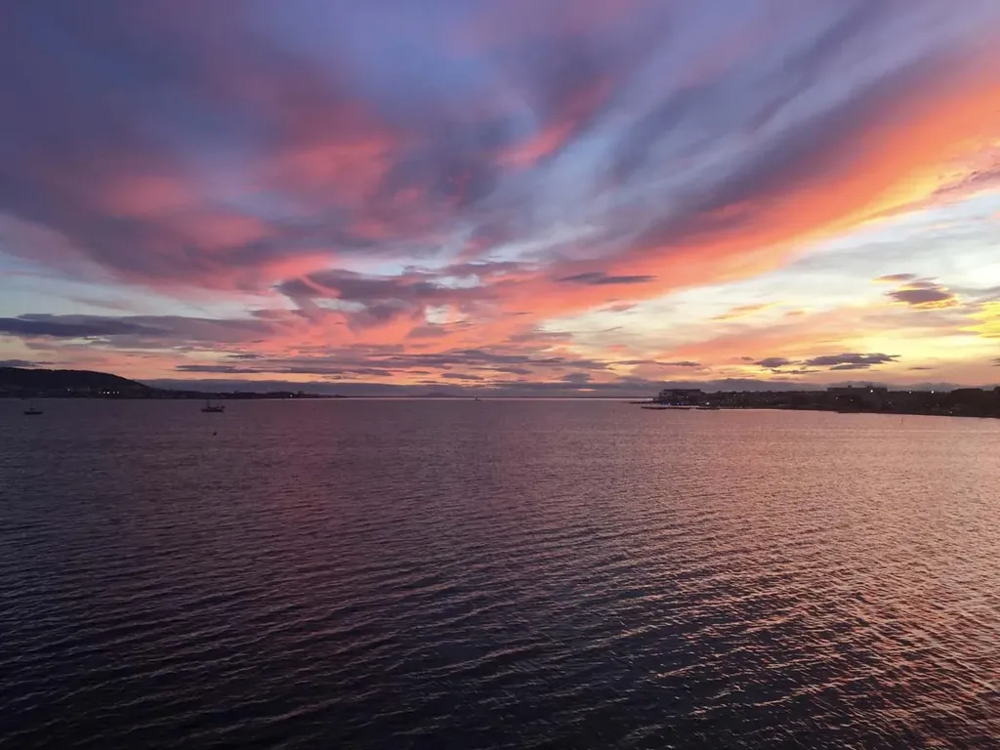

### Mardi 3, Balaruc

Après quelques journées intenses et crispantes de débuging, ma [géolecture](#geolecture) tourne sur iOS et Android. Il ne me reste plus qu’à achever le texte, et trouver des cobayes pour lire dans Montpellier. Pour le moment, nous partons demain faire un petit break en Italie, où je participe à une conférence.

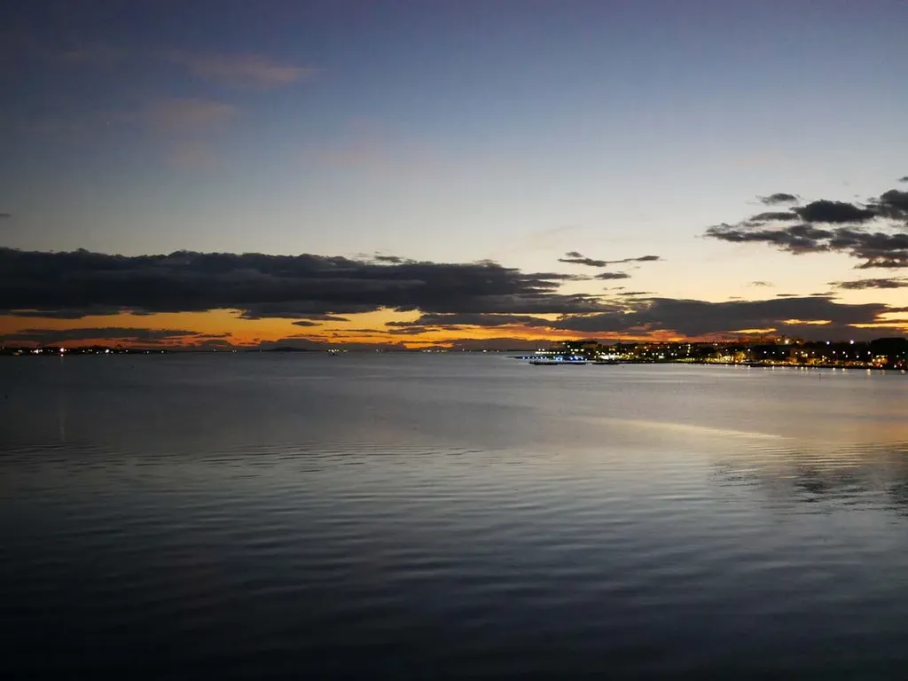
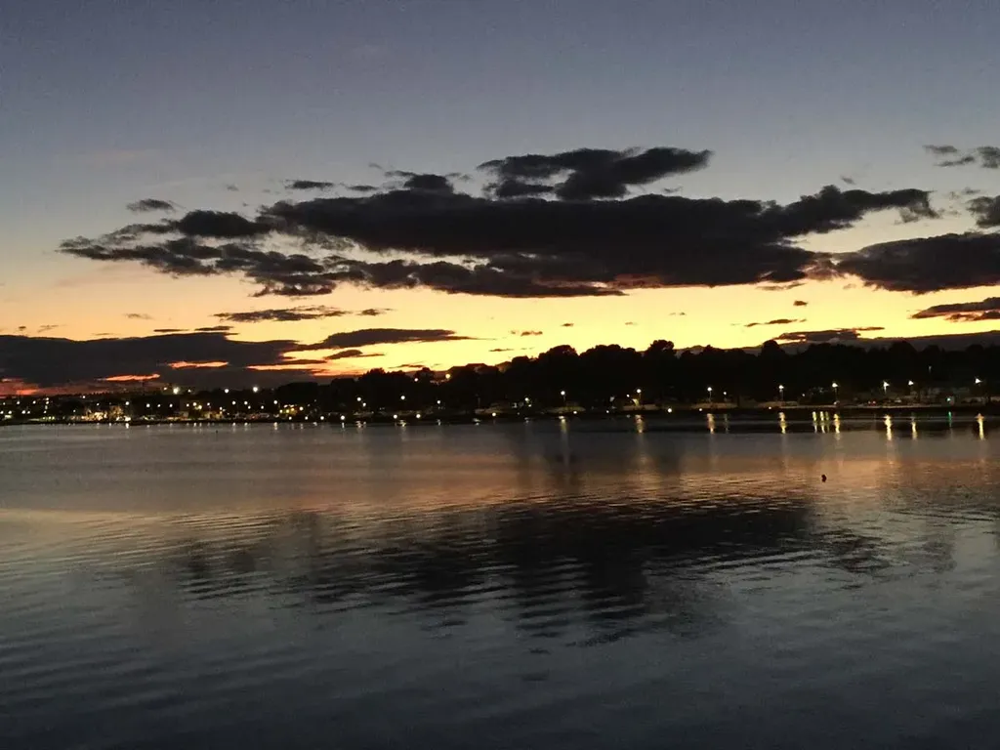

### Mercredi 4, Bergame

Nous quittons la maison sous le soleil, passons Grenoble, puis pénétrons dans une sublime vallée de la Maurienne, jaune et rouge, les sommets parfois entourés de ronds de brouillard soufflés par un invisible fumeur de cigares. Après le tunnel du Fréjus, une fois en Italie, le ciel a disparu dans une nappe laiteuse, tout s’est aplati, jusqu’à ce que jaillisse de la brume les tours et les coupoles de Bergame. Cette ville vous attrape tout de suite, avec ses alignements rectilignes encore accrochés à la plaine du Po qui soudain cognent les collines dévalant des Alpes où se perche la ville haute, musée vivant, paysage de conte de fée, avec des empilements de palais enchevêtrés les uns dans les autres, évasés autour de places bordées de monuments glorieux.

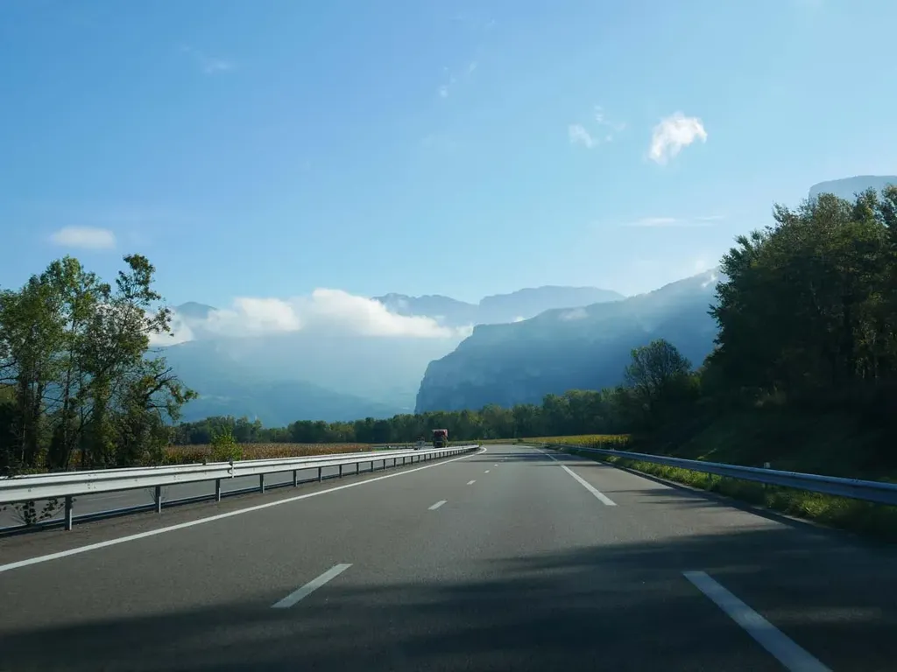
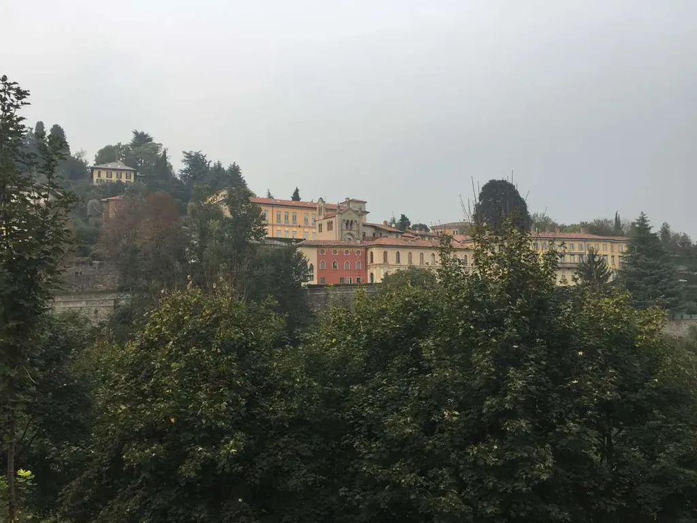

---

Il fait nuit et doux. Je pars courir. Je tourne, grimpe, j’avale les kilomètres, descends, remonte, je ne retrouve plus la ville. Par moment, j’atteins des belvédères, je vois des campaniles au loin, je vais vers eux, les perds, les retrouve. Je dois plusieurs fois demander mon chemin avant d’atteindre une des quatre portes qui s’ouvrent dans les fortifications. Aucune ville ne m’a jamais autant désorienté : impression d’être dans un dédale enroulé sur lui-même en plusieurs couches superposées.

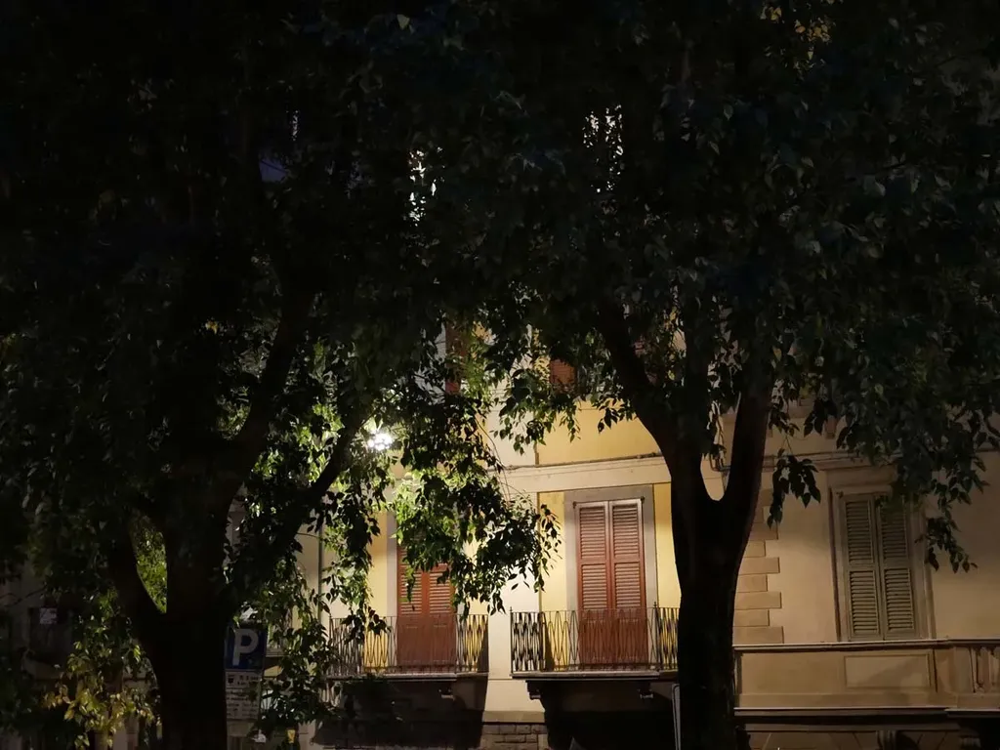

### Jeudi 5, Lac de Côme

Comme sur les cartes postales : soleil, bleu de l’eau, bleu du ciel, vapeur vers les cimes. Je récupère, après mes deux semaines de codage, codage qui comme toujours met mon cerveau en ébullition, jusqu’à faire de moi une boule de nerfs. Reste que maintenant je dispose de ma technologie et peux rêver de l’utiliser partout. Je devais collaborer avec des dev, j’ai collaboré avec moi-même, dans l’espoir sans doute vain de maîtriser toutes les formes d’écriture.

Sur la route, hier, nous avons écouté une émission sur Sacha Guitry, auquel je ne connais rien, et que, par le peu que j’entends parfois de lui, ne me donne pas envie d’en savoir davantage. Mais une chose m’est apparue évidente : les grands dramaturges écrivent des pièces pour eux-mêmes. C’était vrai pour Shakespeare, pour Molière, pour beaucoup d’autres. Il ne me vient pas à l’idée d’écrire pour la scène, car je serais incapable de monter sur scène, sinon pour y jouer mon propre rôle. En revanche, je peux écrire des géolectures, des sortes de pièces de théâtre pour un seul spectateur et aucun acteur.

---

Bellagio. La beauté coule à flots sur les berges du lac. L’automne distille son miel pour nous ensorceler. Chaque seconde est presque douloureuse dans l’air immobile. J’ai pris quelques photos, mais je les sais insuffisantes. Je renouvelle les prises de vue, comme si je pouvais saisir quelque chose qui la première fois n’a pas été enregistré, et qui en fait ne peut pas l’être.

Bellagio est bellissimo, merveillosso. Pas difficile de comprendre pourquoi depuis des siècles les artistes passent du temps dans ces parages. Je devrais venir ici lire mes textes avant de les publier, et peut-être que je les jetterais tous.

Même pas, parce que j’aime le côté brouillon, un peu brut, celui de la plage, avec des galets, des cailloux plus rugueux, de simples esquifs en plastique à proximité de coques plus racées, une maison couverte de vigne vierge rougissante, un cyprès majestueux, un marronnier, plus loin le parc d’une immense propriété, avec son port privé, un hydravion jaune se pose, un hors-bord jaune arrive, il double une bouée jaune, disparaît derrière une digue, avec quelques tables où un couple longtemps a dégusté du vin rouge servi dans des verres ballons. Un marteau piqueur trouble l’harmonie, comme cette phrase qui pourrait être mieux tournée, mais qui ne doit pas l’être, parce que la perfection n’existe pas et qu’il serait dangereux de laisser croire le contraire. Pourtant, ici, on est aussi près que possible du merveilleux.

Des vagues battent le quai et la plage, émises depuis l’autre bout du lac, qu’elles ont traversé comme la lumière l’espace. Les bateaux dansent, assez agités pour que les drisses cognent contre les mats en aluminium. Le marteau piqueur se fait trop insistant, comme un défaut de style qui nous détournerait d’un auteur que nous pourrions pourtant aimer.

Quand j’écris en extérieur, je devrais noter mes coordonnées GPS, que plus tard vous puissiez voir par mes yeux, vous asseoir sur le même banc, par une semblable après-midi ensoleillée de début octobre. La littérature deviendrait une expérience du corps, et non seulement un jeu d’esprit. Je n’aurais pas besoin de décrire la brume bleutée, ce nimbe qui délave le bleu, vous pourriez le savourer, et alors nous partagerions quelque chose de plus, nous serions amis, côte à côte, dans une proximité du même ordre que celle suscitée par certains grands auteurs, bien après leur mort, et que des aficionados suivent pas à pas.

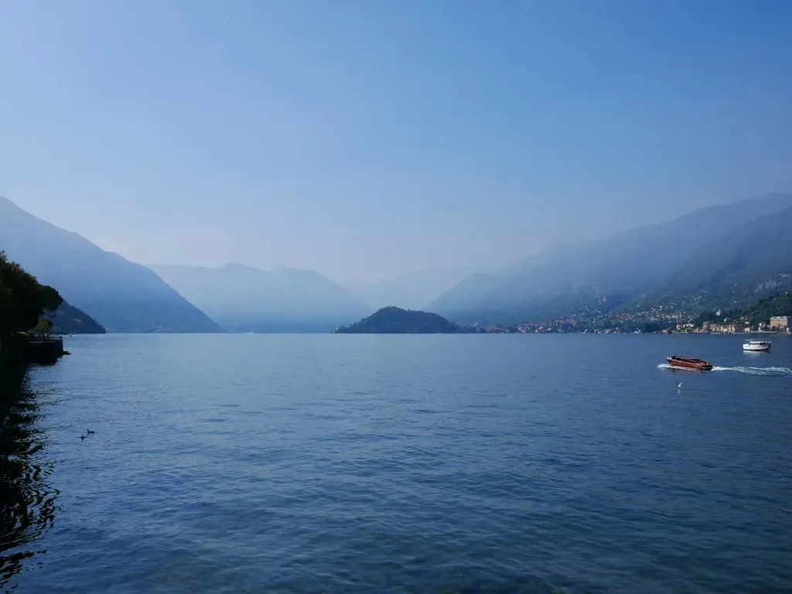
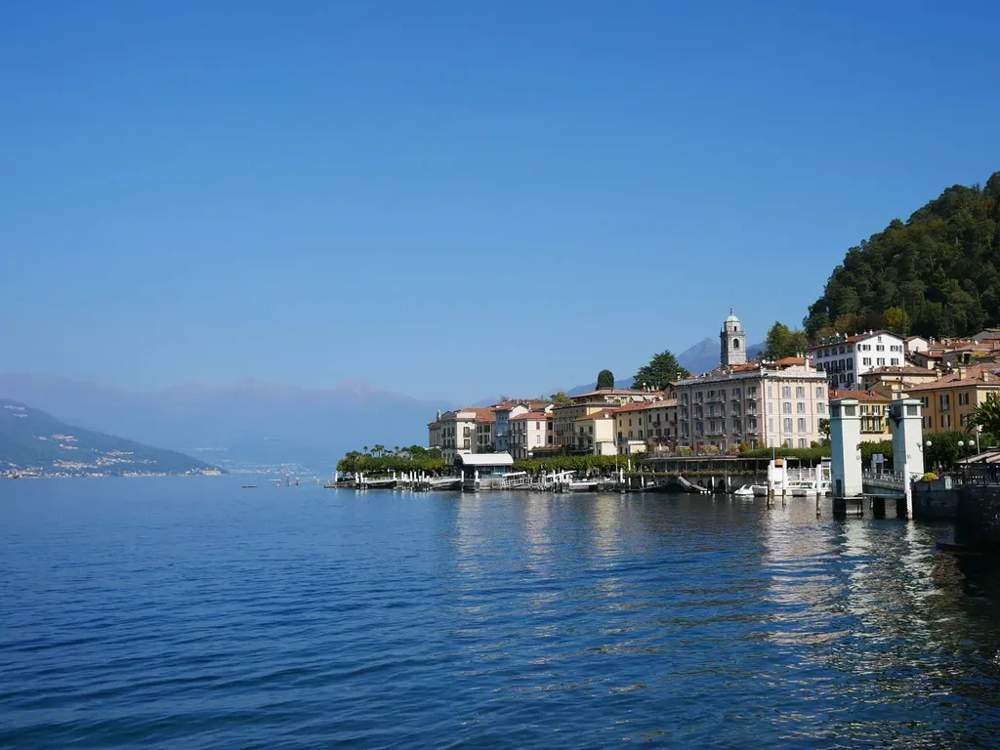
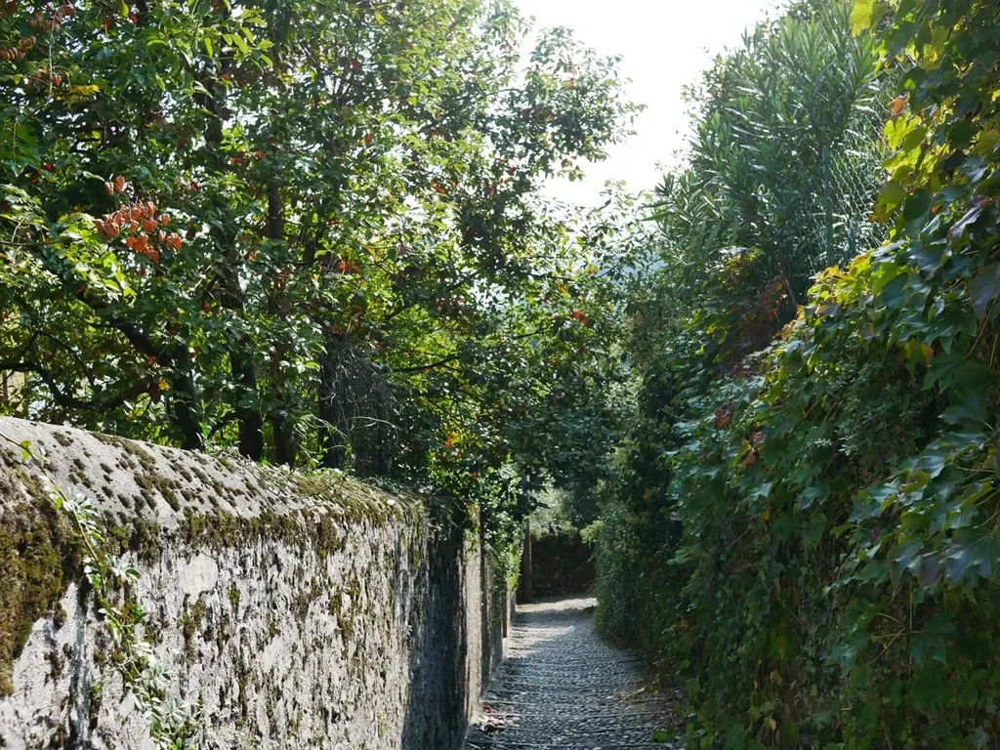
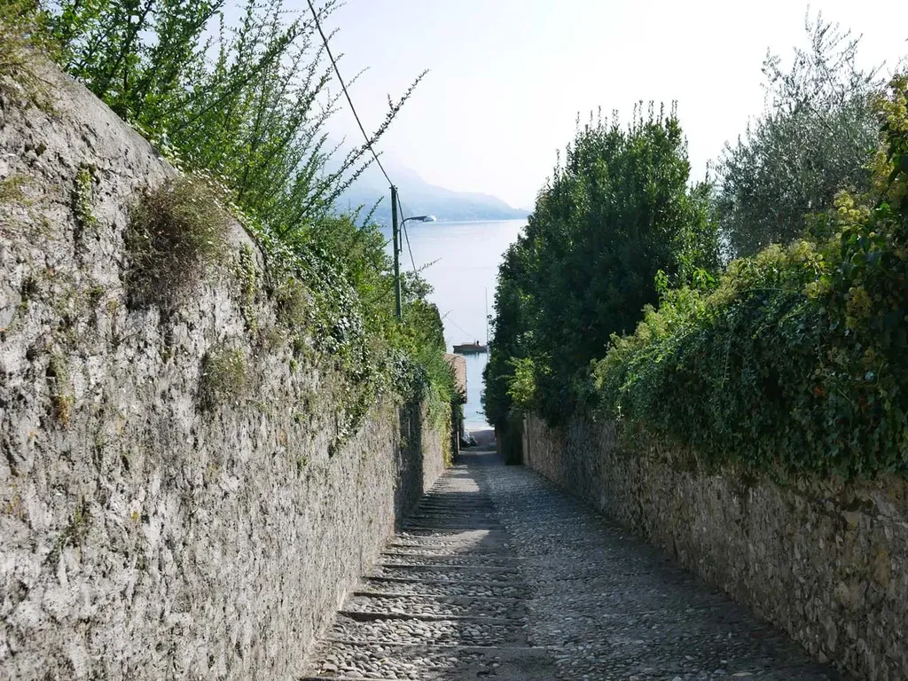
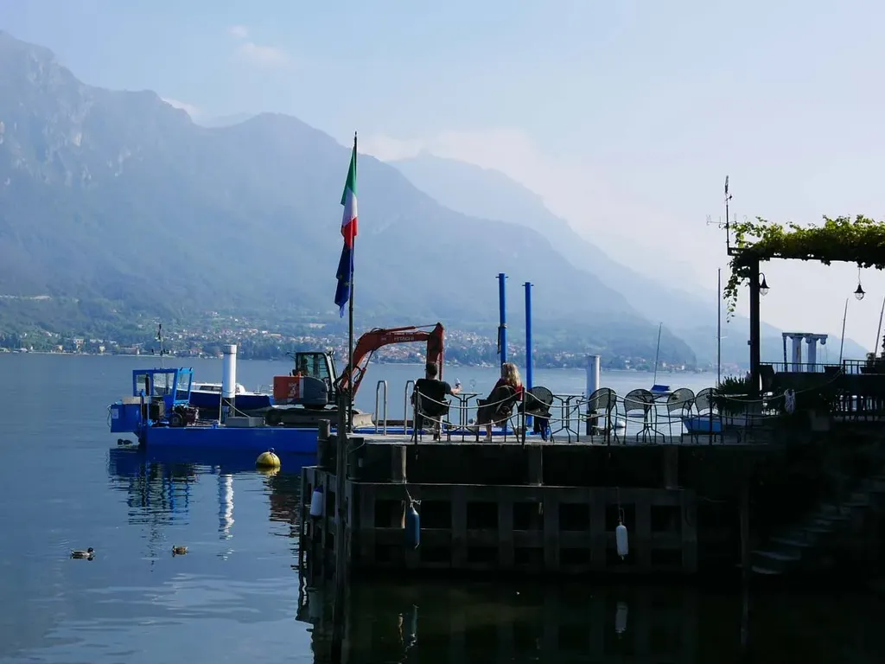
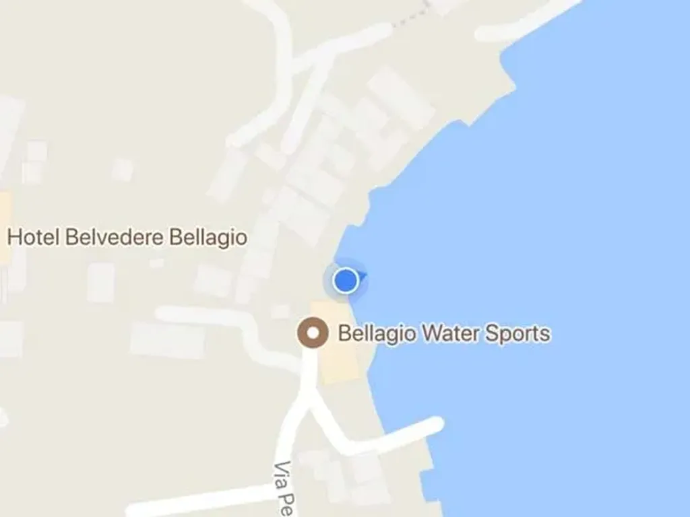

---

Côme, une de ces villes qui tournent le dos à l’eau à ses pieds, qui s’enroule autour de sa cathédrale, qui fait passer une route bruyante le long de ses quais. Ville trop grande, trop opulente, trop commerçante pour être attirante, d’autant que le lac ne s’y dévoile pas dans toute sa longueur, caché par des collines boisées de petits immeubles, devant lesquels décollent des hydravions assourdissants.

Le soleil se couche, traçant dans l’eau un trait éblouissant qui pointe droit sur les marches où nous nous sommes installés pour lire. J’aurais dû écrire « qui semble pointer » parce que de toute évidence plus loin en aval ou en amont d’autres flâneurs peuvent avoir la même impression, mais, en ne disant pas « semble », j’insiste sur mon solipsisme, où laisse croire que je suis solipsiste.

J’ai toujours rêvé d’être aux prises d’une grande œuvre, j’ai cru y être avec *Ératosthène*, qui n’a fait frémir personne, peut-être parce qu’encore trop classique, pas assez d’aujourd’hui, la grande œuvre d’aujourd’hui ne peut pas s’identifier à l’aide des critères anciens, elle est nécessairement fragmentaire, polyphonique, multiformelle, ça ne peut être qu’un agrégat complexe d’où émerge quelques lignes de force, et même son auteur n’est peut-être pas capable de la percevoir.

Reste que je ne sens plus l’œuvre en moi, sois j’y suis plongé à l’instant même, au point de ne plus avoir besoin de la rêver, sois je n’ai même plu la force de la rêver. J’en suis au point où je me demande « Et après ? » Après le roman sur mon père, après ma géolecture, après la mise au propre de *One Minute* ? Un grand vide occupe l’horizon que j’imagine peuplé d’infinis vagabondages, ce qui ne serait pas si désagréable, mais impliquerait de renoncer définitivement à toute visibilité.

Parce que cette question de la reconnaissance est toujours là. Je n’ai pas tout à fait renoncé au monde, à Paris, aux invitations. Je suis humain, j’ai envie qu’on me dise que je ne fais pas tout ça que pour m’illusionner… Mais puisque déjà ces exercices d’écriture m’aident à voir, je devrais en être heureux, oui, certes, pourtant je pourrais être plus attentif, plus tendu, si ces phrases qui m’aident pouvaient en aider d’autres. Ce fantasme de la notoriété est présent chez tous les artistes. Je n’ai pas confiance en ceux qui le nient.

### Vendredi 6, Bergame

Nous farnientons. De l’hôtel, nous atterrissons sur la place voisine, où nous nous échouons en terrasse au soleil, et je regarde les gens, leur façon de s’habiller, avec leurs jeans ridiculement déchirés à la hauteur des genoux, comme s’ils étaient tous des ouvriers. Moi, j’ai des jeans comme ça, parce que je les utilise pour bricoler, je ne vais plus oser sortir avec. Ces gens m’envoient aussi la fumée de leurs immondes clopes. Puis leurs cris, leur voix. Pour résumer, ils m’agressent. J’ai de plus en plus de mal avec cette musique de la ville, qu’avant j’aimais tant, et qui m’insupporte maintenant que je me cloître le plus souvent dans ma bulle au bord de l’eau. Je croyais que ce spectacle de la place publique serait inépuisable, et non, c’est sans doute ça vieillir, se lasser des choses sans en trouver d’autres pour les remplacer. Je n’en suis pas encore à ce point de non-retour. J’ai envie de traverse le monde à la course ou en vélo.

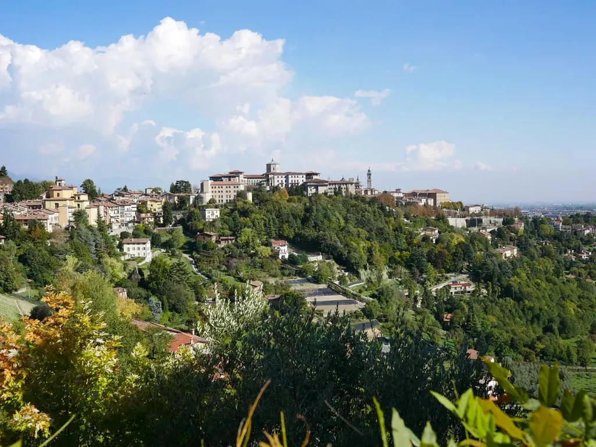
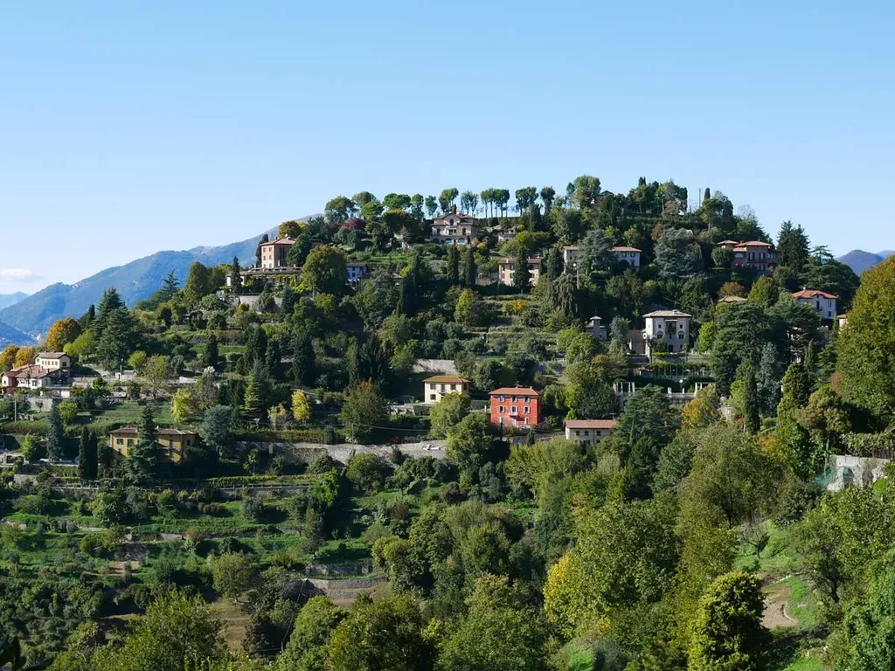

### Samedi 7, Bergame

Hier, nous avons passé l’après-midi à explorer la ville avec Annibal, le traducteur du *Geste qui sauve* en Italien. Il nous a conduit sur les hauteurs par une rue en surplomb de la ville basse, rue qui grimpe entre des villas cossues et bientôt domine la ville haute, ses campaniles et ses coupoles. Nous avons pénétré dans un jardin parachevées par la ruine d’un château médiéval, depuis lequel nous percevions au loin les Alpes enneigées, les collines du piémont, les tours de Milan, puis, dans la brume du lointain, le début de la chaîne des Apennins. Tout était parfait.

---

Une amie m’apprend que Pinterest lui a bloqué son compte parce qu’elle y a publié *Le centre du monde* de Courbet, cela après dénonciation. Terrible !

---

Je devrais être heureux. J’ai un livre traduit en plus de vingt langues, mais je dois ce succès à Didier Pittet, mon héros, mon VRP aussi bien que celui de l’hygiène des mains. Me reste encore à écrire le texte qui saura se promouvoir tout seul, sans le moindre marketing. Je n’existe pas dans la littérature, je suis encore incapable de m’y résigner. Pas pour autant que j’accepterais d’écrire toujours les mêmes livres pour qu’on finisse par me classer dans une case. Je suis un outcast, un hors des cases et j’espère le rester. Je voudrais que ce soit ma signature, avec ce carnet, commencé alors que j’avais dix-sept ans, comme colonne vertébrale.

### Dimanche 8, Bergame

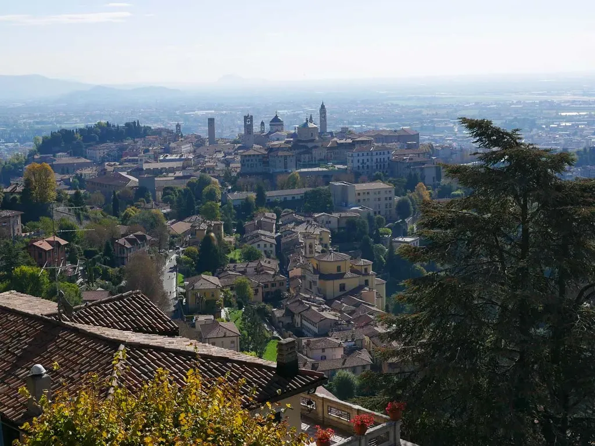
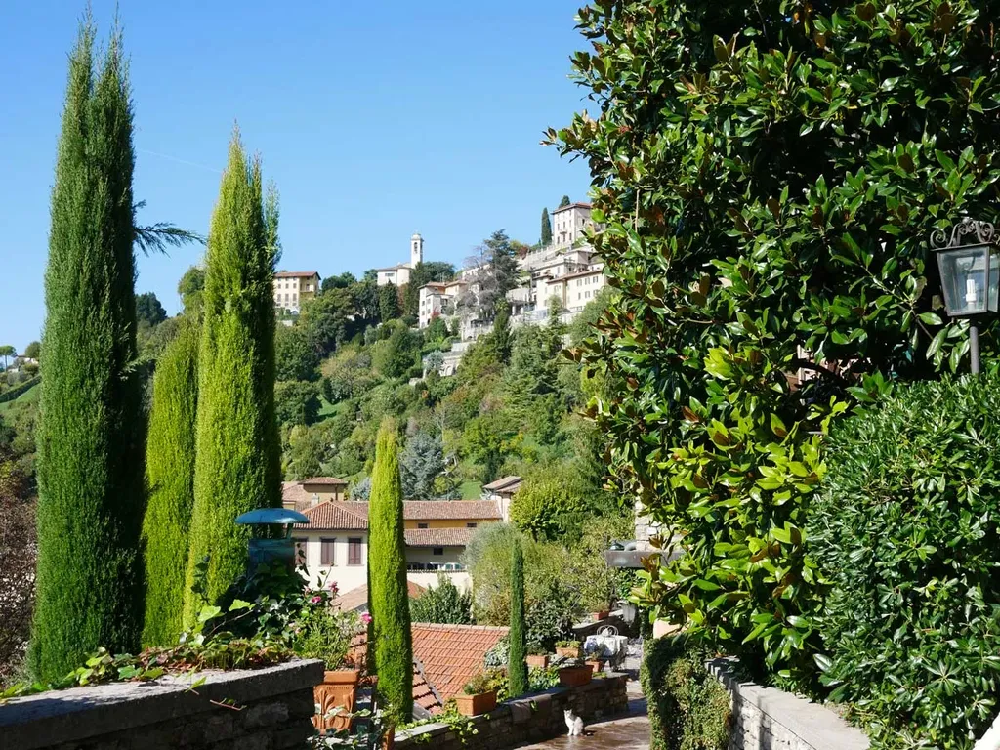
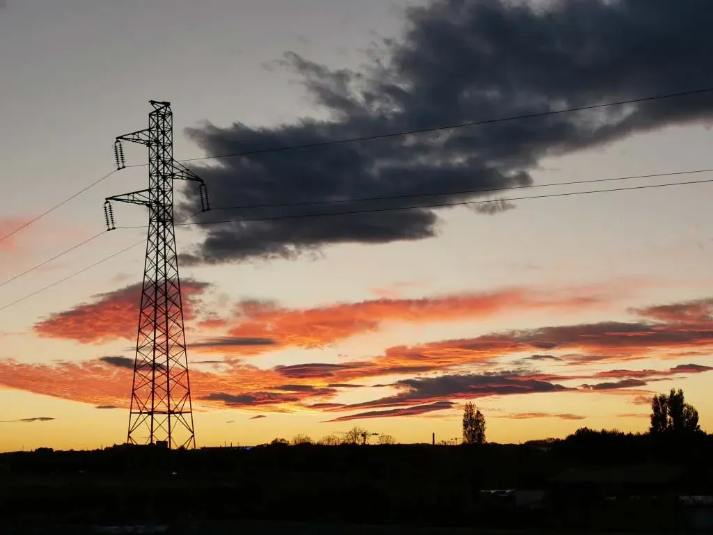

### Jeudi 12, Montpellier

J’assiste à un atelier d’écriture interactive, où des artistes payés par le gouvernement réinventent Twitter en projetant les messages sur les murs. C’est vieux comme l’informatique. Tout ça a commencé avec un ordi posé dans un musée où les visiteurs laissaient un message. Je m’étais juré d’être positif. Je me tais donc.

Tout de même. J’ai toujours des scrupules quand je me retrouve face à l’art officiel, dans des lieux luxueux, où des dizaines de personnes travaillent aux frais des contribuables. Tout ça reste choquant pour l’auteur, pour moi, habitué à me débrouiller par moi-même. Je me sens perdu, au bord de quelque chose qui m’est totalement étranger.

Je prends conscience que je pense l’art en solitaire, seul face à l’œuvre. Je n’ai jamais travaillé le collectif, sauf dans le jeu de rôle, sauf dans l’interaction sur le web, ce n’est déjà pas si mal. La géolecture a un potentiel interactif, les lecteurs pouvant lire aux mêmes endroits en même temps.

Discussion de midi avec une auteure qui a reçu une bourse d’écriture numérique alors qu’elle n’a jamais touché au numérique, qu’elle déteste ça, qu’elle prépare des trucs qui ont déjà été faits cent fois. Je m’étais juré de me taire, mais c’est plus fort que moi, d’ailleurs ceux qui pourraient mal le prendre ne me liront pas. Je suis surtout triste pour mes copains qui essaient encore d’inventer, qui poussent le support pour pousser la littérature, et qui eux ne reçoivent aucune bourse. Je dois les aider. Je n’ai pas droit de seulement me plaindre.

### Vendredi 13, Montpellier

Je croise [Arnaud Maïsetti](http://www.arnaudmaisetti.net/spip/), que je lis depuis longtemps, et tout s’illumine. En deux secondes, il me donne des idées pour ma géolecture. J’avais pensé que j’écrivais une pièce de théâtre pour un spectateur et zéro acteur. Il m’a dit « pourquoi pas retrouver des acteurs dans les lieux, qui liraient les textes. » Oui, une géolecture peut se lire en solitaire, ou en groupe, et même à des heures précises, ce qui revient à imaginer un spectacle dans l’étendue de la ville. Des acteurs pourraient même jouer des scènes que j’ai saisies lors de mes séances d’écritures en extérieur. On pourrait en inventer. Traverstir le réel. L’intensifier.

### Samedi 14, Balaruc

Un beau mail pour m’inviter à écrire un article de 6 000 signes pour une belle revue. « Super intéressant. Vous me payez combien ? » C’était la question à ne pas poser.

---

Je reçois *La forme d’une ville change plus vite, hélas, que le cœur des humains*, de Jacques Roubaud. Dedans, en marque-page, un ticket de métro horodaté le 23/10/2008 à 18:52.

### Mardi 17, Paris

Je viens de raconter en dix minutes [la vie imaginaire de Julius Gregarius à Beaubourg](https://tcrouzet.com/https://tcrouzet.com/2017/10/17/julius-gregarius), et puis j’ai filé, constatant que je n’avais pas soulevé trop d’enthousiasme. Faut dire que j’ai annoncé aux bibliothécaires réunis en conclave que leur métier n’avait aucun avenir. Je me rends compte que j’ai trouvé un assez bon argument, peut-être à développer : le livre a remplacé les dispositifs mémoriels tels que les *lukasa*, donc de nouvelles technologies, radicalement différentes du livre, et aussi de l’écriture telle que nous la connaissons, remplaceront le livre et l’écriture.

---

Dans la ville les ambitieux, en tenue de combat, se chassent les uns des autres.

---

Je cherche encore à vendre quelques idées et, en même temps, j’ai l’impression qu’un désir s’est tari en moi, comme si j’avais manqué le coche, que les opportunités s’étaient refermées, que j’avais échoué à devenir un écrivain de premier ordre… et qu’il ne me restait plus qu’à cultiver mon jardin, plutôt confortable, je l’avoue.

### Mercredi 18, Paris

Tous mes derniers livres publiés chez les éditeurs ont été des bides entre 500 et 3 000 exemplaires, pas simple après de vendre de nouveaux projets. Seul *Le geste qui sauve* a marché, mais il est en Creative Common. Je suis persuadé que nous n’en serions pas à vingt traductions si je l’avais publié sous copyright traditionnel.

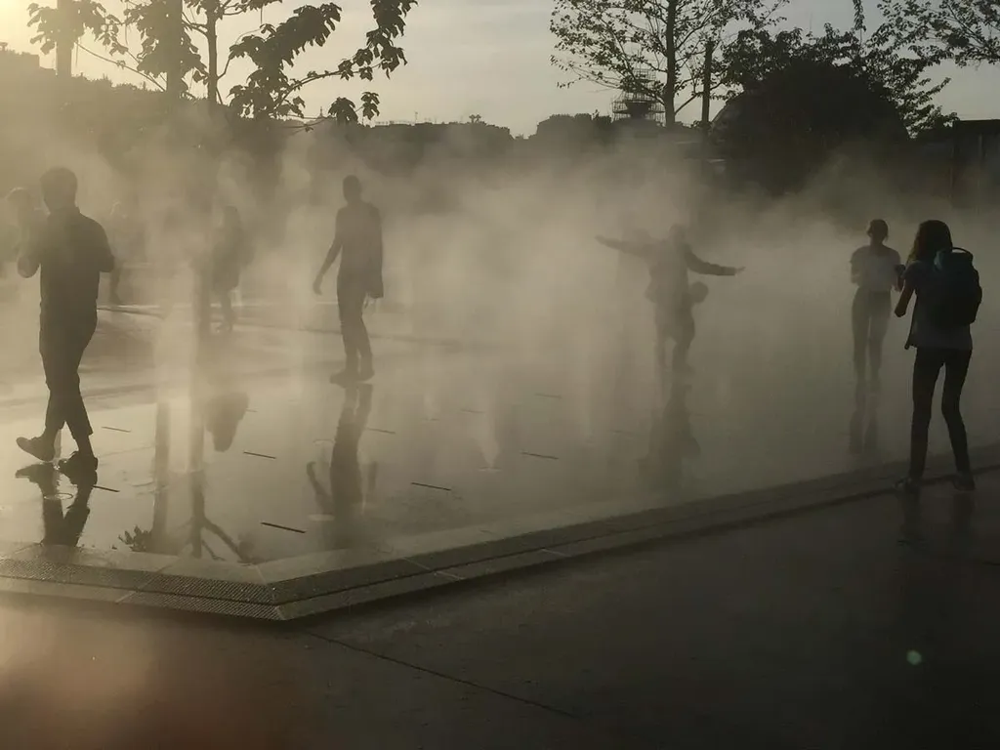
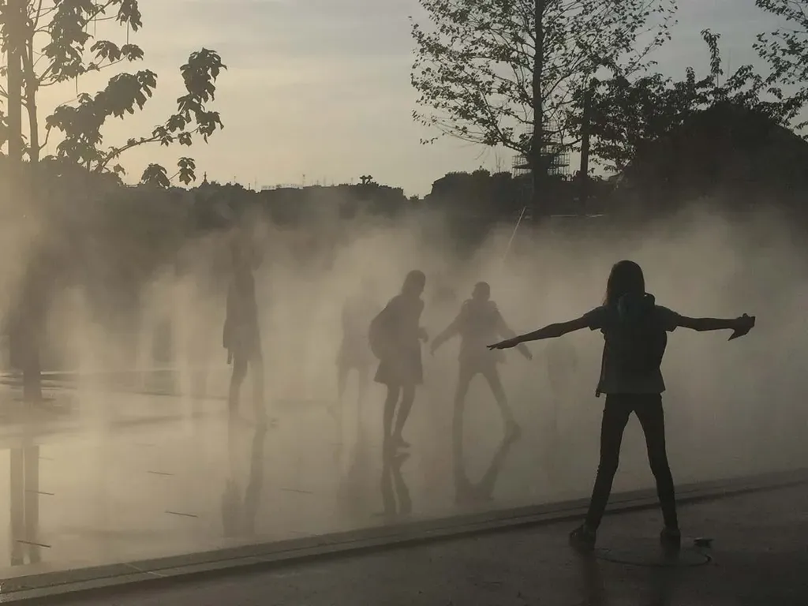

### Vendredi 20, Balaruc

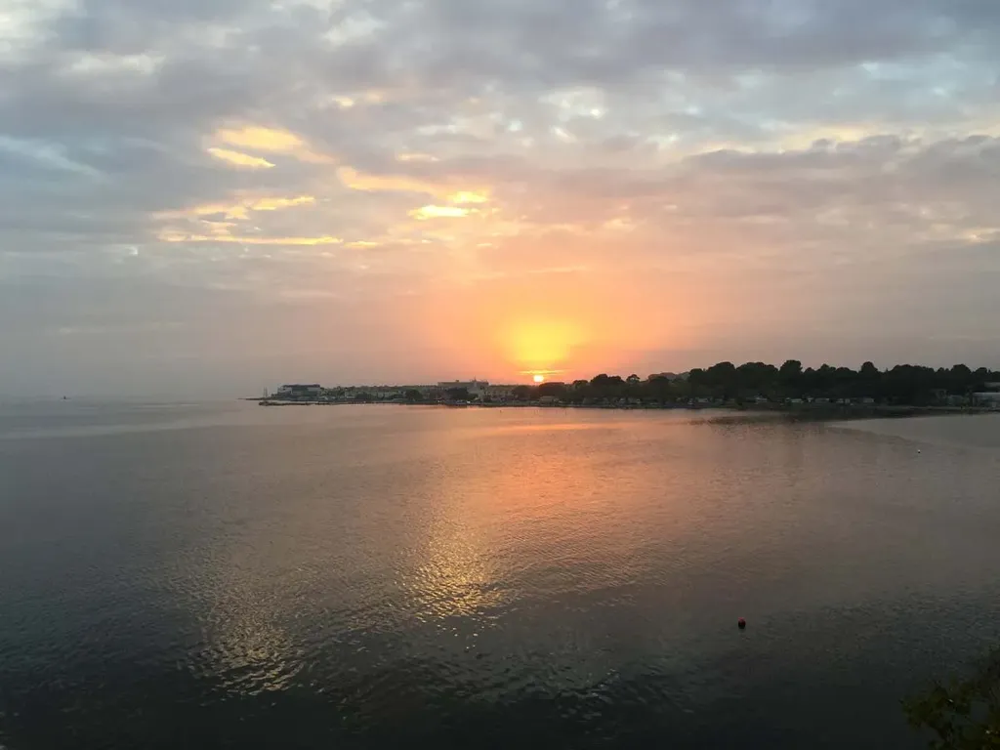

### Lundi 23, Balaruc

À Paris, on m’a fait comprendre qu’un *One minute* allait sortir, que c’était dommage pour le mien, publié en 2015 sur Wattpad, retiré depuis dans l’espoir de le placer chez un éditeur, travail commercial effectué plus que mollement vu que j’étais dans *Résistants*, puis dans *Mon père était un tueur*, puis dans la [Géolecture](https://tcrouzet.com/https://tcrouzet.com/2017/10/24/geolecture-testez-la-beta). Mais enfin, cette nouvelle m’a donné la rage. J’ai décidé de relire mon roman, de le remettre en ligne. Je reste persuadé que sur le plan romanesque il est mon texte le plus important, le plus innovant, le plus fou. Un éditeur m’a même dit que ce roman était « mind-blowing » et il ne l’a pas publié, trop exigent, trop expériemental, trop risqué financièrement.

### Mardi 24, Maillardou

J’ai un rituel les matins d’automne ou d’hiver quand je suis dans la maison familiale d’Isa. J’allume le feu alors que tout le monde dort encore. Ce matin, j’ai manqué de petits bois. Longtemps la flamme a été minuscule, hésitante, fluctuante, doublée de beaucoup de fumée. J’assistais à une naissance ou au contraire à une agonie, deux choix s’offraient et le feu a fini par choisir la vie, soudainement il a tout embrasé en un crépitement joyeux d’étincelles. Je devrais éviter d’ainsi libérer du carbone dans l’atmosphère, je devrais conserver les bûches sous leur forme bois, dans l’attente que nous trouvions une solution au réchauffement climatique, mais non, je suis comme le feu, je dois moi-même flamber.

---

Relire *One Minute* m’électrise le cerveau. Ce texte est une véritable dope pour moi, et pourrait l’être pour tous ceux qui ont une structure cérébrale semblable à la mienne. Le succès d’un auteur ne dépend que d’une adéquation neurale.

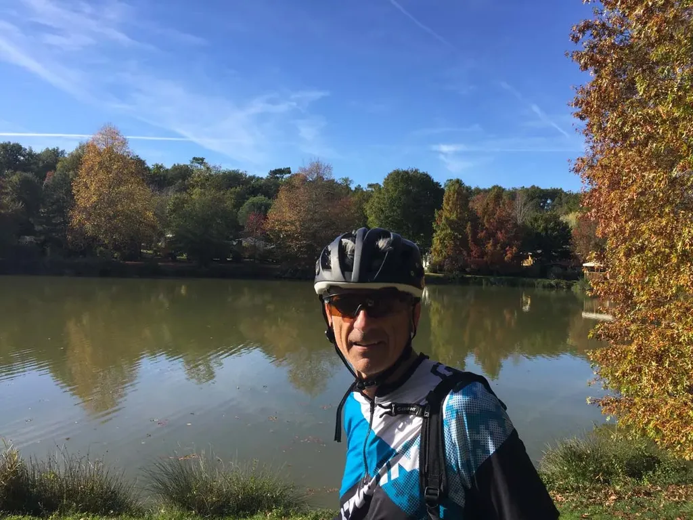

### Jeudi 26, Maillardou-Monpazier

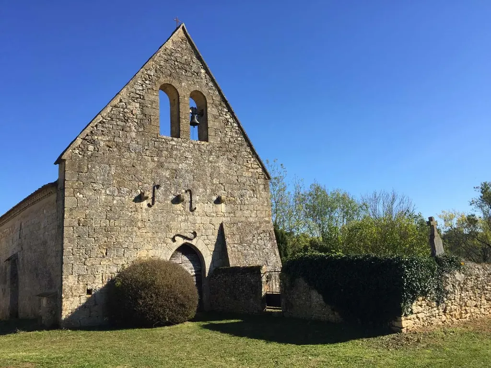
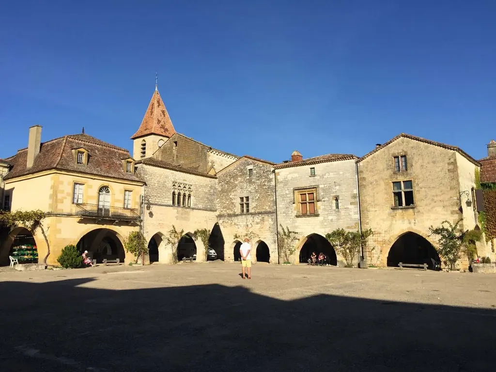

### Dimanche 29, Maillardou

Je suis cité dans un article de *Télérama* au [sujet de la Twittérature](http://www.telerama.fr/medias/les-best-sellers-2.0-secrivent-sur-les-reseaux-sociaux,n5221206.php), qui me laisse un goût amer. Par le passé, les premiers explorateurs d’un champ artistique étaient célébrés plutôt que leurs successeurs qui s’engagent sur la voie commerciale et connaissent le succès populaire. Ils twittent aujourd’hui alors que moi je ne vais pratiquement plus sur Twitter, que cet univers m’est devenu une sorte de prison. J’aimerais être plus positif, je n’y parviens pas. Je ne reçois aucune bonne nouvelle du monde extérieur, je veux dire du monde lointain dans lequel malgré tout j’exerce une petite activité artistique. Reste les feus dans la cheminée le matin, aujourd’hui brumeux et froid, les dîners en famille, aujourd’hui avec un descendant de Toqueville, puis les balades en VTT avec les enfants.

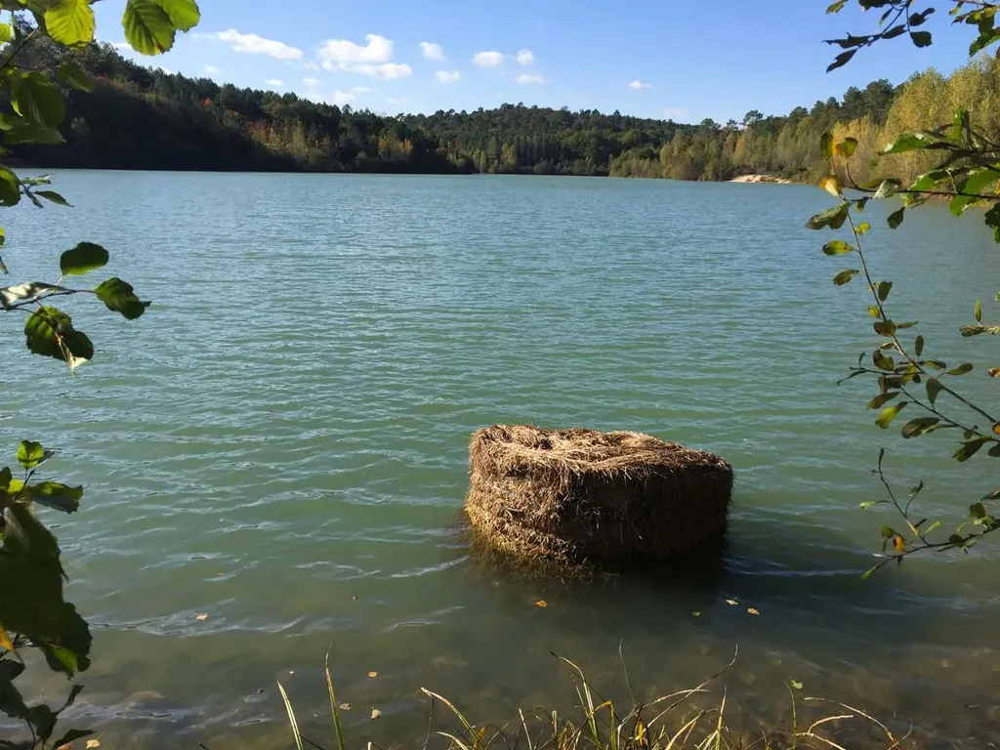

### Lundi 30, Balaruc

Le mistral tombe, rendez-vous VTT à 16:00, petite montée dans la garrigue, descente en zigzags vers les étangs alors que le soleil se couche. Une pause pour passer les coupe-vents et on file vers la pinède, puis à travers les anciens marais salants qui nous éclaboussent d’orange, avec en ligne de mire le mont Saint Clair et les Pyrénées. C’était juste sublime, pas de meilleur moment pour faire du vélo.

### Mardi 31, Balaruc

J’autopublie aujourd’hui *[One Minute](../../page/une-minute)* en papier et ebook, continuant à dépiler mes projets, pour me préparer une belle table blanche, un grand vide tendu vers l’avenir, avec la petite illusion que l’inattendu surgira et m’enchantera pour de longs mois.

Je voulais dans *Mon père était un tueur* raconter mon exploration des archives militaires, à la recherche d’une vérité illusoire. J’ai décidé de réserver cette recherche à un second texte, éventuel, qui s’appellerait *La lettre de mon père*. Tout dépendra de l’accueil qui sera fait au premier tome, que j’ai décidé de publier d’une manière ou d’une autre.

Isa ne cesse de me répéter que *One Minute* est ma forme : multiplication des points de vue, atomisation des personnages, la littérature comme un réseau, comme une métaphore de la complexité du monde. *La lettre de mon père* serait une autre façon de raconter l’histoire de mon père, plutôt que d’interroger la mémoire familiale, interroger celles des archives et des derniers survivants. Je pourrais multiplier aussi les points de vue, mais je ne suis pas sûr d’en avoir envie.

En revanche, depuis plusieurs années, je songe à raconter un moment dans la vie d’une multitude de personnes qui au même moment, sans se connaître, sans se parler, prendraient la décision de changer de vie, de s’arracher à la petite boîte où on les a rangées, et qui, par une sorte de gravité, seraient amenés à se croiser.

#carnets #y2017 #2017-11-1-14h4
