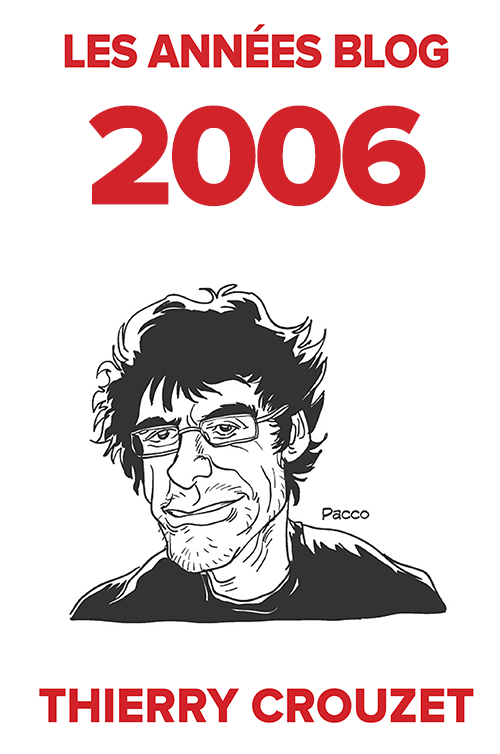

# Archiver le blog pour passer à autre chose

C’est la fin de l’année, bientôt les vacances, j’ai bouclé le roman que je publierai l’année prochaine et je ne sais pas encore à quoi je passerai mon temps dans les mois qui viennent. L’idée d’écrire hors du Web comme je viens de le faire cette année me chagrine. Je m’éloigne irrémédiablement de la matrice qui m’a stimulé durant des années, d’autant que je ne trouve aucun nouveau projet numérique dans lequel m’engouffrer avec quelques lecteurs enthousiastes.

Je vois des auteurs numériques foncer droit vers le large, inflexibles, inconscients que le vent a tourné et ne les pousse plus. Je leur ressemble, puisque je continue à publier [mes carnets de route](#carnet-de-route/?serial=1), mais je ne peux m’empêcher de penser que quelque chose cloche, à tel point que j’éprouve le besoin de faire le point sur ma vie numérique.

[Je l’ai constaté](../11/je-suis-toxicomane.md), [Neil Jomunsi vient d’effectuer le même constat](https://page42.org/fin-du-projet-bradbury-constat-dechec/), il est difficile de refaire deux fois la même chose en ligne. La nouveauté a un rôle entraînant pour les lecteurs, et, sans les lecteurs qui nous stimulent, nous n’avons pas la force de tenir le rythme. Tout simplement parce que publier pour publier n’a aucun sens. Se mettre tout nu sur le Net sans personne pour nous regarder n’est même plus de l’exhibitionnisme. Pour moi, être un auteur en ligne, [c’est être un auteur interactif](auteur-interactif-vs-narration-interactive.md).

Alors j’ai fait une chose bizarre…

1. J’ai commencé par me dire que cette interactivité s’était exercée grâce et autour du blog, et qu’en prendre la mesure revenait à prendre de la distance avec mon blog, de le regarder sous une perspective nouvelle.
2. J’ai repensé à une expérience de 2007 et 2008. J’avais sélectionné des billets et les avais fait imprimer. Pourquoi ne pas recommencer, mais sur l’intégralité des textes et images ? Pourquoi ne pas créer un fac-similé du blog ? Et puis le parcourir comme un vieil album photo.
3. J’ai en même temps songé à la fragilité du blog, à la fragilité de cet album, dont mes enfants ont peu de chance d’hériter. Mon serveur peut crasher à tout moment, mes données disparaître, cela malgré mes backups quotidiens dans le cloud (une irruption solaire particulièrement violente, l’oubli de mes mots de passe, un piratage…). La panne n’est pas le seul risque. En septembre, après être passé du protocole HTTP à HTTPS selon les injonctions de Google, j’ai compris qu’un jour j’en aurai assez de mettre les doigts dans le cambouis, de payer mon domaine, de payer mon hébergement chez OVH… Bien des blogs ont déjà disparu, d’autres sont des épaves, même certains dont le contenu est toujours actualisé alors que leur infrastructure menace de rompre. Les fissurent crèvent les yeux. Ma présence en ligne dépend trop étroitement de ma bonne volonté. Mon album photo peut s’effacer avant même que je le feuillette.
4. Jusqu’à peu, je me contentais de l’archiver en copiant les fichiers dans leur format natif, en l’occurrence WordPress. Si le projet WordPress cessait, ou si j’oubliais de suivre ses évolutions, mes textes finiraient bien vite illisibles. Ce n’est pas très rassurant (et je ne serais pas rassuré si j’avais choisi un autre CMS que WordPress). J’ai donc programmé un plug-in pour exporter mon blog en [Markdown](https://fr.wikipedia.org/wiki/Markdown), c’est-à-dire en texte brut. Je me suis tout de suite senti un peu mieux même si ça ne règle pas le problème d’une irruption solaire massive (sérieusement, toutes les œuvres numériques pourraient se volatiliser).
5. En générant ces fichiers Markdown, j’ai découvert que j’avais publié sur le blog 7,7 millions de signes depuis fin 2005, et je ne compte pas les commentaires. Je me suis dit « Merde, presque autant que *La recherche du temps perdu* (9,6 millions de signes). » Tout ça sous l’effet de la drogue sociale, tout en menant en parallèle de nombreux autres projets.
6. Grâce à [Pandoc](https://pandoc.org) et à quelques coups de syntaxe [Latex](https://www.latex-project.org/), j’ai converti automatiquement mes fichiers Markdown en PDF prêts à être publiés (une même commande Pandoc peut créer des epub ou des docx). Me voilà avec autant de livres que d’années de blog. L’opus 2011 ne comporte que 210 pages, logique [j’étais déconnecté](../../page/jai-debranche). En 2014, j’ai un lourd 588 pages, mais les photos occupent désormais beaucoup de place.
7. [Avant de publier ces textes](../../books/les-annees-blog.md), je les ai parcourus. J’ai revécu en accéléré nos interactions en ligne. J’ai constaté l’évolution de mes pratiques Web. Avant les réseaux sociaux, je publiais des billets pour un oui ou pour un non. Le blog était d’une certaine manière vivant, avec d’innombrables commentaires. Dans ces 4 700 pages, un art de vivre le Web se révèle, un art en perpétuelle évolution. Je me dis que tout cela intéressera peut-être de lointains spécialistes de la génétique littéraire.
8. Tout est désormais bien rangé, [archivé chez Amazon](../../books/les-annees-blog.md), bientôt dans ma bibliothèque. Et après ? Je ne sais toujours pas. Ces pages disent une histoire, elles montrent un mouvement, celui de ma pensée et aussi celui de possibilités explorées puis délaissées. Je ne peux croire que tout cela est déjà terminé. Mais pourquoi pas ?
9. Je me prends à rêver. Le fac-similé d’un blog serait un intermédiaire entre un journal intime et une correspondance. Un objet littéraire d’un nouveau genre, dont l’édition exigera de nombreuses notes, et aussi annexes, avec commentaires et billets de blogs publiés ailleurs. Je pense bien sûr à la correspondance de Flaubert, aux carnets de Paul Valéry. La forme native du blog restera numérique, mais sa possible projection sur papier en démontre la littérarité, et sa place dans l’histoire de la littérature, pour ceux qui encore refusent de regarder dans cette direction. Et dans un mouvement inverse, cette projection, qui peut être remontée depuis le fond de la caverne où on ne voit que des ombres, indique la direction de la lumière.
10. Me reste à allumer de nouveaux feux.

#netlitterature #dialogue #y2017 #2017-12-13-8h51
