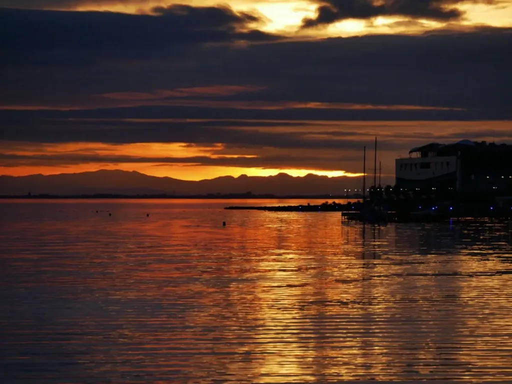

# L’abondance, une illusion dangereuse

Mon père était pêcheur. Il était persuadé qu’on pouvait pêcher sans fin, et, quand les poissons venaient à manquer, il accusait tout le monde sauf des pêcheurs. Il n’a jamais voulu admettre que la ressource qu’il avait reçue en abondance ne l’était plus.

En Méditerranée, il a fallu établir des quotas pour stopper la tragédie des communs, pour nous faire prendre conscience qu’une ressource abondante pouvait devenir rare.

Suite à [mon premier billet sur l’abondance](labondance-est-elle-un-probleme.md), Michèle Turbin a écrit sur Facebook :

>Si pour nous ce qui est rare a plus de valeur, alors on se fiche de ce qui nous semble abondant. L’air et l’eau, par exemple. Jusqu’à les épuiser et les rendre rares. Donc chers.

Je suis bien d’accord, sauf que le « Si » n’est pas nécessaire. Pour nous, tout au moins la plupart d’entre nous, et notamment les collectionneurs, ce qui est rare a plus de valeur que ce qui est abondant, ce qui en effet implique du mépris, de la négligence ou de l’indifférence vis-à-vis des ressources abondantes, attitude critique quand notre survie en tant qu’espèce et notre survie culturelle dépendent de ces ressources abondantes.

Notre erreur est peut-être de croire qu’il existe des ressources abondantes, car comment dans un espace-temps fini quelque chose peut-il être abondant ? L’air et l’eau pourraient être victimes de la tragédie des communs, et c’est déjà le cas dans certaines régions.

Dans l’espace numérique, le problème n’est différent qu’en apparence (espace quasiment infini, mais temps restant bel et bien fini malheureusement). Je reviens à mon exemple des auteurs qui a priori peuvent être innombrables et publier un nombre quasi illimité de textes, de fait abondants.

Sur Twitter, [Calimaq écrit](https://twitter.com/Calimaq/status/946306487172976640) :

>[…] maintenir une rareté des textes implique de maintenir artificiellement une rareté des auteurs dans la société, ce qui ne peut se faire que par une oppression culturelle et soulève un grave problème de justice sociale…

Je suis désolé [si j’ai pu laisser entendre que j’étais pour la raréfaction des textes des auteurs en général](labondance-est-elle-un-probleme.md), et, de fait, de leur raréfaction. Étant moi-même un auteur, si j’étais pour leur raréfaction, je devrais immédiatement cesser de publier. Je ne suis pour la raréfaction de quoi que ce soit, j’attire juste l’attention sur les problèmes engendrés par l’abondance (pour les poissons, les quotas ont raréfié la ressource pour lui donner le temps de se reconstituer).

Face à l’abondance, je me demande comment je dois me comporter. Rendre rare mes textes en les faisant payer est une solution (je n’ai pas parlé de quotas pour les auteurs). Faire payer n’est pas faire disparaître les textes, mais les rendre moins fluides. Et je n’ai pas exigé une loi qui imposerait aux auteurs de vendre leurs productions. Que chacun agisse à sa guise. Pour l’instant, je ne vends que mes livres, et [la plupart en ?1](je-ne-donne-plus-je-vends-en-g1.md), ce qui n’est pas une méthode radicale de raréfaction puisque cette monnaie est abondante.

Notez que les best-sellers, bien que vendus, sont abondamment lus, abondamment achetés, et donc qu’apposer un prix à un bien culturel n’est qu’une méthode statistique de raréfaction (puisque les best-sellers sont rares et les textes par ailleurs abondants presque pas lus).

Donc, si je vends mes textes ou en publie moins, je ne souffre d’aucune oppression culturelle, mais je propose une stratégie pour ne pas me dissoudre dans l’abondance.

La remarque des Calimaq fait bondir l’auteur en moi, et devrait faire bondir la plupart des auteurs que je connais. Je reprends. Nous avons des auteurs abondants (et c’est très bien) qui produisent des textes en abondance (et c’est aussi très bien). Face à ces textes, nous avons des lecteurs en abondance qui malheureusement ne disposent pas de temps en abondance (notre espace-temps est fini). Donc mécaniquement, la plupart des auteurs sont négligés. Voilà une véritable oppression culturelle. D’innombrables auteurs privés d’audience souffrent tous les jours dans leur chair et dans leur conscience. L’abondance d’une ressource entraîne presque mécaniquement la rareté d’une autre comme l’a fait remarquer Michèle Turbin. L’abondance de textes implique une pénurie de temps pour les lire. Elle implique des gestionnaires d’abondance qui font leur beurre sur le dos des créateurs. Elle implique pour moi de trouver un moyen de ne pas être opprimé.

Sur Internet, tout le monde fait la chasse à l’audience, elle se monnaie très cher, parce que l’abondance des contenus et des services l’a rendue rare et précieuse. Un temps, les auteurs se trouvent stimulés par l’ouverture offerte par le Net avant d’en subir durement les conséquences. De leur côté, les consommateurs livrés à eux-mêmes vendent leur temps d’attention, se laissant séduire par les best-sellers les mieux promus. Finalement où est la liberté dans ce modèle ?

Liberté de publier et de ne pas être lu ? Liberté de tout lire et finalement de n’avoir le temps de lire que ce qu’on nous ordonne de lire ? Je caricature peut-être, certains échappent à ce piège, mais je ne suis pas loin de la vérité. Je connais de nombreux auteurs, je connais de nombreux lecteurs. L’abondance culturelle n’a pas entraîné une diversité culturelle. Le succès grandissant des best-sellers le démontre.

Ça me fiche les boules de dire ça, parce que j’ai défendu l’abondance et que je n’arrive pas encore à lui tourner le dos, parce qu’elle promettait en théorie une société plus diverse, plus harmonieuse, plus collectivement intelligente. Il s’agissait d’une idéologie dans laquelle je me suis embarqué, une idéologie qui se heurte au principe de réalité, au fait que la rareté passe d’un vase à un autre. Nous devons trouver des mécanismes d’équilibrage.

L’abondance des contenus fait mal aux auteurs sans réellement faire du bien aux lecteurs. Je ne pense pas que nous puissions nous satisfaire d’un tel modèle. De solution universelle, je n’en ai pas. De solution pour moi, je n’en ai guère davantage. J’attire juste l’attention. Quelque chose qui aurait dû collectivement nous faire du bien ne nous en fait pas. Ce n’est pas nouveau : souvent les idéologies ont des effets contraires à ceux espérés.

Peut-être que pour soulager les auteurs on leur promettra bientôt que leurs textes seront lus par des IA (et dès aujourd’hui par les algorithmes de Google et de Facebook). Je ne suis pas sûr que cette offre les réjouisse. Nous écrivons pour des lecteurs et quand nous manquons de lecteurs nous ne pouvons être heureux. **L’abondance asymétrique n’est pas la solution.** L’abondance de contenus n’a réellement de sens et de portée qu’avec une abondance concomitante de temps d’attention.

Aristote s’effrayait de l’abondance des textes que l’écriture introduisait dans la société. Contrairement à lui, je n’ai pas peur de l’abondance, mais je pense que derrière l’abondance se cachent des créateurs qui eux souffrent. Je parle d’une souffrance, cette souffrance propre aux producteurs exploités par une machine qui le dépasse et le méprise. Une révolution qui se fait au prix de la souffrance ne me paraît pas positive.

Et quand du côté des lecteurs, elle implique plus que jamais le recours à des tiers, qu’ils soient techniques, les IA ou les robots d’indexation, ou humains, les bibliothécaires ou les libraires, je ne peux davantage m’en satisfaire. Le recours aux tiers implique une uniformisation, un filtrage de l’abondance, sa réduction, sa raréfaction pour qu’elle soit consommable. Nous en revenons à la nier, à en faire un terreau invisible. Cette stratégie ne me paraît pas très glorieuse. J’espérais que les lecteurs auraient le courage et les moyens techniques de voyager dans l’abondance.

À ce stade de ma réflexion, militer pour l’abondance ne me paraît ni sage ni nécessaire. Plus l’abondance se développe, plus se développe le [capitalisme cognitif](#capitalisme-cognitif).

*PS1 : Je ne vois aucune contradiction à être pour l’abondance (puisque potentiellement elle implique la diversité) et en déplorer les effets néfastes (il existe toujours des effets néfastes). Une image. On peut être pour la bonne bouffe tout en sachant qu’elle nuit à la santé. Il me paraît au contraire important d’identifier les effets négatifs (comme le font les médecins avec n’importe quel médicament).*

*PS2 : L’air et l’eau sont abondants, mais chacun de nous ne peut les goûter que brièvement parce que notre temps est compté. Toute ressource abondante possède son revers dans la rareté, et donc est tout aussi précieuse que si elle était rare.*

*PS3 : Je conclus par l’image d’un moment rare et, pour moi, précieux. J’en fais des photos en abondance, sans ne rien enlever à la rareté du moment.*

#netculture #dialogue #y2017 #2017-12-28-16h44
